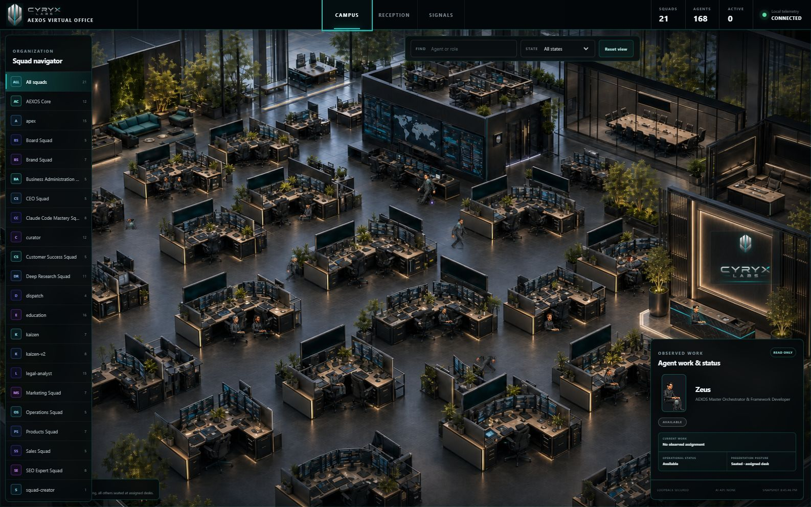
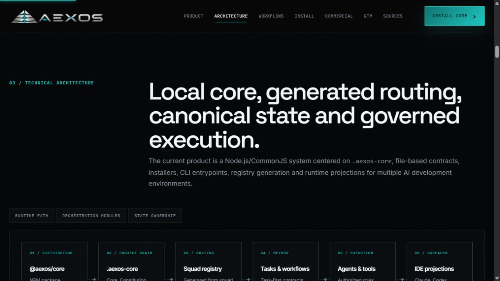
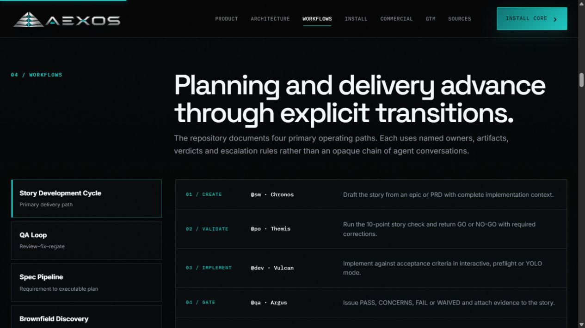

# AEXOS

Agentic eXecution & Orchestration System by Cyryx Labs. Project-local agent
instructions, development workflows and CLI tools for AI-assisted delivery.

**English** · [Português](README.pt-BR.md) · [Español](README.es.md)

## Start Here (10 Min)

You need Node.js 18 or later, npm 9 or later, internet access to npm, and an AI
development host of your choice. Select only the host you use; other host
integrations are optional. GitHub repository access, a global install and a paid
extension are not prerequisites for Core first value.

Check the public version:

```bash
npm view @aexos/core version
npx @aexos/core --version
```

Create a new project:

```bash
npx @aexos/core init my-project
cd my-project
npx @aexos/core doctor
```

For an existing project, run this from inside that directory instead:

```bash
npx @aexos/core install
```

`init` requires a directory name; `install` operates on the current directory.
Both use the same npm package. Reopen your AI host in the project after installing.
Activate a Core agent using your host's agent or skills interface, then ask:

```text
@aexos-master
*help
```

The aim is to receive the agent's greeting and available commands. Host activation
is a separate step from copying files; CLI test results alone do not verify that
your AI host loaded them. See the [IDE guide](docs/ide-integration.md).

### Public release and source candidate

Verified on **2026-09-08**: npm `latest` was **5.3.0**. The installation
corrections are under review in [PR #4](https://github.com/CyryxLabs/aexos-engine/pull/4).
This documentation change does not publish a release or change the package version.
The wider 6.x development work is separate and is not installed by the npm command.

The clean public 5.3.0 check completed `init` with exit 0 and installed 12 Core
agent files. Its `doctor` exited 1 with `rules-files`, `claude-md`, `npm-packages`
and `hooks-claude-count` failures; its banner also incorrectly marked agents
absent. Its init help still shows the old GitHub command. These observed defects
are corrected in the local candidate, whose default-init checks passed, but a
corrected npm release has not been published. Do not interpret that public
Doctor result alone as proof that all installation files are missing, or expect
the unpublished fixes from `npx @aexos/core` yet.

### Core and optional paid extensions

Core first value remains free. The accepted distribution design keeps the Core
framework, 12 software-delivery agents and Security squad in the public Core
package, with additional paid squads delivered privately after authenticated
entitlement and artifact verification. That is the intended 6.x package boundary. This documentation branch retains
the historical 5.3.0 package allowlist; it does not implement that boundary.

Paid delivery is still undergoing end-to-end certification. No live paid
checkout/download/install journey is certified by these local checks. Each
published copy remains governed by the license shipped with that copy; this
documentation introduces no new grant or retroactive restriction.

Next: [Getting started](docs/getting-started.md),
[installation guide](docs/installation/README.md),
[troubleshooting](docs/guides/installation-troubleshooting.md),
[distribution decision](docs/framework/epics/aexos-evolution/adr/ADR-AEX-011-CORE-FREE-PAID-SQUAD-DISTRIBUTION.md).

The maintainer reference below describes the current source checkout. Verify the
installed version's help before using commands beyond the entry path above.


## Contents

- [Start Here (10 Min)](#start-here-10-min)
- [What AEXOS is](#what-aexos-is)
- [How it works — the mental model](#how-it-works--the-mental-model)
- [The constitution](#the-constitution)
- [Install](#install)
- [Commercial licensing](#commercial-licensing)
- [Your first session, step by step](#your-first-session-step-by-step)
- [Activating an agent in your IDE](#activating-an-agent-in-your-ide)
- [The core team](#the-core-team)
- [The squads](#the-squads)
- [Workflows](#workflows)
- [Quality gates](#quality-gates)
- [Building your own squad](#building-your-own-squad)
- [CLI reference](#cli-reference)
- [Framework and project boundary](#framework-and-project-boundary)
- [Documentation](#documentation)

---

## What AEXOS is

AEXOS is an orchestration framework for AI agents that lives in your terminal and in your IDE's
agent surface. You install it into a project; it scaffolds a team of specialists, the procedures
they follow, and the routing layer that decides who handles what.

You do not manage the team member by member. You address the orchestrator — `@aexos-master` — and
it reads a generated registry, matches your request to a domain, and routes it to the specialist
that owns it.

**The problem it addresses.** Most AI-assisted development fails in two places. Planning is
inconsistent, because each conversation reinvents the shape of the requirement. And context is
lost, because the agent that implements never sees what the agent that planned understood.

**How AEXOS answers it.**

1. **Agentic planning.** Dedicated agents — analyst, product manager, architect — work with you to
   produce PRD and architecture documents that are consistent because they are produced by the same
   procedure every time, not by a fresh improvisation.
2. **Engineering-contextualised development.** The scrum master agent turns those plans into
   development stories that carry everything the developer agent needs: complete context,
   implementation detail and architectural guidance, embedded in the story file itself. The
   developer opens one file and knows what to build, how, and why.

The framework organizes agent instructions around three principles:

- **CLI first.** No dashboard is required for the Core development workflow.
- **The expertise lives in procedures, not in personalities.** An agent is a router; the method it
  applies is a file you can read and change.
- **Squad definitions identify their methods.** Check the agent's actual output against its
  declared sources; a definition alone does not prove runtime compliance.

### Observe the organisation without controlling it

Virtual Office is separate development work for a local operational view. Its
scene, host observers and navigation have their own integration and acceptance
requirements. The first-value branch does not add an `office` CLI command;
do not expect it from the documented public npm installation.

<p align="center">
  
</p>

## How it works — the mental model

Six concepts. Learn these and the rest of the framework reads itself.

| Concept       | What it is                                                                                                                          | Where it lives                                        |
| ------------- | ----------------------------------------------------------------------------------------------------------------------------------- | ----------------------------------------------------- |
| **Agent**     | A role with a persona, a scope of authority, and a list of procedures it may run. It routes; it does not itself hold the expertise. | `.aexos-core/development/agents/`, `squads/*/agents/` |
| **Task**      | An executable procedure with declared inputs, outputs and a completion checklist. This is where the method actually lives.          | `.aexos-core/development/tasks/`, `squads/*/tasks/`   |
| **Template**  | The shape of the document a task produces.                                                                                          | `.../templates/`                                      |
| **Checklist** | The validation a task must pass before it is considered done.                                                                       | `.../checklists/`                                     |
| **Data**      | The knowledge base a task reads from — reference tables, signal lists, decision models.                                             | `.../data/`                                           |
| **Workflow**  | A sequence of connected tasks, with the conditions for moving between them.                                                         | `.../workflows/`                                      |

<p align="center">
  
</p>

### Task-first, not agent-first

This is the design decision everything else follows from:

> Workflows are composed of **connected tasks**, not connected agents. Each task defines its own
> inputs, outputs, pre/post-conditions and execution modes. The agents are the _default executors_
> of those tasks — but the sequence, the rules and the dependencies come from the task definitions.

A validated task is binding. It runs as configured, with its dependencies respected, regardless of
who executes it — an agent, a worker, a clone or a human. Swap the executor and the method is
unchanged; that is the point.

Here is a real task contract, from `squads/ceo/tasks/strategy-kernel.md`:

```yaml
task: Build Strategy Kernel
owner: '@strategy-lead'
atomic_layer: task
Input: |
  - situation: What changed, what is not working, what the numbers say (required)
  - evidence_sources: Data, documents and observations available, each with origin and date (required)
  - constraints: Resource, contractual and capability limits already known (optional)
Output: |
  - diagnosis: A falsifiable claim about what is critical, with its evidence table
  - rejected_rival: The rival diagnosis considered in full, rejected with reasons or kept live
  - guiding_policy: The overall approach, and what it rules out
  - prediction: The falsifiable claim, its indicator, its disconfirming observation and check date
Checklist:
  - '[ ] Diagnosis stated as a claim a named observation could contradict'
  - '[ ] At least one rival diagnosis generated in full before the first was evaluated'
```

Inputs are named. Outputs are named. The checklist is the exit gate. Nothing about that depends on
which model or which agent runs it.

### Method, not impersonation

Squad definitions use `based_on` to identify the published methods they apply —
for example COSO for risk oversight and the Cadbury Report for governance.
Original orchestrator definitions identify their role as orchestration.

This is load-bearing. An agent that follows a named method can be audited against the source; an
agent doing celebrity impersonation has nothing to be verified against. The same discipline governs
figures: numbers from a source work are read from the publication or left unstated, because a
coefficient quoted from memory is a defect, not a detail.

### Source catalog and installed contents

The source checkout contains Core agents and domain squads. Its complete catalog
does not establish the intended 6.x package contents. The reviewed Core allowlist
and authenticated paid artifact boundary must be integrated and verified separately. Inspect the
installed version and its package contents instead of inferring them from source
agent counts. See the distribution decision linked above.

## The constitution

AEXOS has a formal constitution at [`.aexos-core/constitution.md`](.aexos-core/constitution.md).
It is not a style guide — automatic gates block violations of the non-negotiable articles.

| Article | Principle                | Severity       | What it means in practice                                                           |
| ------- | ------------------------ | -------------- | ----------------------------------------------------------------------------------- |
| **I**   | CLI First                | NON-NEGOTIABLE | Every capability works from the command line before it has any UI                   |
| **II**  | Agent Authority          | NON-NEGOTIABLE | Exclusive authorities cannot be assumed by another agent                            |
| **III** | Story-Driven Development | MUST           | Development begins and ends with a story                                            |
| **IV**  | No Invention             | MUST           | Every statement in a spec traces to a requirement, constraint or research finding   |
| **V**   | Quality First            | MUST           | Lint, typecheck and tests pass before push                                          |
| **VI**  | Absolute Imports         | SHOULD         | Prefer aliases; relative imports within a module are allowed                        |
| **XI**  | Squad-First Portability  | NON-NEGOTIABLE | Artifacts stay runtime-agnostic, never locked to one IDE                            |
| **XII** | Model Governance         | MUST           | Budget ceilings, routing authority and intent scanning when auto-dispatch is active |

Gate severity is graded: `BLOCK` stops execution and requires a fix; lower levels warn. See the
constitution for the full text, the amendment process and the gate table.

### The priority hierarchy

```text
CLI First  →  Observability Second  →  UI Third
```

| Layer             | Priority  | What it is                                                                    |
| ----------------- | --------- | ----------------------------------------------------------------------------- |
| **CLI**           | Highest   | Where the intelligence lives. All execution, decisions and automation.        |
| **Observability** | Secondary | Watches what the CLI is doing, in real time. Never drives it.                 |
| **UI**            | Tertiary  | Point management and visualisation, where a screen genuinely beats a command. |

A capability that does not work from the command line does not exist yet. Dashboards observe; they
never control. And no UI is ever a requirement for operating the system.

## Install

### Prerequisites

- **Node.js** 18.0.0 or later (20+ recommended)
- **npm** 9.0.0 or later
- **GitHub CLI** — optional, needed for team collaboration flows

### Which install command applies to you

The three contexts are genuinely different, and a command from one will not work in another:

| Your situation                                  | Command                                  |
| ----------------------------------------------- | ---------------------------------------- |
| Starting a new project                          | `npx @aexos/core init my-project`        |
| Adding AEXOS to a directory that already exists | `cd there && npx @aexos/core install`    |
| Contributing to AEXOS itself                    | `git clone` → `npm install` → `npm link` |

The npm command is the primary installation path. The public 5.3.0 artifact and
the unpublished source candidate are distinguished in Start Here. Core first
value does not require purchasing an extension.

To work on the framework itself, or to get the `aexos` binary on your PATH:

```bash
git clone https://github.com/CyryxLabs/aexos-engine.git
cd aexos-engine
npm install
npm link
cd your-project && aexos install
```

### Installation checks

Use the npm Doctor command in Start Here. Its public 5.3.0 limitations are
documented there. Maintainer sync/validation scripts belong to this checkout;
do not assume a newly initialized project has those npm scripts.

## Commercial licensing

The accepted design is free Core with optional, privately distributed paid squads.
Paid acquisition requires verified payment evidence, an AEXOS-scoped entitlement,
and signed artifact validation. Local extraction tests do not certify live
payment, delivery or renewal. Existing downloaded copies keep their shipped
license terms; this section does not introduce replacement terms.

See the [distribution decision](docs/framework/epics/aexos-evolution/adr/ADR-AEX-011-CORE-FREE-PAID-SQUAD-DISTRIBUTION.md).
This later decision supersedes earlier paid-only distribution proposals.

## Your first session, step by step

[Start Here](#start-here-10-min) gets you to first value. This is the same path with the reasoning
filled in, plus what comes after it.

**1. Open your agent surface.** Claude Code, Gemini CLI, Codex CLI or another supported platform —
see [the table below](#activating-an-agent-in-your-ide) for the activation syntax yours uses.

**2. Activate the orchestrator.**

```text
@aexos-master
```

Look for a greeting naming the persona (Zeus) and its role. If it does not appear,
check that your host opened the correct project, loaded its agent configuration
and used the activation syntax in the IDE guide. Run `npx @aexos/core doctor`
for installation diagnostics, accounting for the public 5.3.0 limitations in
Start Here. A missing greeting alone does not establish an incomplete install.

**3. Ask it what it can do.** Every agent responds to `*`-prefixed commands:

```text
*help
```

**4. Ask for something in plain language.** The orchestrator reads the squad registry, matches your
request to a domain and routes it:

```text
I need to decide whether to build this feature or buy it.
```

When the optional CEO squad is installed and registered, this question can route
to `@ceo-chief` and its capital-allocation specialist. Domain examples in this
source reference require their respective squads; Core-only projects should
start with the available software-delivery agents.

**5. Or address a specialist directly**, when you already know who you want:

```text
@architect
*assess-complexity
```

**6. Work from a story.** Development in AEXOS begins with a story — a file that carries the full
context an implementing agent needs. The standard cycle:

```text
@sm      *draft                  →  create the story from an epic or PRD
@po      *validate-story-draft   →  10-point check, GO or NO-GO
@dev     *develop                →  implement against the acceptance criteria
@qa      *gate                   →  quality gate: PASS / CONCERNS / FAIL / WAIVED
@devops  *push                   →  the only agent permitted to push
```

**7. Exit an agent** with `*exit` when you want to switch personas.

New to the workflow? The [User Guide](docs/guides/user-guide.md) walks the planning phase and the
development cycle end to end. [Getting Started](docs/getting-started.md) covers the first session in
more depth.

## Activating an agent in your IDE

Advanced behaviour depends on lifecycle hooks, and platforms differ in what they expose. Where hooks
are unavailable the framework still works — you run the validators yourself instead of having them
fire automatically.

| Platform           | How to activate                  | Lifecycle hooks  | What you give up                                                |
| ------------------ | -------------------------------- | ---------------- | --------------------------------------------------------------- |
| **Claude Code**    | `/agent-name`                    | Full (reference) | Nothing — full automation, guardrails, audit trail              |
| **Gemini CLI**     | `/aexos-menu` → `/aexos-<agent>` | Native events    | Minor timing differences only                                   |
| **Codex CLI**      | `/skills` → `aexos-<agent-id>`   | Partial          | Some checks need a manual trigger; leans on `AGENTS.md` and MCP |
| **Cursor**         | `@agent` + synced rules          | None             | No pre/post-action checks; run validators manually              |
| **GitHub Copilot** | Chat modes + repo instructions   | None             | As Cursor, plus more manual workflow                            |
| **AntiGravity**    | Workflow-driven                  | Workflow-based   | No hook equivalents; use the generated workflows                |

Fastest path for a new user: **Claude Code** or **Gemini CLI**. Detail, per-capability consequences
and workarounds: [IDE Integration Guide](docs/ide-integration.md).

Agent definitions are synced into each platform's own format, so the same roster is available
everywhere:

```bash
npm run sync:ide:codex        # regenerate Codex skills
npm run validate:parity       # confirm every platform is in step
```

## The core team

Twelve roles covering the software lifecycle. Each has a persona, a scope, and a set of tasks it is
the default executor for.

Every agent responds to `*`-prefixed commands. `*help` lists the full set for whichever agent is
active; the column below is a representative sample, not the whole surface.

| Handle              | Persona  | Role                                      | Sample commands                                                                              |
| ------------------- | -------- | ----------------------------------------- | -------------------------------------------------------------------------------------------- |
| `@aexos-master`     | Zeus     | Master orchestrator & framework developer | `*help`, `*status`, `*kb`, `*guide`                                                          |
| `@analyst`          | Sirius   | Business analyst                          | `*create-project-brief`, `*research-deps`, `*extract-patterns`                               |
| `@pm`               | Janus    | Product manager                           | `*create-prd`, `*create-epic`, `*execute-epic`, `*write-spec`                                |
| `@po`               | Themis   | Product owner                             | `*validate-story-draft`, `*backlog-prioritize`, `*close-story`                               |
| `@sm`               | Chronos  | Scrum master                              | `*draft`, `*story-checklist`                                                                 |
| `@architect`        | Vega     | Architect                                 | `*create-plan`, `*create-full-stack-architecture`, `*assess-complexity`, `*document-project` |
| `@dev`              | Vulcan   | Full stack developer                      | `*develop`, `*execute-subtask`, `*apply-qa-fixes`                                            |
| `@qa`               | Argus    | Test architect & quality advisor          | `*review`, `*gate`, `*risk-profile`, `*critique-spec`                                        |
| `@data-engineer`    | Ceres    | Database architect & operations engineer  | `*create-schema`, `*create-rls-policies`, `*design-indexes`                                  |
| `@devops`           | Polaris  | Repository manager & DevOps specialist    | `*pre-push`, `*push`, `*create-pr`, `*release`, `*create-worktree`                           |
| `@ux-design-expert` | Iris     | UX/UI designer & design system architect  | `*audit`, `*tokenize`, `*build`, `*a11y-check`                                               |
| `@squad-creator`    | Arkantos | Squad creator                             | `*design-squad`, `*create-squad`, `*validate-squad`                                          |

### Authority is exclusive by design

Article II is non-negotiable, and the boundaries are real:

| Operation                      | Exclusive to        | Everyone else      |
| ------------------------------ | ------------------- | ------------------ |
| `git push`, `git push --force` | `@devops` (Polaris) | Blocked — delegate |
| `gh pr create`, `gh pr merge`  | `@devops`           | Blocked — delegate |
| Releases and tags              | `@devops`           | Blocked            |
| MCP add / remove / configure   | `@devops`           | Blocked            |
| Story creation (`*draft`)      | `@sm`               | Delegate           |
| Story validation               | `@po`               | Delegate           |
| Epic orchestration             | `@pm`               | Delegate           |
| Architecture decisions         | `@architect`        | Delegate           |
| Quality verdicts               | `@qa`               | Delegate           |

`@dev` may `add`, `commit`, `branch`, `checkout`, `merge` and `stash` locally — but never push. Full
matrix and escalation rules: [`.claude/rules/agent-authority.md`](.claude/rules/agent-authority.md).

## The squads

Nine squads extend the framework past software delivery into the rest of a company. Each has one
front door — the chief — which triages the incoming question and distributes internally. You address
the chief; you do not need to know the roster.

| Entry agent             | Squad                   | Agents | Domain                                                |
| ----------------------- | ----------------------- | -----: | ----------------------------------------------------- |
| `@ceo-chief`            | CEO                     |      5 | Strategy, capital allocation and organisation design  |
| `@board-chief`          | Board                   |      5 | Governance, risk oversight, audit and succession      |
| `@products-chief`       | Products                |      7 | Discovery, positioning, monetisation, experimentation |
| `@marketing-chief`      | Marketing               |      7 | Brand, demand and measurement                         |
| `@sales-chief`          | Sales                   |      5 | Qualification, method and negotiation                 |
| `@ops-chief`            | Operations              |      5 | Reliability, flow and continuous improvement          |
| `@cs-chief`             | Customer Success        |      5 | Onboarding, retention and expansion                   |
| `@admin-chief`          | Business Administration |      5 | Finance, people, legal operations and process         |
| `@claude-mastery-chief` | Claude Code Mastery     |      8 | Hooks, MCP, config, swarm, plugins, integration       |

Each squad ships its own `README.md` describing its philosophy and its agents — start with
[`squads/ceo/README.md`](squads/ceo/README.md) or
[`squads/products/README.md`](squads/products/README.md) for the pattern.

### Routing is generated, not hardcoded

`.aexos-core/data/squad-registry.yaml` is generated from `squads/*/squad.yaml` by
`scripts/generate-squad-registry.js` and must never be hand-edited. The orchestrator reads it to
route by domain and keyword.

The consequence: **adding a squad requires no change to the orchestrator.** Creating the squad and
regenerating the registry is what registers it. A squad on disk that never reached the registry is
not reachable — which is why the registry, not the directory listing, is the source of truth.

## Workflows

Four primary workflows. Each is a sequence of connected tasks with defined transitions.

<p align="center">
  
</p>

### 1. Story Development Cycle — the primary path

| Phase        | Agent  | Task                     | Output                                     |
| ------------ | ------ | ------------------------ | ------------------------------------------ |
| 1. Create    | `@sm`  | `create-next-story.md`   | `{epic}.{story}.story.md`, status Draft    |
| 2. Validate  | `@po`  | `validate-next-story.md` | GO (≥7 of 10) or NO-GO with required fixes |
| 3. Implement | `@dev` | `dev-develop-story.md`   | Status Ready → InProgress                  |
| 4. QA gate   | `@qa`  | `qa-gate.md`             | PASS / CONCERNS / FAIL / WAIVED → Done     |

`@dev` runs the implement phase in one of three modes — `*develop-interactive`, `*develop-yolo` or
`*develop-preflight` — depending on how much you want to be consulted along the way.

### 2. QA Loop — iterative review

Defined in [`workflows/qa-loop.yaml`](.aexos-core/development/workflows/qa-loop.yaml). An automated
review-fix cycle after the initial gate: `@qa` reviews and returns a verdict, `@dev` fixes,
re-review — to a maximum of five iterations before escalation.

```text
@qa   *review                →  verdict on the implementation
@qa   *create-fix-request    →  a structured, addressable fix list
@dev  *apply-qa-fixes        →  work the list
@qa   *gate                  →  re-gate
```

Verdicts route the loop: approve and it completes; reject and it returns to `@dev`; blocked and it
escalates immediately rather than burning iterations.

### 3. Spec Pipeline — before implementation

Turns an informal requirement into an executable spec. Complexity is scored across five dimensions
— scope, integration, infrastructure, knowledge and risk — and the score decides how many phases run.

| Score | Class    | Phases                       |
| ----- | -------- | ---------------------------- |
| ≤ 8   | SIMPLE   | gather → spec → critique (3) |
| 9–15  | STANDARD | all 6                        |
| ≥ 16  | COMPLEX  | all 6, plus a revision cycle |

The pipeline runs `@pm *gather-requirements` → `@architect *assess-complexity` →
`@analyst *research-deps` → `@pm *write-spec` → `@qa *critique-spec` → `@architect *create-plan`,
which is the phase-to-command mapping declared in
[`spec-pipeline.yaml`](.aexos-core/development/workflows/spec-pipeline.yaml) itself.

The critique phase yields `APPROVED` (≥ 4.0), `NEEDS_REVISION` (3.0–3.9) or `BLOCKED` (< 3.0). The
constitutional gate here is Article IV: every statement in the spec must trace to a requirement, a
constraint or a research finding. No invented features.

### Running stories in parallel

Independent stories can be worked in isolated git worktrees rather than serialised on one branch.
`@devops *create-worktree` provisions one (`*list-worktrees`, `*merge-worktree`, `*cleanup-worktrees`
manage the rest); `@dev` has its own `*worktree-create` and `*waves` for planning a multi-story
batch, and `aexos wave plan --stories a,b` produces the execution DAG from the command line.

### 4. Brownfield Discovery — assessing an existing codebase

Ten phases across data collection, drafting, specialist validation and finalisation, producing a
technical debt assessment, an executive report, and an epic with stories ready for development.

Which one to use:

| Situation                         | Workflow                |
| --------------------------------- | ----------------------- |
| New story from an epic            | Story Development Cycle |
| QA found issues needing iteration | QA Loop                 |
| Complex feature needing a spec    | Spec Pipeline, then SDC |
| Joining an existing project       | Brownfield Discovery    |
| Simple bug fix                    | SDC in YOLO mode        |

Definitions: [`.aexos-core/development/workflows/`](.aexos-core/development/workflows/). Rules:
[`.claude/rules/workflow-execution.md`](.claude/rules/workflow-execution.md).

## Quality gates

Three layers, defence in depth:

| Layer             | When              | What runs                                            |
| ----------------- | ----------------- | ---------------------------------------------------- |
| **1. Pre-commit** | Local, fast       | ESLint, TypeScript — fast enough to stay in the loop |
| **2. Pre-push**   | Local             | Story acceptance criteria and status checks          |
| **3. CI**         | Cloud, merge gate | Full suite plus the structural validators below      |

The framework also validates its own shape. Squad manifests are checked against a JSON schema,
every dependency an agent declares must resolve on disk, generated registries must be
byte-reproducible, and the per-IDE syncs must stay in step with the agent definitions.

These run **inside a clone of this repository** — `tests/` and the Jest config are not in the
package's `files` list, so they are not present in a project that merely installed AEXOS:

```bash
npm run lint             # ESLint
npm run typecheck        # TypeScript
npm test                 # Jest — authoritative current suite and test totals
npm run validate:squads  # manifests, registry determinism, agent dependencies
npm run validate:parity  # IDE compatibility contract
```

Warnings are treated as failures: each one names a missing field, a stale reference or a deprecated
shape.

## Building your own squad

A squad is a directory. Its shape is the mental model made concrete:

```text
squads/your-squad/
├── squad.yaml          # identity, domain, keywords, entry agent — feeds the registry
├── agents/             # the specialists, one file each
├── tasks/              # the procedures — where the method lives
├── templates/          # the documents tasks produce
├── checklists/         # the validation tasks must pass
├── data/               # the knowledge base tasks read from
├── workflows/          # task sequences
├── README.md           # what this squad is for
└── CHANGELOG.md
```

Then regenerate the registry and validate — from a clone of this repository, where `scripts/` sits at the root:

```bash
node scripts/generate-squad-registry.js
node scripts/validate-squads.js
```

`@squad-creator` (Arkantos) scaffolds this for you. Full instructions:
[Squads Guide](docs/guides/squads-guide.md) and
[Contributing Squads](docs/guides/contributing-squads.md).

## CLI reference

All of these need the `aexos` binary, so they assume a global install or `npm link`;
otherwise use `npx @aexos/core <command>`. See [which install command applies to you](#which-install-command-applies-to-you).

```bash
# Lifecycle
aexos install [--dry-run|--yes|--ci|--ide <name>]   # install or update in this project
aexos init <project-name>                            # scaffold a new project
aexos update [--check|--dry-run|--force]             # update to the latest version
aexos uninstall [--force|--dry-run|--keep-data]      # remove AEXOS

# Health
aexos doctor [--fix]                                 # diagnostics
aexos validate [--repair|--detailed]                 # installation integrity
aexos info                                           # system information
aexos --version [-d]                                 # version, optionally detailed

# Configuration
aexos config show [--debug]                          # resolved configuration
aexos config diff --levels L1,L2                     # compare configuration levels
aexos config validate                                # validate config files

# Execution
aexos sdc plan <story.md>                            # plan a story development cycle
aexos sdc next <story-id>                            # next SDC phase and its skill
aexos wave plan --stories a,b                        # multi-story execution DAG
aexos workers search <query>                         # service discovery
aexos-delegate codex -t <slug>                       # delegate to an external executor
```

`aexos --help` prints the complete surface.

## Framework and project boundary

AEXOS separates its own artifacts from yours across four layers. Deny rules in
`.claude/settings.json` enforce this deterministically rather than by convention.

| Layer                      | Mutability                 | Paths                                                                                            |
| -------------------------- | -------------------------- | ------------------------------------------------------------------------------------------------ |
| **L1** Framework core      | Never modify               | `.aexos-core/core/`, `.aexos-core/constitution.md`, `bin/`                                       |
| **L2** Framework templates | Never modify — extend only | `.aexos-core/development/{tasks,templates,checklists,workflows}/`, `.aexos-core/infrastructure/` |
| **L3** Project config      | Mutable, with exceptions   | `.aexos-core/data/`, `agents/*/MEMORY.md`, `core-config.yaml`                                    |
| **L4** Project runtime     | Always modify              | `docs/stories/`, `packages/`, `squads/`, `tests/`                                                |

The toggle is `core-config.yaml` → `boundary.frameworkProtection`, which defaults to `true` for
projects and `false` for framework contributors.

## Documentation

|                                                               |                                                    |
| ------------------------------------------------------------- | -------------------------------------------------- |
| [User Guide](docs/guides/user-guide.md)                       | Planning phase, development cycle, all agent roles |
| [Getting Started](docs/getting-started.md)                    | First session, end to end                          |
| [Installation Guide](docs/installation/README.md)             | Linux, macOS, Windows                              |
| [IDE Integration](docs/ide-integration.md)                    | Platform matrix, capabilities and workarounds      |
| [Squads Guide](docs/guides/squads-guide.md)                   | Building a squad for your own domain               |
| [Agent Selection Guide](docs/guides/agent-selection-guide.md) | Which agent for which job                          |
| [Quality Gates](docs/guides/quality-gates.md)                 | The validation pipeline in detail                  |
| [Guiding Principles](docs/GUIDING-PRINCIPLES.md)              | Philosophy and practice                            |
| [Glossary](docs/glossary.md)                                  | Terminology                                        |
| [Troubleshooting](docs/troubleshooting.md)                    | When something does not come up                    |
| [Security](docs/security.md)                                  | Reporting and hardening                            |
| [CHANGELOG](CHANGELOG.md)                                     | Release history                                    |

## Contributing

See [CONTRIBUTING.md](CONTRIBUTING.md) and [CODE_OF_CONDUCT.md](CODE_OF_CONDUCT.md). Note Article II:
only `@devops` opens pull requests and pushes to the remote.

## Licence

[License](LICENSE) © 2026 Cyryx Labs LLC.

The license shipped in each artifact governs that copy. The free Core/private
paid-extension distribution decision does not retroactively relicense downloads
or replace the applicable legal terms.

<p align="center">
  <sub><b>AEXOS</b> by <b>Cyryx Labs</b> · CLI First · Observability Second · UI Third</sub>
</p>
