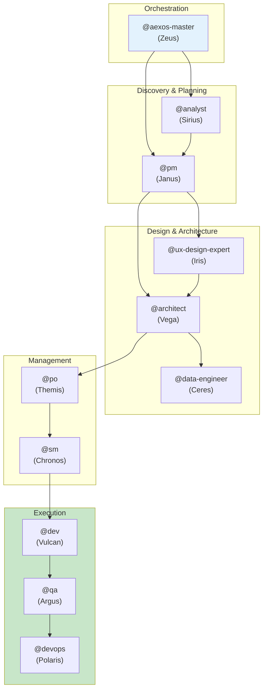

# AEXOS Agent Flows - Detailed Agent Documentation

---

**Version:** 1.0.0
**Last Updated:** 2026-02-05
**Status:** Official Documentation

---

## Overview

This folder contains the detailed documentation for all AEXOS agents, including:

- **Complete system** of each agent
- **Mermaid flowcharts** of operations
- **Command mapping** to tasks
- **Integrations** between agents
- **Workflows** that involve each agent
- **Best practices** and troubleshooting

---

## Documented Agents

| Agent | Persona | Archetype | Document |
|--------|---------|-----------|-----------|
| **@aexos-master** | Zeus | Orchestrator | [aexos-master-system.md](./aexos-master-system.md) |
| **@analyst** | Sirius | Researcher | [analyst-system.md](./analyst-system.md) |
| **@architect** | Vega | Visionary | [architect-system.md](./architect-system.md) |
| **@data-engineer** | Ceres | Data Sage | [data-engineer-system.md](./data-engineer-system.md) |
| **@dev** | Vulcan | Builder | [dev-system.md](./dev-system.md) |
| **@devops** | Polaris | Guardian | [devops-system.md](./devops-system.md) |
| **@pm** | Janus | Strategist | [pm-system.md](./pm-system.md) |
| **@qa** | Argus | Guardian | [qa-system.md](./qa-system.md) |
| **@sm** | Chronos | Facilitator | [sm-system.md](./sm-system.md) |
| **@squad-creator** | Nova | Creator | [squad-creator-system.md](./squad-creator-system.md) |
| **@ux-design-expert** | Iris | Designer | [ux-design-expert-system.md](./ux-design-expert-system.md) |

---

## Structure of Each Document

Each agent document follows this standard structure:

```
1. Overview
   - Main responsibilities
   - Core principles

2. Complete File List
   - Core tasks
   - Agent definition
   - Templates
   - Checklists
   - Related files

3. System Flowchart
   - Complete Mermaid diagram
   - Operation flow

4. Command Mapping
   - Commands → Tasks
   - Parameters and options

5. Related Workflows
   - Workflows that use the agent
   - The agent's role in each workflow

6. Integrations between Agents
   - Who it receives inputs from
   - Who it delivers outputs to
   - Collaborations

7. Configuration
   - Configuration files
   - Available tools
   - Restrictions

8. Best Practices
   - When to use
   - What to avoid

9. Troubleshooting
   - Common problems
   - Solutions

10. Changelog
    - Version history
```

---

## Agent Relationship Diagram



---

## How to Use This Documentation

### To Understand an Agent

1. Open the document for the agent you want
2. Read the **Overview** to understand the role
3. Check the **Commands** to know what it can do
4. Look at the **Workflows** to understand the context

### To Debug Problems

1. Go straight to the **Troubleshooting** section
2. Check the **Flowcharts** to understand the flow
3. Review the **Integrations** for dependencies

### To Extend the System

1. Review the **File List** to know what to modify
2. Follow the **Best Practices** to keep consistency
3. Update the **Changelog** after changes

---

## Relationship with Other Documentation

| Documentation | Location | Purpose |
|--------------|-------------|-----------|
| Meta-Agent Commands | [docs/meta-agent-commands.md](../meta-agent-commands.md) | Quick reference |
| Workflows Guide | [docs/guides/workflows-guide.md](../guides/workflows-guide.md) | Workflows guide |
| AEXOS Workflows | [docs/aexos-workflows/](../aexos-workflows/) | Workflow details |
| Architecture | [docs/architecture/](../architecture/) | Technical architecture |

---

## Contributing

To add or update agent documentation:

1. Follow the standard structure described above
2. Include up-to-date Mermaid diagrams
3. Keep the changelog up to date

---

*AEXOS Agent Flows Documentation v1.0 - Detailed documentation of the agent system*
