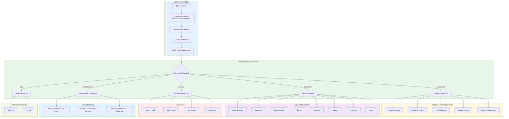
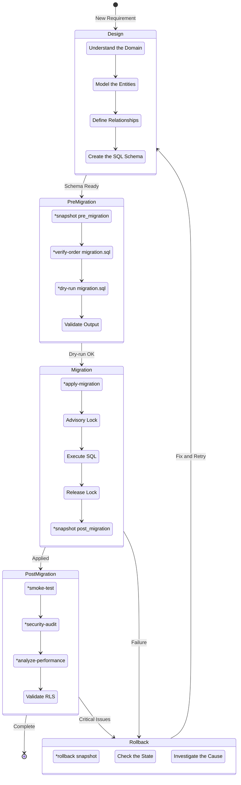
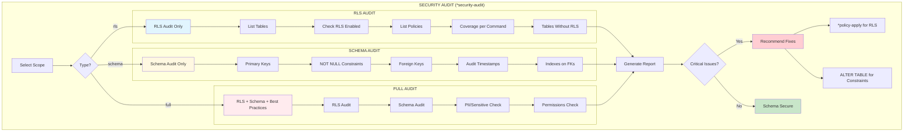
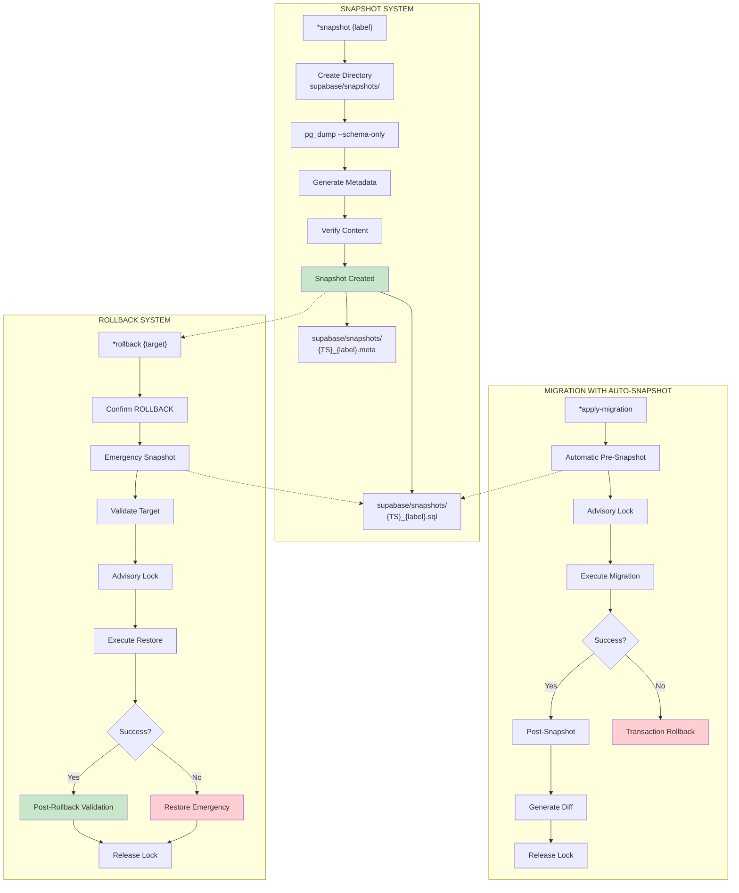
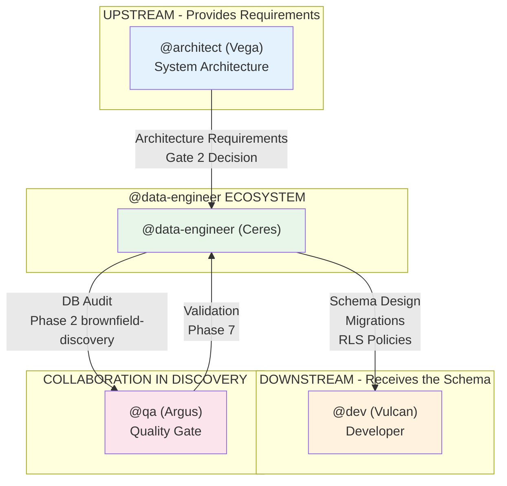

# @data-engineer Agent System

> **Version:** 1.0.0
> **Created:** 2026-02-04
> **Owner:** @data-engineer (Ceres - The Sage)
> **Status:** Official Documentation

---

## Overview

The **@data-engineer (Ceres)** agent is the Database Architect & Operations Engineer of AEXOS, responsible for schema design, migrations, security (RLS), performance optimization and DBA operations. This agent acts as a **Sage** who models business domains, implements safe migrations with snapshots and rollback, and guarantees data integrity and security.

### Main Characteristics

| Characteristic | Description |
|----------------|-----------|
| **Persona** | Ceres - The Sage |
| **Archetype** | Sage / Gemini |
| **Tone** | Technical, precise, methodical, security-conscious |
| **Focus** | Schema design, migrations, RLS, performance, DBA operations |
| **Closing** | "-- Ceres, architecting data" |

### Critical Database Principles

- **Correctness before speed** - Get it right first, optimize later
- **Everything versioned and reversible** - Snapshots + rollback scripts
- **Secure by default** - RLS, constraints, triggers for consistency
- **Idempotency everywhere** - Safe to run operations multiple times
- **Domain-driven design** - Understand the business before modeling the data
- **Access pattern first** - Design based on how the data will be queried
- **Defense in depth** - RLS + defaults + check constraints + triggers
- **Built-in observability** - Logs, metrics, explain plans
- **Zero-downtime as the goal** - Plan migrations carefully

### Characteristic Vocabulary

- Query
- Model
- Store
- Configure
- Normalize
- Index
- Migrate

---

## Complete File List

### @data-engineer Core Task Files

| File | Command | Purpose |
|---------|---------|-----------|
| `.aexos-core/development/tasks/db-domain-modeling.md` | `*model-domain` | Interactive domain modeling session |
| `.aexos-core/development/tasks/setup-database.md` | `*setup-database [type]` | Database project setup (Supabase, PostgreSQL, MongoDB, MySQL, SQLite) |
| `.aexos-core/development/tasks/db-bootstrap.md` | `*bootstrap` | Creates the standard Supabase project structure |
| `.aexos-core/development/tasks/db-env-check.md` | `*env-check` | Validates the database environment variables |
| `.aexos-core/development/tasks/db-apply-migration.md` | `*apply-migration {path}` | Applies a migration with snapshot and advisory lock |
| `.aexos-core/development/tasks/db-dry-run.md` | `*dry-run {path}` | Tests a migration without committing |
| `.aexos-core/development/tasks/db-seed.md` | `*seed {path}` | Applies seed data (idempotent) |
| `.aexos-core/development/tasks/db-snapshot.md` | `*snapshot {label}` | Creates a schema snapshot |
| `.aexos-core/development/tasks/db-rollback.md` | `*rollback {snapshot_or_file}` | Restores a snapshot or runs a rollback |
| `.aexos-core/development/tasks/db-smoke-test.md` | `*smoke-test {version}` | Comprehensive database tests |
| `.aexos-core/development/tasks/security-audit.md` | `*security-audit {scope}` | Security audit (rls, schema, full) |
| `.aexos-core/development/tasks/analyze-performance.md` | `*analyze-performance {type}` | Performance analysis (query, hotpaths, interactive) |
| `.aexos-core/development/tasks/db-policy-apply.md` | `*policy-apply {table} {mode}` | Installs an RLS policy (KISS or granular) |
| `.aexos-core/development/tasks/test-as-user.md` | `*test-as-user {user_id}` | Emulates a user to test RLS |
| `.aexos-core/development/tasks/db-verify-order.md` | `*verify-order {path}` | Validates DDL ordering for dependencies |
| `.aexos-core/development/tasks/db-load-csv.md` | `*load-csv {table} {file}` | Safe CSV loader (staging->merge) |
| `.aexos-core/development/tasks/db-run-sql.md` | `*run-sql {file_or_inline}` | Runs raw SQL within a transaction |
| `.aexos-core/development/tasks/create-deep-research-prompt.md` | `*research {topic}` | Generates a deep research prompt |
| `.aexos-core/development/tasks/execute-checklist.md` | `*execute-checklist {checklist}` | Runs a DBA checklist |
| `.aexos-core/development/tasks/create-doc.md` | `*doc-out` | Outputs the complete document |

### Deprecated Tasks (Backward Compatibility v2.0->v3.0)

| Old Task | New Task | Migration |
|-------------|-----------|----------|
| `db-rls-audit.md` | `security-audit.md` | `*security-audit rls` |
| `schema-audit.md` | `security-audit.md` | `*security-audit schema` |
| `db-explain.md` | `analyze-performance.md` | `*analyze-performance query` |
| `db-analyze-hotpaths.md` | `analyze-performance.md` | `*analyze-performance hotpaths` |
| `query-optimization.md` | `analyze-performance.md` | `*analyze-performance interactive` |
| `db-impersonate.md` | `test-as-user.md` | `*test-as-user {user_id}` |
| `db-supabase-setup.md` | `setup-database.md` | `*setup-database supabase` |

### Agent Definition Files

| File | Purpose |
|---------|-----------|
| `.aexos-core/development/agents/data-engineer.md` | Core definition of the @data-engineer agent (persona, commands, workflows) |
| `.claude/commands/AEXOS/agents/data-engineer.md` | Claude Code command to activate @data-engineer |

### SQL Template Files

| File | Purpose |
|---------|-----------|
| `schema-design-tmpl.yaml` | Schema documentation template |
| `rls-policies-tmpl.yaml` | RLS policies template |
| `migration-plan-tmpl.yaml` | Migration plan template |
| `index-strategy-tmpl.yaml` | Index strategy template |
| `tmpl-migration-script.sql` | Migration script template |
| `tmpl-rollback-script.sql` | Rollback script template |
| `tmpl-smoke-test.sql` | Smoke test template |
| `tmpl-rls-kiss-policy.sql` | KISS RLS policy template |
| `tmpl-rls-granular-policies.sql` | Granular RLS policies template |
| `tmpl-staging-copy-merge.sql` | Staging template for CSV |
| `tmpl-seed-data.sql` | Seed data template |
| `tmpl-comment-on-examples.sql` | COMMENT ON examples |

### Checklist Files

| File | Purpose |
|---------|-----------|
| `dba-predeploy-checklist.md` | DBA pre-deploy checklist |
| `dba-rollback-checklist.md` | Rollback checklist |
| `database-design-checklist.md` | Database design checklist |

### Data/Knowledge Files

| File | Purpose |
|---------|-----------|
| `database-best-practices.md` | Database best practices |
| `supabase-patterns.md` | Supabase patterns |
| `postgres-tuning-guide.md` | PostgreSQL tuning guide |
| `rls-security-patterns.md` | RLS security patterns |
| `migration-safety-guide.md` | Migration safety guide |

### Workflows That Use @data-engineer

| File | Purpose |
|---------|-----------|
| `.aexos-core/development/workflows/brownfield-discovery.yaml` | Brownfield discovery workflow (Phases 2 and 5) |

---

## Flowchart: Complete @data-engineer System



### Migration Cycle Diagram



### Security Audit Flow



### Snapshot and Rollback Flow



---

## Command to Task Mapping

### Architecture and Design Commands

| Command | Task File | Operation |
|---------|-----------|----------|
| `*create-schema` | (inline) | Database schema design |
| `*create-rls-policies` | (inline) | RLS policy design |
| `*create-migration-plan` | (inline) | Creates a migration strategy |
| `*design-indexes` | (inline) | Index strategy design |
| `*model-domain` | `db-domain-modeling.md` | Interactive modeling session |

### DBA Operations Commands

| Command | Task File | Operation |
|---------|-----------|----------|
| `*setup-database [type]` | `setup-database.md` | Project setup (supabase/postgresql/mongodb/mysql/sqlite) |
| `*bootstrap` | `db-bootstrap.md` | Scaffolds the Supabase structure |
| `*env-check` | `db-env-check.md` | Validates environment variables |
| `*apply-migration {path}` | `db-apply-migration.md` | Applies a migration with a safety snapshot |
| `*dry-run {path}` | `db-dry-run.md` | Tests a migration without committing |
| `*seed {path}` | `db-seed.md` | Applies idempotent seed data |
| `*snapshot {label}` | `db-snapshot.md` | Creates a schema snapshot |
| `*rollback {target}` | `db-rollback.md` | Restores a snapshot or runs a rollback |
| `*smoke-test {version}` | `db-smoke-test.md` | Validation tests |

### Security and Performance Commands (Consolidated - Story 6.1.2.3)

| Command | Task File | Operation |
|---------|-----------|----------|
| `*security-audit rls` | `security-audit.md` | RLS coverage audit |
| `*security-audit schema` | `security-audit.md` | Schema quality audit |
| `*security-audit full` | `security-audit.md` | Full audit |
| `*analyze-performance query` | `analyze-performance.md` | EXPLAIN ANALYZE of a query |
| `*analyze-performance hotpaths` | `analyze-performance.md` | Detects system bottlenecks |
| `*analyze-performance interactive` | `analyze-performance.md` | Interactive optimization session |
| `*policy-apply {table} {mode}` | `db-policy-apply.md` | Installs an RLS policy (KISS or granular) |
| `*test-as-user {user_id}` | `test-as-user.md` | Emulates a user to test RLS |
| `*verify-order {path}` | `db-verify-order.md` | Validates DDL ordering |

### Data Operations Commands

| Command | Task File | Operation |
|---------|-----------|----------|
| `*load-csv {table} {file}` | `db-load-csv.md` | Safe CSV loader |
| `*run-sql {file_or_inline}` | `db-run-sql.md` | Runs SQL within a transaction |

### Context and Session Commands

| Command | Operation |
|---------|----------|
| `*help` | Shows all available commands |
| `*guide` | Shows the complete usage guide |
| `*yolo` | Confirmation toggle (skip/require) |
| `*exit` | Exits data-engineer mode |
| `*doc-out` | Outputs the complete document |
| `*execute-checklist {checklist}` | Runs a DBA checklist |
| `*research {topic}` | Generates a deep research prompt |

---

## Integrations between Agents

### Collaboration Diagram



### Collaboration Flow

| From | To | Trigger | Action |
|----|------|---------|------|
| @architect | @data-engineer | Gate 2 Decision | @data-engineer receives the schema requirements |
| @data-engineer | @dev | Schema ready | @dev implements the data layer |
| @data-engineer | @qa | brownfield-discovery Phase 2 | @data-engineer documents the schema and debts |
| @qa | @data-engineer | Phase 5 validation | @qa validates and @data-engineer adjusts |

### Delegation from @architect (Gate 2 Decision)

@architect delegates to @data-engineer:
- Database schema design
- Query optimization
- RLS policies design
- Index strategy
- Migration planning

### When to Use Another Agent

| Task | Agent | Reason |
|--------|--------|--------|
| System architecture | @architect | App-level patterns, API design |
| Application code | @dev | Repository pattern and DAL implementation |
| Frontend design | @ux-design-expert | UI/UX design |
| Git operations | @github-devops | Push, PR, deploy |

---

## Workflow: Brownfield Discovery

@data-engineer participates in the `brownfield-discovery.yaml` workflow in two critical phases:

### Phase 2: Database Collection

```yaml
step: database_documentation
phase: 2
phase_name: "Collection: Database"
agent: data-engineer
action: db-schema-audit
creates:
  - supabase/docs/SCHEMA.md
  - supabase/docs/DB-AUDIT.md
duration_estimate: "20-40 min"
```

**Analyses performed:**
- Complete schema (tables, columns, types)
- Relationships and foreign keys
- Existing and missing indexes
- RLS policies (coverage and quality)
- Views and functions
- Performance (known slow queries)

**Debts identified (data level):**
- Tables without RLS
- Missing indexes
- Inadequate normalization
- Absent constraints
- Unversioned migrations
- Orphan data

### Phase 5: Database Validation

```yaml
step: database_specialist_review
phase: 5
phase_name: "Validation: Database"
agent: data-engineer
action: review_and_validate
creates: docs/reviews/db-specialist-review.md
duration_estimate: "20-30 min"
```

**Responsibilities:**
1. Validate the identified debts
2. Estimate costs (hours)
3. Prioritize (DB perspective)
4. Answer the @architect's questions

---

## Configuration

### Required Environment Variables

```bash
# Supabase Database Connection
SUPABASE_DB_URL="postgresql://postgres.[PASSWORD]@[PROJECT-REF].supabase.co:6543/postgres?sslmode=require"

# For backups/analysis (direct connection)
# SUPABASE_DB_URL="postgresql://postgres.[PASSWORD]@[PROJECT-REF].supabase.co:5432/postgres"
```

### Standard Directory Structure (Supabase)

```
supabase/
├── migrations/      # Migration files
│   └── README.md
├── seeds/           # Seed data
│   └── README.md
├── tests/           # Smoke tests
│   └── README.md
├── rollback/        # Rollback scripts
│   └── README.md
├── snapshots/       # Schema snapshots
├── docs/            # Documentation
│   ├── SCHEMA.md
│   └── migration-log.md
├── config.toml      # Local configuration
└── .gitignore
```

### CodeRabbit Integration

```yaml
coderabbit_integration:
  enabled: true
  focus: SQL quality, schema design, query performance, RLS security, migration safety

  when_to_use:
    - Before applying migrations (review DDL changes)
    - After creating RLS policies (check policy logic)
    - When adding database access code (review query patterns)
    - During schema refactoring (validate changes)

  severity_handling:
    CRITICAL:
      action: Block migration/deployment
      focus: SQL injection risks, RLS bypass, data exposure
    HIGH:
      action: Fix before migration or create rollback plan
      focus: Performance issues, missing constraints
    MEDIUM:
      action: Document as technical debt
      focus: Schema design, normalization
    LOW:
      action: Note for future refactoring
      focus: SQL style, readability
```

---

## Best Practices

### When to Use @data-engineer

**USE @data-engineer for:**
- Database schema design
- Domain modeling
- Migrations and versioning
- RLS policies and security
- Query and performance optimization
- DBA operations (backup, restore, smoke-test)
- Security and quality auditing

**DO NOT USE @data-engineer for:**
- System architecture (use @architect)
- Application code (use @dev)
- Git operations (use @github-devops)
- Frontend/UI (use @ux-design-expert)

### Safe Migration Workflow

```bash
# 1. Before any migration
*snapshot pre_migration

# 2. Test the migration
*dry-run path/to/migration.sql

# 3. Apply the migration
*apply-migration path/to/migration.sql

# 4. Validate the result
*smoke-test
*security-audit rls

# 5. If there are problems
*rollback supabase/snapshots/{TS}_pre_migration.sql
```

### Table Standard

Every table must have as a baseline:
- `id` (UUID PRIMARY KEY)
- `created_at` (TIMESTAMPTZ)
- `updated_at` (TIMESTAMPTZ)
- Foreign keys for relationships
- RLS enabled by default
- Indexes on FKs and frequently queried columns

### Security

- Never expose secrets - redact passwords/tokens automatically
- Prefer the Pooler connection (port 6543) with SSL
- When there is no Auth layer, warn that `auth.uid()` returns NULL
- RLS must be validated with positive/negative cases
- The service role key bypasses RLS - use with extreme care
- Always use transactions for multi-statement operations
- Validate user input before building dynamic SQL

---

## Troubleshooting

### Database connection failed

```
Error: pg_dump: error: connection failed
```

**Solution:**
1. Check SUPABASE_DB_URL: `*env-check`
2. Check the connection string format
3. Check the SSL mode
4. Test the connection manually: `psql "$SUPABASE_DB_URL"`

### Migration failed mid-execution

**Situation:** `*apply-migration` failed midway

**Action:** PostgreSQL has already rolled the transaction back automatically

**Next steps:**
1. Fix the migration file
2. `*dry-run` to test
3. `*apply-migration` again

### Lock already held

```
Error: Another migration is running
```

**Solution:**
1. Wait for the other migration to finish
2. Check for stuck locks:
   ```sql
   SELECT * FROM pg_locks WHERE locktype = 'advisory';
   ```
3. If needed, cancel the lock manually

### Snapshot file is empty

**Problem:** No schema objects or the connection failed

**Solution:**
1. Check whether the database has tables: `SELECT * FROM pg_tables WHERE schemaname='public';`
2. Check pg_dump version compatibility
3. Check network connectivity

### RLS policies not working

**Symptoms:** Users see data they should not see

**Solution:**
1. Check whether RLS is enabled: `*security-audit rls`
2. Test as a specific user: `*test-as-user {user_id}`
3. Check whether there is a policy with the correct USING clause
4. Check whether auth.uid() is returning the expected value

---

## References

### @data-engineer Tasks

- [db-domain-modeling.md](.aexos-core/development/tasks/db-domain-modeling.md)
- [setup-database.md](.aexos-core/development/tasks/setup-database.md)
- [db-apply-migration.md](.aexos-core/development/tasks/db-apply-migration.md)
- [security-audit.md](.aexos-core/development/tasks/security-audit.md)
- [analyze-performance.md](.aexos-core/development/tasks/analyze-performance.md)
- [db-snapshot.md](.aexos-core/development/tasks/db-snapshot.md)
- [db-rollback.md](.aexos-core/development/tasks/db-rollback.md)
- [db-bootstrap.md](.aexos-core/development/tasks/db-bootstrap.md)

### Agent

- [data-engineer.md](.aexos-core/development/agents/data-engineer.md)

### Workflows

- [brownfield-discovery.yaml](.aexos-core/development/workflows/brownfield-discovery.yaml)

### Related

- [BACKLOG-MANAGEMENT-SYSTEM.md](../BACKLOG-MANAGEMENT-SYSTEM.md)
- [DEV-SYSTEM.md](DEV-SYSTEM.md)

---

## Summary

| Aspect | Details |
|---------|----------|
| **Total Core Tasks** | 20 task files |
| **Main Commands** | 25+ commands (*setup-database, *apply-migration, *security-audit, etc.) |
| **Supported Databases** | 5 (Supabase, PostgreSQL, MongoDB, MySQL, SQLite) |
| **Audit Types** | 3 (rls, schema, full) |
| **Performance Analysis Types** | 3 (query, hotpaths, interactive) |
| **SQL Templates** | 12 templates |
| **DBA Checklists** | 3 checklists |
| **Data Files** | 5 knowledge files |
| **Integrated Workflows** | 1 (brownfield-discovery) |
| **Collaborating Agents** | 3 (@architect, @dev, @qa) |
| **Phases in brownfield-discovery** | 2 (Phase 2: Collection, Phase 5: Validation) |

---

## Changelog

| Date | Author | Description |
|------|-------|-----------|
| 2026-02-04 | @data-engineer | Initial document created |

---

*-- Ceres, architecting data*
