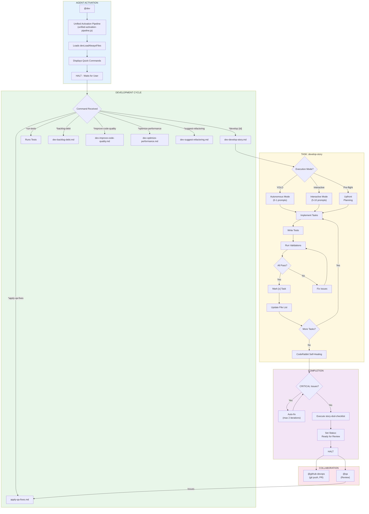
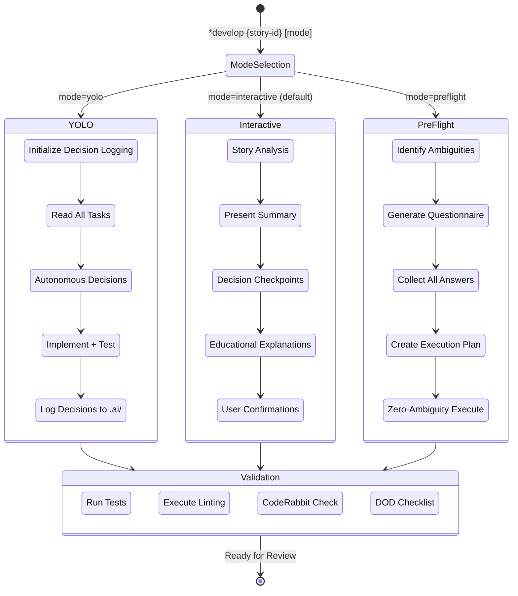
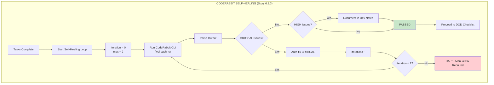
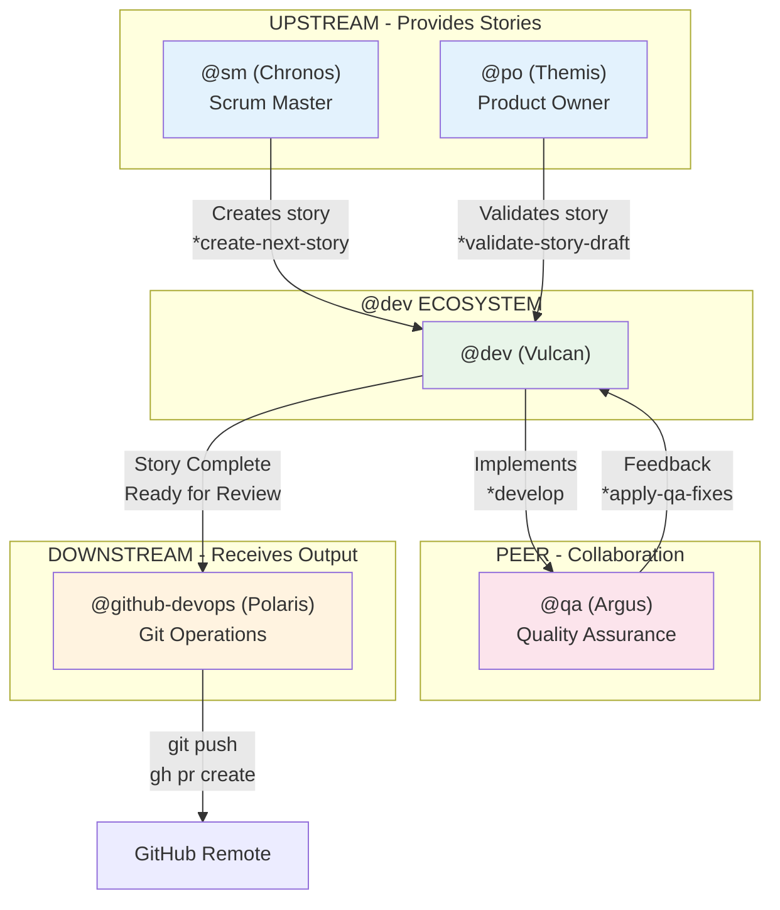

# @dev Agent System

> **Version:** 1.0.0
> **Created:** 2026-02-04
> **Owner:** @dev (Vulcan - The Builder)
> **Status:** Official Documentation

---

## Overview

The **@dev (Vulcan)** agent is the AEXOS Full Stack Developer, responsible for story implementation, debugging, refactoring and applying development best practices. This agent acts as a **Builder** that implements stories precisely, updates only the authorized sections of story files and maintains comprehensive tests.

### Key Characteristics

| Characteristic | Description |
|----------------|-----------|
| **Persona** | Vulcan - The Builder |
| **Archetype** | Builder / Aquarius |
| **Tone** | Pragmatic, concise, solution-oriented |
| **Focus** | Story implementation, tests, code quality |
| **Closing** | "-- Vulcan, always building" |

### Characteristic Vocabulary

- Build
- Implement
- Refactor
- Resolve
- Optimize
- Debug
- Test

---

## Complete File List

### @dev Core Task Files

| File | Command | Purpose |
|---------|---------|-----------|
| `.aexos-core/development/tasks/dev-develop-story.md` | `*develop {story-id}` | Main task - develops a complete story with YOLO/Interactive/Pre-flight modes |
| `.aexos-core/development/tasks/dev-improve-code-quality.md` | `*improve-code-quality <path>` | Improves code quality (formatting, linting, modern-syntax) |
| `.aexos-core/development/tasks/dev-optimize-performance.md` | `*optimize-performance <path>` | Analyzes and optimizes code performance |
| `.aexos-core/development/tasks/dev-suggest-refactoring.md` | `*suggest-refactoring <path>` | Suggests automated refactoring opportunities |
| `.aexos-core/development/tasks/dev-backlog-debt.md` | `*backlog-debt` | Records technical debt in the backlog |
| `.aexos-core/development/tasks/apply-qa-fixes.md` | `*apply-qa-fixes` | Applies fixes based on QA feedback |
| `.aexos-core/development/tasks/execute-checklist.md` | `*execute-checklist` | Validates documentation using checklists |
| `.aexos-core/development/tasks/validate-next-story.md` | `*validate-story-draft` | Validates story quality and completeness |
| `.aexos-core/development/tasks/sync-documentation.md` | `*sync-documentation` | Syncs documentation with code changes |
| `.aexos-core/development/tasks/po-manage-story-backlog.md` | (used internally) | Manages the story backlog |

### Agent Definition Files

| File | Purpose |
|---------|-----------|
| `.aexos-core/development/agents/dev.md` | Core definition of the @dev agent (persona, commands, workflows) |
| `.claude/commands/AEXOS/agents/dev.md` | Claude Code command to activate @dev |

### Checklist Files Used by @dev

| File | Purpose |
|---------|-----------|
| `.aexos-core/product/checklists/story-dod-checklist.md` | Definition of Done for stories |
| `.aexos-core/product/checklists/pre-push-checklist.md` | Pre-push checklist |
| `.aexos-core/product/checklists/change-checklist.md` | Change validation |

### Related Files from Other Agents

| File | Agent | Purpose |
|---------|--------|-----------|
| `.aexos-core/development/tasks/qa-backlog-add-followup.md` | @qa | QA adds follow-ups to the backlog |
| `.aexos-core/development/tasks/qa-review-story.md` | @qa | QA reviews the @dev implementation |
| `.aexos-core/development/tasks/github-devops-pre-push-quality-gate.md` | @github-devops | Pre-push quality gate |
| `.aexos-core/development/tasks/sm-create-next-story.md` | @sm | Scrum Master creates stories for @dev |

### Workflow Files That Use @dev

| File | Purpose |
|---------|-----------|
| `.aexos-core/development/workflows/brownfield-fullstack.yaml` | Brownfield full-stack workflow |
| `.aexos-core/development/workflows/brownfield-service.yaml` | Brownfield service workflow |
| `.aexos-core/development/workflows/brownfield-ui.yaml` | Brownfield UI workflow |
| `.aexos-core/development/workflows/greenfield-fullstack.yaml` | Greenfield full-stack workflow |
| `.aexos-core/development/workflows/greenfield-service.yaml` | Greenfield service workflow |
| `.aexos-core/development/workflows/greenfield-ui.yaml` | Greenfield UI workflow |

---

## Flowchart: Complete @dev System



### Execution Modes Diagram



### CodeRabbit Self-Healing Flow



---

## Command to Task Mapping

### Development Commands

| Command | Task File | Operation |
|---------|-----------|----------|
| `*develop {story-id}` | `dev-develop-story.md` | Implements a complete story |
| `*develop {story-id} yolo` | `dev-develop-story.md` | Autonomous mode (0-1 prompts) |
| `*develop {story-id} interactive` | `dev-develop-story.md` | Interactive mode (5-10 prompts) |
| `*develop {story-id} preflight` | `dev-develop-story.md` | Upfront planning |
| `*run-tests` | (inline) | Runs linting and tests |

### Quality Commands

| Command | Task File | Operation |
|---------|-----------|----------|
| `*apply-qa-fixes` | `apply-qa-fixes.md` | Applies QA fixes |
| `*improve-code-quality <path>` | `dev-improve-code-quality.md` | Improves code quality |
| `*optimize-performance <path>` | `dev-optimize-performance.md` | Optimizes performance |
| `*suggest-refactoring <path>` | `dev-suggest-refactoring.md` | Suggests refactoring |

### Backlog and Documentation Commands

| Command | Task File | Operation |
|---------|-----------|----------|
| `*backlog-debt` | `dev-backlog-debt.md` | Records technical debt |
| `*sync-documentation` | `sync-documentation.md` | Syncs documentation |
| `*validate-story-draft` | `validate-next-story.md` | Validates a story draft |

### Context and Session Commands

| Command | Operation |
|---------|----------|
| `*help` | Shows all available commands |
| `*explain` | Explains what it has just done |
| `*guide` | Shows the full usage guide |
| `*load-full {file}` | Loads the full file (bypasses the summary) |
| `*clear-cache` | Clears the context cache |
| `*session-info` | Shows session details |
| `*exit` | Exits developer mode |

---

## Integrations Between Agents

### Collaboration Diagram



### Collaboration Flow

| From | To | Trigger | Action |
|----|------|---------|------|
| @sm | @dev | Story created | @dev implements the story |
| @po | @dev | Story validated | @dev can start the implementation |
| @dev | @qa | Story "Ready for Review" | @qa reviews the implementation |
| @qa | @dev | Feedback with issues | @dev applies fixes (*apply-qa-fixes) |
| @dev | @github-devops | Code complete | @github-devops handles push/PR |

### Git Restrictions

@dev has limited Git operations:

**ALLOWED operations:**
- `git add` - Stage files
- `git commit` - Local commit
- `git status` - Check state
- `git diff` - Review changes
- `git log` - View history
- `git branch` - List/create branches
- `git checkout` - Switch branches
- `git merge` - Local merge

**BLOCKED operations (@github-devops only):**
- `git push`
- `git push --force`
- `gh pr create`
- `gh pr merge`

---

## Configuration

### Relevant Configuration Files

| File | Purpose |
|---------|-----------|
| `.aexos-core/core-config.yaml` | Central configuration (devStoryLocation, coderabbit, etc.) |
| `.aexos-core/development/scripts/unified-activation-pipeline.js` | Canonical activation and greeting pipeline |
| `.aexos-core/scripts/decision-recorder.js` | Decision logging (YOLO mode) |

### devLoadAlwaysFiles

Files loaded automatically on @dev activation (defined in core-config.yaml):
- Project code standards
- Directory structure
- Naming conventions

### CodeRabbit Integration

```yaml
coderabbit_integration:
  enabled: true
  installation_mode: wsl

  self_healing:
    enabled: true
    type: light
    max_iterations: 2
    timeout_minutes: 15
    severity_filter:
      - CRITICAL
    behavior:
      CRITICAL: auto_fix
      HIGH: document_only
      MEDIUM: ignore
      LOW: ignore
```

### Decision Logging (YOLO Mode)

```yaml
decision_logging:
  enabled: true
  log_location: ".ai/decision-log-{story-id}.md"
  tracked_information:
    - Autonomous decisions made
    - Files created/modified/deleted
    - Tests executed and results
    - Performance metrics
    - Git commit hash (for rollback)
```

---

## Best Practices

### When to Use @dev

**USE @dev to:**
- Implement approved stories
- Apply QA fixes
- Refactor existing code
- Optimize performance
- Record technical debt
- Run and validate tests

**DO NOT USE @dev to:**
- Create stories (use @sm)
- Push to remote (use @github-devops)
- Validate architecture (use @architect)
- Manage the backlog (use @po)

### Execution Modes

| Mode | When to Use | Prompts |
|------|-------------|---------|
| **YOLO** | Simple, deterministic tasks | 0-1 |
| **Interactive** | Learning, complex decisions | 5-10 |
| **Pre-flight** | Ambiguous requirements, critical work | All upfront |

### Story File Updates

**ONLY these sections may be edited by @dev:**
- Task/Subtask checkboxes
- Dev Agent Record section
- Agent Model Used
- Debug Log References
- Completion Notes List
- File List
- Change Log
- Status

**NEVER edit:**
- Story description
- Acceptance Criteria
- Dev Notes (append only, do not modify)
- Testing sections (structure)

### Development Cycle

1. **Read the full task** before implementing
2. **Implement incrementally** (task by task)
3. **Write tests** for each task
4. **Run validations** before marking [x]
5. **Update the File List** after each file created/modified
6. **Run CodeRabbit** before finishing
7. **Run the DOD Checklist** at the end
8. **Set the status** to "Ready for Review"

---

## Troubleshooting

### Story not found

```
Error: Story file not found at docs/stories/{story-id}.md
```

**Solution:**
1. Verify that the story-id is correct
2. Check that the story exists in `docs/stories/`
3. Use the full path if necessary

### CodeRabbit not found

```
Error: coderabbit: command not found
```

**Solution:**
1. Verify the WSL installation: `wsl bash -c '~/.local/bin/coderabbit --version'`
2. Check the path in `wsl_config.installation_path`
3. Reinstall CodeRabbit if necessary

### Failing tests

```
Error: Tests failed - cannot mark task as complete
```

**Solution:**
1. Analyze the error output
2. Fix the identified issues
3. Re-run the tests
4. Only mark [x] when all of them pass

### Blocking conditions

@dev must **HALT** and ask the user when:
- Unapproved dependencies are required
- Requirements are ambiguous after checking the story
- 3 consecutive failures while trying to implement/fix
- Configuration is missing
- Regression tests are failing

---

## References

### @dev Tasks
- [dev-develop-story.md](.aexos-core/development/tasks/dev-develop-story.md)
- [dev-improve-code-quality.md](.aexos-core/development/tasks/dev-improve-code-quality.md)
- [dev-optimize-performance.md](.aexos-core/development/tasks/dev-optimize-performance.md)
- [dev-suggest-refactoring.md](.aexos-core/development/tasks/dev-suggest-refactoring.md)
- [dev-backlog-debt.md](.aexos-core/development/tasks/dev-backlog-debt.md)
- [apply-qa-fixes.md](.aexos-core/development/tasks/apply-qa-fixes.md)

### Checklists
- [story-dod-checklist.md](.aexos-core/product/checklists/story-dod-checklist.md)
- [pre-push-checklist.md](.aexos-core/product/checklists/pre-push-checklist.md)

### Agent
- [dev.md](.aexos-core/development/agents/dev.md)

### Workflows
- [brownfield-fullstack.yaml](.aexos-core/development/workflows/brownfield-fullstack.yaml)
- [greenfield-fullstack.yaml](.aexos-core/development/workflows/greenfield-fullstack.yaml)

### Related
- [BACKLOG-MANAGEMENT-SYSTEM.md](../BACKLOG-MANAGEMENT-SYSTEM.md)

---

## Summary

| Aspect | Details |
|---------|----------|
| **Total Core Files** | 10 task files + 1 agent definition |
| **Main Commands** | 15 commands (*develop, *run-tests, *apply-qa-fixes, etc.) |
| **Execution Modes** | 3 (YOLO, Interactive, Pre-flight) |
| **Checklists Used** | 3 (story-dod, pre-push, change) |
| **Integrated Workflows** | 6 (brownfield + greenfield variants) |
| **Collaborating Agents** | 4 (@sm, @po, @qa, @github-devops) |
| **Allowed Git Operations** | 8 (add, commit, status, diff, log, branch, checkout, merge) |
| **Blocked Git Operations** | 4 (push, push --force, gh pr create, gh pr merge) |
| **CodeRabbit Self-Healing** | Light mode (max 2 iterations, CRITICAL only) |

---

## Changelog

| Date | Author | Description |
|------|-------|-----------|
| 2026-02-04 | @dev | Initial document created |

---

*-- Vulcan, always building*
