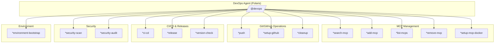
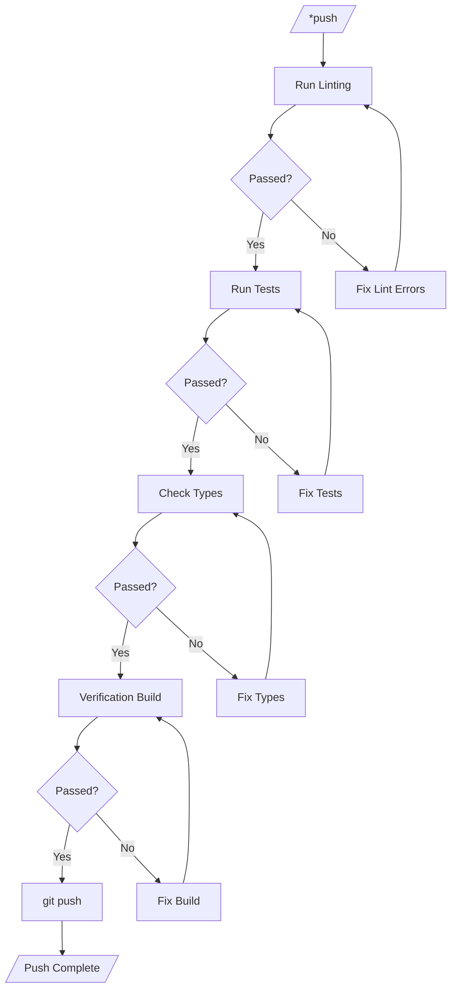
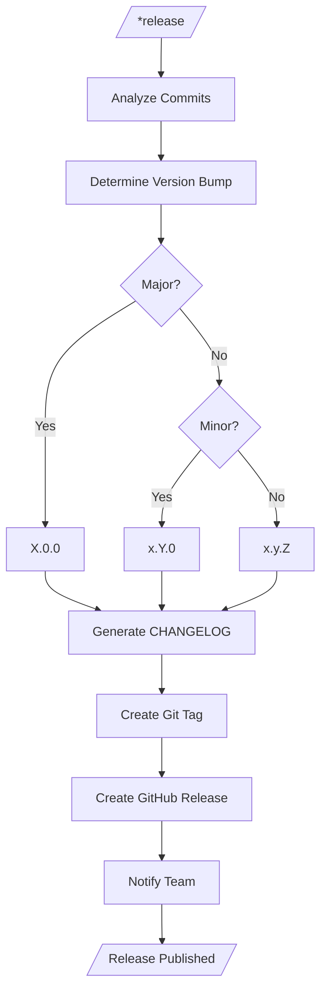
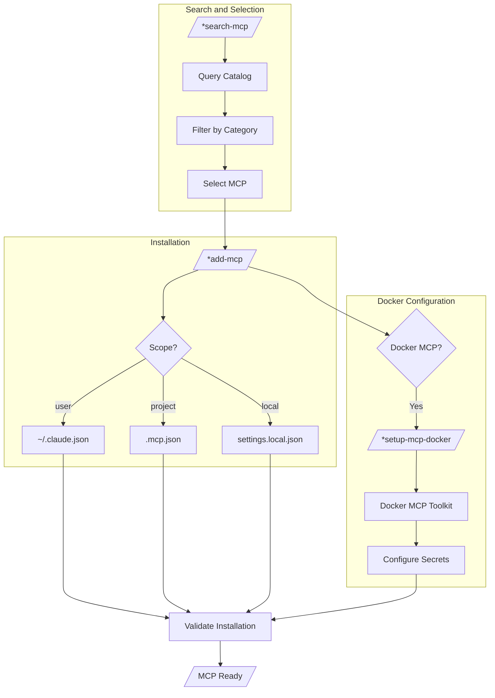
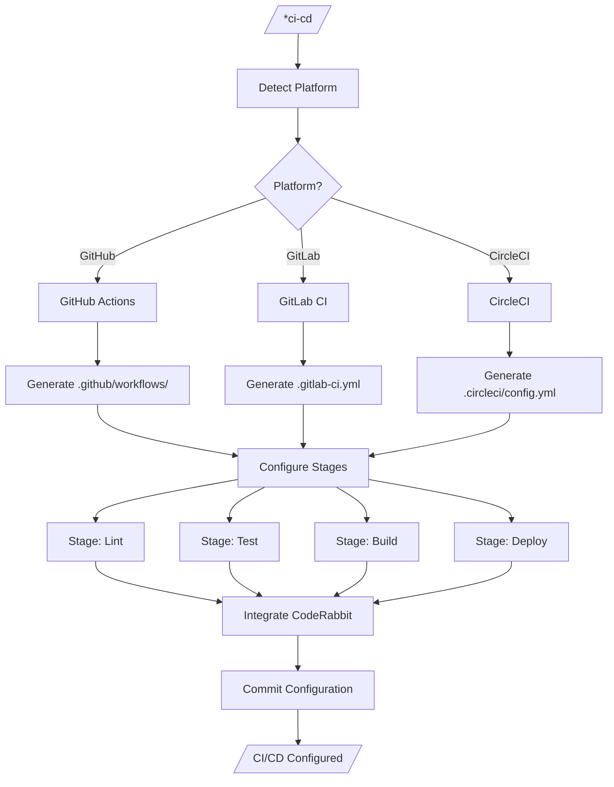
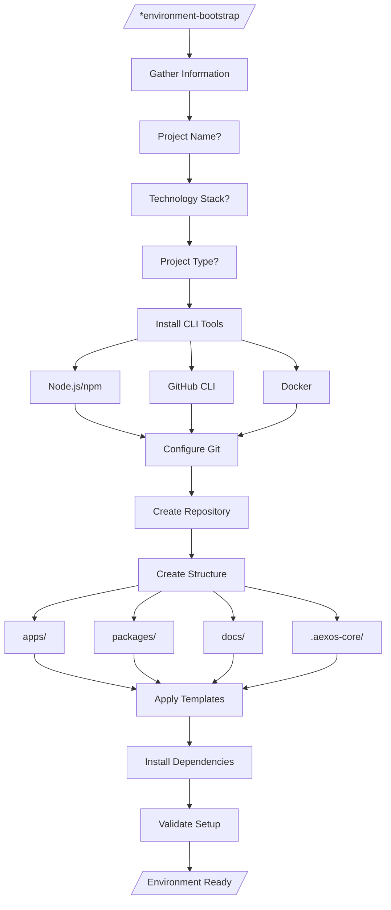
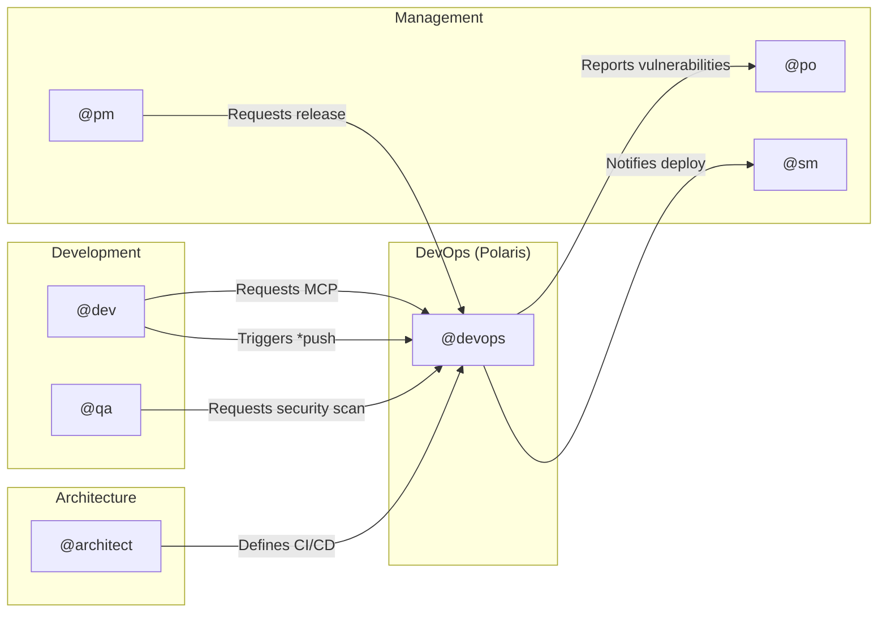

# DevOps System - Complete Guide to the @devops Agent

> **Agent:** Polaris (Operator)
> **Version:** 2.0.0
> **Last Updated:** 2026-02-04

## Table of Contents

1. [Overview](#overview)
2. [Complete File List](#complete-file-list)
3. [Flowchart: Complete System](#flowchart-complete-system)
4. [Command to Task Mapping](#command-to-task-mapping)
5. [Integrations Between Agents](#integrations-between-agents)
6. [Configuration](#configuration)
7. [Best Practices](#best-practices)
8. [Troubleshooting](#troubleshooting)
9. [References](#references)
10. [Summary](#summary)

---

## Overview

The `@devops` (Polaris) agent is the infrastructure and operations specialist of the AEXOS framework. It is responsible for:

- **MCP Governance**: Exclusive management of MCP (Model Context Protocol) servers
- **CI/CD**: Configuration and maintenance of continuous integration and delivery pipelines
- **Releases**: Version management and release publishing
- **Repositories**: Maintenance, cleanup and code quality
- **Security**: Security audits and scans
- **Environments**: Bootstrap of new projects and environment configuration

### Persona

```yaml
Name: Polaris
Role: Operator
Specialization: DevOps, Infrastructure, CI/CD, MCP
Philosophy: "Automate everything that can be automated"
```

### Critical Rule

**IMPORTANT:** Every MCP infrastructure operation is managed EXCLUSIVELY by the DevOps agent. Other agents (Dev, Architect, etc.) are MCP consumers, not administrators.

---

## Complete File List

### Agent File

| File | Path | Description |
|---------|---------|-----------|
| Agent Definition | `.aexos-core/development/agents/devops.md` | Persona, commands and behaviors |

### Task Files

| Task | Path | Command |
|------|---------|---------|
| Pre-Push Quality Gate | `.aexos-core/development/tasks/github-devops-pre-push-quality-gate.md` | `*push` |
| Version Management | `.aexos-core/development/tasks/github-devops-version-management.md` | `*version-check` |
| Repository Cleanup | `.aexos-core/development/tasks/github-devops-repository-cleanup.md` | `*cleanup` |
| CI/CD Configuration | `.aexos-core/development/tasks/ci-cd-configuration.md` | `*ci-cd` |
| Release Management | `.aexos-core/development/tasks/release-management.md` | `*release` |
| Environment Bootstrap | `.aexos-core/development/tasks/environment-bootstrap.md` | `*environment-bootstrap` |
| Search MCP | `.aexos-core/development/tasks/search-mcp.md` | `*search-mcp` |
| Add MCP | `.aexos-core/development/tasks/add-mcp.md` | `*add-mcp` |
| Setup MCP Docker | `.aexos-core/development/tasks/setup-mcp-docker.md` | `*setup-mcp-docker` |
| Setup GitHub | `.aexos-core/development/tasks/setup-github.md` | `*setup-github` |
| Security Audit | `.aexos-core/development/tasks/security-audit.md` | `*security-audit` |
| Security Scan | `.aexos-core/development/tasks/security-scan.md` | `*security-scan` |

### Configuration and Rules Files

| File | Path | Purpose |
|---------|---------|-----------|
| MCP Rules | `.claude/rules/mcp-usage.md` | MCP governance and usage |
| N8N Rules | `.claude/rules/n8n-operations.md` | Operations on N8N infrastructure |

---

## Flowchart: Complete System

### General DevOps Architecture



### Pre-Push Quality Gate Flow



### Release Management Flow



### MCP Governance Flow



### CI/CD Configuration Flow



### Environment Bootstrap Flow



---

## Command to Task Mapping

### MCP Commands

| Command | Task | Description | Mode |
|---------|------|-----------|------|
| `*search-mcp` | search-mcp.md | Search MCPs in the catalog | Interactive |
| `*add-mcp` | add-mcp.md | Install an MCP server | Interactive |
| `*list-mcps` | (inline) | List enabled MCPs | YOLO |
| `*remove-mcp` | (inline) | Remove an MCP server | Interactive |
| `*setup-mcp-docker` | setup-mcp-docker.md | Configure the Docker MCP Toolkit | Interactive |

### Git/GitHub Commands

| Command | Task | Description | Mode |
|---------|------|-----------|------|
| `*push` | github-devops-pre-push-quality-gate.md | Quality gate before push | Interactive |
| `*setup-github` | setup-github.md | Configure the GitHub repository | Interactive |
| `*cleanup` | github-devops-repository-cleanup.md | Clean up branches and files | Interactive |

### CI/CD and Release Commands

| Command | Task | Description | Mode |
|---------|------|-----------|------|
| `*ci-cd` | ci-cd-configuration.md | Configure the CI/CD pipeline | Interactive |
| `*release` | release-management.md | Create a release with changelog | Interactive |
| `*version-check` | github-devops-version-management.md | Analyze and suggest a version | YOLO |

### Security Commands

| Command | Task | Description | Mode |
|---------|------|-----------|------|
| `*security-scan` | security-scan.md | Vulnerability scan | Interactive |
| `*security-audit` | security-audit.md | Full security audit | Interactive |

### Environment Commands

| Command | Task | Description | Mode |
|---------|------|-----------|------|
| `*environment-bootstrap` | environment-bootstrap.md | Bootstrap of a new project | Interactive |
| `*pro-access-grant` | devops-pro-access-grant.md | Grant/restore AEXOS Pro access with API and installer validation | Interactive |
| `*pro-check-access` | devops-pro-check-access.md | Query entitlement and account existence | Interactive |
| `*pro-request-reset` | devops-pro-request-reset.md | Trigger the password reset email | Interactive |
| `*pro-resend-verification` | devops-pro-resend-verification.md | Resend email verification | Interactive |
| `*pro-reset-password` | devops-pro-reset-password.md | Change the password administratively and validate login | Interactive |
| `*pro-validate-login` | devops-pro-validate-login.md | Validate login and token issuance | Interactive |
| `*pro-verify-status` | devops-pro-verify-status.md | Query the email verification state | Interactive |
| `*pro-activate` | devops-pro-activate.md | Validate/restore Pro activation directly | Interactive |

---

## Integrations Between Agents

### Integrations Diagram



### Responsibility Matrix

| Operation | DevOps | Dev | QA | Architect | PM |
|----------|--------|-----|----|-----------|----|
| Manage MCPs | **Owner** | Consumer | Consumer | Consumer | - |
| CI/CD Config | **Owner** | Reviewer | - | Approver | - |
| Releases | **Owner** | - | Validator | - | Requester |
| Security Scan | **Owner** | - | **Co-Owner** | - | - |
| Repository Setup | **Owner** | - | - | Reviewer | - |
| Environment Bootstrap | **Owner** | Requester | - | - | - |

### Delegation Flow

1. **Dev needs an MCP**: `@dev` -> `@devops *add-mcp`
2. **QA needs security**: `@qa` -> `@devops *security-scan`
3. **PM requests a release**: `@pm` -> `@devops *release`
4. **Architect defines the pipeline**: `@architect` -> `@devops *ci-cd`

---

## Configuration

### Global MCP Configuration

File: `~/.claude.json`

```json
{
  "mcpServers": {
    "context7": {
      "type": "sse",
      "url": "https://mcp.context7.com/sse"
    },
    "playwright": {
      "command": "npx",
      "args": ["-y", "@anthropic/mcp-playwright"]
    },
    "desktop-commander": {
      "command": "npx",
      "args": ["-y", "@anthropic/mcp-desktop-commander"]
    }
  }
}
```

### Project Configuration

File: `.mcp.json`

```json
{
  "mcpServers": {
    "project-specific-mcp": {
      "command": "node",
      "args": ["./mcp-server/index.js"]
    }
  }
}
```

### Docker MCP Configuration

File: `~/.docker/mcp/catalogs/docker-mcp.yaml`

```yaml
exa:
  env:
    - name: EXA_API_KEY
      value: 'your-key-here'

apify:
  env:
    - name: APIFY_TOKEN
      value: 'your-token-here'
```

### Environment Variables

```bash
# GitHub
GITHUB_TOKEN=ghp_xxxxxxxxxxxx

# CI/CD
CI_ENVIRONMENT=production

# MCP
MCP_DEBUG=true
```

---

## Best Practices

### MCP Governance

1. **Principle of Least Privilege**
   - Use the `local` scope for test MCPs
   - Use the `project` scope for shared MCPs
   - Use the `user` scope only for personal tools

2. **Documentation**
   - Document every MCP added to the project
   - Keep the README up to date with the required MCPs

3. **Security**
   - Never commit API keys in `.mcp.json`
   - Use environment variables for credentials
   - Rotate tokens regularly

### CI/CD

1. **Pipeline Stages**
   ```
   lint -> test -> build -> deploy
   ```

2. **Quality Gates**
   - Require 80%+ test coverage
   - Fail the build on lint errors
   - Integrate CodeRabbit for automatic code review

3. **Releases**
   - Use semantic versioning (SemVer)
   - Generate the CHANGELOG automatically
   - Create signed tags

### Repositories

1. **Regular Cleanup**
   - Run `*cleanup` monthly
   - Remove branches merged >30 days ago
   - Clean up temporary files

2. **Branch Protection**
   - Protect `main` and `develop`
   - Require reviews before merge
   - Enable status checks

### Security

1. **Regular Scans**
   - Run `*security-scan` weekly
   - Audit dependencies with `npm audit`
   - Check for exposed secrets

2. **Vulnerability Response**
   - Prioritize critical CVEs
   - Document remediations
   - Notify stakeholders

---

## Troubleshooting

### MCP Problems

#### MCP does not connect

```bash
# Check status
claude mcp list

# Check logs (if available)
tail -f ~/.claude/logs/mcp*.log

# Test the server manually
npx -y @package/mcp-server
```

#### Docker MCP without tools

**Symptom:** `docker mcp tools ls` shows "(N prompts)" instead of "(N tools)"

**Cause:** Bug in the Docker MCP Toolkit with secrets

**Solution:**
1. Edit `~/.docker/mcp/catalogs/docker-mcp.yaml`
2. Replace the template with hardcoded values
3. Restart the MCP container

### CI/CD Problems

#### Pipeline fails with no clear reason

```bash
# Check logs locally
npm run lint
npm run test
npm run build

# Check the configuration
cat .github/workflows/ci.yml
```

#### CodeRabbit does not comment

1. Check whether the app is installed on the repository
2. Check the GitHub App permissions
3. Check the `.coderabbit.yaml` file

### Release Problems

#### Tag already exists

```bash
# Check existing tags
git tag -l

# Delete the local and remote tag (if needed)
git tag -d v1.0.0
git push origin :refs/tags/v1.0.0
```

#### CHANGELOG not generated

1. Check the commit format (Conventional Commits)
2. Check whether there are commits since the last release
3. Run it manually: `npx conventional-changelog`

### Security Scan Problems

#### npm audit fails

```bash
# Force resolution
npm audit fix --force

# Ignore a specific vulnerability (with care)
npm audit --ignore-advisories=ADVISORY_ID
```

---

## References

### AEXOS Documentation

- [MCP Usage Rules](../../.claude/rules/mcp-usage.md)
- [N8N Operations](../../.claude/rules/n8n-operations.md)
- [Documentation Structure](../../.claude/rules/documentation-structure.md)

### External Documentation

- [GitHub Actions](https://docs.github.com/en/actions)
- [Conventional Commits](https://www.conventionalcommits.org/)
- [Semantic Versioning](https://semver.org/)
- [Docker MCP Toolkit](https://docs.docker.com/mcp/)

### Related Tasks

| Task | Description |
|------|-----------|
| [Pre-Push Quality Gate](.aexos-core/development/tasks/github-devops-pre-push-quality-gate.md) | Validation before push |
| [Version Management](.aexos-core/development/tasks/github-devops-version-management.md) | Version management |
| [CI/CD Configuration](.aexos-core/development/tasks/ci-cd-configuration.md) | Pipeline configuration |
| [Release Management](.aexos-core/development/tasks/release-management.md) | Release management |
| [Environment Bootstrap](.aexos-core/development/tasks/environment-bootstrap.md) | Environment bootstrap |

---

## Summary

| Aspect | Details |
|---------|----------|
| **Agent** | Polaris (Operator) |
| **Activation** | `@devops` |
| **Total Commands** | 14 |
| **Total Tasks** | 12 |
| **Areas of Operation** | MCP, CI/CD, Releases, Security, Repositories |
| **Main Rule** | Exclusive governance of MCP infrastructure |
| **Default Mode** | Interactive |
| **Version** | 2.0.0 |

### Quick Commands

```bash
# MCP
@devops *search-mcp "browser automation"
@devops *add-mcp playwright -s user

# Git/GitHub
@devops *push
@devops *cleanup

# AEXOS Pro
@devops *pro-access-grant user@example.com <PASSWORD>
@devops *pro-check-access user@example.com
@devops *pro-request-reset user@example.com
@devops *pro-resend-verification user@example.com
@devops *pro-reset-password user@example.com <NEW_PASSWORD>
@devops *pro-validate-login user@example.com <PASSWORD>
@devops *pro-verify-status ACCESS_TOKEN
@devops *pro-activate ACCESS_TOKEN

# CI/CD
@devops *ci-cd github-actions
@devops *release minor

# Security
@devops *security-scan
```

---

*Document generated by the AEXOS System - 2026-02-04*
*Maintained by: @devops*
