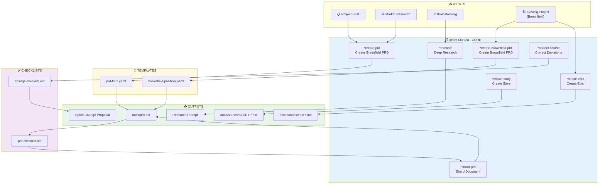
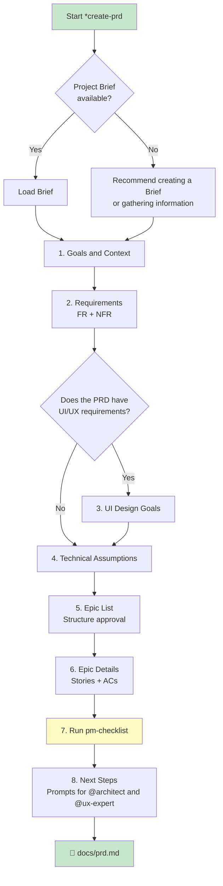
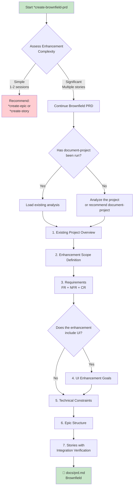
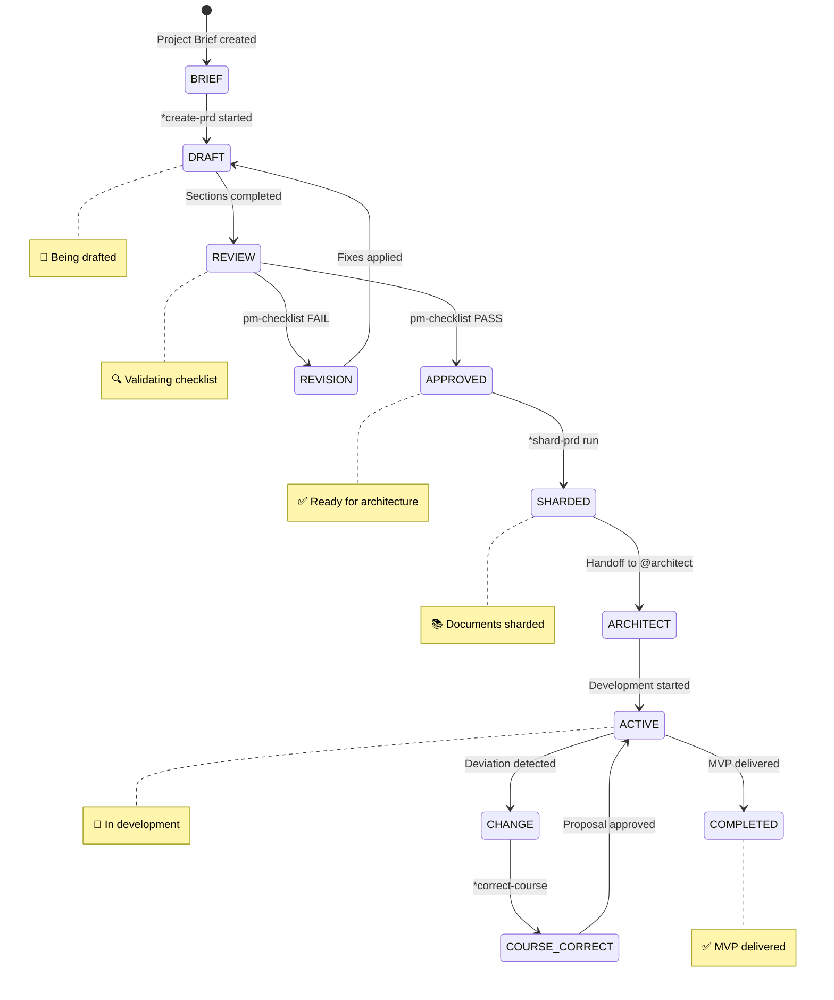
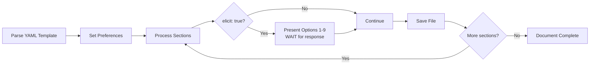
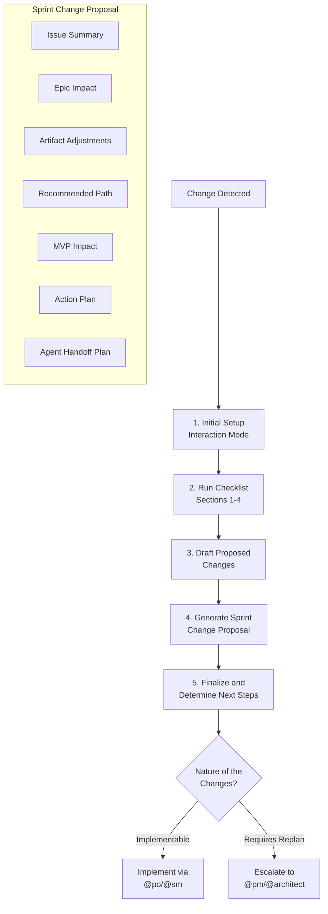
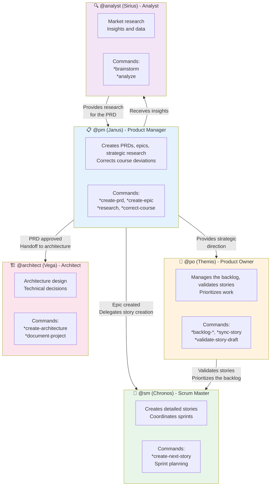

# Product Manager (PM) Agent System - AEXOS

> **Version:** 1.0.0
> **Created:** 2026-02-04
> **Owner:** @pm (Janus)
> **Status:** Official Documentation

---

## Overview

This document describes the complete system of the AEXOS Product Manager (PM) agent, including all the files involved, workflows, available commands and integrations between agents.

The PM agent is designed to:
- Create and manage Product Requirements Documents (PRDs) for greenfield and brownfield projects
- Define and structure epics with integrated quality planning
- Conduct strategic research and market analysis
- Correct course deviations during development
- Shard large documents into manageable parts
- Collaborate with other agents to ensure strategic alignment

### Persona: Janus - The Strategist

| Attribute | Value |
|----------|-------|
| **Name** | Janus |
| **ID** | pm |
| **Title** | Product Manager |
| **Icon** | :clipboard: |
| **Archetype** | Strategist |
| **Sign** | Capricorn |
| **Tone** | Strategic |
| **Signature** | "-- Janus, planning the future :bar_chart:" |

---

## Complete File List

### Agent Definition File

| File | Purpose |
|---------|-----------|
| `.aexos-core/development/agents/pm.md` | Core definition of the PM agent |
| `.claude/commands/AEXOS/agents/pm.md` | Claude Code command to activate @pm |

### @pm Tasks

| File | Command | Purpose |
|---------|---------|-----------|
| `.aexos-core/development/tasks/create-doc.md` | `*create-prd` | Creates documents from YAML templates |
| `.aexos-core/development/tasks/correct-course.md` | `*correct-course` | Analyzes and corrects project deviations |
| `.aexos-core/development/tasks/create-deep-research-prompt.md` | `*research` | Generates deep research prompts |
| `.aexos-core/development/tasks/brownfield-create-epic.md` | `*create-epic` | Creates epics for brownfield projects |
| `.aexos-core/development/tasks/brownfield-create-story.md` | `*create-story` | Creates stories for brownfield |
| `.aexos-core/development/tasks/execute-checklist.md` | `*checklist` | Runs checklist validation |
| `.aexos-core/development/tasks/shard-doc.md` | `*shard-prd` | Shards large documents |

### @pm Templates

| File | Purpose |
|---------|-----------|
| `.aexos-core/product/templates/prd-tmpl.yaml` | PRD template for greenfield projects |
| `.aexos-core/product/templates/brownfield-prd-tmpl.yaml` | PRD template for brownfield projects |

### @pm Checklists

| File | Purpose |
|---------|-----------|
| `.aexos-core/product/checklists/pm-checklist.md` | PRD validation checklist |
| `.aexos-core/product/checklists/change-checklist.md` | Checklist for navigating changes |

### Workflows That Use @pm

| File | Phase | Purpose |
|---------|------|-----------|
| `.aexos-core/development/workflows/brownfield-discovery.yaml` | Phase 10 | Post-discovery epic and story creation |

---

## Flowchart: Complete PM System



### Greenfield PRD Flow Diagram



### Brownfield PRD Flow Diagram



---

## PRD Lifecycle Diagram



---

## Command to Task Mapping

### Document Creation Commands

| Command | Task File | Template | Description |
|---------|-----------|----------|-----------|
| `*create-prd` | `create-doc.md` | `prd-tmpl.yaml` | Creates a PRD for a greenfield project |
| `*create-brownfield-prd` | `create-doc.md` | `brownfield-prd-tmpl.yaml` | Creates a PRD for a brownfield project |
| `*shard-prd` | `shard-doc.md` | N/A | Shards the PRD into smaller files |
| `*doc-out` | `create-doc.md` | N/A | Generates the complete document |

### Strategic Planning Commands

| Command | Task File | Description |
|---------|-----------|-----------|
| `*create-epic` | `brownfield-create-epic.md` | Creates an epic for a brownfield enhancement |
| `*create-story` | `brownfield-create-story.md` | Creates a standalone story for brownfield |
| `*research {topic}` | `create-deep-research-prompt.md` | Generates a deep research prompt |
| `*correct-course` | `correct-course.md` | Navigates changes and deviations |

### Utility Commands

| Command | Description |
|---------|-----------|
| `*help` | Shows all available commands |
| `*session-info` | Shows details of the current session |
| `*guide` | Full agent usage guide |
| `*yolo` | Toggles confirmation mode |
| `*exit` | Exits PM mode |

---

## Task Details

### Task: create-doc.md (PRD Creation)

**Purpose:** Create product requirements documents using interactive YAML templates.

**Execution Modes:**
1. **YOLO Mode** - Autonomous, minimal interaction (0-1 prompts)
2. **Interactive Mode** [DEFAULT] - Decision checkpoints (5-10 prompts)
3. **Pre-Flight Planning** - Complete upfront planning

**Processing Flow:**



**Mandatory Elicitation Format:**
- Option 1: Always "Proceed to next section"
- Options 2-9: Elicitation methods from `data/elicitation-methods`
- Ends with: "Select 1-9 or just type your question/feedback:"

---

### Task: brownfield-create-epic.md

**Purpose:** Create focused epics for smaller brownfield enhancements (1-3 stories).

**When to Use:**
- Enhancement completable in 1-3 stories
- No significant architectural changes
- Follows existing project patterns
- Minimal integration complexity

**Epic Structure:**

```markdown
## Epic: {{Enhancement Name}} - Brownfield Enhancement

### Epic Goal
{{1-2 sentences describing the objective and value}}

### Epic Description
**Existing System Context:**
- Current relevant functionality
- Technology stack
- Integration points

**Enhancement Details:**
- What's being added/changed
- How it integrates
- Success criteria

### Stories (with Quality Planning)
1. **Story 1: {{Title}}**
   - Description
   - **Predicted Agents**: @dev, @db-sage, etc.
   - **Quality Gates**: Pre-Commit, Pre-PR, Pre-Deployment

### Risk Mitigation
- Primary Risk
- Mitigation Strategy
- Rollback Plan
```

**Agent Assignment Guide:**

| Type of Change | Predicted Agents |
|-----------------|------------------|
| Database Changes | @dev, @db-sage |
| API/Backend Changes | @dev, @architect |
| Frontend/UI Changes | @dev, @ux-expert |
| Deployment/Infrastructure | @dev, @github-devops |
| Security Features | @dev (OWASP focus) |

---

### Task: create-deep-research-prompt.md

**Purpose:** Generate structured research prompts for in-depth analysis.

**Available Research Types:**

| # | Type | Description |
|---|------|-----------|
| 1 | Product Validation Research | Validate hypotheses and market fit |
| 2 | Market Opportunity Research | Analyze market size and potential |
| 3 | User & Customer Research | Personas, jobs-to-be-done, pain points |
| 4 | Competitive Intelligence Research | Competitor analysis |
| 5 | Technology & Innovation Research | Technology trends |
| 6 | Industry & Ecosystem Research | Value chains and ecosystem |
| 7 | Strategic Options Research | Evaluate strategic directions |
| 8 | Risk & Feasibility Research | Identify and assess risks |
| 9 | Custom Research Focus | Custom research |

**Research Prompt Structure:**

```markdown
## Research Objective
[Clear statement of the objective]

## Background Context
[Context from the brief, brainstorming, or inputs]

## Research Questions
### Primary Questions (Must Answer)
1. [Specific, actionable question]

### Secondary Questions (Nice to Have)
1. [Supporting question]

## Research Methodology
### Information Sources
### Analysis Frameworks
### Data Requirements

## Expected Deliverables
### Executive Summary
### Detailed Analysis
### Supporting Materials

## Success Criteria
[How to assess whether the research met its objectives]
```

---

### Task: correct-course.md

**Purpose:** Navigate significant changes during development using `change-checklist.md`.

**Course Correction Flow:**



**Change Checklist Sections:**
1. Understand the Trigger & Context
2. Epic Impact Assessment
3. Artifact Conflict & Impact Analysis
4. Path Forward Evaluation
5. Sprint Change Proposal Components
6. Final Review & Handoff

---

## Integrations Between Agents

### Collaboration Diagram



### Handoff Matrix

| From | To | Trigger | Artifact |
|----|------|---------|----------|
| @pm | @architect | PRD approved | `docs/prd.md` + Architect Prompt |
| @pm | @ux-expert | PRD with UI | `docs/prd.md` + UX Expert Prompt |
| @pm | @sm | Epic created | Epic doc + Story Manager Handoff |
| @pm | @po | PRD for validation | PRD Draft |
| @analyst | @pm | Research complete | Research findings |
| @pm | @pm (self) | Deviation detected | Sprint Change Proposal |

### Brownfield Discovery Workflow Flow

```mermaid
flowchart LR
    subgraph PHASE_1_9["PHASES 1-9: Discovery & Assessment"]
        ARCH["@architect"]
        DATA["@data-engineer"]
        UX["@ux-design-expert"]
        QA["@qa"]
        ANALYST["@analyst"]
    end

    subgraph PHASE_10["PHASE 10: Planning"]
        PM["@pm"]
        EPIC["*brownfield-create-epic"]
        STORY["*brownfield-create-story"]
    end

    PHASE_1_9 -->|"Assessment complete<br/>docs/prd/technical-debt-assessment.md"| PM
    PM --> EPIC
    EPIC --> STORY
    STORY -->|"Stories ready<br/>docs/stories/story-*.md"| DEV["@dev"]

    style PM fill:#e3f2fd
    style EPIC fill:#fff9c4
    style STORY fill:#fff9c4
```



---

## Template Structure

### Greenfield PRD Template (prd-tmpl.yaml)

| Section | ID | Elicit | Description |
|-------|----|----|-----------|
| Goals and Background | goals-context | No | Project objectives and context |
| Requirements | requirements | **Yes** | FR + NFR |
| UI Design Goals | ui-goals | **Yes** | UX/UI vision (conditional) |
| Technical Assumptions | technical-assumptions | **Yes** | Technical decisions |
| Epic List | epic-list | **Yes** | List of epics for approval |
| Epic Details | epic-details | **Yes** | Detailed stories and ACs |
| Checklist Results | checklist-results | No | pm-checklist results |
| Next Steps | next-steps | No | Prompts for the next agents |

### Brownfield PRD Template (brownfield-prd-tmpl.yaml)

| Section | ID | Elicit | Description |
|-------|----|----|-----------|
| Intro Analysis | intro-analysis | No | Analysis of the existing project |
| Requirements | requirements | **Yes** | FR + NFR + CR (Compatibility) |
| UI Enhancement Goals | ui-enhancement-goals | No | Integration with the existing UI |
| Technical Constraints | technical-constraints | No | Constraints and integration |
| Epic Structure | epic-structure | **Yes** | Epic structure |
| Epic Details | epic-details | **Yes** | Stories with Integration Verification |

---

## Detailed Checklists

### PM Checklist (pm-checklist.md)

**9 Validation Categories:**

| # | Category | Focus |
|---|-----------|------|
| 1 | Problem Definition & Context | Problem, goals, user research |
| 2 | MVP Scope Definition | Core functionality, boundaries, validation |
| 3 | User Experience Requirements | Journeys, usability, UI |
| 4 | Functional Requirements | Features, quality, user stories |
| 5 | Non-Functional Requirements | Performance, security, reliability |
| 6 | Epic & Story Structure | Epics, breakdown, first epic |
| 7 | Technical Guidance | Architecture, decisions, implementation |
| 8 | Cross-Functional Requirements | Data, integration, operations |
| 9 | Clarity & Communication | Documentation, stakeholder alignment |

**Category Status:**
- **PASS**: 90%+ complete
- **PARTIAL**: 60-89% complete
- **FAIL**: <60% complete

**Final Decision:**
- **READY FOR ARCHITECT**: PRD complete and structured
- **NEEDS REFINEMENT**: Requires additional work

### Change Checklist (change-checklist.md)

**6 Navigation Sections:**

| # | Section | Purpose |
|---|-------|-----------|
| 1 | Understand Trigger & Context | Identify the issue and initial impact |
| 2 | Epic Impact Assessment | Analyze the impact on current and future epics |
| 3 | Artifact Conflict Analysis | Review PRD, Architecture, Frontend Spec |
| 4 | Path Forward Evaluation | Evaluate options (adjust, rollback, re-scope) |
| 5 | Sprint Change Proposal | Proposal components |
| 6 | Final Review & Handoff | Approval and next steps |

---

## Best Practices

### PRD Creation

1. **Always start with a Project Brief** - The brief provides an essential foundation
2. **Use Interactive mode** - For complex PRDs, elicitation is crucial
3. **Validate with the checklist** - Run pm-checklist before handoff
4. **Shard large documents** - Use `*shard-prd` for maintainability
5. **Document decisions** - Rationale for technical and scope choices

### Brownfield Epic Creation

1. **Assess the scope first** - If > 3 stories, consider a full PRD
2. **Analyze the existing project** - Understand the patterns before proposing changes
3. **Plan quality gates** - Include appropriate validation for each story
4. **Identify specialized agents** - Assign experts according to the type of change
5. **Include a rollback plan** - Always have a reversal strategy

### Course Correction

1. **Do not jump to solutions** - Understand the problem fully first
2. **Assess cascading impact** - Changes ripple through the project
3. **Document trade-offs** - Be honest about costs and benefits
4. **Get explicit approval** - Never assume implicit agreement
5. **Define success criteria** - How will we know the change worked?

---

## Troubleshooting

### PRD does not pass the checklist

**Common Causes:**
- Problem not clearly defined
- MVP too large or too small
- Ambiguous requirements

**Solution:**
- Review the categories marked FAIL
- Refine specific requirements
- Validate the scope with stakeholders

### Epic too complex

**Common Causes:**
- Trying to do too much in one epic
- Architectural changes required

**Solution:**
- Split it into multiple epics
- Consider a full brownfield PRD
- Consult @architect for technical decisions

### Change detected during development

**Common Causes:**
- Requirement discovered late
- Technical limitation encountered
- Pivot based on feedback

**Solution:**
- Run `*correct-course`
- Follow the change-checklist
- Document the proposal and get approval

### Template not found

**Common Causes:**
- Incorrect path
- Template renamed

**Solution:**
- Check `.aexos-core/product/templates/`
- List available templates with create-doc
- Update the reference in the agent if necessary

---

## References

- [Agent Definition: pm.md](.aexos-core/development/agents/pm.md)
- [Task: create-doc.md](.aexos-core/development/tasks/create-doc.md)
- [Task: brownfield-create-epic.md](.aexos-core/development/tasks/brownfield-create-epic.md)
- [Task: correct-course.md](.aexos-core/development/tasks/correct-course.md)
- [Template: prd-tmpl.yaml](.aexos-core/product/templates/prd-tmpl.yaml)
- [Template: brownfield-prd-tmpl.yaml](.aexos-core/product/templates/brownfield-prd-tmpl.yaml)
- [Checklist: pm-checklist.md](.aexos-core/product/checklists/pm-checklist.md)
- [Checklist: change-checklist.md](.aexos-core/product/checklists/change-checklist.md)
- [Workflow: brownfield-discovery.yaml](.aexos-core/development/workflows/brownfield-discovery.yaml)

---

## Summary

| Aspect | Details |
|---------|----------|
| **Total Tasks** | 7 task files |
| **Templates** | 2 (greenfield + brownfield PRD) |
| **Checklists** | 2 (PM validation + Change navigation) |
| **Workflows** | 1 (Brownfield Discovery - Phase 10) |
| **Main Commands** | 7 (`*create-prd`, `*create-epic`, `*research`, etc.) |
| **Collaborating Agents** | @po, @sm, @architect, @analyst, @ux-expert |
| **Main Handoff** | PM -> Architect (approved PRD) |

---

## Changelog

| Date | Author | Description |
|------|-------|-----------|
| 2026-02-04 | Technical Doc Specialist | Initial document created |
| 2026-02-04 | Technical Doc Specialist | Added Mermaid diagrams (6 flowcharts + 1 stateDiagram) |

---

*-- Janus, planning the future :bar_chart:*
