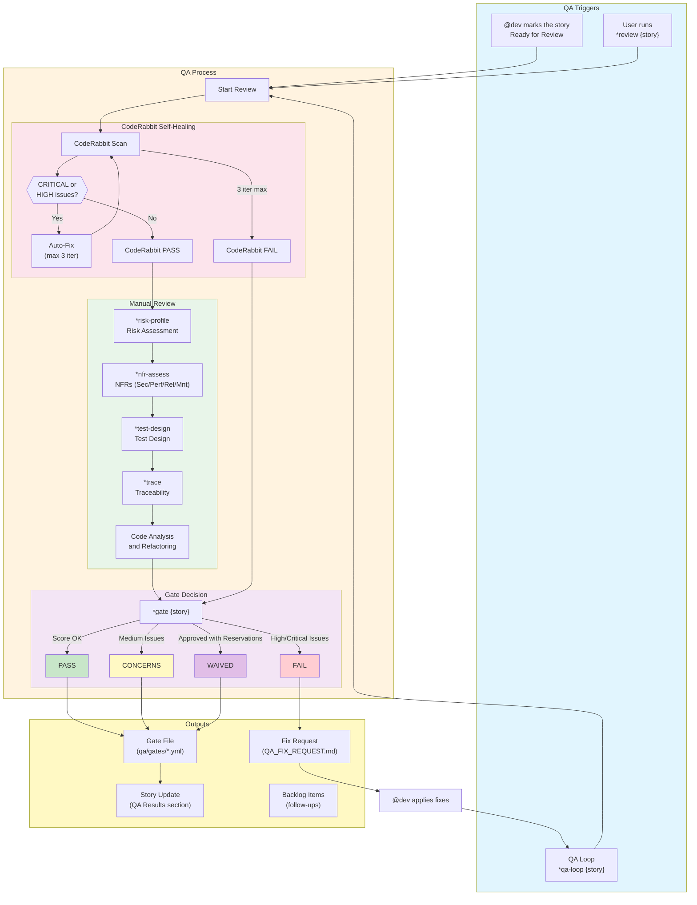
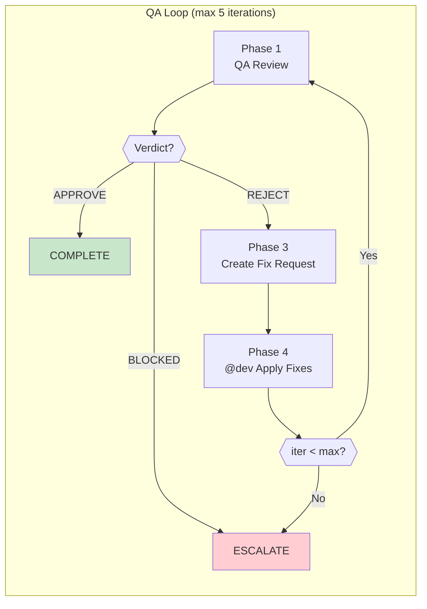
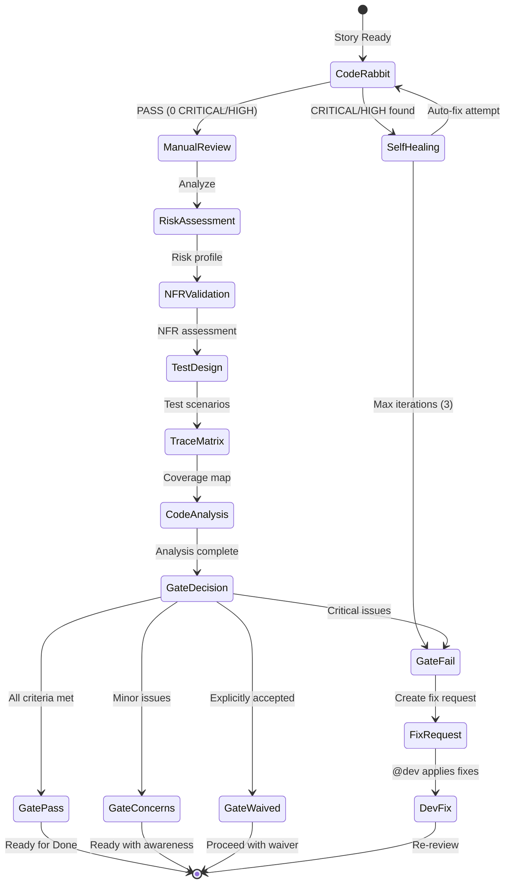
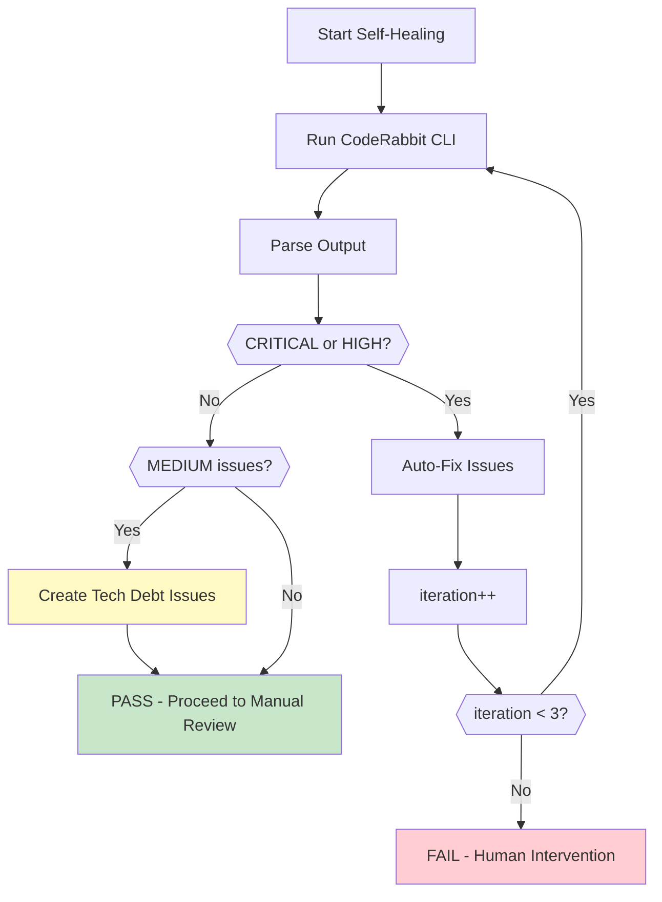
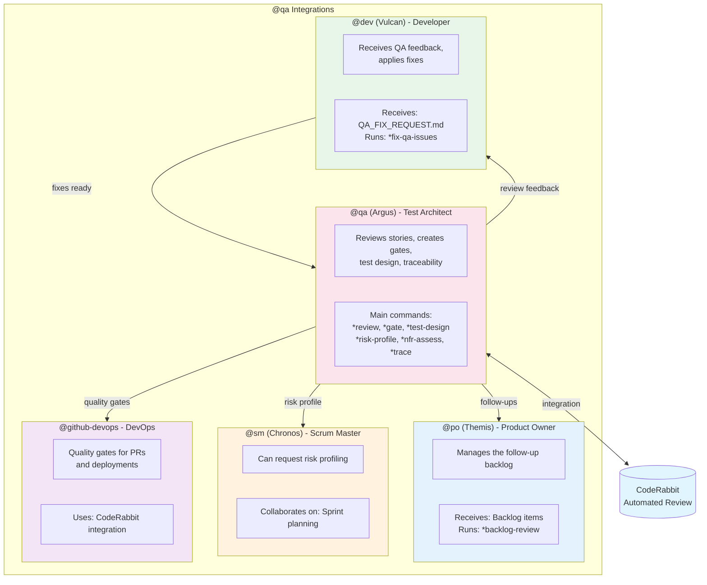

# @qa Agent System

> **Version:** 1.0.0
> **Created:** 2026-02-04
> **Owner:** @qa (Argus - Guardian)
> **Status:** Official Documentation

---

## Overview

The **@qa (Argus)** agent is the Test Architect & Quality Advisor of AEXOS. Its role is to provide comprehensive quality analysis, quality gate decisions and actionable recommendations for development teams.

**Archetype:** Guardian (Virgo)
**Communication Tone:** Analytical, systematic, educational, pragmatic
**Characteristic Vocabulary:** validate, verify, ensure, protect, audit, inspect, assure

### Core Principles

1. **Depth As Needed** - Go deep based on risk signals, stay concise when risk is low
2. **Requirements Traceability** - Map every story to tests using Given-When-Then patterns
3. **Risk-Based Testing** - Assess and prioritize by likelihood x impact
4. **Quality Attributes** - Validate NFRs (security, performance, reliability)
5. **Testability Assessment** - Evaluate controllability, observability, debuggability
6. **Gate Governance** - Provide clear PASS/CONCERNS/FAIL/WAIVED decisions with rationale
7. **Advisory Excellence** - Educate through documentation, never block arbitrarily
8. **CodeRabbit Integration** - Use automated review to catch issues early

---

## Complete File List

### @qa Core Task Files

| File | Command | Purpose |
|------|---------|---------|
| `.aexos-core/development/tasks/qa-gate.md` | `*gate {story}` | Create a quality gate decision file |
| `.aexos-core/development/tasks/qa-review-story.md` | `*review {story}` | Full story review with a gate decision |
| `.aexos-core/development/tasks/qa-test-design.md` | `*test-design {story}` | Create comprehensive test scenarios |
| `.aexos-core/development/tasks/qa-risk-profile.md` | `*risk-profile {story}` | Generate a risk assessment matrix |
| `.aexos-core/development/tasks/qa-nfr-assess.md` | `*nfr-assess {story}` | Validate non-functional requirements |
| `.aexos-core/development/tasks/qa-trace-requirements.md` | `*trace {story}` | Map requirements to tests (Given-When-Then) |
| `.aexos-core/development/tasks/qa-generate-tests.md` | `*generate-tests` | Generate test suites automatically |
| `.aexos-core/development/tasks/qa-run-tests.md` | `*run-tests` | Run the test suite with a quality gate |
| `.aexos-core/development/tasks/qa-backlog-add-followup.md` | `*backlog-add` | Add follow-ups to the backlog |
| `.aexos-core/development/tasks/qa-create-fix-request.md` | `*create-fix-request {story}` | Generate a fix request document for @dev |

### @qa Secondary Task Files

| File | Purpose |
|------|---------|
| `.aexos-core/development/tasks/qa-browser-console-check.md` | Check for browser console errors |
| `.aexos-core/development/tasks/qa-evidence-requirements.md` | Evidence requirements for QA |
| `.aexos-core/development/tasks/qa-false-positive-detection.md` | False positive detection |
| `.aexos-core/development/tasks/qa-fix-issues.md` | Task for @dev to apply QA fixes |
| `.aexos-core/development/tasks/qa-library-validation.md` | Library validation |
| `.aexos-core/development/tasks/qa-migration-validation.md` | Migration validation |
| `.aexos-core/development/tasks/qa-review-build.md` | Build review |
| `.aexos-core/development/tasks/qa-security-checklist.md` | Security checklist |
| `.aexos-core/development/tasks/qa-review-proposal.md` | Proposal review |

### Agent Definition Files

| File | Purpose |
|------|---------|
| `.aexos-core/development/agents/qa.md` | Complete definition of the QA agent |
| `.claude/commands/AEXOS/agents/qa.md` | Claude Code command to activate @qa |

### Workflow Files

| File | Purpose |
|------|---------|
| `.aexos-core/development/workflows/qa-loop.yaml` | QA loop orchestrator (Review -> Fix -> Re-review) |

### Team Files

| File | Purpose |
|------|---------|
| `.aexos-core/development/agent-teams/team-qa-focused.yaml` | Configuration of the QA-focused team (@dev, @qa, @github-devops) |

### Data Files (Outputs)

| File | Purpose |
|------|---------|
| `docs/qa/gates/` | Quality gate decision files |
| `docs/qa/assessments/` | Risk, NFR and trace assessments |
| `docs/qa/coderabbit-reports/` | CodeRabbit review reports |
| `docs/qa/backlog-archive-{YYYY-MM}.md` | Archive of completed items |

### Configuration Files

| File | Purpose |
|------|---------|
| `.aexos-core/core-config.yaml` | Central configuration (qa.qaLocation, etc.) |
| `.aexos-core/development/data/technical-preferences.md` | Technical preferences for QA |

---

## Flowchart: Complete QA System



### Automated QA Loop Flow



---

## Command-to-Task Mapping

### Analysis and Review Commands

| Command | Task File | Operation |
|---------|-----------|-----------|
| `*code-review {scope}` | (internal) | Run an automated review |
| `*review {story}` | `qa-review-story.md` | Full story review |

### Quality Gate Commands

| Command | Task File | Operation |
|---------|-----------|-----------|
| `*gate {story}` | `qa-gate.md` | Create a quality gate decision |
| `*nfr-assess {story}` | `qa-nfr-assess.md` | Validate non-functional requirements |
| `*risk-profile {story}` | `qa-risk-profile.md` | Generate a risk matrix |

### Test Strategy Commands

| Command | Task File | Operation |
|---------|-----------|-----------|
| `*test-design {story}` | `qa-test-design.md` | Create test scenarios |
| `*trace {story}` | `qa-trace-requirements.md` | Map requirements to tests |
| `*generate-tests` | `qa-generate-tests.md` | Generate tests automatically |
| `*run-tests` | `qa-run-tests.md` | Run the test suite |

### Backlog Commands

| Command | Task File | Operation |
|---------|-----------|-----------|
| `*backlog-add` | `qa-backlog-add-followup.md` | Add a follow-up to the backlog |
| `*backlog-update {id} {status}` | (via po-manage-story-backlog) | Update an item's status |
| `*backlog-review` | (via po-manage-story-backlog) | Generate a backlog review |

### Utility Commands

| Command | Task File | Operation |
|---------|-----------|-----------|
| `*help` | (internal) | Show all commands |
| `*session-info` | (internal) | Show session details |
| `*guide` | (internal) | Show the complete usage guide |
| `*exit` | (internal) | Exit QA mode |

---

## Story Review Lifecycle

### 1. Prerequisites

```yaml
Pre-conditions:
  - Story status: "Review"
  - Developer completed every task
  - File List updated in the story
  - All automated tests passing
```

### 2. Review Process



### 3. Issue Severities

| Severity | Prefix | Action | Gate Impact |
|----------|--------|--------|-------------|
| CRITICAL | `SEC-`, `DATA-` | Auto-fix or block | Gate = FAIL |
| HIGH | `PERF-`, `REL-` | Auto-fix or document | Gate = FAIL |
| MEDIUM | `MNT-`, `TEST-` | Tech debt issue | Gate = CONCERNS |
| LOW | `DOC-`, `ARCH-` | Note in the review | Gate = PASS |

### 4. Gate Decisions

```yaml
Gate Criteria:
  PASS:
    - All acceptance criteria met
    - No high-severity issue
    - Test coverage meets the project standards

  CONCERNS:
    - Non-blocking issues present
    - They must be tracked and scheduled
    - It can proceed with awareness

  FAIL:
    - Acceptance criteria not met
    - High-severity issues present
    - Recommend returning to InProgress

  WAIVED:
    - Issues explicitly accepted
    - Requires approval and rationale
    - Proceed despite known issues
```

---

## CodeRabbit Integration

### Self-Healing Configuration

```yaml
coderabbit_integration:
  enabled: true
  installation_mode: wsl

  self_healing:
    enabled: true
    type: full
    max_iterations: 3
    timeout_minutes: 30
    trigger: review_start

    severity_filter:
      - CRITICAL
      - HIGH

    behavior:
      CRITICAL: auto_fix       # Auto-fix (3 attempts max)
      HIGH: auto_fix           # Auto-fix (3 attempts max)
      MEDIUM: document_as_debt # Create a tech debt issue
      LOW: ignore              # Note in the review, no action
```

### CodeRabbit Commands

```bash
# Pre-review (uncommitted changes)
wsl bash -c 'cd /mnt/c/.../aexos-core && ~/.local/bin/coderabbit --prompt-only -t uncommitted'

# Story review (committed changes vs main)
wsl bash -c 'cd /mnt/c/.../aexos-core && ~/.local/bin/coderabbit --prompt-only -t committed --base main'
```

### Self-Healing Flow



---

## Integrations Between Agents

### Integration Diagram



### QA -> Dev Handoff Flow

1. @qa runs `*review {story}`
2. Identifies critical issues
3. Creates `*create-fix-request {story}`
4. @dev receives `QA_FIX_REQUEST.md`
5. @dev runs `*fix-qa-issues {story}`
6. @dev creates `READY_FOR_REREVIEW.md`
7. @qa re-reviews with `*review {story}`

### Backlog Flow

1. @qa identifies follow-ups during the review
2. Adds the item with `*backlog-add`
3. The item is tracked with source: "QA Review"
4. @po prioritizes it with `*backlog-prioritize`

---

## Configuration

### core-config.yaml

```yaml
qa:
  qaLocation: docs/qa
  gatesLocation: docs/qa/gates
  assessmentsLocation: docs/qa/assessments
  reportsLocation: docs/qa/coderabbit-reports

  # Thresholds
  coverageTarget: 80
  qualityScoreMinimum: 70

  # CodeRabbit
  coderabbitEnabled: true
  selfHealingEnabled: true
  maxSelfHealingIterations: 3

devStoryLocation: docs/stories
```

### Git Restrictions

```yaml
git_restrictions:
  allowed_operations:
    - git status      # Check the repository state
    - git log         # View the commit history
    - git diff        # Review changes
    - git branch -a   # List branches

  blocked_operations:
    - git push        # ONLY @github-devops can push
    - git commit      # QA reviews, it does not commit
    - gh pr create    # ONLY @github-devops creates PRs
```

---

## Best Practices

### During the Review

1. **Run CodeRabbit first** - Let automation find the obvious issues
2. **Assess risk** - Determine the depth of the review
3. **Check traceability** - Every AC must have a corresponding test
4. **Document refactorings** - If you modify code, explain WHY and HOW
5. **Stay focused** - Only update the QA Results section

### Gate Creation

1. **Use the correct severities** - low/medium/high only
2. **Justify the decision** - status_reason in 1-2 sentences
3. **Identify owners** - dev/sm/po for each issue
4. **Set an expiration** - Typically 2 weeks

### Avoid

- Modifying story sections beyond QA Results
- Blocking without a clear rationale
- Ignoring medium issues (document them as tech debt)
- Reviewing before CodeRabbit finishes
- Approving without checking test coverage

---

## Troubleshooting

### CodeRabbit not found

```bash
# Check the installation
wsl bash -c '~/.local/bin/coderabbit --version'

# If not installed, use wsl_config.installation_path in the agent
```

### Review timeout

- CodeRabbit can take up to 30 minutes
- Increase the timeout if necessary
- Check whether there are stuck processes

### Gate file not created

1. Check whether `qa.qaLocation/gates` exists
2. Check write permissions
3. Confirm that the `qa-gate-tmpl.yaml` template is available

### Story not found

1. Check the story ID format (epic.story)
2. Confirm that the story exists in `docs/stories/`
3. Use the full path if necessary

### Self-healing issues persist

1. Check whether the issues are really auto-fixable
2. Consider manual intervention after 3 iterations
3. Create tech debt for complex issues

---

## References

### Core Tasks

- [qa-gate.md](/.aexos-core/development/tasks/qa-gate.md)
- [qa-review-story.md](/.aexos-core/development/tasks/qa-review-story.md)
- [qa-test-design.md](/.aexos-core/development/tasks/qa-test-design.md)
- [qa-risk-profile.md](/.aexos-core/development/tasks/qa-risk-profile.md)
- [qa-nfr-assess.md](/.aexos-core/development/tasks/qa-nfr-assess.md)
- [qa-trace-requirements.md](/.aexos-core/development/tasks/qa-trace-requirements.md)

### Workflows

- [qa-loop.yaml](/.aexos-core/development/workflows/qa-loop.yaml)

### Teams

- [team-qa-focused.yaml](/.aexos-core/development/agent-teams/team-qa-focused.yaml)

### Agent

- [qa.md](/.aexos-core/development/agents/qa.md)

### Related Documents

- [BACKLOG-MANAGEMENT-SYSTEM.md](/docs/guides/BACKLOG-MANAGEMENT-SYSTEM.md)

---

## Summary

| Aspect | Details |
|--------|---------|
| **Total Core Tasks** | 10 main task files |
| **Total Secondary Tasks** | 9 supporting task files |
| **Main Workflow** | qa-loop.yaml (orchestration) |
| **Review Commands** | 2 (`*code-review`, `*review`) |
| **Gate Commands** | 3 (`*gate`, `*nfr-assess`, `*risk-profile`) |
| **Test Commands** | 4 (`*test-design`, `*trace`, `*generate-tests`, `*run-tests`) |
| **Backlog Commands** | 3 (`*backlog-*` family) |
| **Gate Decisions** | 4 (PASS, CONCERNS, FAIL, WAIVED) |
| **Severities** | 3 (low, medium, high) |
| **Self-Healing Max** | 3 iterations |
| **CodeRabbit Integration** | Yes (WSL mode) |

---

## Changelog

| Date | Author | Description |
|------|--------|-------------|
| 2026-02-04 | @qa | Initial document created with complete Mermaid diagrams |

---

*-- Argus, guardian of quality*
