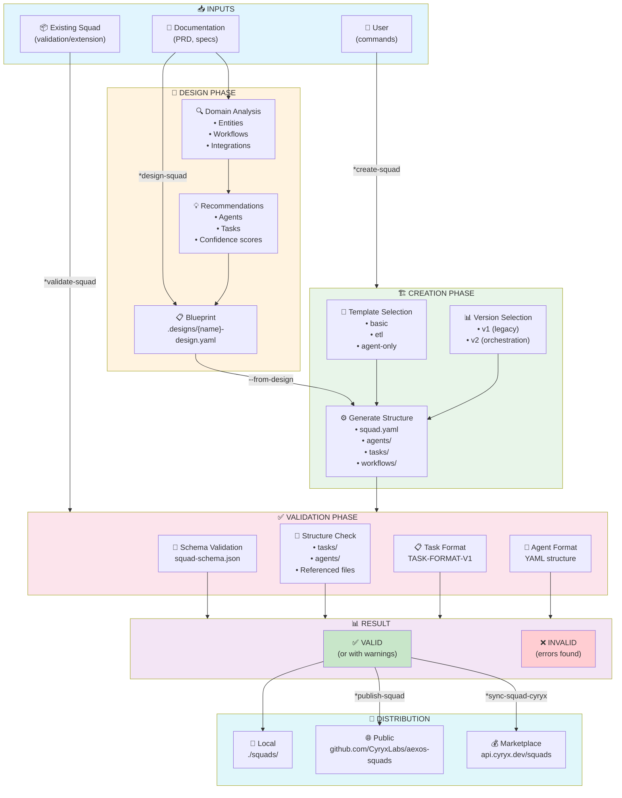
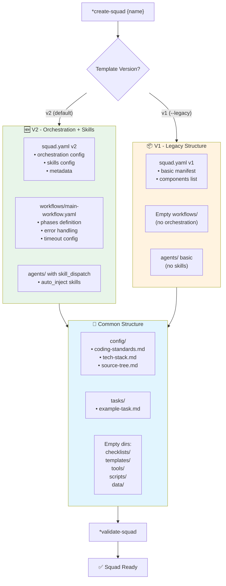
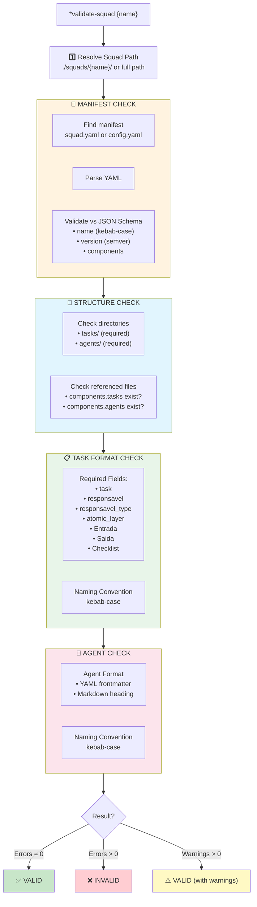
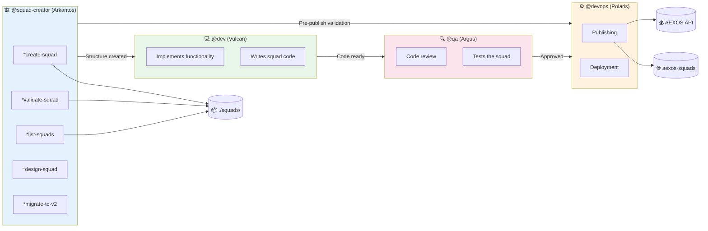
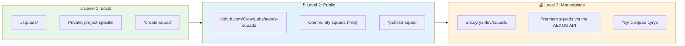

# AEXOS Squad Creation and Management System

> **Version:** 1.0.0
> **Created:** 2026-02-04
> **Owner:** @squad-creator (Arkantos)
> **Status:** Official Documentation

---

## Overview

The **Squad Creator** (Arkantos) is the AEXOS agent specialized in creating, validating, publishing and managing squads. Squads are modular packages of agents, tasks, workflows and resources that can be reused across projects.

This system implements the AEXOS **task-first architecture**, where tasks are the main entry point for execution and agents orchestrate those tasks.

### System Purposes

- **Create squads** following AEXOS standards and structure
- **Validate squads** against the JSON Schema and task specifications
- **List squads** local to the project
- **Distribute squads** across 3 levels (Local, aexos-squads, AEXOS API)
- **Migrate squads** to the v2 format with orchestration and skills
- **Analyze and extend** existing squads

### Fundamental Principles

1. **Task-First Architecture**: Tasks are the entry point, agents orchestrate
2. **Mandatory Validation**: Always validate before distributing
3. **JSON Schema**: Manifests validated against a schema
4. **3 Distribution Levels**: Local, Public (aexos-squads), Marketplace (AEXOS API)
5. **Integration with aexos-core**: Squads work in synergy with the framework

---

## Complete File List

### Core Agent Definition Files

| File | Purpose |
|------|---------|
| `.aexos-core/development/agents/squad-creator.md` | Core definition of the Squad Creator agent |
| `.claude/commands/AEXOS/agents/squad-creator.md` | Claude Code command to activate @squad-creator |

### @squad-creator Task Files

| File | Command | Purpose | Status |
|------|---------|---------|--------|
| `.aexos-core/development/tasks/squad-creator-create.md` | `*create-squad` | Creates a new squad with the complete structure | Active |
| `.aexos-core/development/tasks/squad-creator-design.md` | `*design-squad` | Analyzes documentation and generates a blueprint | Active |
| `.aexos-core/development/tasks/squad-creator-validate.md` | `*validate-squad` | Validates a squad against the schema and standards | Active |
| `.aexos-core/development/tasks/squad-creator-list.md` | `*list-squads` | Lists local squads | Active |
| `.aexos-core/development/tasks/squad-creator-analyze.md` | `*analyze-squad` | Analyzes the structure and suggests improvements | Active |
| `.aexos-core/development/tasks/squad-creator-extend.md` | `*extend-squad` | Extends a squad with new components | Active |
| `.aexos-core/development/tasks/squad-creator-migrate.md` | `*migrate-to-v2` | Migrates a squad to the v2 format | Active |
| `.aexos-core/development/tasks/squad-generate-skills.md` | `*generate-skills` | Generates skills from the squad's knowledge | Active |
| `.aexos-core/development/tasks/squad-generate-workflow.md` | `*generate-workflow` | Generates a YAML orchestration workflow | Active |
| `.aexos-core/development/tasks/squad-creator-download.md` | `*download-squad` | Downloads a squad from the public repository | Placeholder (Sprint 8) |
| `.aexos-core/development/tasks/squad-creator-publish.md` | `*publish-squad` | Publishes a squad to aexos-squads | Placeholder (Sprint 8) |
| `.aexos-core/development/tasks/squad-creator-sync-aexos.md` | `*sync-squad-cyryx` | Syncs a squad with the AEXOS API | Placeholder (Sprint 8) |

### Related Task Files

| File | Command | Purpose |
|------|---------|---------|
| `.aexos-core/development/tasks/create-agent.md` | `*create-agent` | Creates an individual agent definition |
| `.aexos-core/development/tasks/create-task.md` | `*create-task` | Creates an individual task file |
| `.aexos-core/development/tasks/create-workflow.md` | `*create-workflow` | Creates an orchestration workflow |

### Supporting Scripts

| File | Class/Function | Purpose |
|------|----------------|---------|
| `.aexos-core/development/scripts/squad/squad-generator.js` | `SquadGenerator` | Generates the complete squad structure |
| `.aexos-core/development/scripts/squad/squad-validator.js` | `SquadValidator` | Validates a squad against the schema and standards |
| `.aexos-core/development/scripts/squad/squad-loader.js` | `SquadLoader` | Loads and resolves squads |
| `.aexos-core/development/scripts/squad/squad-designer.js` | `SquadDesigner` | Analyzes docs and generates blueprints |
| `.aexos-core/development/scripts/squad/squad-analyzer.js` | `SquadAnalyzer` | Analyzes squad structure |
| `.aexos-core/development/scripts/squad/squad-extender.js` | `SquadExtender` | Extends existing squads |
| `.aexos-core/development/scripts/squad/squad-migrator.js` | `SquadMigrator` | Migrates squads to v2 |
| `.aexos-core/development/scripts/squad/squad-downloader.js` | `SquadDownloader` | Downloads squads from the repository |
| `.aexos-core/development/scripts/squad/squad-publisher.js` | `SquadPublisher` | Publishes squads |

### JSON Schemas

| File | Purpose |
|------|---------|
| `.aexos-core/schemas/squad-schema.json` | Validation schema for squad.yaml |
| `.aexos-core/schemas/squad-design-schema.json` | Validation schema for blueprints |

### Output Files (Generated Squads)

| Directory | Purpose |
|-----------|---------|
| `./squads/{squad-name}/` | Root directory of the squad |
| `./squads/{squad-name}/squad.yaml` | Squad manifest (required) |
| `./squads/{squad-name}/README.md` | Squad documentation |
| `./squads/{squad-name}/agents/` | Agent definitions |
| `./squads/{squad-name}/tasks/` | Task definitions |
| `./squads/{squad-name}/workflows/` | Orchestration workflows |
| `./squads/{squad-name}/config/` | Configuration files |
| `./squads/.designs/` | Blueprints generated by *design-squad |

---

## Flowchart: Complete Squad Management System



---

## Flowchart: Squad Creation with v1 vs v2 Templates



---

## Flowchart: Design Flow with Blueprint

```mermaid
flowchart TB
    subgraph INPUT["📥 INPUT PHASE"]
        DOCS["Documentation Files<br/>• PRD<br/>• Specs<br/>• Requirements"]
        VERBAL["Verbal Description<br/>(interactive)"]
        DOMAIN["Domain Hint<br/>--domain flag"]
    end

    INPUT --> NORMALIZE["1️⃣ Input Normalization<br/>• Parse markdown/yaml/json<br/>• Extract text content<br/>• Merge sources"]

    NORMALIZE --> ANALYZE["2️⃣ Domain Analysis"]

    subgraph ANALYZE["🔍 ANALYSIS PIPELINE"]
        ENTITY["Entity Extraction<br/>• Nouns/proper nouns<br/>• Domain terms<br/>• Group concepts"]
        WORKFLOW["Workflow Detection<br/>• Action verbs<br/>• Sequential processes<br/>• I/O patterns"]
        INTEGRATION["Integration Mapping<br/>• External systems<br/>• APIs/Services"]
        STAKE["Stakeholder ID<br/>• User roles<br/>• Personas"]
    end

    ANALYZE --> RECOMMEND["3️⃣ Recommendation Engine"]

    subgraph RECOMMEND["💡 RECOMMENDATIONS"]
        AGENTS["Agent Generation<br/>• Role from workflows<br/>• Commands from steps<br/>• Confidence calc"]
        TASKS_R["Task Generation<br/>• TASK-FORMAT-V1<br/>• Entrada from inputs<br/>• Saida from outputs"]
        DEDUP["Deduplication<br/>• Merge >70% overlap"]
    end

    RECOMMEND --> REVIEW["4️⃣ Interactive Review"]

    subgraph REVIEW["👤 USER REFINEMENT"]
        CONFIRM["[A]ccept agents"]
        MODIFY["[M]odify agents"]
        REJECT["[R]eject agents"]
        ADD["[A]dd custom"]
    end

    REVIEW --> BLUEPRINT["📋 Blueprint Output<br/>.designs/{name}-design.yaml"]

    BLUEPRINT --> CREATE["*create-squad --from-design"]

    style INPUT fill:#e1f5fe
    style ANALYZE fill:#fff3e0
    style RECOMMEND fill:#e8f5e9
    style REVIEW fill:#fce4ec
```



---

## Flowchart: Validation Pipeline



---

## Command-to-Task Mapping

### Squad Management Commands

| Command | Task File | Operation |
|---------|-----------|-----------|
| `*create-squad` | `squad-creator-create.md` | CREATE a squad with the complete structure |
| `*create-squad --from-design` | `squad-creator-create.md` | CREATE a squad from a blueprint |
| `*design-squad` | `squad-creator-design.md` | DESIGN a squad through doc analysis |
| `*validate-squad` | `squad-creator-validate.md` | VALIDATE a squad against the schema |
| `*list-squads` | `squad-creator-list.md` | LIST local squads |
| `*analyze-squad` | `squad-creator-analyze.md` | ANALYZE the structure and suggest improvements |
| `*extend-squad` | `squad-creator-extend.md` | EXTEND a squad with new components |

### Orchestration and Skills Commands (v2)

| Command | Task File | Operation |
|---------|-----------|-----------|
| `*generate-skills` | `squad-generate-skills.md` | GENERATE skills from the squad's knowledge |
| `*generate-workflow` | `squad-generate-workflow.md` | GENERATE a YAML orchestration workflow |
| `*migrate-to-v2` | `squad-creator-migrate.md` | MIGRATE a squad to the v2 format |

### Distribution Commands (Sprint 8 - Placeholders)

| Command | Task File | Operation |
|---------|-----------|-----------|
| `*download-squad` | `squad-creator-download.md` | DOWNLOAD a squad from aexos-squads |
| `*publish-squad` | `squad-creator-publish.md` | PUBLISH a squad to aexos-squads |
| `*sync-squad-cyryx` | `squad-creator-sync-aexos.md` | SYNC a squad to the AEXOS API |

### Individual Component Commands

| Command | Task File | Operation |
|---------|-----------|-----------|
| `*create-agent` | `create-agent.md` | CREATE an agent definition |
| `*create-task` | `create-task.md` | CREATE a task file |
| `*create-workflow` | `create-workflow.md` | CREATE an orchestration workflow |

---

## Structure of a Generated Squad

### v2 (Default - With Orchestration)

```text
./squads/{squad-name}/
├── squad.yaml                    # Manifest v2 (orchestration + skills)
├── README.md                     # Documentation
├── config/
│   ├── coding-standards.md      # Coding standards
│   ├── tech-stack.md            # Technology stack
│   └── source-tree.md           # Documented structure
├── agents/
│   └── example-agent.md         # Agent with skill_dispatch
├── tasks/
│   └── example-task.md          # Task following TASK-FORMAT-V1
├── workflows/
│   └── main-workflow.yaml       # Workflow with phases (v2)
├── checklists/
│   └── .gitkeep
├── templates/
│   └── .gitkeep
├── tools/
│   └── .gitkeep
├── scripts/
│   └── .gitkeep
└── data/
    └── .gitkeep
```

### v1 (Legacy)

```text
./squads/{squad-name}/
├── squad.yaml                    # Manifest v1 (basic)
├── README.md
├── config/
│   ├── coding-standards.md
│   ├── tech-stack.md
│   └── source-tree.md
├── agents/
│   └── example-agent.md
├── tasks/
│   └── example-agent-task.md
├── workflows/
│   └── .gitkeep                 # Empty (no orchestration)
├── checklists/
│   └── .gitkeep
├── templates/
│   └── .gitkeep
├── tools/
│   └── .gitkeep
├── scripts/
│   └── .gitkeep
└── data/
    └── .gitkeep
```

---

## Agent Collaboration Diagram



---

## Available Templates

| Template | Description | Components |
|----------|-------------|------------|
| `basic` | Minimal structure | 1 agent, 1 task |
| `etl` | Data processing | 2 agents (extractor, transformer), 3 tasks, scripts |
| `agent-only` | Agents only | 2 agents (primary, helper), no tasks |
| `custom` | Via blueprint | Defined by the design |

## Template Versions

| Version | Description | Features |
|---------|-------------|----------|
| `v2` | **Default** - Full orchestration | squad.yaml v2, workflow.yaml, skill_dispatch in agents |
| `v1` | Legacy structure | Basic squad.yaml, no orchestration/skills |

---

## squad.yaml JSON Schema

### Required Fields

```yaml
name: string          # kebab-case, 2-50 characters
version: string       # semver (1.0.0)
```

### Optional Fields

```yaml
short-title: string   # max 100 chars
description: string   # max 500 chars
author: string
license: MIT | Apache-2.0 | ISC | GPL-3.0 | UNLICENSED
slashPrefix: string   # prefix for commands
tags: string[]        # keywords for discovery

cyryx:
  minVersion: string  # minimum AEXOS version
  type: squad

components:
  tasks: string[]     # task files
  agents: string[]    # agent files
  workflows: string[]
  checklists: string[]
  templates: string[]
  tools: string[]
  scripts: string[]

config:
  extends: extend | override | none
  coding-standards: string
  tech-stack: string
  source-tree: string

dependencies:
  node: string[]
  python: string[]
  squads: string[]
```

---

## Validation Error Codes

| Code | Severity | Description |
|------|----------|-------------|
| `MANIFEST_NOT_FOUND` | Error | squad.yaml or config.yaml not found |
| `YAML_PARSE_ERROR` | Error | Invalid YAML syntax |
| `SCHEMA_ERROR` | Error | The manifest does not match the JSON Schema |
| `FILE_NOT_FOUND` | Error | A referenced file does not exist |
| `DEPRECATED_MANIFEST` | Warning | Using config.yaml instead of squad.yaml |
| `MISSING_DIRECTORY` | Warning | Expected directory not found |
| `NO_TASKS` | Warning | No task file in tasks/ |
| `TASK_MISSING_FIELD` | Warning | Task missing a recommended field |
| `AGENT_INVALID_FORMAT` | Warning | The agent file may not follow the format |
| `INVALID_NAMING` | Warning | The file name is not kebab-case |

---

## Distribution Levels



---

## Best Practices

### Squad Creation

1. **Always start with a design** - Use `*design-squad` for complex projects
2. **Follow task-first** - Tasks are the main entry point
3. **Use v2 by default** - Support for orchestration and skills
4. **Validate before distributing** - `*validate-squad` is mandatory
5. **Document well** - README.md and comments in the YAML

### Component Organization

1. **Naming**: Always use kebab-case
2. **Tasks**: Include every required field from TASK-FORMAT-V1
3. **Agents**: Use YAML frontmatter with an `agent:` block
4. **Config**: Specify the inheritance mode (extend/override/none)

### Validation

1. **Pre-commit**: Run `*validate-squad` before commits
2. **CI/CD**: Integrate validation into the pipeline
3. **Strict mode**: Use `--strict` to treat warnings as errors
4. **Fixes**: Address warnings for better quality

### Distribution

1. **Test locally** - Validate and use it before publishing
2. **Documentation** - Complete README and a clear description
3. **Versioning** - Use semver correctly
4. **License** - Specify an appropriate license

---

## Troubleshooting

### The squad does not show up in *list-squads

- Check whether the directory exists in `./squads/`
- Check whether `squad.yaml` or `config.yaml` exists
- Validate the manifest's YAML syntax

### Validation fails with SCHEMA_ERROR

- Check the `name` field (it must be kebab-case)
- Check the `version` field (it must be semver: 1.0.0)
- Use a YAML linter to check the syntax

### Validation fails with FILE_NOT_FOUND

- Check the files listed under `components`
- Check the relative paths (relative to the squad directory)
- Create the missing files or remove them from the list

### The task reports TASK_MISSING_FIELD

- Add the required fields:
  - `task:`, `responsavel:`, `responsavel_type:`
  - `atomic_layer:`, `Entrada:`, `Saida:`, `Checklist:`
- Follow the TASK-FORMAT-SPECIFICATION-V1 format

### The blueprint fails to generate

- Provide more detailed documentation
- Use `--verbose` to see the analysis
- Use `--domain` to give context

### *create-squad --from-design fails

- Check whether the blueprint exists at the specified path
- Validate the blueprint's YAML syntax
- Check whether every required field is present

---

## References

- [Task: squad-creator-create.md](.aexos-core/development/tasks/squad-creator-create.md)
- [Task: squad-creator-validate.md](.aexos-core/development/tasks/squad-creator-validate.md)
- [Task: squad-creator-design.md](.aexos-core/development/tasks/squad-creator-design.md)
- [Script: squad-generator.js](.aexos-core/development/scripts/squad/squad-generator.js)
- [Script: squad-validator.js](.aexos-core/development/scripts/squad/squad-validator.js)
- [Schema: squad-schema.json](.aexos-core/schemas/squad-schema.json)
- [Agent: squad-creator.md](.aexos-core/development/agents/squad-creator.md)
- [Command: squad-creator.md](.claude/commands/AEXOS/agents/squad-creator.md)

---

## Summary

| Aspect | Details |
|--------|---------|
| **Total Core Tasks** | 12 task files |
| **Active Tasks** | 9 (create, design, validate, list, analyze, extend, migrate, generate-skills, generate-workflow) |
| **Placeholder Tasks** | 3 (download, publish, sync-aexos) |
| **Supporting Scripts** | 9 scripts in squad/ |
| **Schemas** | 2 (squad-schema, squad-design-schema) |
| **Templates** | 3 (basic, etl, agent-only) |
| **Template Versions** | 2 (v1 legacy, v2 orchestration) |
| **Distribution Levels** | 3 (Local, aexos-squads, AEXOS API) |

---

## Changelog

| Date | Author | Description |
|------|--------|-------------|
| 2026-02-04 | @squad-creator | Initial document created with 7 Mermaid diagrams |

---

*-- Arkantos, always structuring*
