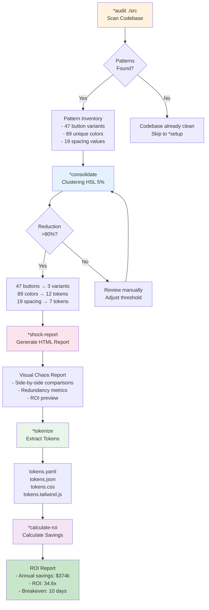
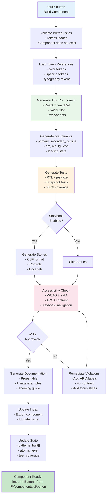
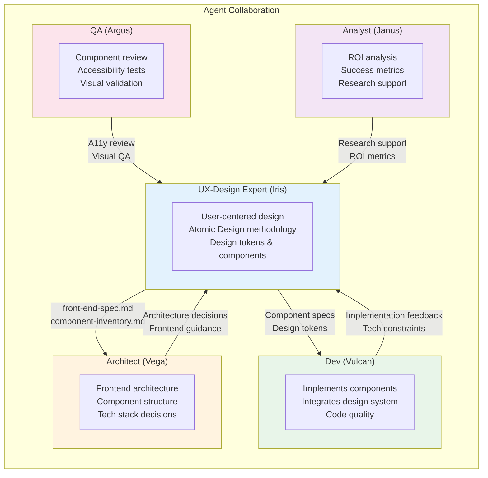
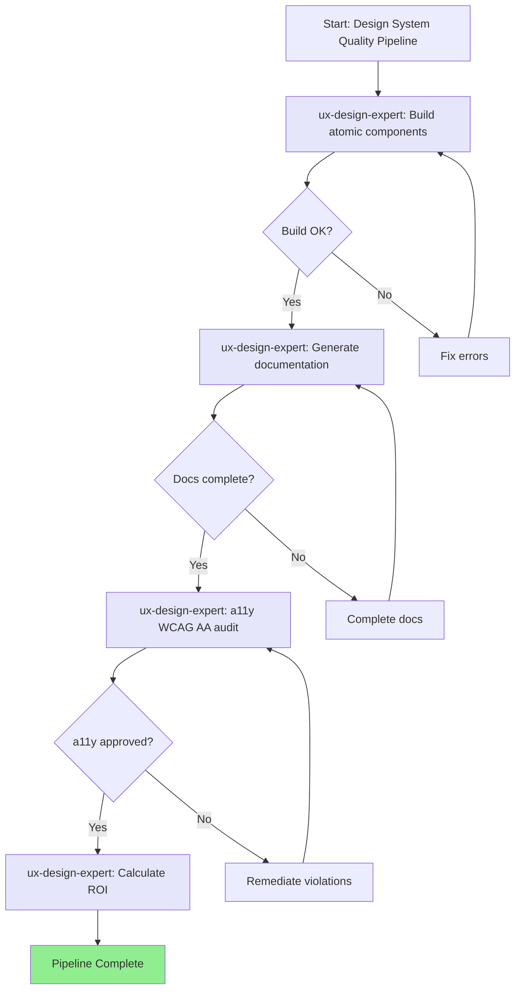
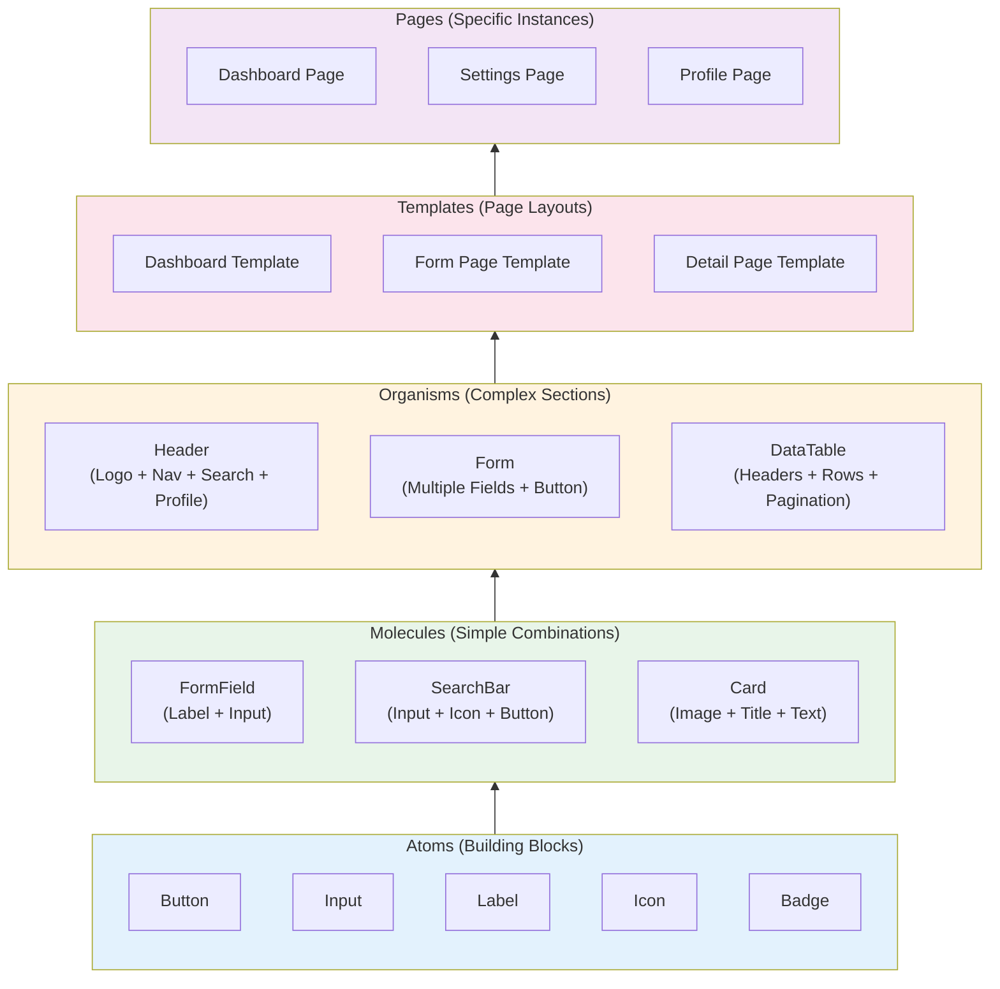

# AEXOS UX-Design-Expert System

> **Version:** 1.0.0
> **Created:** 2026-02-04
> **Owner:** @ux-design-expert (Iris)
> **Status:** Official Documentation

---

## Overview

This document describes the complete system of the **UX-Design Expert (Iris)** agent, including every file involved, workflows, available commands, integrations with other agents and AEXOS workflows.

The UX-Design Expert is a hybrid agent that combines:
- **Sally's UX Principles** - Empathy, user research, user-centered design
- **Brad Frost's System Principles** - Atomic Design, design tokens, metrics and ROI

### Purpose

The agent is designed to:
- Conduct user research and create personas
- Create wireframes and interaction flows
- Audit existing codebases to identify UI redundancies
- Extract and consolidate design tokens
- Build atomic components (atoms, molecules, organisms)
- Ensure accessibility (WCAG AA/AAA)
- Calculate ROI and design system savings

---

## 5-Phase Architecture

The UX-Design Expert operates in 5 distinct phases, each with specific commands:

```mermaid
flowchart TB
    subgraph PHASE1["Phase 1: UX Research"]
        R1["*research<br/>User Research"]
        R2["*wireframe<br/>Create Wireframes"]
        R3["*generate-ui-prompt<br/>Prompts for v0/Lovable"]
        R4["*create-front-end-spec<br/>Frontend Specification"]
    end

    subgraph PHASE2["Phase 2: Design System Audit"]
        A1["*audit {path}<br/>Scan Redundancies"]
        A2["*consolidate<br/>Smart Clustering"]
        A3["*shock-report<br/>Visual HTML Report"]
    end

    subgraph PHASE3["Phase 3: Design Tokens"]
        T1["*tokenize<br/>Extract Tokens"]
        T2["*setup<br/>Initialize DS"]
        T3["*migrate<br/>Migration Strategy"]
        T4["*upgrade-tailwind<br/>Upgrade Tailwind v4"]
        T5["*bootstrap-shadcn<br/>Install Shadcn/Radix"]
    end

    subgraph PHASE4["Phase 4: Component Building"]
        B1["*build {component}<br/>Build Atom"]
        B2["*compose {molecule}<br/>Compose Molecule"]
        B3["*extend {component}<br/>Add Variant"]
    end

    subgraph PHASE5["Phase 5: Quality & Documentation"]
        Q1["*document<br/>Pattern Library"]
        Q2["*a11y-check<br/>WCAG Audit"]
        Q3["*calculate-roi<br/>Calculate ROI"]
    end

    PHASE1 --> PHASE2
    PHASE2 --> PHASE3
    PHASE3 --> PHASE4
    PHASE4 --> PHASE5

    style PHASE1 fill:#e3f2fd
    style PHASE2 fill:#fff3e0
    style PHASE3 fill:#e8f5e9
    style PHASE4 fill:#fce4ec
    style PHASE5 fill:#f3e5f5
```



---

## Complete File List

### Agent Definition File

| File | Purpose |
|---------|-----------|
| `.aexos-core/development/agents/ux-design-expert.md` | Complete agent definition (persona, commands, workflows) |
| `.claude/commands/AEXOS/agents/ux-design-expert.md` | Claude Code command to activate @ux-design-expert |

### Tasks by Phase

#### Phase 1: UX Research & Design (4 tasks)

| File | Command | Purpose |
|---------|---------|-----------|
| `.aexos-core/development/tasks/ux-user-research.md` | `*research` | Conduct user research, create personas and journeys |
| `.aexos-core/development/tasks/ux-create-wireframe.md` | `*wireframe` | Create low/mid/high fidelity wireframes |
| `.aexos-core/development/tasks/generate-ai-frontend-prompt.md` | `*generate-ui-prompt` | Generate prompts for v0.dev, Lovable.ai |
| `.aexos-core/development/tasks/create-doc.md` | `*create-front-end-spec` | Create a detailed frontend specification |

#### Phase 2: Design System Audit (3 tasks)

| File | Command | Purpose |
|---------|---------|-----------|
| `.aexos-core/development/tasks/audit-codebase.md` | `*audit {path}` | Scan the codebase for UI redundancies |
| `.aexos-core/development/tasks/consolidate-patterns.md` | `*consolidate` | Reduce redundancy with HSL clustering |
| `.aexos-core/development/tasks/generate-shock-report.md` | `*shock-report` | Generate a visual HTML report |

#### Phase 3: Design Tokens & Setup (7 tasks)

| File | Command | Purpose |
|---------|---------|-----------|
| `.aexos-core/development/tasks/extract-tokens.md` | `*tokenize` | Extract design tokens (YAML, JSON, CSS, DTCG) |
| `.aexos-core/development/tasks/setup-design-system.md` | `*setup` | Initialize the design system structure |
| `.aexos-core/development/tasks/generate-migration-strategy.md` | `*migrate` | Generate a 4-phase migration strategy |
| `.aexos-core/development/tasks/tailwind-upgrade.md` | `*upgrade-tailwind` | Upgrade to Tailwind CSS v4 |
| `.aexos-core/development/tasks/audit-tailwind-config.md` | `*audit-tailwind-config` | Validate the Tailwind configuration |
| `.aexos-core/development/tasks/export-design-tokens-dtcg.md` | `*export-dtcg` | Export W3C DTCG tokens |
| `.aexos-core/development/tasks/bootstrap-shadcn-library.md` | `*bootstrap-shadcn` | Install Shadcn/Radix UI |

#### Phase 4: Atomic Component Building (3 tasks)

| File | Command | Purpose |
|---------|---------|-----------|
| `.aexos-core/development/tasks/build-component.md` | `*build {component}` | Build an atomic component (React + TypeScript) |
| `.aexos-core/development/tasks/compose-molecule.md` | `*compose {molecule}` | Compose a molecule from existing atoms |
| `.aexos-core/development/tasks/extend-pattern.md` | `*extend {component}` | Add a variant to an existing component |

#### Phase 5: Quality & Documentation (3 tasks)

| File | Command | Purpose |
|---------|---------|-----------|
| `.aexos-core/development/tasks/generate-documentation.md` | `*document` | Generate pattern library documentation |
| `.aexos-core/development/tasks/calculate-roi.md` | `*calculate-roi` | Calculate ROI and cost savings |
| `.aexos-core/development/checklists/accessibility-wcag-checklist.md` | `*a11y-check` | WCAG accessibility audit |

#### Universal Tasks (2 tasks)

| File | Command | Purpose |
|---------|---------|-----------|
| `.aexos-core/development/tasks/ux-ds-scan-artifact.md` | `*scan {path\|url}` | Analyze HTML/React to extract patterns |
| `.aexos-core/development/tasks/integrate-Squad.md` | `*integrate {squad}` | Connect with an expansion squad |

### Templates

| File | Purpose |
|---------|-----------|
| `.aexos-core/development/templates/front-end-spec-tmpl.yaml` | Frontend specification template |
| `.aexos-core/development/templates/tokens-schema-tmpl.yaml` | Design tokens schema |
| `.aexos-core/development/templates/component-react-tmpl.tsx` | React component template |
| `.aexos-core/development/templates/state-persistence-tmpl.yaml` | State persistence template |
| `.aexos-core/development/templates/shock-report-tmpl.html` | HTML shock report template |
| `.aexos-core/development/templates/migration-strategy-tmpl.md` | Migration strategy template |
| `.aexos-core/development/templates/token-exports-css-tmpl.css` | CSS export template |
| `.aexos-core/development/templates/token-exports-tailwind-tmpl.js` | Tailwind export template |
| `.aexos-core/development/templates/ds-artifact-analysis.md` | Artifact analysis template |

### Checklists

| File | Purpose |
|---------|-----------|
| `.aexos-core/development/checklists/pattern-audit-checklist.md` | Pattern audit checklist |
| `.aexos-core/development/checklists/component-quality-checklist.md` | Component quality checklist |
| `.aexos-core/development/checklists/accessibility-wcag-checklist.md` | WCAG AA/AAA checklist |
| `.aexos-core/development/checklists/migration-readiness-checklist.md` | Migration readiness checklist |

### Data Files

| File | Purpose |
|---------|-----------|
| `.aexos-core/development/data/technical-preferences.md` | Default technical preferences |
| `.aexos-core/development/data/atomic-design-principles.md` | Atomic Design principles |
| `.aexos-core/development/data/design-token-best-practices.md` | Design token best practices |
| `.aexos-core/development/data/consolidation-algorithms.md` | Consolidation algorithms |
| `.aexos-core/development/data/roi-calculation-guide.md` | ROI calculation guide |
| `.aexos-core/development/data/integration-patterns.md` | Integration patterns |
| `.aexos-core/development/data/wcag-compliance-guide.md` | WCAG compliance guide |

### Related Workflows

| File | Purpose |
|---------|-----------|
| `.aexos-core/development/workflows/design-system-build-quality.yaml` | Post-migration pipeline (build, docs, a11y, ROI) |
| `.aexos-core/development/workflows/brownfield-ui.yaml` | Workflow for brownfield UI |
| `.aexos-core/development/workflows/brownfield-discovery.yaml` | Discovery for existing projects |
| `.aexos-core/development/workflows/greenfield-ui.yaml` | Workflow for greenfield UI |

### Output Files

| File | Purpose |
|---------|-----------|
| `outputs/ux-research/{project}/` | UX research outputs |
| `outputs/wireframes/{project}/` | Wireframes and flows |
| `outputs/design-system/{project}/` | Design system outputs |
| `outputs/design-system/{project}/.state.yaml` | Workflow state |

---

## Flowchart: Complete Workflow (UX to Build)

```mermaid
flowchart TB
    subgraph START["Start"]
        ACTIVATE["@ux-design-expert"]
    end

    ACTIVATE --> CHECK{"Project<br/>Type?"}

    CHECK -->|Greenfield| GF["Greenfield Workflow"]
    CHECK -->|Brownfield| BF["Brownfield Workflow"]
    CHECK -->|Complete| COMPLETE["Complete Workflow"]

    subgraph GF["GREENFIELD (New Project)"]
        GF1["*research<br/>User Research"]
        GF2["*wireframe<br/>Create Wireframes"]
        GF3["*setup<br/>Initialize DS"]
        GF4["*build button<br/>Build Atoms"]
        GF5["*compose form-field<br/>Compose Molecules"]
        GF6["*document<br/>Document"]

        GF1 --> GF2 --> GF3 --> GF4 --> GF5 --> GF6
    end

    subgraph BF["BROWNFIELD (Existing Project)"]
        BF1["*audit ./src<br/>Scan Codebase"]
        BF2["*consolidate<br/>Consolidate Patterns"]
        BF3["*tokenize<br/>Extract Tokens"]
        BF4["*migrate<br/>Migration Strategy"]
        BF5["*build button<br/>Build Components"]
        BF6["*document<br/>Document"]

        BF1 --> BF2 --> BF3 --> BF4 --> BF5 --> BF6
    end

    subgraph COMPLETE["COMPLETE (5 Phases)"]
        C1["Phase 1: UX Research<br/>*research, *wireframe"]
        C2["Phase 2: Audit<br/>*audit, *consolidate, *shock-report"]
        C3["Phase 3: Tokens<br/>*tokenize, *setup, *migrate"]
        C4["Phase 4: Build<br/>*build, *compose, *extend"]
        C5["Phase 5: Quality<br/>*document, *a11y-check, *calculate-roi"]

        C1 --> C2 --> C3 --> C4 --> C5
    end

    GF --> DONE["Design System Ready!"]
    BF --> DONE
    COMPLETE --> DONE

    style START fill:#e1f5fe
    style GF fill:#e8f5e9
    style BF fill:#fff3e0
    style COMPLETE fill:#f3e5f5
    style DONE fill:#c8e6c9
```



---

## Flowchart: Brownfield Audit Workflow



---

## Flowchart: Atomic Component Build



---

## Command-to-Task Mapping

### Phase 1: UX Research & Design

| Command | Task File | Input | Output |
|---------|-----------|---------|-------|
| `*research` | `ux-user-research.md` | Goals, methods | personas.md, user-journeys.md, insights.md |
| `*wireframe {fidelity}` | `ux-create-wireframe.md` | Screens, use case | wireframes/, flows.md, component-inventory.md |
| `*generate-ui-prompt` | `generate-ai-frontend-prompt.md` | front-end-spec.md | AI prompts for v0/Lovable |
| `*create-front-end-spec` | `create-doc.md` | PRD, wireframes | front-end-spec.md |

### Phase 2: Design System Audit

| Command | Task File | Input | Output |
|---------|-----------|---------|-------|
| `*audit {path}` | `audit-codebase.md` | Scan path | pattern-inventory.json, .state.yaml |
| `*consolidate` | `consolidate-patterns.md` | Audit results | consolidation-report.md, pattern-mapping.json |
| `*shock-report` | `generate-shock-report.md` | Consolidation | shock-report.html |

### Phase 3: Design Tokens & Setup

| Command | Task File | Input | Output |
|---------|-----------|---------|-------|
| `*tokenize` | `extract-tokens.md` | Consolidation | tokens.yaml, tokens.json, tokens.css |
| `*setup` | `setup-design-system.md` | Tokens | components/, lib/, docs/ |
| `*migrate` | `generate-migration-strategy.md` | Tokens | migration-strategy.md (4 phases) |
| `*upgrade-tailwind` | `tailwind-upgrade.md` | Config | tailwind.config.ts (v4) |
| `*audit-tailwind-config` | `audit-tailwind-config.md` | Config | audit-report.md |
| `*export-dtcg` | `export-design-tokens-dtcg.md` | tokens.yaml | tokens.dtcg.json (W3C) |
| `*bootstrap-shadcn` | `bootstrap-shadcn-library.md` | Project | Shadcn components |

### Phase 4: Atomic Component Building

| Command | Task File | Input | Output |
|---------|-----------|---------|-------|
| `*build {component}` | `build-component.md` | Name, variants | Component.tsx, tests, stories, docs |
| `*compose {molecule}` | `compose-molecule.md` | Atom deps | Molecule.tsx, tests |
| `*extend {component}` | `extend-pattern.md` | Component, variant | Updated component + tests |

### Phase 5: Quality & Documentation

| Command | Task File | Input | Output |
|---------|-----------|---------|-------|
| `*document` | `generate-documentation.md` | Components | Pattern library docs |
| `*a11y-check` | `accessibility-wcag-checklist.md` | Components | a11y-audit-report.md |
| `*calculate-roi` | `calculate-roi.md` | Consolidation | roi-analysis.md, executive-summary.md |

### Universal Commands

| Command | Task File | Input | Output |
|---------|-----------|---------|-------|
| `*scan {path\|url}` | `ux-ds-scan-artifact.md` | Artifact | scan-summary.md, design-tokens.yaml |
| `*integrate {squad}` | `integrate-Squad.md` | Squad name | Integration config |
| `*help` | N/A | N/A | List of commands by phase |
| `*status` | N/A | N/A | Current workflow state |
| `*guide` | N/A | N/A | Complete agent guide |
| `*exit` | N/A | N/A | Exit UX-Design Expert mode |

---

## Agent Integrations

### Collaboration Diagram



### When to Use Each Agent

| Need | Recommended Agent |
|-------------|-------------------|
| User research, personas | @ux-design-expert |
| Wireframes and prototypes | @ux-design-expert |
| Design system audit | @ux-design-expert |
| Component building | @ux-design-expert or @dev |
| Frontend architecture | @architect |
| Code implementation | @dev |
| Accessibility review | @ux-design-expert or @qa |
| ROI analysis | @ux-design-expert or @analyst |

### Typical Handoffs

| From | To | Artifact | Purpose |
|----|------|----------|-----------|
| @ux-design-expert | @architect | front-end-spec.md | Specification for architecture |
| @architect | @ux-design-expert | architecture.md | Technical constraints |
| @ux-design-expert | @dev | Component specs + tokens | Implementation |
| @dev | @ux-design-expert | Implementation feedback | Design adjustments |
| @qa | @ux-design-expert | A11y report | Remediations |

---

## State Management

### State File (.state.yaml)

```yaml
# Location: outputs/ux-design/{project}/.state.yaml
metadata:
  version: "1.0.0"
  generated_by: "Iris (UX-Design Expert)"
  generated_at: "2026-02-04T12:00:00Z"

# UX Phase (Phase 1)
ux_research:
  complete: true
  personas: ["Developer Dave", "Designer Dana", "Manager Mike"]
  key_insights: ["Users need faster workflows", "Accessibility is priority"]
  research_date: "2026-02-04"

wireframes:
  created: ["dashboard", "settings", "profile"]
  fidelity_level: "mid"
  component_inventory: ["Button", "Input", "Card", "Modal"]

# Audit Phase (Phase 2)
audit:
  complete: true
  scan_path: "./src"
  patterns:
    buttons:
      unique: 47
      instances: 327
      redundancy_factor: 6.96
    colors:
      unique_hex: 82
      total_instances: 1247
      redundancy_factor: 14.01
    spacing:
      unique_values: 19

# Consolidation Phase
consolidation:
  complete: true
  patterns_consolidated:
    colors:
      before: 89
      after: 12
      reduction: "86.5%"
    buttons:
      before: 47
      after: 3
      reduction: "93.6%"
  overall_reduction: "81.8%"
  target_met: true

# Tokenization Phase (Phase 3)
tokens:
  extracted: true
  categories:
    colors: 12
    spacing: 7
    typography: 10
    radius: 4
    shadows: 3
  total: 36
  exports: ["yaml", "json", "css", "tailwind", "dtcg"]
  coverage: "96.3%"

# Build Phase (Phase 4)
components:
  built: ["Button", "Input", "Label", "Badge"]
  atomic_levels:
    atoms: ["Button", "Input", "Label", "Icon", "Badge"]
    molecules: ["FormField", "SearchBar", "Card"]
    organisms: ["Header", "Form", "Modal"]
  test_coverage: "92.4%"

# Quality Phase (Phase 5)
quality:
  accessibility:
    score: 98
    wcag_level: "AA"
    violations: 0
  documentation:
    complete: true
    components_documented: 15
  roi:
    annual_savings: "$374,400"
    roi_ratio: 34.6
    breakeven_months: 0.38

# Workflow tracking
workflow:
  current_phase: "quality"
  workflow_type: "brownfield"
  phases_completed: [1, 2, 3, 4, 5]
```

---

## Related Workflows

### design-system-build-quality.yaml

Post-migration pipeline that chains:
1. **Build** - Compile atomic components
2. **Document** - Generate pattern library documentation
3. **A11y Check** - WCAG AA audit
4. **ROI** - Calculate savings and metrics



### brownfield-ui.yaml

Complete workflow for existing UI projects:
1. **Analyze** - @architect analyzes the project
2. **PRD** - @pm creates the PRD
3. **Spec** - @ux-design-expert creates the front-end-spec
4. **Architecture** - @architect creates the architecture
5. **Validate** - @po validates the artifacts
6. **Development Cycle** - @sm, @dev, @qa

---

## Design Principles (Atomic Design)

### Component Hierarchy



---

## Best Practices

### 1. UX Research

- **Always** start with user research before design
- Conduct 5-10 interviews for qualitative insights
- Create personas based on evidence, not assumptions
- Document user journeys with pain points and opportunities

### 2. Design System Audit

- Run `*audit` before any consolidation
- Target: >80% redundancy reduction
- Use 5% HSL clustering for colors (perceptual similarity)
- Document manual overrides when necessary

### 3. Design Tokens

- tokens.yaml is the source of truth - every export derives from it
- Use semantic naming (primary, not blue-500)
- OKLCH for modern colors with hex fallback
- Validate with the DTCG CLI before finalizing

### 4. Component Building

- Components must use ONLY tokens (zero hardcoded values)
- Use `cva` for variants (class-variance-authority)
- Implement a loading state in every interactive component
- Tests with >85% coverage + jest-axe for accessibility

### 5. Accessibility

- WCAG AA is the minimum, AAA is the ideal
- Contrast: 4.5:1 for text, 3:1 for UI
- Visible focus on every interactive element
- Keyboard navigation (Tab/Shift+Tab/Space/Enter)

### 6. ROI Calculation

- Use conservative estimates (2 hrs/month per pattern)
- Include all costs: implementation, migration, training
- Calculate the breakeven point before presenting to stakeholders
- ROI >2x is the minimum for approval

---

## Troubleshooting

### *audit finds no patterns

**Cause:** Incorrect path or non-UI files
**Solution:**
```bash
# Check the path
*audit ./src/components

# Check the extensions
# Supported: .jsx, .tsx, .vue, .html, .css, .scss
```

### *consolidate does not reach 80%

**Cause:** Patterns too distinct or threshold too low
**Solution:**
- Review the patterns manually
- Adjust the HSL threshold (default 5%)
- Accept a smaller reduction with justification

### *tokenize generates incomplete tokens

**Cause:** Incomplete consolidation
**Solution:**
```bash
# Re-run the consolidation
*consolidate

# Check the coverage
# Target: >95%
```

### *build fails with token not found

**Cause:** The referenced token does not exist in tokens.yaml
**Solution:**
- Check the token name
- Add the missing token to tokens.yaml
- Re-run `*tokenize` if necessary

### Accessibility tests fail

**Cause:** WCAG violations
**Solution:**
- Review a11y-audit-report.md
- Fix the most critical violations first
- Re-run `*a11y-check` after the fixes

### Corrupted state file

**Cause:** Interrupted execution
**Solution:**
```bash
# A backup exists at .state.yaml.bak
# Restore it or re-run the commands from the last valid state
```

---

## References

### Task Files

- [ux-user-research.md](../../.aexos-core/development/tasks/ux-user-research.md)
- [ux-create-wireframe.md](../../.aexos-core/development/tasks/ux-create-wireframe.md)
- [audit-codebase.md](../../.aexos-core/development/tasks/audit-codebase.md)
- [consolidate-patterns.md](../../.aexos-core/development/tasks/consolidate-patterns.md)
- [extract-tokens.md](../../.aexos-core/development/tasks/extract-tokens.md)
- [build-component.md](../../.aexos-core/development/tasks/build-component.md)
- [calculate-roi.md](../../.aexos-core/development/tasks/calculate-roi.md)

### Workflow Files

- [design-system-build-quality.yaml](../../.aexos-core/development/workflows/design-system-build-quality.yaml)
- [brownfield-ui.yaml](../../.aexos-core/development/workflows/brownfield-ui.yaml)

### Agent Definition

- [ux-design-expert.md](../../.aexos-core/development/agents/ux-design-expert.md)

### External Resources

- [Atomic Design by Brad Frost](https://atomicdesign.bradfrost.com/)
- [W3C Design Tokens Format (DTCG)](https://design-tokens.github.io/community-group/format/)
- [WCAG 2.2 Guidelines](https://www.w3.org/TR/WCAG22/)
- [Shadcn/UI](https://ui.shadcn.com/)
- [Tailwind CSS v4](https://tailwindcss.com/)

---

## Summary

| Aspect | Details |
|---------|----------|
| **Total Tasks** | 22 tasks (4 + 3 + 7 + 3 + 3 + 2) |
| **Total Templates** | 9 templates |
| **Total Checklists** | 4 checklists |
| **Total Data Files** | 7 data files |
| **Total Commands** | 19 commands + 4 universal |
| **Workflow Phases** | 5 (Research, Audit, Tokens, Build, Quality) |
| **Related Workflows** | 4 (design-system-build-quality, brownfield-ui, brownfield-discovery, greenfield-ui) |
| **Collaborating Agents** | 4 (@architect, @dev, @qa, @analyst) |
| **Core Methodology** | Atomic Design (Brad Frost) |
| **Accessibility Level** | WCAG AA minimum, AAA ideal |

---

## Changelog

| Date | Author | Description |
|------|-------|-----------|
| 2026-02-04 | @ux-design-expert | Initial document created |

---

*-- Iris, designing with empathy*
