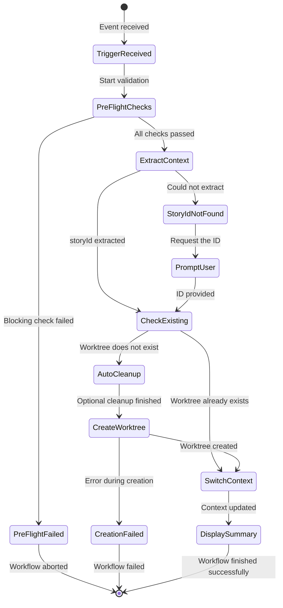
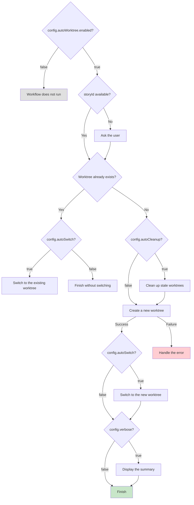
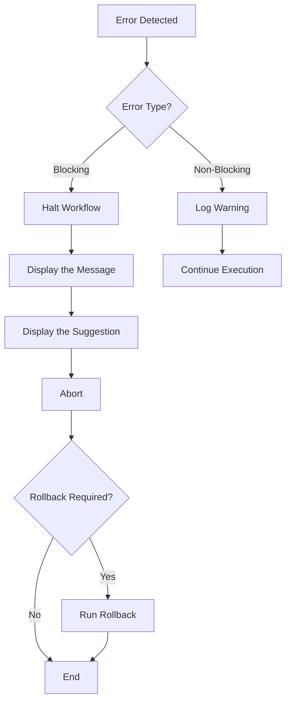

# Auto-Worktree Workflow

**Version:** 1.0
**Created:** 2026-01-28
**Author:** @architect (Vega)
**Story:** 1.4 - Epic 1 - Worktree Manager

---

## Overview

**Auto-Worktree** is an automation workflow that creates and manages isolated Git worktrees for story development. It is part of the **Auto-Claude ADE** (Autonomous Development Engine) infrastructure, enabling parallel development of multiple stories without conflicts between branches.

### Key Benefits

| Benefit | Description |
|---------|-------------|
| **Isolation** | Each story works in a separate directory and branch |
| **Parallelism** | Multiple stories can be developed simultaneously |
| **Automation** | Worktrees are created automatically when a story starts |
| **Cleanup** | Stale worktrees can be removed automatically |

### When the Workflow Is Triggered

1. **`story_started` event**: When `@dev` starts a story
2. **`story_assigned` event**: When `@po` assigns a story (optional)
3. **Manual command**: `*auto-worktree`

---

## Workflow Diagram

### Main Flow

```mermaid
flowchart TB
    subgraph TRIGGER["Trigger"]
        T1[story_started<br/>@dev]
        T2[story_assigned<br/>@po]
        T3[*auto-worktree<br/>manual]
    end

    subgraph PREFLIGHT["Pre-Flight Checks"]
        PF1{Git repository?}
        PF2{Worktree support?}
        PF3{WorktreeManager?}
        PF4{Worktree limit?}
    end

    subgraph WORKFLOW["Workflow Sequence"]
        S1["STEP 1: Extract Story Context<br/>Extract the Story ID"]
        S2["STEP 2: Check Existing<br/>Check for an Existing Worktree"]
        S3["STEP 3: Auto Cleanup<br/>Clean Up Stale Worktrees"]
        S4["STEP 4: Create Worktree<br/>Create an Isolated Worktree"]
        S5["STEP 5: Switch Context<br/>Switch to the Worktree"]
        S6["STEP 6: Display Summary<br/>Display the Summary"]
    end

    subgraph OUTPUT["Output"]
        O1[storyId]
        O2[worktree.path]
        O3[worktree.branch]
        O4[worktree.status]
    end

    T1 --> PF1
    T2 --> PF1
    T3 --> PF1

    PF1 -->|Yes| PF2
    PF1 -->|No| ERR1[Error: Not a git repository]

    PF2 -->|Yes| PF3
    PF2 -->|No| ERR2[Error: Git < 2.5]

    PF3 -->|Exists| PF4
    PF3 -->|Does not exist| ERR3[Error: AEXOS incomplete]

    PF4 -->|OK| S1
    PF4 -->|Limit| WARN1[Warning: Approaching the limit]
    WARN1 --> S1

    S1 --> S2
    S2 -->|Exists| S5
    S2 -->|Does not exist| S3
    S3 --> S4
    S4 -->|Success| S5
    S4 -->|Failure| ERR4[Error: Creation failed]
    S5 --> S6
    S6 --> O1
    S6 --> O2
    S6 --> O3
    S6 --> O4

    style TRIGGER fill:#e1f5fe
    style PREFLIGHT fill:#fff3e0
    style WORKFLOW fill:#e8f5e9
    style OUTPUT fill:#f3e5f5
    style ERR1 fill:#ffcdd2
    style ERR2 fill:#ffcdd2
    style ERR3 fill:#ffcdd2
    style ERR4 fill:#ffcdd2
    style WARN1 fill:#fff9c4
```

### State Diagram



### Component Architecture

```mermaid
graph TB
    subgraph AEXOS["AEXOS Core"]
        WF[auto-worktree.yaml<br/>Workflow Definition]
        TK[create-worktree.md<br/>Task Definition]
    end

    subgraph INFRA["Infrastructure"]
        WM[worktree-manager.js<br/>WorktreeManager Class]
        GIT[Git CLI<br/>git worktree]
    end

    subgraph FS["File System"]
        WT[.aexos/worktrees/{storyId}/<br/>Worktree Directory]
        LOG[.aexos/logs/merges/<br/>Merge Audit Logs]
    end

    subgraph AGENTS["Agents"]
        DEV[@dev<br/>Polaris - DevOps]
        PO[@po<br/>Product Owner]
    end

    DEV -->|Starts a story| WF
    PO -->|Assigns a story| WF
    WF -->|Executes| TK
    TK -->|Uses| WM
    WM -->|Executes| GIT
    GIT -->|Creates| WT
    WM -->|Writes logs| LOG

    style AEXOS fill:#e3f2fd
    style INFRA fill:#fce4ec
    style FS fill:#f3e5f5
    style AGENTS fill:#e8f5e9
```

---

## Detailed Steps

### Step 1: Extract Story Context

| Property | Value |
|----------|-------|
| **Phase** | 1 - Extract Context |
| **Action** | `extract_story_info` |
| **Agent** | System (automatic) |
| **Blocking** | Yes |

**Description:**
Extracts the story ID from the trigger context. It looks in several sources:

1. Explicit `storyId` parameter
2. Path of the story file (`storyFile`)
3. Current task (`currentTask.storyId`)
4. Name of the current branch (`story-X.Y` convention)

**Input:**
```typescript
interface TriggerContext {
  storyId?: string;
  storyFile?: string;
  currentTask?: { storyId: string };
}
```

**Output:**
```typescript
{ storyId: string }
```

**Error if it fails:**
```
Could not determine story ID. Please provide explicitly.
```

---

### Step 2: Check Existing

| Property | Value |
|----------|-------|
| **Phase** | 2 - Check Existing |
| **Action** | `check_worktree_exists` |
| **Agent** | System (automatic) |
| **Blocking** | No (can skip to switch) |

**Description:**
Checks whether a worktree already exists for the story. If it does, it skips to Step 5 (Switch Context).

**Logic:**
```javascript
const manager = new WorktreeManager();
const exists = await manager.exists(storyId);

if (exists) {
  return { exists: true, action: 'switch' };
}
return { exists: false, action: 'create' };
```

**Output:**
```typescript
interface CheckResult {
  exists: boolean;
  worktree?: WorktreeInfo;
  action: 'switch' | 'skip' | 'create';
}
```

---

### Step 3: Auto Cleanup

| Property | Value |
|----------|-------|
| **Phase** | 3 - Auto Cleanup |
| **Action** | `cleanup_stale_worktrees` |
| **Agent** | @devops (Polaris) |
| **Conditional** | `config.autoCleanup === true` |

**Description:**
Automatically removes stale worktrees (more than 30 days without use) before creating a new one. This step only runs if `autoCleanup` is enabled in the configuration.

**Staleness Criterion:**
- Worktree created more than `staleDays` ago (default: 30 days)

**Output:**
```typescript
interface CleanupResult {
  cleaned: number;
  removedIds: string[];
}
```

**Log:**
```
Cleaned up {cleaned} stale worktrees
```

---

### Step 4: Create Worktree

| Property | Value |
|----------|-------|
| **Phase** | 4 - Create Worktree |
| **Action** | `create_isolated_worktree` |
| **Agent** | @devops (Polaris) |
| **Task** | `create-worktree.md` |
| **Blocking** | Yes |

**Description:**
Creates a new isolated worktree for the story using the WorktreeManager.

**Structure Created:**
```
.aexos/worktrees/{storyId}/     # Working directory
Branch: auto-claude/{storyId}   # Git branch
```

**Input:**
```typescript
{ story_id: string }
```

**Output:**
```typescript
interface CreateResult {
  success: boolean;
  worktree: WorktreeInfo;
  path: string;
  branch: string;
  error?: string;
}
```

**Git Commands Executed:**
```bash
git worktree add .aexos/worktrees/{storyId} -b auto-claude/{storyId}
```

---

### Step 5: Switch Context

| Property | Value |
|----------|-------|
| **Phase** | 5 - Switch Context |
| **Action** | `switch_to_worktree` |
| **Agent** | System (automatic) |
| **Conditional** | `config.autoSwitch === true` |

**Description:**
Sets environment variables and displays instructions for navigating to the worktree.

**Environment Variables:**
```bash
AEXOS_WORKTREE=/path/to/.aexos/worktrees/{storyId}
AEXOS_STORY={storyId}
```

**Output:**
```typescript
interface SwitchResult {
  worktreePath: string;
  instructions: string;  // "cd /path/to/worktree"
}
```

---

### Step 6: Display Summary

| Property | Value |
|----------|-------|
| **Phase** | 6 - Summary |
| **Action** | `show_summary` |
| **Agent** | System (automatic) |
| **Conditional** | `config.verbose === true` |

**Description:**
Displays a complete summary of the operation with the worktree information and next steps.

**Output Template:**
```
+------------------------------------------------------------------+
|  Auto-Worktree Complete                                          |
+------------------------------------------------------------------+

Story:      {storyId}
Worktree:   {worktree.path}
Branch:     {worktree.branch}
Status:     {worktree.status}

-------------------------------------------------------------------
Quick Reference:

Navigate:   cd {worktree.path}
Status:     *list-worktrees
Merge:      *merge-worktree {storyId}
Remove:     *remove-worktree {storyId}

-------------------------------------------------------------------
You are now working in an isolated environment.
Changes here do not affect the main branch until the merge.
```

---

## Participating Agents

### @devops (Polaris)

| Responsibility | Description |
|----------------|-------------|
| **Worktree Creation** | Runs the `create-worktree.md` task |
| **Worktree Removal** | Runs the `remove-worktree.md` task |
| **Automatic Cleanup** | Removes stale worktrees |
| **Worktree Merge** | Runs the `merge-worktree.md` task |

**Agent Commands:**
- `*create-worktree {storyId}` - Create an isolated worktree
- `*list-worktrees` - List active worktrees
- `*remove-worktree {storyId}` - Remove a worktree
- `*merge-worktree {storyId}` - Merge the worktree
- `*cleanup-worktrees` - Clean up stale worktrees

### @dev (Developer)

| Responsibility | Description |
|----------------|-------------|
| **Primary Trigger** | Starts the workflow when beginning a story |
| **Development** | Works inside the isolated worktree |

### @po (Product Owner)

| Responsibility | Description |
|----------------|-------------|
| **Secondary Trigger** | Can trigger creation when assigning a story |

---

## Tasks Executed

### create-worktree.md

| Property | Value |
|----------|-------|
| **Location** | `.aexos-core/development/tasks/create-worktree.md` |
| **Agent** | @devops (Polaris) |
| **Version** | 1.0 |
| **Story** | 1.3 |

**Execution Modes:**

| Mode | Prompts | Recommended Use |
|------|---------|-----------------|
| **YOLO** (default) | 0-1 | Fast story setup |
| **Interactive** | 2-3 | Beginner users |

**Pre-Conditions:**
- [x] The current directory is a git repository
- [x] WorktreeManager available
- [x] Worktree limit not reached

**Post-Conditions:**
- [x] The worktree directory exists
- [x] The `auto-claude/{storyId}` branch exists

---

## Prerequisites

### System Requirements

| Requirement | Minimum Version | Verification |
|-------------|-----------------|--------------|
| **Git** | >= 2.5 | `git --version` |
| **Node.js** | >= 18 | `node --version` |
| **AEXOS Core** | Installed | Check `.aexos-core/` |

### NPM Dependencies

| Package | Use |
|---------|-----|
| **execa** | Running git commands |
| **chalk** | Terminal colors |

### Required Files

```
.aexos-core/
  infrastructure/
    scripts/
      worktree-manager.js     # WorktreeManager class
  development/
    workflows/
      auto-worktree.yaml       # Workflow definition
    tasks/
      create-worktree.md       # Creation task
      list-worktrees.md        # Listing task
      remove-worktree.md       # Removal task
      merge-worktree.md        # Merge task
```

---

## Inputs and Outputs

### Workflow Inputs

| Input | Type | Required | Source | Description |
|-------|------|----------|--------|-------------|
| `storyId` | string | Yes* | Context or user | Story ID (e.g. STORY-42, 1.3) |
| `storyFile` | string | No | Context | Path of the story file |
| `currentTask` | object | No | Context | Task currently running |

*Required, but it can be extracted automatically from the context.

### Workflow Outputs

| Output | Type | Description |
|--------|------|-------------|
| `storyId` | string | ID of the processed story |
| `worktree` | WorktreeInfo | Object with the worktree information |
| `path` | string | Absolute path of the worktree |
| `branch` | string | Branch name (`auto-claude/{storyId}`) |

### WorktreeInfo Interface

```typescript
interface WorktreeInfo {
  storyId: string;           // 'STORY-42'
  path: string;              // '/abs/path/.aexos/worktrees/STORY-42'
  branch: string;            // 'auto-claude/STORY-42'
  createdAt: Date;           // Creation date
  uncommittedChanges: number; // Number of uncommitted changes
  status: 'active' | 'stale'; // Status based on age
}
```

---

## Decision Points

### Decision Diagram



### Settings That Affect Decisions

| Setting | Default | Impact |
|---------|---------|--------|
| `enabled` | true | Enables/disables the workflow |
| `createOnAssign` | false | Creates the worktree when @po assigns a story |
| `autoSwitch` | true | Switches to the worktree automatically |
| `verbose` | true | Displays the summary at the end |
| `autoCleanup` | false | Cleans up stale worktrees automatically |
| `maxWorktrees` | 10 | Limit of simultaneous worktrees |
| `staleDays` | 30 | Days before a worktree is considered stale |

---

## Error Handling

### Blocking Errors

| Error | Cause | Resolution |
|-------|-------|------------|
| `Not a git repository` | The directory is not a git repo | Run `git init` |
| `Git worktree not supported` | Git < 2.5 | Update Git |
| `WorktreeManager not found` | AEXOS incomplete | Reinstall AEXOS |
| `Maximum worktrees limit reached` | >= 10 worktrees | Run `*cleanup-worktrees` |
| `Could not determine story ID` | ID not found | Provide the ID explicitly |
| `Worktree creation failed` | Error in git worktree | Check git status |

### Non-Blocking Errors (Warnings)

| Warning | Cause | Action |
|---------|-------|--------|
| `Approaching worktree limit` | Close to the limit | Consider a cleanup |
| `Could not delete branch` | Protected branch or in use | Remove it manually |

### Error Recovery Flow



---

## Troubleshooting

### Problem: Worktree is not created

**Symptoms:**
- The `*create-worktree` command fails
- Message "Failed to create worktree"

**Diagnosis:**
```bash
# Check whether it is a git repository
git rev-parse --is-inside-work-tree

# Check the git version
git --version

# Check the existing worktrees
git worktree list

# Check whether WorktreeManager exists
ls .aexos-core/infrastructure/scripts/worktree-manager.js
```

**Solutions:**
1. Initialize the repository: `git init`
2. Update Git to >= 2.5
3. Clean up worktrees: `*cleanup-worktrees`
4. Remove a specific worktree: `*remove-worktree {storyId}`

---

### Problem: Worktree limit reached

**Symptoms:**
- Message "Maximum worktrees limit (10) reached"

**Diagnosis:**
```bash
# List all worktrees
*list-worktrees

# Check the count
git worktree list | wc -l
```

**Solutions:**
1. Clean up stale worktrees: `*cleanup-worktrees`
2. Remove unused worktrees: `*remove-worktree {storyId}`
3. Raise the limit (if necessary) in `.aexos/config.yaml`

---

### Problem: Conflicts when merging

**Symptoms:**
- `*merge-worktree` fails
- Message with a list of conflicting files

**Diagnosis:**
```bash
# Check the conflicting files
git diff --name-only --diff-filter=U

# View the differences
git diff HEAD...auto-claude/{storyId}
```

**Solutions:**
1. Resolve the conflicts manually in the worktree
2. Rebase the worktree: `git rebase main` (inside the worktree)
3. Use a staged merge: `*merge-worktree {storyId} --staged`

---

### Problem: Corrupted worktree

**Symptoms:**
- Git commands fail in the worktree
- The worktree shows up as "locked"

**Diagnosis:**
```bash
# Check the worktree status
git worktree list

# Check whether it is locked
ls .git/worktrees/{storyId}/locked
```

**Solutions:**
1. Remove the lock: `rm .git/worktrees/{storyId}/locked`
2. Remove the worktree with force: `*remove-worktree {storyId} --force`
3. Manual removal:
   ```bash
   git worktree remove .aexos/worktrees/{storyId} --force
   git branch -D auto-claude/{storyId}
   ```

---

### Problem: Story ID not detected

**Symptoms:**
- Message "Could not determine story ID"

**Solutions:**
1. Provide the ID explicitly: `*auto-worktree STORY-42`
2. Check whether the story file exists
3. Check the naming convention of the current branch

---

## Related Commands

| Command | Description | Example |
|---------|-------------|---------|
| `*create-worktree` | Create a worktree manually | `*create-worktree STORY-42` |
| `*list-worktrees` | List all worktrees | `*list-worktrees` |
| `*remove-worktree` | Remove a worktree | `*remove-worktree STORY-42` |
| `*merge-worktree` | Merge the worktree | `*merge-worktree STORY-42` |
| `*cleanup-worktrees` | Clean up stale worktrees | `*cleanup-worktrees` |

---

## References

### Framework Files

| File | Path |
|------|------|
| **Workflow Definition** | `.aexos-core/development/workflows/auto-worktree.yaml` |
| **Task Create** | `.aexos-core/development/tasks/create-worktree.md` |
| **WorktreeManager** | `.aexos-core/infrastructure/scripts/worktree-manager.js` |

### Related Documentation

- [Git Worktree Documentation](https://git-scm.com/docs/git-worktree)
- Epic 1 - Worktree Manager (Stories 1.1-1.5)
- Auto-Claude ADE Architecture

### Related Stories

| Story | Title |
|-------|-------|
| 1.1 | WorktreeManager Core Class |
| 1.2 | Merge Functionality |
| 1.3 | CLI Commands for Worktree Management |
| 1.4 | Auto-Worktree Workflow Integration |
| 1.5 | Worktree Status in Project Context |

---

## Version History

| Version | Date | Author | Changes |
|---------|------|--------|---------|
| 1.0 | 2026-01-28 | @architect (Vega) | Initial version |

---

*Documentation generated automatically by AEXOS-FULLSTACK*
