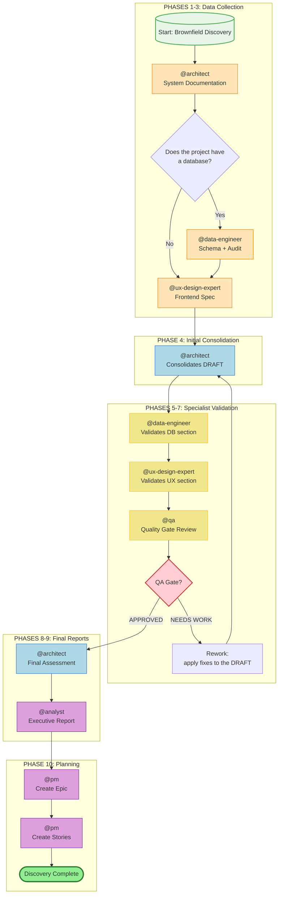
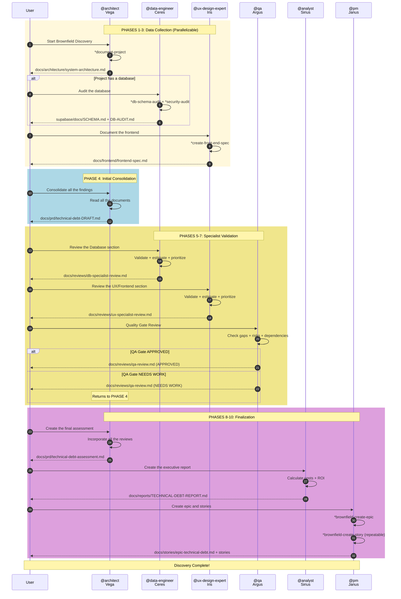
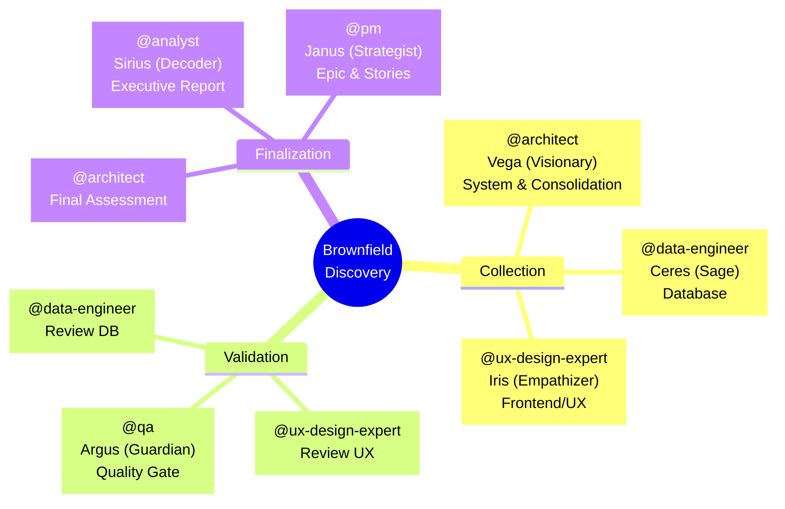
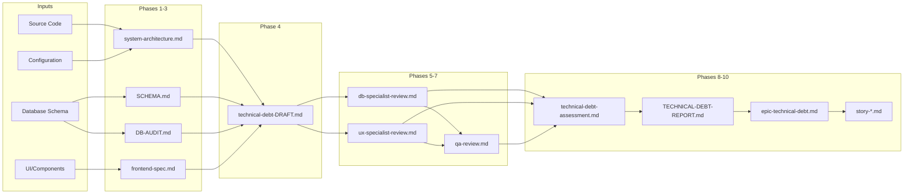
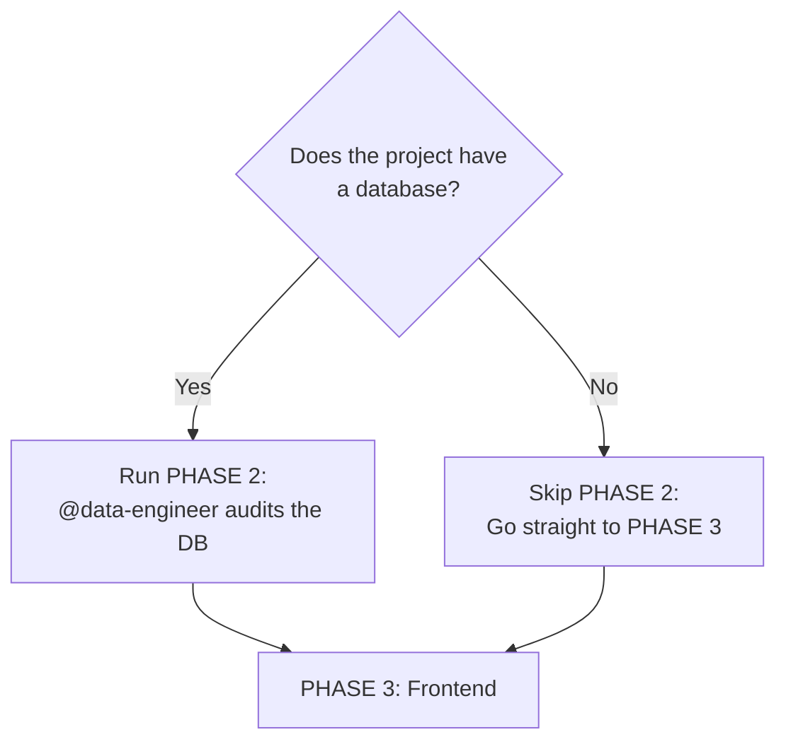
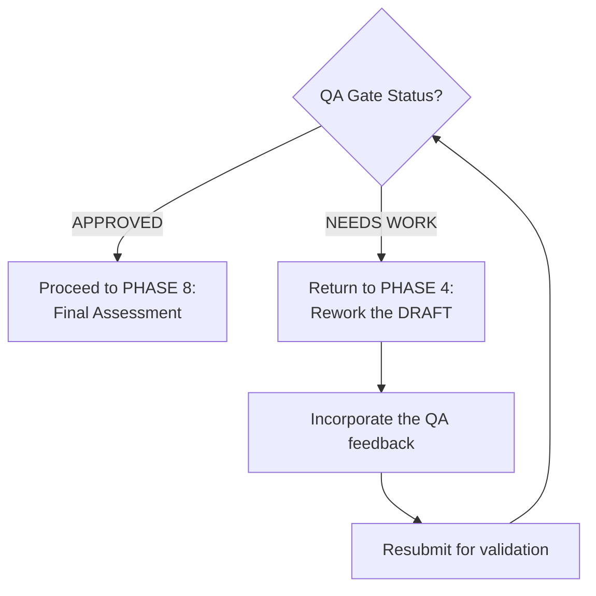
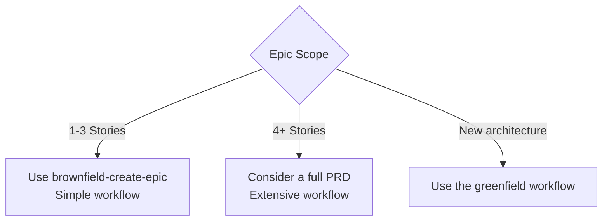

# Workflow: Brownfield Discovery

**ID:** `brownfield-discovery`
**Version:** 2.0
**Type:** Brownfield (Existing Projects)
**Estimated Duration:** 4-8 hours
**Last Updated:** 2026-02-04

---

## Overview

**Brownfield Discovery** is a complete multi-agent workflow for technical debt assessment in existing projects. Designed specifically for projects migrating from platforms such as Lovable, v0.dev, or legacy codebases, this workflow:

- Documents the system comprehensively
- Identifies technical debt across every layer (system, database, frontend)
- Validates findings with domain specialists
- Generates executive reports for stakeholders
- Creates epics and stories ready for development

### Primary Use Cases

| Scenario | Recommended |
|---------|-------------|
| Lovable/v0.dev project migration | Yes |
| Full codebase audit | Yes |
| Modernization planning | Yes |
| Pre-investment assessment | Yes |
| Onboarding onto a legacy project | Yes |
| Technical due diligence | Yes |
| New project (greenfield) | No - use the `greenfield-*` workflows |
| Isolated enhancement | No - use `brownfield-create-story` |

---

## Workflow Diagram



---

## Detailed Sequence Diagram



---

## Detailed Steps

### PHASE 1: Collection - System

| Attribute | Value |
|----------|-------|
| **Step ID** | `system_documentation` |
| **Phase** | 1 |
| **Phase Name** | Collection: System |
| **Agent** | `@architect` (Vega) |
| **Action** | `*document-project` |
| **Elicitation** | Yes |
| **Estimated Duration** | 30-60 min |
| **Output** | `docs/architecture/system-architecture.md` |

**What the agent analyzes:**
- Technology stack (React, Vite, Tailwind, etc.)
- Folder and component structure
- Dependencies and versions
- Existing code patterns
- Integration points
- Configuration (env, build, deploy)

**Debt identified (system level):**
- Outdated dependencies
- Duplicated code
- Lack of tests
- Hardcoded configuration
- Excessive coupling

---

### PHASE 2: Collection - Database

| Attribute | Value |
|----------|-------|
| **Step ID** | `database_documentation` |
| **Phase** | 2 |
| **Phase Name** | Collection: Database |
| **Agent** | `@data-engineer` (Ceres - Sage) |
| **Action** | `*db-schema-audit` + `*security-audit` |
| **Condition** | `project_has_database` |
| **Elicitation** | Yes |
| **Estimated Duration** | 20-40 min |
| **Outputs** | `supabase/docs/SCHEMA.md`, `supabase/docs/DB-AUDIT.md` |

**What the agent analyzes:**
- Complete schema (tables, columns, types)
- Relationships and foreign keys
- Existing and missing indexes
- RLS policies (coverage and quality)
- Views and functions
- Performance (known slow queries)

**Debt identified (data level):**
- Tables without RLS
- Missing indexes
- Inadequate normalization
- Absent constraints
- Unversioned migrations
- Orphaned data

---

### PHASE 3: Collection - Frontend/UX

| Attribute | Value |
|----------|-------|
| **Step ID** | `frontend_documentation` |
| **Phase** | 3 |
| **Phase Name** | Collection: Frontend/UX |
| **Agent** | `@ux-design-expert` (Iris - Empathizer) |
| **Action** | `*create-front-end-spec` |
| **Elicitation** | Yes |
| **Estimated Duration** | 30-45 min |
| **Output** | `docs/frontend/frontend-spec.md` |

**What the agent analyzes:**
- Existing UI components
- Design system/tokens in use
- Layout patterns
- User flows
- Responsiveness
- Accessibility (a11y)
- Visual consistency
- Perceived performance

**Debt identified (UX/UI level):**
- Visual inconsistencies
- Duplicated components
- Lack of a design system
- Accessibility issues
- Mobile not optimized
- Missing loading/error states
- Missing user feedback

---

### PHASE 4: Initial Consolidation

| Attribute | Value |
|----------|-------|
| **Step ID** | `initial_consolidation` |
| **Phase** | 4 |
| **Phase Name** | Initial Consolidation |
| **Agent** | `@architect` (Vega) |
| **Action** | `consolidate_findings_draft` (workflow-action) |
| **Elicitation** | Yes |
| **Estimated Duration** | 30-45 min |
| **Output** | `docs/prd/technical-debt-DRAFT.md` |

**Required as input:**
- `docs/architecture/system-architecture.md`
- `supabase/docs/SCHEMA.md` (if it exists)
- `supabase/docs/DB-AUDIT.md` (if it exists)
- `docs/frontend/frontend-spec.md`

**Structure of the generated DRAFT:**

```markdown
# Technical Debt Assessment - DRAFT
## For Specialist Review

### 1. System Debt
[List from system-architecture.md]

### 2. Database Debt
[List from DB-AUDIT.md]
PENDING: @data-engineer review

### 3. Frontend/UX Debt
[List from frontend-spec.md]
PENDING: @ux-design-expert review

### 4. Preliminary Matrix
| ID | Debt | Area | Impact | Effort | Priority |
|----|--------|------|---------|---------|------------|

### 5. Questions for the Specialists
- @data-engineer: [questions about the DB]
- @ux-design-expert: [questions about UX]
```

---

### PHASE 5: Validation - Database

| Attribute | Value |
|----------|-------|
| **Step ID** | `database_specialist_review` |
| **Phase** | 5 |
| **Phase Name** | Validation: Database |
| **Agent** | `@data-engineer` (Ceres) |
| **Action** | `review_and_validate` (workflow-action) |
| **Elicitation** | Yes |
| **Estimated Duration** | 20-30 min |
| **Output** | `docs/reviews/db-specialist-review.md` |

**Specialist responsibilities:**

1. **VALIDATE the identified debt**
   - Confirms whether the items are real problems
   - Adjusts severity if necessary
   - Adds debt that was not identified

2. **ESTIMATE COSTS**
   - Hours to resolve each debt item
   - Complexity (simple/medium/complex)
   - Technical dependencies

3. **PRIORITIZE (DB perspective)**
   - Security risk
   - Performance impact
   - Maintenance debt

4. **ANSWER QUESTIONS**
   - Answers questions from @architect
   - Clarifies technical points

---

### PHASE 6: Validation - UX/Frontend

| Attribute | Value |
|----------|-------|
| **Step ID** | `ux_specialist_review` |
| **Phase** | 6 |
| **Phase Name** | Validation: UX/Frontend |
| **Agent** | `@ux-design-expert` (Iris) |
| **Action** | `review_and_validate` (workflow-action) |
| **Elicitation** | Yes |
| **Estimated Duration** | 20-30 min |
| **Output** | `docs/reviews/ux-specialist-review.md` |

**Specialist responsibilities:**

1. **VALIDATE the identified debt**
   - Confirms whether the items affect UX
   - Adjusts severity if necessary
   - Adds debt that was not identified

2. **ESTIMATE COSTS**
   - Hours to resolve each debt item
   - Visual vs functional impact
   - Need for a design review

3. **PRIORITIZE (UX perspective)**
   - Impact on the user experience
   - Accessibility issues
   - Visual consistency

4. **ANSWER QUESTIONS**
   - Answers questions from @architect
   - Suggests design solutions

---

### PHASE 7: Validation - QA Review

| Attribute | Value |
|----------|-------|
| **Step ID** | `qa_general_review` |
| **Phase** | 7 |
| **Phase Name** | Validation: QA Review |
| **Agent** | `@qa` (Argus - Guardian) |
| **Action** | `review_assessment` (workflow-action) |
| **Elicitation** | Yes |
| **Estimated Duration** | 30-45 min |
| **Output** | `docs/reviews/qa-review.md` |

**QA responsibilities:**

1. **IDENTIFY GAPS**
   - Debt not covered
   - Areas not analyzed
   - Cross-cutting risks

2. **ASSESS RISKS**
   - Security risks
   - Regression risks
   - Integration risks

3. **VALIDATE DEPENDENCIES**
   - Does the resolution order make sense?
   - Dependencies between debt items
   - Potential blockers

4. **SUGGEST TESTS**
   - Tests required after resolution
   - Acceptance criteria for debt items
   - Quality metrics

5. **QUALITY GATE**
   - Is the assessment complete?
   - Can it move on to planning?
   - **Decision:** `APPROVED` | `NEEDS WORK`

---

### PHASE 8: Final Assessment

| Attribute | Value |
|----------|-------|
| **Step ID** | `final_assessment` |
| **Phase** | 8 |
| **Phase Name** | Final Assessment |
| **Agent** | `@architect` (Vega) |
| **Action** | `finalize_assessment` (workflow-action) |
| **Condition** | `qa_review_approved` |
| **Elicitation** | Yes |
| **Estimated Duration** | 30-45 min |
| **Output** | `docs/prd/technical-debt-assessment.md` |

**Final consolidation includes:**
1. Incorporates adjustments from @data-engineer
2. Incorporates adjustments from @ux-design-expert
3. Addresses gaps raised by @qa
4. Recalculates priorities with specialist input
5. Defines the final resolution order

**Structure of the final document:**

```markdown
# Technical Debt Assessment - FINAL

## Executive Summary
- Total debts: X
- Critical: Y | High: Z | Medium: W
- Total estimated effort: XXX hours

## Complete Debt Inventory

### System (validated by @architect)
| ID | Debt | Severity | Hours | Priority |

### Database (validated by @data-engineer)
| ID | Debt | Severity | Hours | Priority |

### Frontend/UX (validated by @ux-design-expert)
| ID | Debt | Severity | Hours | Priority |

## Final Prioritization Matrix

## Resolution Plan

## Risks and Mitigations

## Success Criteria
```

---

### PHASE 9: Executive Report

| Attribute | Value |
|----------|-------|
| **Step ID** | `executive_awareness_report` |
| **Phase** | 9 |
| **Phase Name** | Executive Report |
| **Agent** | `@analyst` (Sirius - Decoder) |
| **Action** | `create_awareness_report` (workflow-action) |
| **Elicitation** | Yes |
| **Estimated Duration** | 30-45 min |
| **Output** | `docs/reports/TECHNICAL-DEBT-REPORT.md` |

**Goal:** A document for stakeholders to understand the COST and IMPACT of the identified technical debt.

**Report structure:**

```markdown
# Technical Debt Report
**Project:** [name]
**Date:** [date]

## Executive Summary (1 page)
### Current Situation
### Key Numbers
| Metric | Value |
|---------|-------|
| Total Debts | X |
| Critical Debts | Y |
| Total Effort | Z hours |
| Estimated Cost | R$ XX.XXX |

## Cost Analysis
### Cost of RESOLVING
### Cost of NOT RESOLVING (Accumulated Risk)

## Business Impact
### Performance
### Security
### User Experience
### Maintainability

## Recommended Timeline
### Phase 1: Quick Wins (1-2 weeks)
### Phase 2: Foundation (2-4 weeks)
### Phase 3: Optimization (4-6 weeks)

## ROI of the Resolution

## Next Steps
```

---

### PHASE 10: Planning (Epic + Stories)

| Attribute | Value |
|----------|-------|
| **Step ID** | `epic_creation` + `story_creation` |
| **Phase** | 10 |
| **Phase Name** | Planning |
| **Agent** | `@pm` (Janus - Strategist) |
| **Actions** | `*brownfield-create-epic`, `*brownfield-create-story` |
| **Elicitation** | Yes |
| **Estimated Duration** | 30-60 min |
| **Outputs** | `docs/stories/epic-technical-debt.md`, `docs/stories/story-*.md` |

**The epic includes:**
- Epic objective
- Scope (which debt items)
- Success criteria
- Timeline (from the report)
- Approved budget
- List of stories

**Each story includes:**
- Clear tasks
- Specific acceptance criteria
- Required tests (from the QA review)
- Estimate validated by the specialists
- Definition of Done

---

## Participating Agents



### Agent Profiles

| Agent | ID | Archetype | Primary Specialty |
|--------|-----|-----------|------------------------|
| Vega | `@architect` | Visionary | Systems architecture, holistic design |
| Ceres | `@data-engineer` | Sage | PostgreSQL, Supabase, RLS, migrations |
| Iris | `@ux-design-expert` | Empathizer | Atomic Design, design tokens, accessibility |
| Argus | `@qa` | Guardian | Quality gates, testing, traceability |
| Sirius | `@analyst` | Decoder | Research, analysis, ROI |
| Janus | `@pm` | Strategist | PRDs, epics, prioritization |

---

## Executed Tasks

### Automated Tasks (task-reference)

| Task | Agent | Phase | Description |
|------|--------|------|-----------|
| `document-project` | @architect | 1 | Complete system documentation |
| `db-schema-audit` | @data-engineer | 2 | Database schema audit |
| `security-audit` | @data-engineer | 2 | Security audit (RLS, PII) |
| `create-front-end-spec` | @ux-design-expert | 3 | Frontend specification |
| `brownfield-create-epic` | @pm | 10 | Creation of the technical debt epic |
| `brownfield-create-story` | @pm | 10 | Story creation (repeatable) |

### Manual Actions (workflow-action)

| Action | Agent | Phase | Description |
|------|--------|------|-----------|
| `consolidate_findings_draft` | @architect | 4 | Consolidate the initial DRAFT |
| `review_and_validate` | @data-engineer | 5 | Validate DB debt |
| `review_and_validate` | @ux-design-expert | 6 | Validate UX debt |
| `review_assessment` | @qa | 7 | Quality Gate review |
| `finalize_assessment` | @architect | 8 | Final assessment |
| `create_awareness_report` | @analyst | 9 | Executive report |

---

## Prerequisites

### Environment

- [ ] Access to the project repository
- [ ] Supabase CLI configured (if there is a database)
- [ ] Database credentials available
- [ ] Read permissions on all files

### Prior Documentation

- [ ] Basic understanding of the project's purpose
- [ ] Knowledge of the stakeholders for the report

### Tools Used

| Tool | Agent | Purpose |
|------------|--------|-----------|
| `git` | @architect | Repository analysis |
| `supabase-cli` | @data-engineer | Database audit |
| `psql` | @data-engineer | Audit queries |
| `coderabbit` | @qa | Automated code review |
| `exa` | @analyst | Market/benchmark research |

---

## Inputs and Outputs

### Artifact Map



### Final Artifact Structure

```
docs/
├── architecture/
│   └── system-architecture.md         [PHASE 1]
├── frontend/
│   └── frontend-spec.md               [PHASE 3]
├── reviews/
│   ├── db-specialist-review.md        [PHASE 5]
│   ├── ux-specialist-review.md        [PHASE 6]
│   └── qa-review.md                   [PHASE 7]
├── prd/
│   ├── technical-debt-DRAFT.md        [PHASE 4]
│   └── technical-debt-assessment.md   [PHASE 8]
├── reports/
│   └── TECHNICAL-DEBT-REPORT.md       [PHASE 9] ← Stakeholders
└── stories/
    ├── epic-technical-debt.md         [PHASE 10]
    ├── story-1.1-*.md
    └── story-1.2-*.md

supabase/
└── docs/
    ├── SCHEMA.md                      [PHASE 2]
    └── DB-AUDIT.md                    [PHASE 2]
```

---

## Decision Points

### Decision Point 1: Does the Project Have a Database?



**Criteria:**
- Is there a `supabase/` folder or similar?
- Are there migration files?
- Does the project use Supabase, PostgreSQL, or another DB?

---

### Decision Point 2: QA Gate



**Criteria for APPROVED:**
- All debt validated by the specialists
- No critical gap identified
- Dependencies make sense
- Risks are mapped

**Criteria for NEEDS WORK:**
- Gaps not addressed
- Debt missing validation
- Cross-cutting risks not mitigated
- Inconsistent dependencies

---

### Decision Point 3: Growing Scope



---

## Troubleshooting

### Issue: Phase 2 fails due to lack of DB access

**Symptom:** `psql: connection refused` or invalid credentials

**Solutions:**
1. Check `SUPABASE_DB_URL` in the environment
2. Test the connection manually: `psql "$SUPABASE_DB_URL" -c "SELECT 1"`
3. Confirm network permissions (VPN, firewall)
4. If access is impossible, skip PHASE 2 and document it as debt

---

### Issue: Assessment too large

**Symptom:** DRAFT with more than 50 identified debt items

**Solutions:**
1. Prioritize debt by severity (CRITICAL > HIGH > MEDIUM)
2. Group similar debt into categories
3. Consider multiple epics per area (DB, Frontend, Infra)
4. Focus on the top 10-15 debt items for the first cycle

---

### Issue: Specialists disagree

**Symptom:** @data-engineer and @ux-design-expert have conflicting priorities

**Solutions:**
1. @architect acts as the mediator
2. Use an objective prioritization framework (RICE, ICE)
3. Consider cross-cutting impact (a slow DB affects UX)
4. Document the trade-offs in the final assessment

---

### Issue: QA Gate in an infinite loop

**Symptom:** NEEDS WORK repeated multiple times

**Solutions:**
1. Review the approval criteria with @qa
2. Focus on addressing specific gaps (not all of them)
3. Consider approving with documented conditions
4. Escalate to the stakeholder if blocked

---

### Issue: Executive report does not resonate with stakeholders

**Symptom:** Feedback that the report is too technical

**Solutions:**
1. Use business language, not technical language
2. Focus on costs in R$ (not hours)
3. Include analogies and comparisons
4. Add visual impact charts

---

## References

### Workflow Files

| File | Location |
|---------|-------------|
| Workflow Definition | `.aexos-core/development/workflows/brownfield-discovery.yaml` |
| Task: brownfield-create-epic | `.aexos-core/development/tasks/brownfield-create-epic.md` |
| Task: brownfield-create-story | `.aexos-core/development/tasks/brownfield-create-story.md` |
| Task: db-schema-audit | `.aexos-core/development/tasks/db-schema-audit.md` |
| Task: security-audit | `.aexos-core/development/tasks/security-audit.md` |

### Agents

| Agent | Location |
|--------|-------------|
| @architect | `.aexos-core/development/agents/architect.md` |
| @data-engineer | `.aexos-core/development/agents/data-engineer.md` |
| @ux-design-expert | `.aexos-core/development/agents/ux-design-expert.md` |
| @qa | `.aexos-core/development/agents/qa.md` |
| @analyst | `.aexos-core/development/agents/analyst.md` |
| @pm | `.aexos-core/development/agents/pm.md` |

### Related Documentation

- [ADR-025: Documentation Structure](../../architecture/ADR-025-DOCUMENTATION-STRUCTURE.md)
- [AEXOS Workflows Guide](./README.md)
- [Story Standard](../templates/STORY-TEMPLATE.md)

---

## Time Estimates

| Complexity | Minimum Time | Typical Time | Maximum Time |
|--------------|--------------|--------------|--------------|
| Simple project (no DB) | 3 hours | 4 hours | 5 hours |
| Medium project | 4 hours | 5-6 hours | 7 hours |
| Complex project | 6 hours | 7-8 hours | 10+ hours |

**Factors that increase the time:**
- Large database with many tables
- Frontend with many components
- Multiple external integrations
- QA Gate with rework
- Stakeholders with many questions

---

## Next Steps After Discovery

1. **Present** `TECHNICAL-DEBT-REPORT.md` to the stakeholders
2. **Obtain approval** for the budget
3. **Prioritize** the stories in the backlog
4. **Start development**: `@dev` implements `story-1.1`
5. **Monitor progress** via ClickUp/GitHub

---

*Documentation generated on: 2026-02-04*
*Workflow Version: 2.0*
*Maintained by: @devops*
