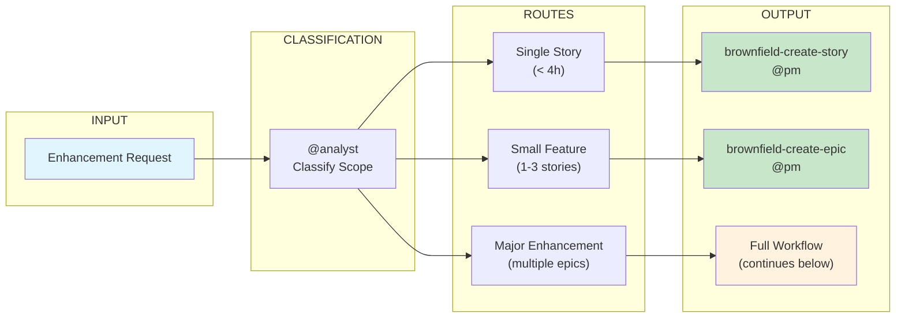
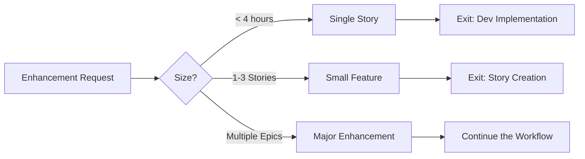
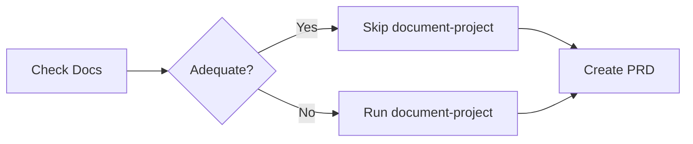
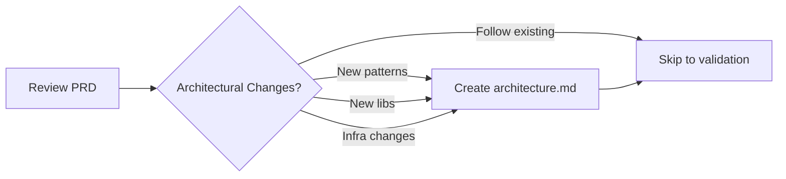
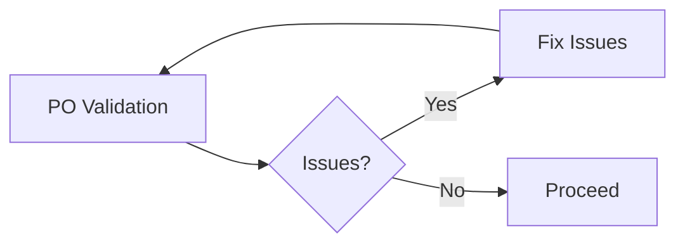
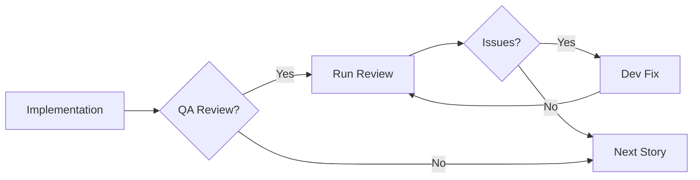
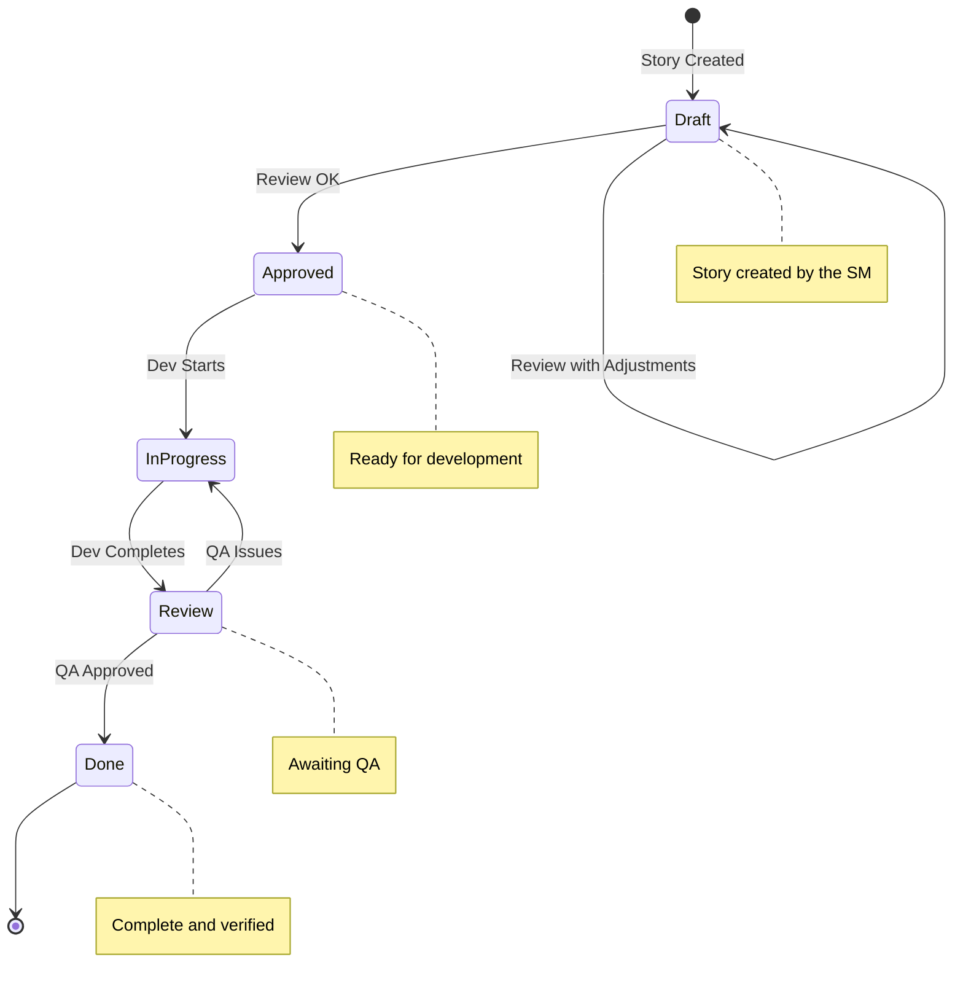
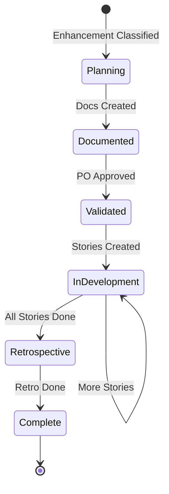

# Workflow: Brownfield Full-Stack Enhancement

> **Version:** 1.0.0
> **Created:** 2026-02-04
> **Type:** Brownfield Development
> **Status:** Official Documentation
> **Source File:** `.aexos-core/development/workflows/brownfield-fullstack.yaml`

---

## Overview

The **Brownfield Full-Stack Enhancement** workflow is designed to enhance existing full-stack applications with new features, modernization or significant changes. This workflow handles the analysis of existing systems and safe integration, ensuring that the modifications do not break already established functionality.

### When to Use This Workflow

**Use this workflow when:**

- The enhancement requires coordinated stories
- Architectural changes are needed
- Significant integration work is required
- Risk assessment and mitigation are needed
- Multiple team members will work on related changes

**Supported Project Types:**

- `feature-addition` - Adding new features
- `refactoring` - Refactoring existing code
- `modernization` - Modernizing technologies
- `integration-enhancement` - Enhancing integrations

---

## Main Workflow Diagram

```mermaid
flowchart TB
    subgraph CLASSIFICATION["1. ENHANCEMENT CLASSIFICATION"]
        START[("Start: Brownfield Enhancement")] --> ANALYST_CLASSIFY
        ANALYST_CLASSIFY["@analyst<br/>Classify the enhancement scope"]
    end

    ANALYST_CLASSIFY --> DECISION_SIZE{{"Enhancement Size?"}}

    subgraph ROUTING["2. ROUTING BY SIZE"]
        DECISION_SIZE -->|"Single Story<br/>(< 4 hours)"| PM_STORY
        DECISION_SIZE -->|"Small Feature<br/>(1-3 Stories)"| PM_EPIC
        DECISION_SIZE -->|"Major Enhancement<br/>(Multiple Epics)"| ANALYST_DOCS

        PM_STORY["@pm<br/>brownfield-create-story"]
        PM_EPIC["@pm<br/>brownfield-create-epic"]
    end

    PM_STORY --> EXIT_STORY[/"Exit: Dev Implementation"/]
    PM_EPIC --> EXIT_EPIC[/"Exit: Story Creation"/]

    subgraph DOCUMENTATION["3. DOCUMENTATION CHECK"]
        ANALYST_DOCS["@analyst<br/>Check existing documentation"]
        ANALYST_DOCS --> DECISION_DOCS{{"Documentation Adequate?"}}
        DECISION_DOCS -->|No| ARCHITECT_DOCPROJ["@architect<br/>document-project"]
        DECISION_DOCS -->|Yes| PM_PRD["@pm<br/>Create brownfield-prd.md"]
        ARCHITECT_DOCPROJ --> PM_PRD
    end

    subgraph PLANNING["4. PLANNING"]
        PM_PRD --> DECISION_ARCH{{"Architectural<br/>Changes?"}}
        DECISION_ARCH -->|Yes| ARCHITECT_ARCH["@architect<br/>Create architecture.md"]
        DECISION_ARCH -->|No| PO_VALIDATE
        ARCHITECT_ARCH --> PO_VALIDATE["@po<br/>Validate artifacts<br/>(po-master-checklist)"]
    end

    subgraph VALIDATION["5. VALIDATION AND FIXES"]
        PO_VALIDATE --> DECISION_ISSUES{{"Did the PO find<br/>issues?"}}
        DECISION_ISSUES -->|Yes| FIX_ISSUES["Fix issues<br/>(relevant agent)"]
        FIX_ISSUES --> PO_VALIDATE
        DECISION_ISSUES -->|No| PO_SHARD["@po<br/>Shard documents"]
    end

    subgraph DEVELOPMENT["6. DEVELOPMENT CYCLE"]
        PO_SHARD --> SM_STORY["@sm<br/>Create story"]
        SM_STORY --> DECISION_STORY_TYPE{{"Documentation<br/>Type?"}}
        DECISION_STORY_TYPE -->|"PRD Sharded"| SM_NEXT["create-next-story"]
        DECISION_STORY_TYPE -->|"Brownfield Docs"| SM_BROWNFIELD["create-brownfield-story"]
        SM_NEXT --> DECISION_REVIEW{{"Review draft?"}}
        SM_BROWNFIELD --> DECISION_REVIEW
        DECISION_REVIEW -->|Yes| REVIEW_APPROVE["Review & Approve"]
        DECISION_REVIEW -->|No| DEV_IMPLEMENT
        REVIEW_APPROVE --> DEV_IMPLEMENT["@dev<br/>Implement story"]
    end

    subgraph QA_CYCLE["7. QA CYCLE"]
        DEV_IMPLEMENT --> DECISION_QA{{"QA Review?"}}
        DECISION_QA -->|Yes| QA_REVIEW["@qa<br/>Review implementation"]
        DECISION_QA -->|No| DECISION_MORE_STORIES
        QA_REVIEW --> DECISION_QA_ISSUES{{"Issues?"}}
        DECISION_QA_ISSUES -->|Yes| DEV_FIX["@dev<br/>Fix feedback"]
        DECISION_QA_ISSUES -->|No| DECISION_MORE_STORIES
        DEV_FIX --> QA_REVIEW
    end

    subgraph COMPLETION["8. WRAP-UP"]
        DECISION_MORE_STORIES{{"More stories?"}}
        DECISION_MORE_STORIES -->|Yes| SM_STORY
        DECISION_MORE_STORIES -->|No| DECISION_RETRO
        DECISION_RETRO{{"Retrospective?"}}
        DECISION_RETRO -->|Yes| PO_RETRO["@po<br/>Epic Retrospective"]
        DECISION_RETRO -->|No| COMPLETE
        PO_RETRO --> COMPLETE[("Project Complete")]
    end

    style START fill:#87CEEB
    style COMPLETE fill:#90EE90
    style EXIT_STORY fill:#90EE90
    style EXIT_EPIC fill:#90EE90
    style PM_STORY fill:#87CEEB
    style PM_EPIC fill:#87CEEB
    style PM_PRD fill:#FFE4B5
    style ARCHITECT_ARCH fill:#FFE4B5
    style PO_SHARD fill:#ADD8E6
    style SM_STORY fill:#ADD8E6
    style DEV_IMPLEMENT fill:#ADD8E6
    style REVIEW_APPROVE fill:#F0E68C
    style QA_REVIEW fill:#F0E68C
    style PO_RETRO fill:#F0E68C
```



---

## Simplified Routing Diagram



---

## Detailed Steps

### Step 1: Enhancement Classification

| Attribute | Value |
|-----------|-------|
| **Agent** | @analyst (Sirius) |
| **Action** | Classify the enhancement scope |
| **Input** | Description of the enhancement by the user |
| **Output** | Classification: single_story / small_feature / major_enhancement |

**Process:**

The analyst determines the enhancement's complexity in order to route it to the appropriate path. The key question for the user is:

> "Can you describe the scope of the enhancement? Is it a small fix, a feature addition, or a larger enhancement that requires architectural changes?"

**Classification Criteria:**

- **Single Story** (< 4 hours): Use the `brownfield-create-story` task
- **Small Feature** (1-3 stories): Use the `brownfield-create-epic` task
- **Major Enhancement** (multiple epics): Continue with the full workflow

---

### Step 2: Routing by Decision

| Route | Agent | Task | Next Action |
|-------|-------|------|-------------|
| `single_story` | @pm | `brownfield-create-story` | Exit the workflow after the story is created |
| `small_feature` | @pm | `brownfield-create-epic` | Exit the workflow after the epic is created |
| `major_enhancement` | - | - | Continue to the next step |

---

### Step 3: Documentation Check

| Attribute | Value |
|-----------|-------|
| **Agent** | @analyst (Sirius) |
| **Action** | Check existing documentation |
| **Condition** | Only for `major_enhancement` |
| **Input** | Existing codebase and documentation |
| **Output** | Assessment: adequate_documentation / inadequate_documentation |

**Verification Checklist:**

- [ ] Do architecture documents exist?
- [ ] Are the API specifications up to date?
- [ ] Are the coding standards documented?
- [ ] Is the documentation current and comprehensive?

**Decision:**

- **If adequate**: Skip `document-project`, proceed to PRD creation
- **If inadequate**: Run `document-project` first

---

### Step 4: Project Analysis (Conditional)

| Attribute | Value |
|-----------|-------|
| **Agent** | @architect (Vega) |
| **Task** | `document-project` |
| **Condition** | Run if the documentation is inadequate |
| **Input** | Existing codebase |
| **Output** | `brownfield-architecture.md` (or multiple documents) |

**Purpose:**

Capture the current state of the system, technical debt and constraints. The findings are passed on to PRD creation.

**Task File:** `.aexos-core/development/tasks/document-project.md`

---

### Step 5: Brownfield PRD Creation

| Attribute | Value |
|-----------|-------|
| **Agent** | @pm (Janus) |
| **Template** | `brownfield-prd-tmpl` |
| **Requirement** | Existing documentation or the analysis from Step 4 |
| **Output** | `docs/prd.md` |

**Instructions:**

- If `document-project` was run, reference its output to avoid re-analysis
- If it was skipped, use the project's existing documentation
- **IMPORTANT**: Copy the final `prd.md` into the project's `docs/` folder

---

### Step 6: Architecture Decision

| Attribute | Value |
|-----------|-------|
| **Agents** | @pm (Janus) / @architect (Vega) |
| **Action** | Determine whether an architecture document is needed |
| **Condition** | After PRD creation |

**Criteria for creating an architecture document:**

- [ ] New architectural patterns required
- [ ] New libraries/frameworks to be adopted
- [ ] Platform/infrastructure changes
- [ ] Following existing patterns? -> Skip to story creation

---

### Step 7: Architecture Creation (Conditional)

| Attribute | Value |
|-----------|-------|
| **Agent** | @architect (Vega) |
| **Template** | `brownfield-architecture-tmpl` |
| **Requirement** | `prd.md` |
| **Condition** | Architectural changes required |
| **Output** | `docs/architecture.md` |

**Instructions:**

Create an architecture document ONLY for significant architectural changes.

**IMPORTANT**: Copy the final `architecture.md` into the project's `docs/` folder

---

### Step 8: PO Validation

| Attribute | Value |
|-----------|-------|
| **Agent** | @po (Themis) |
| **Checklist** | `po-master-checklist` |
| **Input** | All created artifacts |
| **Output** | Validation or list of issues |

**Checklist File:** `.aexos-core/product/checklists/po-master-checklist.md`

**Process:**

Validates every document for:
- Integration safety
- Completeness
- Alignment with requirements
- Brownfield-specific risks

---

### Step 9: Issue Fixes (Conditional)

| Attribute | Value |
|-----------|-------|
| **Agent** | Variable (depends on the issue) |
| **Condition** | The PO found problems |
| **Action** | Fix and re-export the updated documents |

**Flow:**

1. The PO identifies issues
2. The relevant agent fixes them
3. The updated document is saved in `docs/`
4. Returns to PO validation

---

### Step 10: Document Sharding

| Attribute | Value |
|-----------|-------|
| **Agent** | @po (Themis) |
| **Task** | `shard-doc` |
| **Input** | Documents validated in the project |
| **Output** | `docs/prd/` and `docs/architecture/` with sharded content |

**Execution Options:**

- **Option A**: Use the PO agent to shard: `@po` and ask it to shard `docs/prd.md`
- **Option B**: Manual: Drag the `shard-doc` task + `docs/prd.md` into the chat

**Task File:** `.aexos-core/development/tasks/shard-doc.md`

---

### Step 11: Story Creation

| Attribute | Value |
|-----------|-------|
| **Agent** | @sm (Chronos) |
| **Repeats** | For each epic or enhancement |
| **Input** | Sharded documents or brownfield docs |
| **Output** | `story.md` in "Draft" status |

**Task Decision:**

| Documentation Type | Task |
|--------------------|------|
| PRD Sharded | `create-next-story` |
| Brownfield Docs | `create-brownfield-story` |

**Task Files:**
- `.aexos-core/development/tasks/create-next-story.md`
- `.aexos-core/development/tasks/create-brownfield-story.md`

---

### Step 12: Draft Review (Optional)

| Attribute | Value |
|-----------|-------|
| **Agents** | @analyst / @pm |
| **Condition** | The user wants a story review |
| **Input** | `story.md` in Draft |
| **Output** | Updated story: Draft -> Approved |

**Note:** The `story-review` task is under development.

---

### Step 13: Implementation

| Attribute | Value |
|-----------|-------|
| **Agent** | @dev (Vulcan) |
| **Requirement** | Approved story |
| **Output** | Implementation files |

**Instructions:**

1. Dev Agent (New chat session): `@dev`
2. Implements the approved story
3. Updates the File List with every change
4. Marks the story as "Review" when complete

---

### Step 14: QA Review (Optional)

| Attribute | Value |
|-----------|-------|
| **Agent** | @qa (Argus) |
| **Task** | `review-story` |
| **Requirement** | Implemented files |
| **Output** | Reviewed implementation |

**Process:**

1. QA Agent (New chat session): `@qa` -> `review-story`
2. Senior dev review with refactoring capability
3. Fixes small issues directly
4. Leaves a checklist for the remaining items
5. Updates the story status (Review -> Done or stays in Review)

---

### Step 15: QA Feedback Fixes (Conditional)

| Attribute | Value |
|-----------|-------|
| **Agent** | @dev (Vulcan) |
| **Condition** | QA left items unchecked |
| **Action** | Address the remaining items |

**Flow:**

1. Dev Agent (New chat session): Address the remaining items
2. Return to QA for final approval

---

### Step 16: Development Cycle

**Repeats:** The SM -> Dev -> QA cycle for all stories in the epic

Continues until every story in the PRD is complete.

---

### Step 17: Epic Retrospective (Optional)

| Attribute | Value |
|-----------|-------|
| **Agent** | @po (Themis) |
| **Condition** | Epic complete |
| **Output** | `epic-retrospective.md` |

**Process:**

1. Validate that the epic was completed correctly
2. Document lessons learned and improvements

**Note:** The `epic-retrospective` task is under development.

---

### Step 18: Workflow Completion

**Status:** All stories implemented and reviewed

**Reference:** `.aexos-core/data/aexos-kb.md#IDE Development Workflow`

---

## Participating Agents

| Agent | Name | Role in the Workflow | Steps |
|-------|------|----------------------|-------|
| @analyst | Sirius | Scope classification, documentation check | 1, 3 |
| @architect | Vega | Project documentation, architecture design | 4, 6, 7 |
| @pm | Janus | Creation of PRD, epics and simple stories | 2, 5, 6 |
| @po | Themis | Artifact validation, sharding, retrospective | 8, 10, 17 |
| @sm | Chronos | Detailed story creation | 11 |
| @dev | Vulcan | Story implementation | 13, 15 |
| @qa | Argus | Implementation review | 14 |

---

## Tasks Executed

| Task | Step | Agent | Purpose |
|------|------|-------|---------|
| `brownfield-create-story` | 2 | @pm | Create a single story for simple enhancements |
| `brownfield-create-epic` | 2 | @pm | Create a focused epic with 1-3 stories |
| `document-project` | 4 | @architect | Document the current state of the brownfield system |
| `brownfield-prd-tmpl` | 5 | @pm | Template for a brownfield project PRD |
| `brownfield-architecture-tmpl` | 7 | @architect | Template for brownfield architecture |
| `po-master-checklist` | 8 | @po | Comprehensive artifact validation |
| `shard-doc` | 10 | @po | Shard documents into smaller files |
| `create-next-story` | 11 | @sm | Create a story from a sharded PRD |
| `create-brownfield-story` | 11 | @sm | Create a story from brownfield docs |
| `review-story` | 14 | @qa | Implementation review |

---

## Prerequisites

Before starting this workflow, make sure of the following:

### Environment

- [ ] Access to the existing project repository
- [ ] Development environment configured
- [ ] Dependencies installed

### Documentation

- [ ] Basic understanding of the existing system
- [ ] Access to existing documentation (if any)
- [ ] Clear enhancement requirements

### Tools

- [ ] GitHub CLI configured (`gh auth status`)
- [ ] Access to the PM tool (ClickUp/GitHub/Jira) if applicable
- [ ] AEXOS core config set up (`.aexos-core/core-config.yaml`)

---

## Inputs and Outputs

### Workflow Inputs

| Input | Source | Format | Required |
|-------|--------|--------|----------|
| Enhancement Request | User | Textual description | Yes |
| Existing Codebase | Repository | Source code | Yes |
| Existing Documentation | `docs/` | Markdown | No |
| Stakeholder Requirements | User/PM tool | Text/Tickets | No |

### Workflow Outputs

| Output | Destination | Format | Condition |
|--------|-------------|--------|-----------|
| `brownfield-architecture.md` | `docs/` | Markdown | If the documentation is inadequate |
| `prd.md` | `docs/` | Markdown | Major enhancement |
| `architecture.md` | `docs/` | Markdown | If there are architectural changes |
| Sharded stories | `docs/stories/` | Markdown | Always |
| Implemented code | `src/` | Various | Always |
| `epic-retrospective.md` | `docs/` | Markdown | Optional |

---

## Decision Points

### Decision 1: Enhancement Size



### Decision 2: Adequate Documentation



### Decision 3: Architectural Changes



### Decision 4: PO Issues



### Decision 5: QA Review



---

## Handoff Prompts

### Classification Complete

```text
Enhancement classified as: {{enhancement_type}}

If single_story: Proceeding with the brownfield-create-story task for immediate implementation.
If small_feature: Creating a focused epic with the brownfield-create-epic task.
If major_enhancement: Continuing with the comprehensive planning workflow.
```

### Documentation Assessment

```text
Documentation assessment complete:

If adequate: Existing documentation is sufficient. Proceeding directly to PRD creation.
If inadequate: Running document-project to capture the current state of the system before the PRD.
```

### Document Project to PM

```text
Project analysis complete. Key findings documented in:
- {{document_list}}

Use these findings to inform PRD creation and avoid re-analyzing the same aspects.
```

### PM to Architect Decision

```text
PRD complete and saved as docs/prd.md.
Architectural changes identified: {{yes/no}}

If yes: Proceeding to create an architecture document for: {{specific_changes}}
If no: No architectural change required. Proceeding to validation.
```

### Architect to PO

```text
Architecture complete. Save it as docs/architecture.md.
Please validate all artifacts for integration safety.
```

### PO to SM

```text
All artifacts validated.
Documentation type available: {{sharded_prd / brownfield_docs}}

If sharded: Use the standard create-next-story task.
If brownfield: Use the create-brownfield-story task to handle varied documentation formats.
```

### Story Creation by the SM

```text
Creating a story from {{documentation_type}}.

If context is missing: It may be necessary to gather additional context from the user during story creation.
```

### Workflow Complete

```text
All planning artifacts validated and development can begin.
Stories will be created based on the available documentation format.
```

---

## Troubleshooting

### Problem: Enhancement misclassified

**Symptom:** A simple workflow used for a complex enhancement, or vice versa

**Solution:**
1. Pause the current workflow
2. Re-run the classification with @analyst
3. Provide more context about integration and complexity

### Problem: Inadequate documentation not detected

**Symptom:** PRD created without sufficient system context

**Solution:**
1. Run `document-project` manually with @architect
2. Update the PRD with the new findings
3. Re-validate with @po

### Problem: Infinite PO validation loop

**Symptom:** Issues keep appearing after fixes

**Solution:**
1. Schedule an alignment meeting with stakeholders
2. Document clearer acceptance criteria
3. Consider reducing the enhancement's scope

### Problem: Story too large

**Symptom:** The story cannot be completed in a single session

**Solution:**
1. Split the story into multiple sub-stories
2. Re-assess the enhancement classification
3. Consider using `brownfield-create-epic` instead of a single story

### Problem: Integration breaking existing functionality

**Symptom:** Regression tests failing

**Solution:**
1. Review the impact analysis in the PRD
2. Add more integration tests
3. Consider feature flags for a gradual rollout

### Problem: Inconclusive QA Review

**Symptom:** Issues going back and forth between dev and QA

**Solution:**
1. Document clearer acceptance criteria
2. Schedule pair programming for complex issues
3. Consider adding automated tests

---

## State Diagrams

### Story State



### Epic State



---

## Success Metrics

| Metric | Description | Target |
|--------|-------------|--------|
| Classification Accuracy | % of enhancements classified correctly | > 90% |
| Time to PRD | Days from request to approved PRD | < 3 days |
| Issues per Validation | Average number of issues found by the PO | < 3 |
| QA Cycles | Average number of dev/QA round trips | < 2 |
| Zero Regression | % of releases without regression bugs | 100% |

---

## References

### Core Workflow Files

| File | Purpose |
|------|---------|
| `.aexos-core/development/workflows/brownfield-fullstack.yaml` | Workflow definition |
| `.aexos-core/development/tasks/brownfield-create-story.md` | Task to create a simple story |
| `.aexos-core/development/tasks/brownfield-create-epic.md` | Task to create an epic |
| `.aexos-core/development/tasks/document-project.md` | Task to document an existing project |
| `.aexos-core/development/tasks/shard-doc.md` | Task to shard documents |
| `.aexos-core/development/tasks/create-brownfield-story.md` | Task to create a brownfield story |
| `.aexos-core/development/tasks/create-next-story.md` | Task to create a story from the PRD |
| `.aexos-core/product/checklists/po-master-checklist.md` | PO validation checklist |

### Agent Files

| File | Agent |
|------|-------|
| `.aexos-core/development/agents/analyst.md` | @analyst (Sirius) |
| `.aexos-core/development/agents/architect.md` | @architect (Vega) |
| `.aexos-core/development/agents/pm.md` | @pm (Janus) |
| `.aexos-core/development/agents/po.md` | @po (Themis) |
| `.aexos-core/development/agents/sm.md` | @sm (Chronos) |
| `.aexos-core/development/agents/dev.md` | @dev (Vulcan) |
| `.aexos-core/development/agents/qa.md` | @qa (Argus) |

### Related Documentation

| Document | Purpose |
|----------|---------|
| `docs/guides/BACKLOG-MANAGEMENT-SYSTEM.md` | Backlog management system |
| `docs/guides/workflows/GREENFIELD-SERVICE-WORKFLOW.md` | Workflow for greenfield projects |
| `.aexos-core/working-in-the-brownfield.md` | Brownfield working guide |

---

## Changelog

| Date | Author | Description |
|------|--------|-------------|
| 2026-02-04 | @analyst | Initial document created |

---

*-- Sirius, decoding complexity into clarity*
