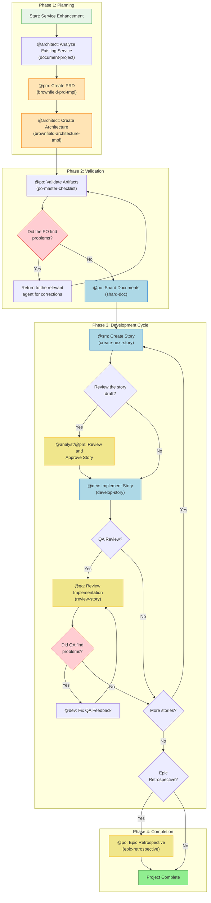
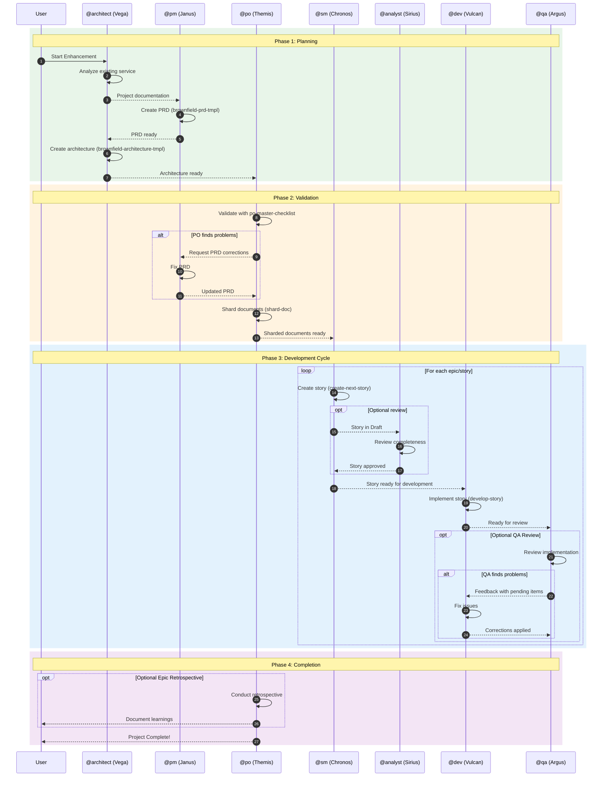
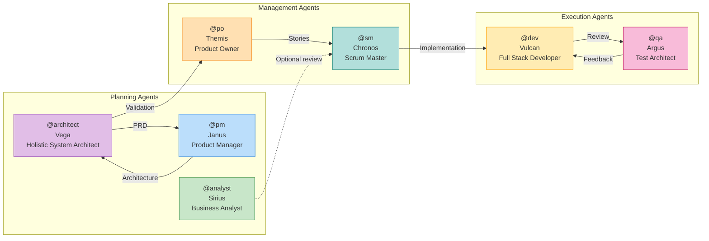
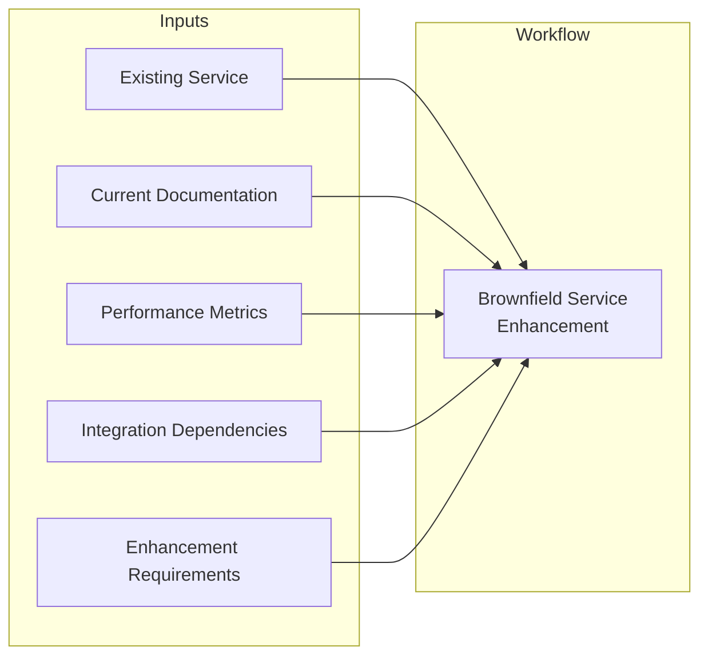
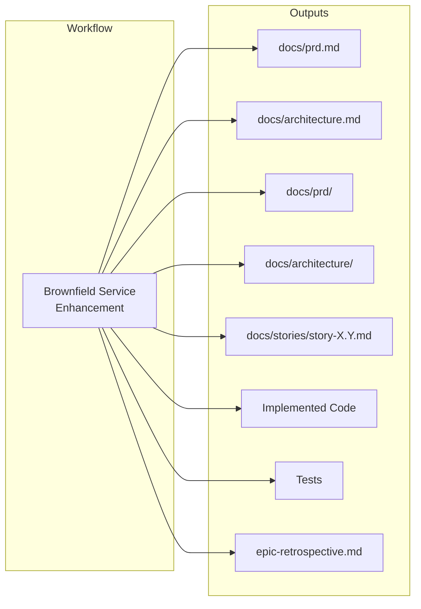
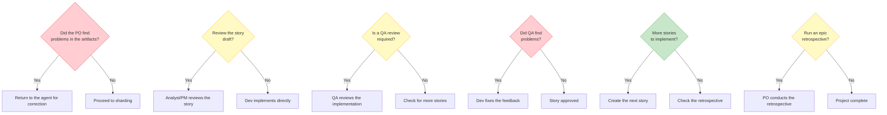

# Workflow: Brownfield Service/API Enhancement

**Identifier:** `brownfield-service`
**Type:** Brownfield (Existing Systems)
**Version:** 1.0
**Last Updated:** 2026-02-04

---

## Overview

The **Brownfield Service/API Enhancement** workflow is designed to enhance existing backend services and APIs with new features, modernization or performance improvements. It manages the analysis of existing systems and safe integration, ensuring that changes are implemented without disrupting critical functionality.

### Use Cases

| Project Type | Description |
|-----------------|-----------|
| **Service Modernization** | Updating legacy services to modern technologies |
| **API Enhancement** | Adding new endpoints or improvements to existing APIs |
| **Microservice Extraction** | Extracting modules from a monolith into microservices |
| **Performance Optimization** | Performance optimization in existing services |
| **Integration Enhancement** | Improvement of integrations between systems |

### When to Use

- Service enhancement requires coordinated stories
- API versioning or breaking changes required
- Database schema changes required
- Performance or scalability improvements required
- Multiple integration points affected

---

## Workflow Diagram



---

## Sequence Diagram



---

## Detailed Steps

### Step 1: Service Analysis

| Attribute | Value |
|----------|-------|
| **Agent** | @architect (Vega) |
| **Task** | `document-project` |
| **Input** | Existing service/API, performance metrics, current documentation |
| **Output** | Multiple documents according to the document-project template |
| **Notes** | Review existing documentation, codebase, performance metrics and identify integration dependencies |

**Activation:**
```
@architect
*document-project
```

---

### Step 2: PRD Creation

| Attribute | Value |
|----------|-------|
| **Agent** | @pm (Janus) |
| **Task** | `create-doc` with `brownfield-prd-tmpl` |
| **Input** | Analysis of the existing service |
| **Output** | `docs/prd.md` |
| **Requires** | Analysis of the existing service completed |
| **Notes** | Create a comprehensive PRD focused on service enhancement with analysis of the existing system |

**Activation:**
```
@pm
*create-brownfield-prd
```

**IMPORTANT:** Save the final `prd.md` file in the project's `docs/` folder.

---

### Step 3: Architecture Creation

| Attribute | Value |
|----------|-------|
| **Agent** | @architect (Vega) |
| **Task** | `create-doc` with `brownfield-architecture-tmpl` |
| **Input** | PRD (`docs/prd.md`) |
| **Output** | `docs/architecture.md` |
| **Requires** | Approved PRD |
| **Notes** | Create the architecture with a service integration strategy and API evolution planning |

**Activation:**
```
@architect
*create-brownfield-architecture
```

**IMPORTANT:** Save the final `architecture.md` file in the project's `docs/` folder.

---

### Step 4: Artifact Validation

| Attribute | Value |
|----------|-------|
| **Agent** | @po (Themis) |
| **Task** | `execute-checklist` with `po-master-checklist` |
| **Input** | All artifacts (PRD, Architecture) |
| **Output** | Validation report |
| **Notes** | Validate all documents for service integration safety and API compatibility. May require updates to any document. |

**Activation:**
```
@po
*execute-checklist-po
```

---

### Step 5: Problem Correction (Conditional)

| Attribute | Value |
|----------|-------|
| **Agent** | Varies according to the document with the problem |
| **Task** | Document-specific correction |
| **Input** | PO feedback |
| **Output** | Updated documents |
| **Condition** | The PO found problems in the checklist |
| **Notes** | If the PO finds problems, return to the relevant agent to fix and re-export the updated documents to the `docs/` folder |

---

### Step 6: Document Sharding

| Attribute | Value |
|----------|-------|
| **Agent** | @po (Themis) |
| **Task** | `shard-doc` |
| **Input** | All validated artifacts in `docs/` |
| **Output** | `docs/prd/` and `docs/architecture/` folders with sharded content |
| **Requires** | All artifacts in the project folder |
| **Notes** | Shard documents for development in the IDE |

**Activation Options:**

**Option A - Via the PO Agent:**
```
@po
shard docs/prd.md
```

**Option B - Manual:**
Drag the `shard-doc` task + `docs/prd.md` into the chat.

---

### Step 7: Story Creation

| Attribute | Value |
|----------|-------|
| **Agent** | @sm (Chronos) |
| **Task** | `create-next-story` |
| **Input** | Sharded documents |
| **Output** | `story.md` |
| **Requires** | Sharded documents |
| **Repeats** | For each epic |
| **Notes** | The story starts with status "Draft" |

**Activation (New chat session):**
```
@sm
*draft
```

---

### Step 8: Story Draft Review (Optional)

| Attribute | Value |
|----------|-------|
| **Agent** | @analyst (Sirius) or @pm (Janus) |
| **Task** | `review-draft-story` (in development) |
| **Input** | Story in Draft |
| **Output** | Updated story |
| **Requires** | Story created |
| **Optional** | Yes - when the user wants a story review |
| **Condition** | The user requests a review |
| **Notes** | Review the completeness and alignment of the story. Update status: Draft -> Approved |

---

### Step 9: Story Implementation

| Attribute | Value |
|----------|-------|
| **Agent** | @dev (Vulcan) |
| **Task** | `develop-story` |
| **Input** | Approved story |
| **Output** | Implementation files |
| **Requires** | Approved story (not in Draft) |
| **Notes** | Implement the approved story, update the File List with all changes, mark the story as "Review" when complete |

**Activation (New chat session):**
```
@dev
*develop {story-id}
```

---

### Step 10: QA Review (Optional)

| Attribute | Value |
|----------|-------|
| **Agent** | @qa (Argus) |
| **Task** | `review-story` |
| **Input** | Implementation files |
| **Output** | Updated implementation + QA Checklist |
| **Optional** | Yes |
| **Notes** | Senior dev review with refactoring capability. Fixes small problems directly. Leaves a checklist for remaining items. Updates the story status (Review -> Done or stays in Review) |

**Activation (New chat session):**
```
@qa
*review {story-id}
```

---

### Step 11: QA Feedback Correction (Conditional)

| Attribute | Value |
|----------|-------|
| **Agent** | @dev (Vulcan) |
| **Task** | `apply-qa-fixes` |
| **Input** | QA feedback with pending items |
| **Output** | Corrected implementation |
| **Condition** | QA left unchecked items |
| **Notes** | If QA left pending items: Dev (new session) fixes the remaining items and returns to QA for final approval |

**Activation (New chat session):**
```
@dev
*apply-qa-fixes
```

---

### Step 12: Repeat the Development Cycle

| Attribute | Value |
|----------|-------|
| **Action** | Repeat steps 7-11 |
| **Notes** | Repeat the story cycle (SM -> Dev -> QA) for all stories in the epic. Continue until all stories in the PRD are complete. |

---

### Step 13: Epic Retrospective (Optional)

| Attribute | Value |
|----------|-------|
| **Agent** | @po (Themis) |
| **Task** | `epic-retrospective` (in development) |
| **Input** | Completed epic |
| **Output** | `epic-retrospective.md` |
| **Condition** | Epic complete |
| **Optional** | Yes |
| **Notes** | Validate that the epic was completed correctly. Document learnings and improvements. |

---

### Step 14: End of the Workflow

| Attribute | Value |
|----------|-------|
| **Action** | Project complete |
| **Notes** | All stories implemented and reviewed! The project's development phase is complete. |

**Reference:** `.aexos-core/data/aexos-kb.md#IDE Development Workflow`

---

## Participating Agents



### Agent Table

| Agent | Name | Role | Responsibilities in the Workflow |
|--------|------|-------|------------------------------|
| @architect | Vega | Holistic System Architect | Analysis of the existing service, architecture creation |
| @pm | Janus | Product Manager | PRD creation for brownfield |
| @po | Themis | Product Owner | Artifact validation, document sharding, retrospective |
| @sm | Chronos | Scrum Master | Story creation |
| @analyst | Sirius | Business Analyst | Optional review of story drafts |
| @dev | Vulcan | Full Stack Developer | Story implementation, feedback correction |
| @qa | Argus | Test Architect | Implementation review, quality gates |

---

## Tasks Executed

### Main Tasks

| Task | Template/Checklist | Agent | Phase |
|------|-------------------|--------|------|
| `document-project` | document-project template | @architect | Planning |
| `create-doc` | `brownfield-prd-tmpl.yaml` | @pm | Planning |
| `create-doc` | `brownfield-architecture-tmpl.yaml` | @architect | Planning |
| `execute-checklist` | `po-master-checklist.md` | @po | Validation |
| `shard-doc` | - | @po | Validation |
| `create-next-story` | `story-tmpl.yaml` | @sm | Development |
| `develop-story` | - | @dev | Development |
| `review-story` | - | @qa | Development |
| `apply-qa-fixes` | - | @dev | Development |

### Future Tasks (In Development)

| Task | Agent | Status |
|------|--------|--------|
| `story-review` | @analyst/@pm | In development |
| `epic-retrospective` | @po | In development |

---

## Prerequisites

### Before Starting the Workflow

1. **Existing Service/API**
   - Access to the service source code
   - Current documentation (if it exists)
   - Performance metrics available

2. **Configured Environment**
   - Git configured and working
   - Access to the AEXOS templates
   - Development tools installed

3. **Project Context**
   - Clear enhancement objectives
   - Known restrictions and constraints
   - Stakeholders identified

4. **Available Templates**
   - `.aexos-core/development/templates/brownfield-prd-tmpl.yaml`
   - `.aexos-core/development/templates/brownfield-architecture-tmpl.yaml`
   - `.aexos-core/development/templates/story-tmpl.yaml`

5. **Available Checklists**
   - `.aexos-core/development/checklists/po-master-checklist.md`
   - `.aexos-core/development/checklists/story-draft-checklist.md`
   - `.aexos-core/development/checklists/story-dod-checklist.md`

---

## Inputs and Outputs

### Workflow Inputs



| Input | Description | Source |
|---------|-----------|-------|
| Existing Service | Current source code and infrastructure | Git repository |
| Current Documentation | Existing service docs | Project `docs/` |
| Performance Metrics | Performance and usage data | Monitoring tools |
| Integration Dependencies | Systems connected to the service | Current architecture |
| Enhancement Requirements | What needs to be improved | Stakeholders |

### Workflow Outputs



| Output | Description | Location |
|-------|-----------|-------------|
| PRD | Product requirements document | `docs/prd.md` |
| Architecture | Architecture document | `docs/architecture.md` |
| Sharded PRD | PRD split into parts | `docs/prd/` |
| Sharded Architecture | Architecture split up | `docs/architecture/` |
| Stories | User stories for development | `docs/stories/` |
| Implemented Code | Feature source code | Project folders |
| Tests | Unit and integration tests | `tests/` or similar |
| Retrospective | Epic learnings | `epic-retrospective.md` |

---

## Decision Points



### Decision Point Details

| Point | Question | Yes | No |
|-------|----------|-----|-----|
| **D1** | Did the PO find problems in the artifacts? | Return to the relevant agent for correction | Proceed to document sharding |
| **D2** | Does the user want to review the story draft? | Analyst/PM reviews completeness and alignment | Dev implements the story directly |
| **D3** | Is a QA review required? | QA reviews the implementation | Check whether there are more stories |
| **D4** | Did QA find problems? | Dev fixes the feedback and returns to QA | Story approved, check for more stories |
| **D5** | More stories to implement? | Create the next story (return to Step 7) | Check whether to run a retrospective |
| **D6** | Run an epic retrospective? | PO conducts the retrospective and documents it | Project complete |

---

## Troubleshooting

### Common Problems and Solutions

#### 1. Incomplete Service Analysis

**Symptom:** The architecture does not reflect all existing dependencies.

**Cause:** Lack of documentation or access to the code.

**Solution:**
1. Check access to the Git repository
2. Run `*document-project` again
3. Consult the current team about undocumented dependencies
4. Analyze integration logs to discover connections

---

#### 2. PRD Rejected by the PO

**Symptom:** The PO checklist fails repeatedly.

**Cause:** PRD incomplete or inconsistent with the architecture.

**Solution:**
1. Review the specific PO feedback
2. Check the PRD <-> Architecture alignment
3. Validate that the acceptance criteria are testable
4. Confirm that the NFRs are documented

```
@pm
*correct-course
```

---

#### 3. Story in Draft Not Approved

**Symptom:** The story stays in Draft after the review.

**Cause:** Lack of detail or ambiguity.

**Solution:**
1. Check whether all acceptance criteria are clear
2. Confirm that the tasks are executable
3. Validate that dependencies are identified
4. Run the story-draft-checklist

```
@sm
*story-checklist
```

---

#### 4. Implementation Fails QA

**Symptom:** QA rejects the implementation repeatedly.

**Cause:** The code does not meet the criteria or tests are missing.

**Solution:**
1. Review the detailed QA feedback
2. Check test coverage
3. Run CodeRabbit before sending to QA
4. Make sure the File List is complete

```
@dev
*run-tests
*apply-qa-fixes
```

---

#### 5. Infinite Feedback Cycle

**Symptom:** Dev and QA get stuck in a correction loop.

**Cause:** Ambiguous requirements or scope creep.

**Solution:**
1. Pause and review the original story
2. Clarify the acceptance criteria with the PO
3. Set an iteration limit (max 3)
4. Escalate to the PO if needed

---

#### 6. Document Sharding Fails

**Symptom:** The `shard-doc` command does not generate the expected folders.

**Cause:** Documents in the wrong format or wrong path.

**Solution:**
1. Check that `prd.md` is in `docs/`
2. Confirm the document format
3. Run it via Option A (PO agent)
4. Check the error logs

---

### Escalation Matrix

| Problem | First Contact | Escalate To |
|----------|-----------------|--------------|
| Incomplete PRD | @pm (Janus) | @po (Themis) |
| Inconsistent architecture | @architect (Vega) | @pm (Janus) |
| Ambiguous story | @sm (Chronos) | @po (Themis) |
| Implementation with bugs | @dev (Vulcan) | @qa (Argus) |
| Quality gate failure | @qa (Argus) | @po (Themis) |
| Broken integration | @architect (Vega) | @devops (Polaris) |

---

## Handoff Prompts

The handoff prompts ease the transition between agents:

| Transition | Prompt |
|-----------|--------|
| Analyst -> PM | "Service analysis complete. Create a comprehensive PRD with a service integration strategy." |
| PM -> Architect | "PRD ready. Save it as `docs/prd.md`, then create the service architecture." |
| Architect -> PO | "Architecture complete. Save it as `docs/architecture.md`. Please validate all artifacts for service integration safety." |
| PO (problems) | "The PO found problems with [document]. Please return to [agent] to fix and re-save the updated document." |
| PO (complete) | "All planning artifacts validated and saved in the `docs/` folder. Move to the IDE environment to start development." |

---

## References

### Configuration Files

| File | Description | Path |
|---------|-----------|---------|
| Workflow Definition | YAML definition of the workflow | `.aexos-core/development/workflows/brownfield-service.yaml` |
| PRD Template | Template for the brownfield PRD | `.aexos-core/development/templates/brownfield-prd-tmpl.yaml` |
| Architecture Template | Template for the architecture | `.aexos-core/development/templates/brownfield-architecture-tmpl.yaml` |
| Story Template | Template for stories | `.aexos-core/development/templates/story-tmpl.yaml` |
| PO Master Checklist | Validation checklist | `.aexos-core/development/checklists/po-master-checklist.md` |
| Story Draft Checklist | Story checklist | `.aexos-core/development/checklists/story-draft-checklist.md` |
| Story DoD Checklist | Definition of Done | `.aexos-core/development/checklists/story-dod-checklist.md` |

### Agents

| Agent | File | Path |
|--------|---------|---------|
| @architect | Vega | `.aexos-core/development/agents/architect.md` |
| @pm | Janus | `.aexos-core/development/agents/pm.md` |
| @po | Themis | `.aexos-core/development/agents/po.md` |
| @sm | Chronos | `.aexos-core/development/agents/sm.md` |
| @analyst | Sirius | `.aexos-core/development/agents/analyst.md` |
| @dev | Vulcan | `.aexos-core/development/agents/dev.md` |
| @qa | Argus | `.aexos-core/development/agents/qa.md` |

### Related Documentation

- [AEXOS Knowledge Base](../../../.aexos-core/data/aexos-kb.md) - Framework knowledge base
- [Technical Preferences](../../../.aexos-core/development/data/technical-preferences.md) - Project technical preferences
- [IDE Development Workflow](../../../.aexos-core/data/aexos-kb.md#IDE-Development-Workflow) - Development flow in the IDE

---

## Change History

| Date | Version | Change | Author |
|------|--------|-----------|-------|
| 2026-02-04 | 1.0 | Initial documentation created | Technical Documentation Specialist |

---

*Document generated from the `brownfield-service.yaml` workflow - AEXOS Framework v2.2*
