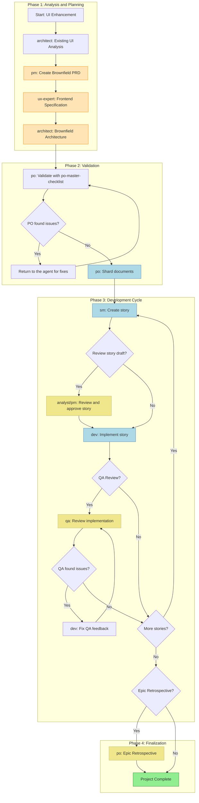
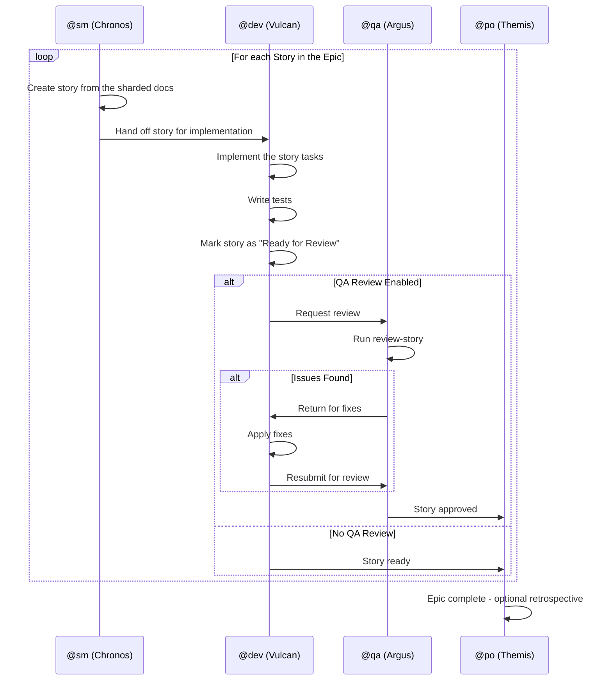
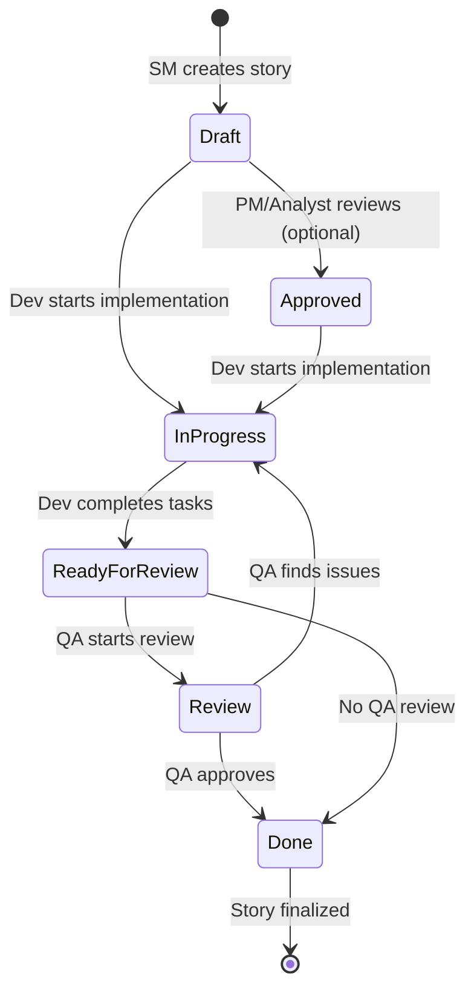
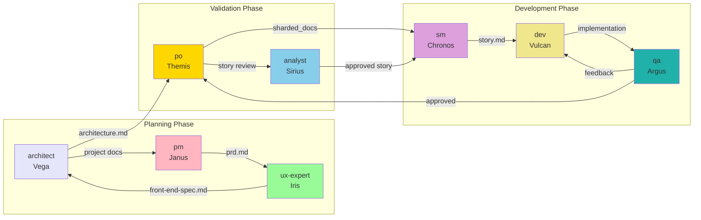
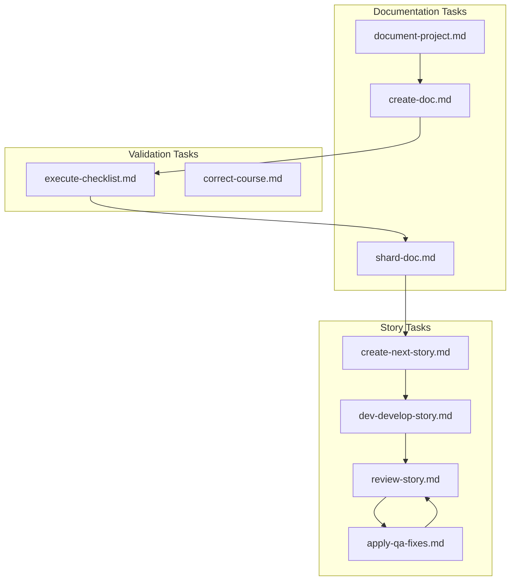
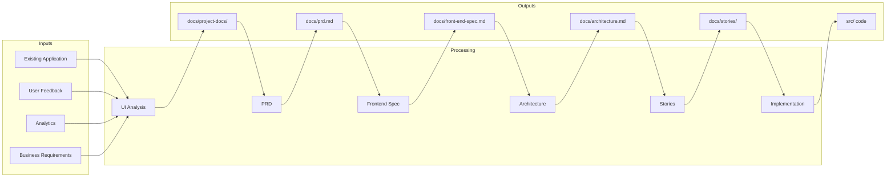
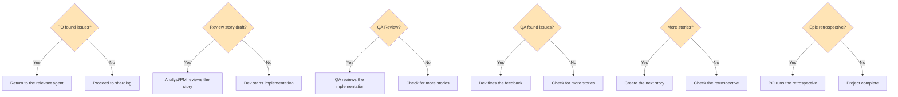

# Brownfield UI/Frontend Enhancement Workflow

> **ID:** `brownfield-ui`
> **Type:** Brownfield (existing project)
> **Version:** 1.0
> **Last Updated:** 2026-02-04

## Table of Contents

- [Overview](#overview)
- [Workflow Diagram](#workflow-diagram)
- [Detailed Steps](#detailed-steps)
- [Participating Agents](#participating-agents)
- [Tasks Executed](#tasks-executed)
- [Prerequisites](#prerequisites)
- [Inputs and Outputs](#inputs-and-outputs)
- [Decision Points](#decision-points)
- [Troubleshooting](#troubleshooting)
- [References](#references)

---

## Overview

The **Brownfield UI/Frontend Enhancement Workflow** is a structured workflow for enhancing existing frontend applications. It spans everything from the initial analysis of the legacy system to the full implementation of new features, component modernization, or design updates.

### Use Cases

| Project Type | Description |
|-----------------|-----------|
| **UI Modernization** | Updating legacy interfaces to modern standards |
| **Framework Migration** | Migration between frameworks (e.g., jQuery to React) |
| **Design Refresh** | Visual update following new design standards |
| **Frontend Enhancement** | Adding new features to the existing frontend |

### Benefits

- Structured analysis of the existing system before any modification
- Safe integration with legacy code
- Quality validation at every stage
- Complete documentation of architectural decisions

---

## Workflow Diagram

### Main Flow Diagram



### Color Legend

| Color | Meaning |
|-----|-------------|
| Light Green | Workflow completion |
| Light Blue | Main execution steps |
| Light Orange | Documentation artifact creation |
| Light Yellow | Optional review steps |

### Development Cycle Diagram



### Story State Diagram



---

## Detailed Steps

### Step 1: Existing UI Analysis

| Attribute | Value |
|----------|-------|
| **Agent** | @architect (Vega) |
| **Action** | Analyze the existing project using the `document-project` task |
| **Artifacts Created** | Multiple documents as defined by the document-project template |
| **Input** | Existing frontend application, user feedback, analytics data |
| **Output** | Project documentation with identified improvement areas |

**Notes:**
- Review the existing frontend application
- Analyze user feedback and usage data
- Identify areas for improvement and modernization
- Document the current architecture

---

### Step 2: Create Brownfield PRD

| Attribute | Value |
|----------|-------|
| **Agent** | @pm (Janus) |
| **Action** | Create a PRD focused on UI enhancement |
| **Template** | `brownfield-prd-tmpl` |
| **Artifacts Created** | `prd.md` |
| **Requires** | Existing UI analysis (Step 1) |
| **Output** | Complete PRD document with an integration strategy |

**Notes:**
- Create a comprehensive PRD focused on UI enhancement
- Include the analysis of the existing system
- IMPORTANT: Save the final `prd.md` file in the project's `docs/` folder

---

### Step 3: Frontend Specification

| Attribute | Value |
|----------|-------|
| **Agent** | @ux-expert (Iris) |
| **Action** | Create a UI/UX specification integrated with existing patterns |
| **Template** | `front-end-spec-tmpl` |
| **Artifacts Created** | `front-end-spec.md` |
| **Requires** | `prd.md` (Step 2) |
| **Output** | Detailed UI/UX specification |

**Notes:**
- Create a UI/UX specification that integrates with existing design patterns
- Take into account the design tokens already in use
- IMPORTANT: Save the final `front-end-spec.md` file in the project's `docs/` folder

---

### Step 4: Brownfield Architecture

| Attribute | Value |
|----------|-------|
| **Agent** | @architect (Vega) |
| **Action** | Create the frontend architecture with an integration strategy |
| **Template** | `brownfield-architecture-tmpl` |
| **Artifacts Created** | `architecture.md` |
| **Requires** | `prd.md`, `front-end-spec.md` (Steps 2 and 3) |
| **Output** | Architecture document with a migration plan |

**Notes:**
- Create the frontend architecture with a component integration strategy
- Include migration planning
- Define how new components interact with the existing system
- IMPORTANT: Save the final `architecture.md` file in the project's `docs/` folder

---

### Step 5: PO Validation

| Attribute | Value |
|----------|-------|
| **Agent** | @po (Themis) |
| **Action** | Validate all artifacts |
| **Checklist** | `po-master-checklist` |
| **Artifacts Validated** | All created artifacts |
| **Output** | Approval decision or a list of fixes |

**Notes:**
- Validate all documents for UI integration safety
- Check design consistency
- May require updates to any document

---

### Step 6: Fixes (Conditional)

| Attribute | Value |
|----------|-------|
| **Agent** | Varies (depending on the issue found) |
| **Condition** | `po_checklist_issues` - PO found issues |
| **Action** | Fix the flagged documents |
| **Output** | Updated documents re-exported to `docs/` |

**Notes:**
- If the PO finds issues, return to the relevant agent
- Fix and re-export the updated documents

---

### Step 7: Document Sharding

| Attribute | Value |
|----------|-------|
| **Agent** | @po (Themis) |
| **Action** | Shard the documents for IDE development |
| **Artifacts Created** | `sharded_docs` (`docs/prd/` and `docs/architecture/` folders) |
| **Requires** | All artifacts in the project folder |
| **Output** | Sharded content ready for agent consumption |

**Execution Methods:**
- **Option A:** Use the PO agent to shard: `@po` then request "shard docs/prd.md"
- **Option B:** Manual: Drag the `shard-doc` task + `docs/prd.md` into the chat

---

### Step 8: Story Creation (Cycle)

| Attribute | Value |
|----------|-------|
| **Agent** | @sm (Chronos) |
| **Action** | Create stories from the sharded documents |
| **Artifacts Created** | `story.md` (for each epic) |
| **Requires** | `sharded_docs` (Step 7) |
| **Repeats** | For each epic in the PRD |
| **Output** | Stories in "Draft" status |

**Process:**
1. Activate the SM Agent in a new chat: `@sm`
2. Run the command: `*draft`
3. SM creates the next story from the sharded docs
4. The story starts in "Draft" status

---

### Step 9: Story Draft Review (Optional)

| Attribute | Value |
|----------|-------|
| **Agent** | @analyst (Sirius) or @pm (Janus) |
| **Action** | Review and approve the story draft |
| **Condition** | `user_wants_story_review` - The user wants a review |
| **Optional** | Yes |
| **Output** | Story updated with status "Draft" -> "Approved" |

**Notes:**
- The `story-review` task is under development
- Review the story's completeness and alignment
- Update the story status

---

### Step 10: Story Implementation

| Attribute | Value |
|----------|-------|
| **Agent** | @dev (Vulcan) |
| **Action** | Implement the approved story |
| **Artifacts Created** | Implementation files |
| **Requires** | Approved `story.md` |
| **Output** | Implemented code, updated File List, "Review" status |

**Process:**
1. Activate the Dev Agent in a new chat: `@dev`
2. Run the command: `*develop {story-id}`
3. Implement the story according to its tasks
4. Update the File List with every change
5. Mark the story as "Review" once complete

---

### Step 11: QA Review (Optional)

| Attribute | Value |
|----------|-------|
| **Agent** | @qa (Argus) |
| **Action** | Review the implementation as a senior dev |
| **Artifacts Updated** | Implementation files |
| **Requires** | Implemented files |
| **Optional** | Yes |
| **Output** | Fixes applied or a checklist of pending items |

**Process:**
1. Activate the QA Agent in a new chat: `@qa`
2. Run the command: `*review {story-id}`
3. Senior dev review with refactoring authority
4. Fix small issues directly
5. Leave a checklist for the remaining items
6. Update the story status (Review -> Done, or it stays in Review)

---

### Step 12: QA Feedback Fixes (Conditional)

| Attribute | Value |
|----------|-------|
| **Agent** | @dev (Vulcan) |
| **Condition** | `qa_left_unchecked_items` - QA left pending items |
| **Action** | Address the QA feedback |
| **Output** | Items fixed, returned to QA for final approval |

---

### Step 13: Development Cycle

| Attribute | Value |
|----------|-------|
| **Action** | Repeat the SM -> Dev -> QA cycle |
| **Repeats** | For every story in the PRD |
| **Exit Condition** | All stories in the PRD completed |

---

### Step 14: Epic Retrospective (Optional)

| Attribute | Value |
|----------|-------|
| **Agent** | @po (Themis) |
| **Condition** | `epic_complete` - Epic finished |
| **Optional** | Yes |
| **Artifacts Created** | `epic-retrospective.md` |
| **Output** | Documentation of learnings and improvements |

**Notes:**
- The `epic-retrospective` task is under development
- Validate that the epic was completed correctly
- Document learnings and improvements

---

### Step 15: Project Complete

| Attribute | Value |
|----------|-------|
| **Action** | Workflow finalization |
| **Status** | All stories implemented and reviewed |
| **Output** | Project development phase complete |

---

## Participating Agents

### Agent Table

| Icon | ID | Name | Title | Role in the Workflow |
|-------|-----|------|--------|-------------------|
| @architect | architect | Vega | Holistic System Architect | Initial analysis and brownfield architecture |
| @pm | pm | Janus | Product Manager | Brownfield PRD creation |
| @ux-expert | ux-design-expert | Iris | UX/UI Designer | Frontend specification |
| @po | po | Themis | Product Owner | Validation, sharding, retrospective |
| @sm | sm | Chronos | Scrum Master | Story creation |
| @analyst | analyst | Sirius | Business Analyst | Story review (optional) |
| @dev | dev | Vulcan | Full Stack Developer | Implementation |
| @qa | qa | Argus | Test Architect | Quality review (optional) |

### Agent Collaboration Diagram



---

## Tasks Executed

### Tasks by Step

| Step | Task | Agent | Description |
|------|------|--------|-----------|
| 1 | `document-project.md` | architect | Document the existing project |
| 2 | `create-doc.md` + `brownfield-prd-tmpl` | pm | Create the brownfield PRD |
| 3 | `create-doc.md` + `front-end-spec-tmpl` | ux-expert | Create the frontend specification |
| 4 | `create-doc.md` + `brownfield-architecture-tmpl` | architect | Create the brownfield architecture |
| 5 | `execute-checklist.md` + `po-master-checklist` | po | Validate the artifacts |
| 7 | `shard-doc.md` | po | Shard the documents |
| 8 | `create-next-story.md` | sm | Create stories |
| 10 | `dev-develop-story.md` | dev | Implement the story |
| 11 | `review-story.md` | qa | Review the implementation |
| 12 | `apply-qa-fixes.md` | dev | Apply QA fixes |

### Related Tasks



---

## Prerequisites

### Technical Requirements

| Requirement | Description | Verification |
|-----------|-----------|-------------|
| **Existing Application** | Live frontend to analyze | Accessible codebase |
| **AEXOS Templates** | Templates installed | Check `.aexos-core/development/templates/` |
| **Agents Configured** | All agents used by the workflow | Check `.aexos-core/development/agents/` |
| **Git Configured** | Version control | `git status` working |
| **Node.js** | Runtime for scripts | `node --version` >= 18 |

### Documentation Requirements

| Document | Location | Required For |
|-----------|-------------|-----------------|
| PRD Template | `.aexos-core/development/templates/brownfield-prd-tmpl.yaml` | Step 2 |
| Frontend Template | `.aexos-core/development/templates/front-end-spec-tmpl.yaml` | Step 3 |
| Architecture Template | `.aexos-core/development/templates/brownfield-architecture-tmpl.yaml` | Step 4 |
| PO Checklist | `.aexos-core/development/checklists/po-master-checklist.md` | Step 5 |
| Story Template | `.aexos-core/development/templates/story-tmpl.yaml` | Step 8 |

### Recommended Input Data

- User feedback on the current application
- Analytics data (feature usage, time on page, etc.)
- Existing technical documentation (if available)
- Current design system or style guide
- Business requirements for the improvements

---

## Inputs and Outputs

### Input/Output Matrix by Step



### Final Artifacts

| Artifact | Location | Description |
|----------|-------------|-----------|
| Project Documentation | `docs/project-docs/` | Analysis of the existing system |
| Brownfield PRD | `docs/prd.md` | Product requirements |
| Frontend Specification | `docs/front-end-spec.md` | UI/UX specification |
| Architecture | `docs/architecture.md` | System architecture |
| Sharded PRD | `docs/prd/` | Sharded documents |
| Sharded Architecture | `docs/architecture/` | Sharded architecture |
| Stories | `docs/stories/epic-{N}/` | User stories |
| Implemented Code | `src/` | Source code |
| Retrospective | `docs/epic-retrospective.md` | Learnings (optional) |

---

## Decision Points

### Decision Diagram



### Decision Point Descriptions

| Point | Condition | Yes Path | No Path |
|-------|----------|-------------|-------------|
| **D1** | `po_checklist_issues` | Fix the documents | Shard the documents |
| **D2** | `user_wants_story_review` | Review by Analyst/PM | Straight to Dev |
| **D3** | Project configuration | Full QA review | Skip to the next story |
| **D4** | `qa_left_unchecked_items` | Dev fixes the issues | Mark the story as Done |
| **D5** | Stories remaining in the PRD | Create the next story | Check the retrospective |
| **D6** | `epic_complete` and desired | Run the retrospective | Close out the project |

### Decision Criteria

#### When to Use Story Review (D2)
- Complex stories with multiple dependencies
- First story of a new epic
- Stories that impact multiple systems
- Ambiguous business requirements

#### When to Use QA Review (D3)
- Changes to critical components
- Security or performance changes
- Code that interacts with external systems
- First implementation of new patterns

#### When to Run a Retrospective (D6)
- The epic took longer than planned
- There were many fix cycles
- New patterns were established
- Important learnings to share

---

## Troubleshooting

### Common Problems and Solutions

#### Problem: Agent does not recognize commands

**Symptoms:**
- The agent does not respond to commands with the `*` prefix
- Error messages about unknown commands

**Solution:**
1. Check that the agent was activated correctly with `@{agent-id}`
2. Confirm the command exists for that agent (check `*help`)
3. Check the command spelling

```bash
# Example of a correct activation
@pm
*create-brownfield-prd
```

---

#### Problem: Templates not found

**Symptoms:**
- Error when creating documents
- Message about a nonexistent template

**Solution:**
1. Check that the templates exist:
```bash
ls .aexos-core/development/templates/
```

2. Check that the template name in the workflow is correct
3. If necessary, reinstall the AEXOS core templates

---

#### Problem: PO validation fails repeatedly

**Symptoms:**
- Endless loop between validation and fixes
- Documents are never approved

**Solution:**
1. Review the `po-master-checklist` criteria
2. Check that all requirements were understood
3. Consider reducing the scope if necessary
4. Consult the PO about specific criteria

---

#### Problem: Story too large to implement

**Symptoms:**
- Dev takes too long to finish
- Too many tasks in the story
- Feedback that the scope is too broad

**Solution:**
1. Go back to the SM to split the story into smaller stories
2. Use the `*shard-doc` command to break up the PRD
3. Review the epic granularity

---

#### Problem: QA finds too many issues

**Symptoms:**
- Repeated cycles between Dev and QA
- Growing list of issues

**Solution:**
1. Check that Dev is following the code standards
2. Run linting before submitting to QA
3. Check that unit tests pass
4. Consider pair programming for recurring issues

---

#### Problem: Document sharding does not work

**Symptoms:**
- Error when running shard-doc
- Folders not created

**Solution:**
1. Check that the documents were saved in the `docs/` folder
2. Confirm write permissions
3. Run it manually:
```bash
@po
# Request a specific shard
"shard docs/prd.md"
```

---

### Logs and Diagnostics

#### Check Project Status

```bash
# Via AEXOS
@aexos-master
*status

# Via Git
git status
```

#### Check Agent History

```bash
@{agent}
*session-info
```

#### Locate Artifacts

```bash
# Documents
ls docs/

# Stories
ls docs/stories/

# Architecture
ls docs/architecture/
```

---

## References

### Related Documentation

| Document | Location | Description |
|-----------|-------------|-----------|
| AEXOS Knowledge Base | `.aexos-core/data/aexos-kb.md` | AEXOS knowledge base |
| IDE Development Workflow | `.aexos-core/data/aexos-kb.md#IDE Development Workflow` | IDE development workflow |
| Brownfield PRD Template | `.aexos-core/development/templates/brownfield-prd-tmpl.yaml` | Brownfield PRD template |
| Frontend Spec Template | `.aexos-core/development/templates/front-end-spec-tmpl.yaml` | Frontend specification template |
| Brownfield Architecture Template | `.aexos-core/development/templates/brownfield-architecture-tmpl.yaml` | Brownfield architecture template |
| PO Master Checklist | `.aexos-core/development/checklists/po-master-checklist.md` | PO validation checklist |

### Agents

| Agent | File | Documentation |
|--------|---------|--------------|
| @architect | `.aexos-core/development/agents/architect.md` | Vega - Holistic System Architect |
| @pm | `.aexos-core/development/agents/pm.md` | Janus - Product Manager |
| @ux-expert | `.aexos-core/development/agents/ux-design-expert.md` | Iris - UX/UI Designer |
| @po | `.aexos-core/development/agents/po.md` | Themis - Product Owner |
| @sm | `.aexos-core/development/agents/sm.md` | Chronos - Scrum Master |
| @analyst | `.aexos-core/development/agents/analyst.md` | Sirius - Business Analyst |
| @dev | `.aexos-core/development/agents/dev.md` | Vulcan - Full Stack Developer |
| @qa | `.aexos-core/development/agents/qa.md` | Argus - Test Architect |

### Handoff Prompts

The following prompts are used for transitions between agents:

| Transition | Prompt |
|-----------|--------|
| Analyst -> PM | "UI analysis complete. Create comprehensive PRD with UI integration strategy." |
| PM -> UX | "PRD ready. Save it as docs/prd.md, then create the UI/UX specification." |
| UX -> Architect | "UI/UX spec complete. Save it as docs/front-end-spec.md, then create the frontend architecture." |
| Architect -> PO | "Architecture complete. Save it as docs/architecture.md. Please validate all artifacts for UI integration safety." |
| PO Issues | "PO found issues with [document]. Please return to [agent] to fix and re-save the updated document." |
| Complete | "All planning artifacts validated and saved in docs/ folder. Move to IDE environment to begin development." |

---

## When to Use This Workflow

### Usage Indicators

- The UI enhancement requires coordinated stories
- Design system changes are needed
- New component patterns are required
- User research and testing are needed
- Multiple team members will work on related changes

### Alternatives

| Scenario | Recommended Workflow |
|---------|---------------------|
| New project (greenfield) | `greenfield-ui` |
| Simple bug fix | Ad-hoc workflow with @dev |
| Isolated change | Single story without the full workflow |
| Backend migration | `brownfield-backend` |
| Full stack | `brownfield-fullstack` |

---

*Documentation generated automatically from `.aexos-core/development/workflows/brownfield-ui.yaml`*

*Last updated: 2026-02-04*
