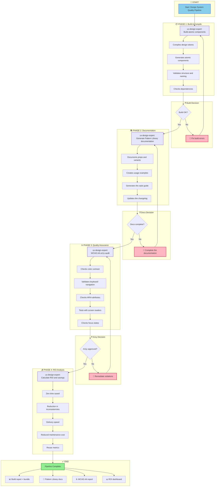
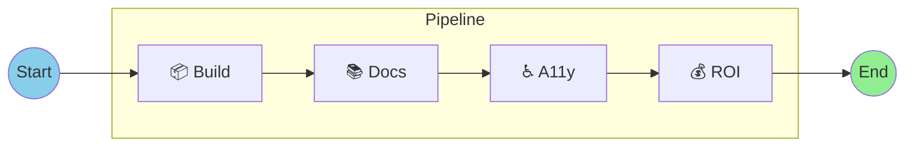
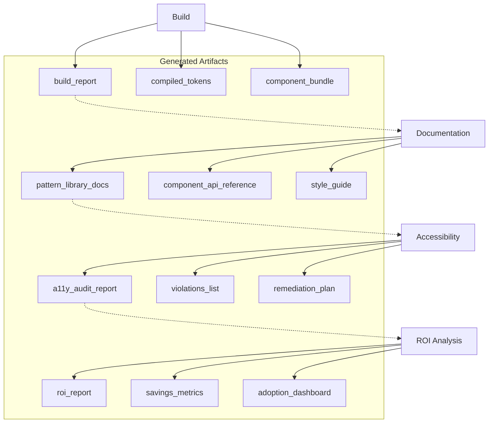
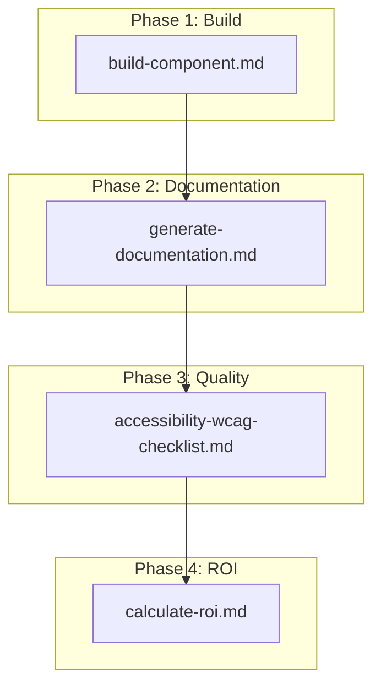
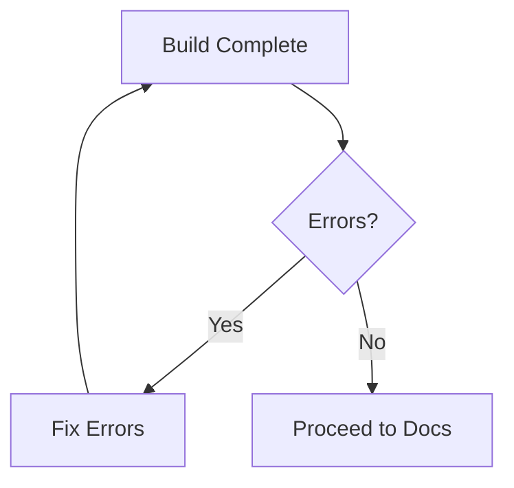
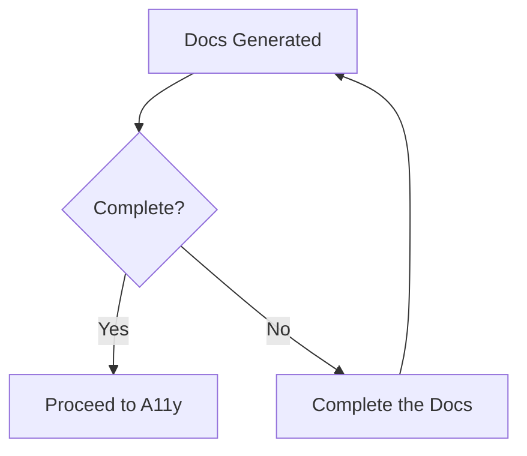
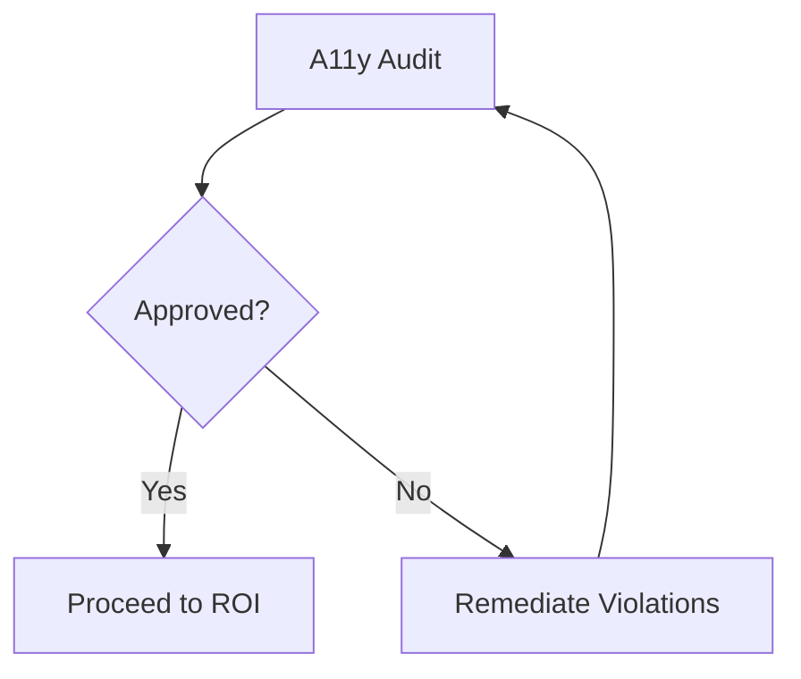

# Design System Build Quality Pipeline

**Workflow ID:** `design-system-build-quality`
**Version:** 1.0.0
**Type:** Brownfield
**Status:** Production Ready

---

## Overview

The **Design System Build Quality Pipeline** is a post-migration workflow for Design Systems. It sequentially chains the build, documentation, accessibility audit and ROI calculation steps to ensure quality and measure the value delivered.

### Purpose

This pipeline ensures that, after the migration or creation of a Design System:

1. **Components compile correctly** - Build of tokens and atomic components
2. **Documentation is complete** - Pattern Library with examples and guides
3. **Accessibility is validated** - WCAG 2.1 AA compliance
4. **ROI is measured** - Savings metrics and value delivered

### When to Use

| Scenario | Recommendation |
|---------|--------------|
| After a Design System migration | Strongly recommended |
| Release of a new Pattern Library version | Mandatory |
| Periodic quality audit | Recommended (quarterly) |
| Pre-production component validation | Mandatory |
| Generating metrics for stakeholders | As needed |

### Supported Project Types

- `design-system`
- `component-library`
- `pattern-library`
- `ui-migration`

---

## Workflow Diagram

### Main Flow



### Simplified View



#### Dependency Flow



---

## Detailed Steps

### Step 1: Build Atomic Components

| Attribute | Value |
|----------|-------|
| **ID** | `build` |
| **Phase** | 1 - Build & Compile |
| **Agent** | `ux-design-expert` (Iris) |
| **Action** | Build of atomic components |
| **Dependencies** | None (initial step) |

#### Description

Runs the build of the Design System components, compiling tokens and generating the atomic components.

#### Activities Performed

1. **Compiles design tokens** - colors, typography, spacing
2. **Generates atomic components** - buttons, inputs, cards, etc.
3. **Validates file structure and naming**
4. **Checks dependencies and imports**

#### Success Criteria

- [ ] Build completes without errors
- [ ] All tokens compiled
- [ ] Components exported correctly

#### Outputs

| Artifact | Description |
|----------|-----------|
| `build_report` | Report of the build process |
| `compiled_tokens` | Compiled design tokens (CSS/JS) |
| `component_bundle` | Bundle of ready components |

---

### Step 2: Generate Documentation

| Attribute | Value |
|----------|-------|
| **ID** | `document` |
| **Phase** | 2 - Documentation |
| **Agent** | `ux-design-expert` (Iris) |
| **Action** | Generate the Pattern Library documentation |
| **Dependencies** | `build` (Step 1) |

#### Description

Generates complete Pattern Library documentation, including the component API, examples and style guides.

#### Activities Performed

1. **Documents each component** with props and variants
2. **Creates usage examples** and code snippets
3. **Generates a visual style guide**
4. **Updates the component changelog**

#### Success Criteria

- [ ] All components documented
- [ ] Working code examples
- [ ] Style guide updated

#### Outputs

| Artifact | Description |
|----------|-----------|
| `pattern_library_docs` | Complete Pattern Library documentation |
| `component_api_reference` | Component API reference |
| `style_guide` | Visual style guide |

---

### Step 3: Accessibility Audit

| Attribute | Value |
|----------|-------|
| **ID** | `a11y-check` |
| **Phase** | 3 - Quality Assurance |
| **Agent** | `ux-design-expert` (Iris) |
| **Action** | Accessibility audit (WCAG AA) |
| **Dependencies** | `document` (Step 2) |

#### Description

Runs an accessibility audit against WCAG 2.1 AA, validating contrast, navigation and compatibility with assistive technologies.

#### Activities Performed

1. **Checks color contrast** - 4.5:1 text, 3:1 UI
2. **Validates keyboard navigation**
3. **Checks ARIA attributes and roles**
4. **Tests with screen readers**
5. **Checks focus states and visual indicators**

#### Success Criteria

- [ ] Color contrast approved
- [ ] Keyboard navigation functional
- [ ] Correct ARIA labels
- [ ] Zero critical WCAG AA violations

#### Outputs

| Artifact | Description |
|----------|-----------|
| `a11y_audit_report` | Complete audit report |
| `violations_list` | List of violations found |
| `remediation_plan` | Remediation plan for the violations |

---

### Step 4: Calculate ROI

| Attribute | Value |
|----------|-------|
| **ID** | `calculate-roi` |
| **Phase** | 4 - ROI Analysis |
| **Agent** | `ux-design-expert` (Iris) |
| **Action** | ROI and savings calculation |
| **Dependencies** | `a11y-check` (Step 3) |

#### Description

Calculates the return on investment of the Design System, measuring time savings, reduction in inconsistencies and reuse metrics.

#### Metrics Calculated

1. **Time saved** in development (hours/month)
2. **Reduction in visual inconsistencies** (%)
3. **Feature delivery speed** (average time)
4. **Reduced maintenance cost** ($)
5. **Component reuse rate** (%)

#### Success Criteria

- [ ] Dev hours saved/month calculated
- [ ] % of component reuse measured
- [ ] Average time for a new feature calculated
- [ ] Reduction in visual bugs quantified

#### Outputs

| Artifact | Description |
|----------|-----------|
| `roi_report` | Complete ROI report |
| `savings_metrics` | Detailed savings metrics |
| `adoption_dashboard` | Design System adoption dashboard |

---

## Participating Agents

### ux-design-expert (Iris)

| Attribute | Value |
|----------|-------|
| **Name** | Iris |
| **Role** | UX/UI Designer & Design System Architect |
| **Icon** | 🎨 |
| **Archetype** | Empathizer |

#### Hybrid Philosophy

Iris combines two complementary approaches:

**Sally's UX Principles (Research phase):**
- User-centric: decisions based on real needs
- Empathetic discovery: deep user research
- Iterative simplicity: start simple, refine with feedback
- Delight in details: micro-interactions create memorable experiences

**Brad Frost's System Principles (Build & Scale phases):**
- Metric-driven: numbers over opinions
- Visual shock therapy: show the chaos with real data
- Intelligent consolidation: algorithmic clustering of patterns
- ROI-focused: calculate savings, prove value
- Zero hardcoded values: all styling comes from tokens
- Atomic Design: Atoms → Molecules → Organisms → Templates → Pages
- WCAG AA minimum: accessibility built in

#### Commands Relevant to This Workflow

| Command | Description | Phase |
|---------|-----------|------|
| `*build {component}` | Build of an atomic component | 4 |
| `*document` | Generate Pattern Library documentation | 5 |
| `*a11y-check` | WCAG AA/AAA audit | 5 |
| `*calculate-roi` | Calculate ROI and savings | 5 |

---

## Tasks Executed

### Task Mapping by Step

| Step | Task File | Description |
|------|-----------|-----------|
| Build | `build-component.md` | Build of atomic components |
| Documentation | `generate-documentation.md` | Pattern Library generation |
| A11y Audit | `accessibility-wcag-checklist.md` | WCAG 2.1 AA checklist |
| ROI | `calculate-roi.md` | ROI and metrics calculation |

### Task Dependency Diagram



---

## Prerequisites

### Technical Requirements

| Requirement | Description |
|-----------|-----------|
| Existing Design System | Components already migrated/created |
| Token structure | `tokens.yaml` or equivalent configured |
| Build environment | Node.js 18+, npm/yarn/pnpm |
| Testing tools | Jest, Testing Library (recommended) |

### Project Requirements

- [ ] Design System migration completed (or v1 created)
- [ ] Design tokens extracted and organized
- [ ] Atomic components defined (atoms, molecules, organisms)
- [ ] Folder structure following Atomic Design

### Team Requirements

- [ ] Knowledge of the Atomic Design methodology
- [ ] Familiarity with the WCAG 2.1 guidelines
- [ ] Access to the Design System repository

---

## Inputs and Outputs

### Pipeline Inputs

| Input | Type | Description |
|---------|------|-----------|
| Design tokens source | `tokens.yaml` | Definitions of colors, typography, spacing |
| Component source files | `*.tsx`, `*.css` | Component source code |
| Existing documentation | `*.md` | Existing documentation (if any) |

### Pipeline Outputs

#### Phase 1: Build & Compile

```
outputs/design-system/
├── build_report.json
├── compiled/
│   ├── tokens.css
│   ├── tokens.js
│   └── tokens.d.ts
└── bundle/
    ├── components.js
    └── components.d.ts
```

#### Phase 2: Documentation

```
outputs/design-system/
├── docs/
│   ├── pattern-library/
│   │   ├── index.html
│   │   ├── atoms/
│   │   ├── molecules/
│   │   └── organisms/
│   ├── api-reference/
│   │   └── components.md
│   └── style-guide/
│       └── index.html
└── changelog.md
```

#### Phase 3: Quality Assurance

```
outputs/design-system/
├── a11y/
│   ├── audit-report.html
│   ├── violations.json
│   └── remediation-plan.md
```

#### Phase 4: ROI Analysis

```
outputs/design-system/
├── metrics/
│   ├── roi-report.pdf
│   ├── savings-breakdown.json
│   └── adoption-dashboard.html
```

---

## Decision Points

### Decision 1: Build OK?



**Pass Criteria:**
- Zero compilation errors
- All tokens valid
- Exports working

**Actions on Failure:**
1. Review the build logs
2. Fix syntax/import errors
3. Validate the token structure
4. Re-run the build

---

### Decision 2: Documentation Complete?



**Pass Criteria:**
- 100% of components documented
- Working code examples
- Style guide updated

**Actions on Failure:**
1. Identify components without documentation
2. Add missing props and examples
3. Update the changelog
4. Re-generate the documentation

---

### Decision 3: Accessibility Approved?



**Pass Criteria:**
- Zero critical violations (Level A)
- Zero serious violations (Level AA)
- Keyboard navigation 100% functional

**Actions on Failure:**
1. Review `violations_list`
2. Follow the `remediation_plan`
3. Fix contrast problems
4. Add missing ARIA labels
5. Re-run the audit

---

## Execution Modes

The workflow supports three execution modes:

### YOLO Mode (Autonomous)

| Attribute | Value |
|----------|-------|
| **Prompts** | 0-1 |
| **Interaction** | Minimal |
| **Use** | CI/CD pipelines, automated execution |

```bash
# Autonomous execution
*workflow design-system-build-quality --mode yolo
```

### Interactive Mode (Default)

| Attribute | Value |
|----------|-------|
| **Prompts** | 5-10 |
| **Interaction** | Decision checkpoints |
| **Use** | Normal development, educational feedback |

```bash
# Interactive execution (default)
*workflow design-system-build-quality
```

### Preflight Mode (Planning)

| Attribute | Value |
|----------|-------|
| **Prompts** | 10-15 |
| **Interaction** | Full planning before execution |
| **Use** | First run, impact analysis |

```bash
# Execution with full planning
*workflow design-system-build-quality --mode preflight
```

---

## Troubleshooting

### Problem: Build Fails with Token Errors

**Symptoms:**
- "Token not found" error
- Colors or spacing do not compile

**Solution:**
```bash
# 1. Check the token structure
cat tokens.yaml

# 2. Validate the YAML syntax
npm run lint:tokens

# 3. Check the cross-references
grep -r "var(--" src/
```

---

### Problem: Incomplete Documentation

**Symptoms:**
- Components without examples
- Undocumented props

**Solution:**
```bash
# 1. List components without docs
*audit --check-docs

# 2. Generate documentation stubs
*document --generate-stubs

# 3. Complete them manually and re-run
*document
```

---

### Problem: Accessibility Violations

**Symptoms:**
- Contrast failures
- Missing ARIA labels

**Solution:**
```bash
# 1. Review the detailed report
cat outputs/design-system/a11y/violations.json

# 2. Use a contrast tool
# Recommended: WebAIM Contrast Checker

# 3. Add ARIA labels
# Follow remediation-plan.md

# 4. Re-run the audit
*a11y-check
```

---

### Problem: ROI Not Calculated Correctly

**Symptoms:**
- Metrics at zero
- Missing historical data

**Solution:**
```bash
# 1. Check the input data
cat .state.yaml

# 2. Provide a manual baseline
*calculate-roi --baseline "manual"

# 3. Use market estimates
# Brad Frost suggests: 30-50% savings in development
```

---

## Handoff Prompts

### After Build Complete

```
Component build completed successfully.
Tokens compiled: {{token_count}}
Components generated: {{component_count}}
Proceeding to documentation...
```

### After Documentation

```
Pattern Library documentation generated.
Components documented: {{documented_count}}
Examples created: {{example_count}}
Starting the accessibility audit...
```

### After A11y Audit

```
WCAG AA accessibility audit completed.
Status: {{pass/fail}}
Critical violations: {{critical_count}}
Minor violations: {{minor_count}}
{{if pass}}: Proceeding to the ROI calculation.
{{if fail}}: Review remediation_plan before continuing.
```

### Pipeline Complete

```
Quality pipeline finished!

Summary:
- Build: {{build_status}}
- Documentation: {{docs_status}}
- Accessibility: {{a11y_status}}
- ROI calculated: {{roi_value}}

Artifacts available in outputs/design-system/
```

---

## References

### Internal Documentation

| Document | Path |
|-----------|---------|
| Workflow Definition | `.aexos-core/development/workflows/design-system-build-quality.yaml` |
| UX-Design Expert Agent | `.aexos-core/development/agents/ux-design-expert.md` |
| Task: Build Component | `.aexos-core/development/tasks/build-component.md` |
| Task: Generate Documentation | `.aexos-core/development/tasks/generate-documentation.md` |
| Checklist: WCAG A11y | `.aexos-core/development/checklists/accessibility-wcag-checklist.md` |
| Task: Calculate ROI | `.aexos-core/development/tasks/calculate-roi.md` |

### External References

| Resource | Link |
|---------|------|
| Atomic Design (Brad Frost) | https://atomicdesign.bradfrost.com/ |
| WCAG 2.1 Guidelines | https://www.w3.org/WAI/WCAG21/quickref/ |
| Design Tokens W3C | https://design-tokens.github.io/community-group/format/ |
| WebAIM Contrast Checker | https://webaim.org/resources/contrastchecker/ |

### Related Workflows

| Workflow | Description |
|----------|-----------|
| `brownfield-migration` | Migration of an existing Design System |
| `greenfield-design-system` | Creation of a Design System from scratch |
| `component-library-setup` | Initial setup of a component library |

---

## Version History

| Version | Date | Author | Changes |
|--------|------|-------|----------|
| 1.0.0 | 2025-01-30 | Zeus (AEXOS Master) | Initial version of the workflow |

---

## Metadata

```yaml
workflow_id: design-system-build-quality
version: 1.0.0
type: brownfield
author: Zeus (AEXOS Master)
created_date: 2025-01-30
documentation_created: 2026-02-04
tags:
  - design-system
  - quality-assurance
  - accessibility
  - documentation
  - roi
  - brownfield
```

---

*Documentation generated by Technical Documentation Specialist*
*AEXOS-FULLSTACK Framework v2.2*
