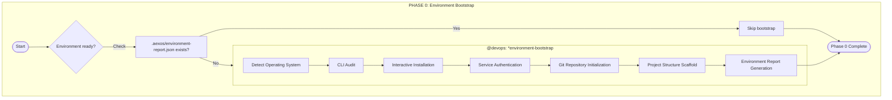
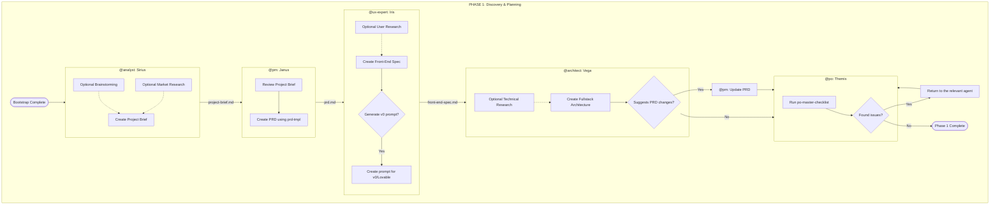
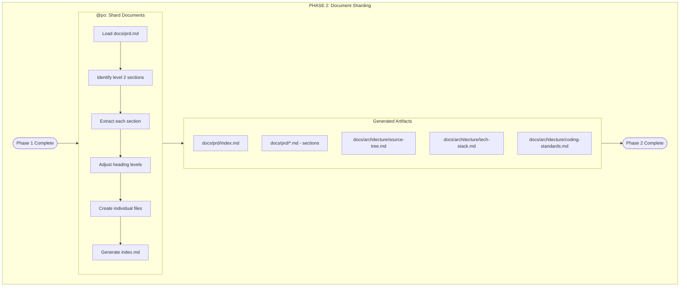
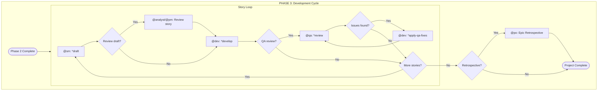
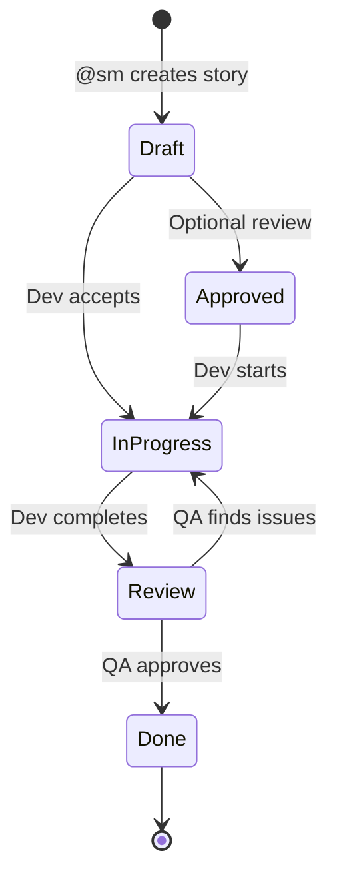
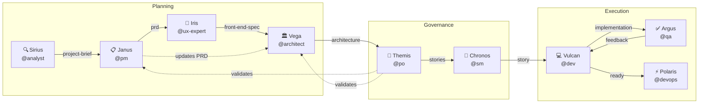
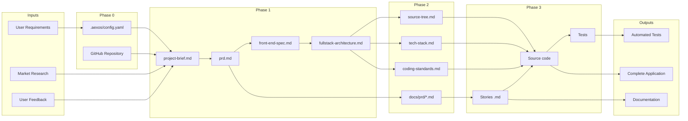
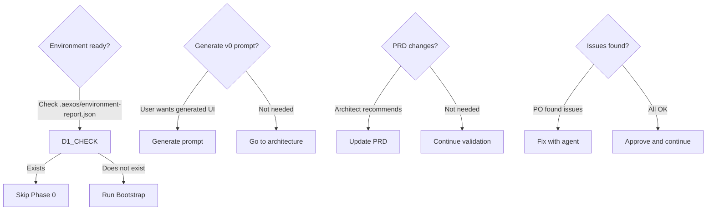

# Greenfield Full-Stack Workflow

**Version:** 1.0.0
**Type:** Greenfield
**Last Updated:** 2026-02-04
**Source File:** `.aexos-core/development/workflows/greenfield-fullstack.yaml`

---

## Overview

The **Greenfield Full-Stack Workflow** is the main AEXOS workflow for building full-stack applications from concept through development. This workflow supports both comprehensive planning for complex projects and rapid prototyping for simple projects.

### Supported Project Types

| Type | Description |
|------|-----------|
| `web-app` | Modern web applications |
| `saas` | Software as a Service |
| `enterprise-app` | Enterprise applications |
| `prototype` | Prototypes and POCs |
| `mvp` | Minimum Viable Products |

### When to Use This Workflow

- Building production-ready applications
- Projects with multiple team members
- Complex feature requirements
- Need for comprehensive documentation
- Long-term maintenance expectations
- Enterprise or customer-facing applications

---

## Overall Workflow Diagram

```mermaid
flowchart TB
    subgraph PHASE0["PHASE 0: Environment Bootstrap"]
        A[Start: Greenfield Project] --> A1{Environment ready?}
        A1 -->|No| A2["@devops: *environment-bootstrap"]
        A2 --> A3[CLIs installed + GitHub repository created]
        A1 -->|Yes| A3
    end

    subgraph PHASE1["PHASE 1: Discovery and Planning"]
        A3 --> B["@analyst: project-brief.md"]
        B --> C["@pm: prd.md"]
        C --> D["@ux-expert: front-end-spec.md"]
        D --> D2{Generate v0 prompt?}
        D2 -->|Yes| D3["@ux-expert: create v0 prompt"]
        D2 -->|No| E["@architect: fullstack-architecture.md"]
        D3 --> D4[User: generate UI in v0/Lovable]
        D4 --> E
        E --> F{Architecture suggests PRD changes?}
        F -->|Yes| G["@pm: update prd.md"]
        F -->|No| H["@po: validate all artifacts"]
        G --> H
        H --> I{PO found issues?}
        I -->|Yes| J[Return to the relevant agent for fixes]
        I -->|No| K_GATE[Phase 1 Complete]
        J --> H
    end

    subgraph PHASE2["PHASE 2: Document Sharding"]
        K_GATE --> K["@po: shard documents"]
        K --> K1[Creates: source-tree, tech-stack, coding-standards]
    end

    subgraph PHASE3["PHASE 3: Development Cycle"]
        K1 --> L["@sm: create story"]
        L --> M{Review story draft?}
        M -->|Yes| N["@analyst/@pm: review and approve story"]
        M -->|No| O["@dev: implement story"]
        N --> O
        O --> P{QA review?}
        P -->|Yes| Q["@qa: review implementation"]
        P -->|No| R{More stories?}
        Q --> S{QA found issues?}
        S -->|Yes| T["@dev: resolve QA feedback"]
        S -->|No| R
        T --> Q
        R -->|Yes| L
        R -->|No| U{Epic retrospective?}
        U -->|Yes| V["@po: epic retrospective"]
        U -->|No| W[Project Complete]
        V --> W
    end

    %% Optional paths
    B -.-> B1[Optional: brainstorming]
    B -.-> B2[Optional: market research]
    D -.-> D1[Optional: user research]
    E -.-> E1[Optional: technical research]

    %% Styles
    style A2 fill:#FF6B6B,color:#fff
    style A3 fill:#FF6B6B,color:#fff
    style W fill:#90EE90
    style K fill:#ADD8E6
    style K1 fill:#ADD8E6
    style L fill:#ADD8E6
    style O fill:#ADD8E6
    style D3 fill:#E6E6FA
    style D4 fill:#E6E6FA
    style B fill:#FFE4B5
    style C fill:#FFE4B5
    style D fill:#FFE4B5
    style E fill:#FFE4B5
    style N fill:#F0E68C
    style Q fill:#F0E68C
    style V fill:#F0E68C
```



---

## Workflow Phases

### Color Legend

| Color | Meaning |
|-----|-------------|
| Red (#FF6B6B) | Environment bootstrap |
| Light orange (#FFE4B5) | Planning and documentation |
| Light blue (#ADD8E6) | Development and sharding |
| Light purple (#E6E6FA) | AI-powered UI generation |
| Yellow (#F0E68C) | Review and validation |
| Green (#90EE90) | Completion |

---

## PHASE 0: Environment Bootstrap

### Goal
Set up the development environment before starting project planning.

### Detailed Diagram



### Detailed Step

| Step | Agent | Task | Input | Output | Required |
|------|--------|------|---------|-------|-------------|
| 1 | @devops (Polaris) | `environment-bootstrap.md` | `project_name`, `project_path`, `github_org` | `.aexos/config.yaml`, `.aexos/environment-report.json`, `.gitignore`, `README.md`, `package.json` | Yes |

### Artifacts Created

| File | Description |
|---------|-----------|
| `.aexos/config.yaml` | AEXOS project configuration |
| `.aexos/environment-report.json` | Complete environment report |
| `.gitignore` | Git ignore rules |
| `README.md` | Initial project documentation |
| `package.json` | NPM configuration |

### CLIs Verified/Installed

| Category | Tool | Required |
|-----------|------------|-------------|
| Essential | git | Yes |
| Essential | gh (GitHub CLI) | Yes |
| Essential | node | Yes |
| Essential | npm | Yes |
| Infrastructure | supabase | Recommended |
| Infrastructure | railway | Optional |
| Infrastructure | docker | Recommended |
| Quality | coderabbit | Recommended |
| Optional | pnpm | Optional |
| Optional | bun | Optional |

### Skip Conditions

- Skip only if the project already has `.aexos/environment-report.json`
- Re-run when switching machines or when new members join the project

---

## PHASE 1: Discovery and Planning

### Goal
Create all planning artifacts: project brief, PRD, specifications, and architecture.

### Detailed Diagram



### Detailed Steps

| Step | Agent | Task/Template | Input | Output | Required |
|------|--------|---------------|---------|-------|-------------|
| 1 | @analyst (Sirius) | `project-brief-tmpl.yaml` | User requirements, research | `project-brief.md` | Yes |
| 2 | @pm (Janus) | `prd-tmpl.yaml` | `project-brief.md` | `prd.md` | Yes |
| 3 | @ux-expert (Iris) | `front-end-spec-tmpl.yaml` | `prd.md` | `front-end-spec.md` | Yes |
| 4 | @ux-expert (Iris) | `generate-ai-frontend-prompt.md` | `front-end-spec.md` | Prompt for v0/Lovable | Optional |
| 5 | @architect (Vega) | `fullstack-architecture-tmpl.yaml` | `prd.md`, `front-end-spec.md` | `fullstack-architecture.md` | Yes |
| 6 | @pm (Janus) | Update | `fullstack-architecture.md` | Updated `prd.md` | Conditional |
| 7 | @po (Themis) | `po-master-checklist.md` | All artifacts | Validation | Yes |

### Artifacts Created

| Document | Owner | Location |
|-----------|-------------|-------------|
| Project Brief | @analyst | `docs/project-brief.md` |
| PRD | @pm | `docs/prd.md` |
| Front-End Spec | @ux-expert | `docs/front-end-spec.md` |
| Fullstack Architecture | @architect | `docs/fullstack-architecture.md` |

### Optional Steps

| Step | Agent | Description |
|------|--------|-----------|
| Brainstorming | @analyst | Structured ideation session |
| Market Research | @analyst | Market and competitor analysis |
| User Research | @ux-expert | Interviews and needs analysis |
| Technical Research | @architect | Technology investigation |

---

## PHASE 2: Document Sharding

### Goal
Split the PRD and the architecture into development-ready parts.

### Detailed Diagram



### Detailed Step

| Step | Agent | Task | Input | Output | Required |
|------|--------|------|---------|-------|-------------|
| 1 | @po (Themis) | `shard-doc.md` | `docs/prd.md` | `docs/prd/` folder with sharded files | Yes |

### Sharding Method

1. **Automatic (Recommended)**: Use `md-tree explode {input} {output}`
2. **Manual**: Split by level 2 (##) sections

### Artifacts Created

| File | Description |
|---------|-----------|
| `docs/prd/index.md` | Index with links to all sections |
| `docs/prd/*.md` | Individual PRD sections |
| `docs/architecture/source-tree.md` | Project directory structure |
| `docs/architecture/tech-stack.md` | Technology stack |
| `docs/architecture/coding-standards.md` | Coding standards |

---

## PHASE 3: Development Cycle

### Goal
Iterative story implementation with QA review.

### Detailed Diagram



### Detailed Steps

| Step | Agent | Task | Input | Output | Required |
|------|--------|------|---------|-------|-------------|
| 1 | @sm (Chronos) | `sm-create-next-story.md` | Sharded docs | `{epic}.{story}.story.md` | Yes |
| 2 | @analyst/@pm | Review | Story draft | Approved story | Optional |
| 3 | @dev (Vulcan) | `dev-develop-story.md` | Approved story | Implementation | Yes |
| 4 | @qa (Argus) | `qa-review-story.md` | Implementation | QA feedback | Optional |
| 5 | @dev (Vulcan) | `apply-qa-fixes.md` | QA feedback | Applied fixes | Conditional |
| 6 | @po (Themis) | Retrospective | Completed epic | Retrospective | Optional |

### Story Cycle



### Story Status

| Status | Description | Next Step |
|--------|-----------|---------------|
| Draft | Story created by the SM | Review or development |
| Approved | Story reviewed and approved | Development |
| In Progress | Under development | QA review |
| Review | Awaiting review | QA or fixes |
| Done | Complete and approved | Next story |

---

## Participating Agents

### Agent Table

| Agent | ID | Icon | Archetype | Responsibilities |
|--------|----|----|-----------|-------------------|
| Polaris | @devops | ⚡ | Operator | Environment bootstrap, Git push, releases, CI/CD |
| Sirius | @analyst | 🔍 | Decoder | Market research, brainstorming, project brief |
| Janus | @pm | 📋 | Strategist | PRD, product strategy, epics |
| Iris | @ux-expert | 🎨 | Empathizer | Frontend specs, UX, design systems |
| Vega | @architect | 🏛️ | Visionary | Full-stack architecture, technical decisions |
| Themis | @po | 🎯 | Balancer | Artifact validation, backlog, sharding |
| Chronos | @sm | 🌊 | Facilitator | Story creation, sprint planning |
| Vulcan | @dev | 💻 | Builder | Code implementation, tests |
| Argus | @qa | ✅ | Guardian | Quality review, tests, gates |

### Agent Interaction Diagram



---

## Executed Tasks

### Complete Task List

| Phase | Task | Agent | File |
|------|------|--------|---------|
| 0 | Environment Bootstrap | @devops | `environment-bootstrap.md` |
| 1 | Create Document | @analyst, @pm, @ux-expert, @architect | `create-doc.md` |
| 1 | Facilitate Brainstorming | @analyst | `facilitate-brainstorming-session.md` |
| 1 | Deep Research Prompt | @analyst, @pm, @architect | `create-deep-research-prompt.md` |
| 1 | Generate AI Frontend Prompt | @ux-expert | `generate-ai-frontend-prompt.md` |
| 1 | Execute Checklist | @po | `execute-checklist.md` |
| 2 | Shard Document | @po | `shard-doc.md` |
| 3 | Create Next Story | @sm | `sm-create-next-story.md` |
| 3 | Develop Story | @dev | `dev-develop-story.md` |
| 3 | Review Story | @qa | `qa-review-story.md` |
| 3 | Apply QA Fixes | @dev | `apply-qa-fixes.md` |

### Templates Used

| Template | Agent | Purpose |
|----------|--------|-----------|
| `project-brief-tmpl.yaml` | @analyst | Project brief structure |
| `prd-tmpl.yaml` | @pm | PRD structure |
| `front-end-spec-tmpl.yaml` | @ux-expert | Frontend specification |
| `fullstack-architecture-tmpl.yaml` | @architect | Complete architecture |
| `story-tmpl.yaml` | @sm | User story template |

### Checklists Used

| Checklist | Agent | Purpose |
|-----------|--------|-----------|
| `po-master-checklist.md` | @po | Validation of all artifacts |
| `story-draft-checklist.md` | @sm | Story draft quality |
| `story-dod-checklist.md` | @dev | Definition of Done |

---

## Prerequisites

### System Requirements

| Requirement | Minimum | Recommended |
|-----------|--------|-------------|
| Windows | 10 1809+ | 11 |
| macOS | 12+ | 14+ |
| Linux | Ubuntu 20.04+ | Ubuntu 22.04+ |
| Node.js | 18.x | 20.x |
| Git | 2.x | 2.43+ |

### Required Tools

| Tool | Verification Command | Installation |
|------------|------------------------|------------|
| Git | `git --version` | Native to the system |
| GitHub CLI | `gh --version` | `winget install GitHub.cli` |
| Node.js | `node --version` | `winget install OpenJS.NodeJS.LTS` |
| npm | `npm --version` | Bundled with Node.js |

### Required Authentications

| Service | Login Command | Verification |
|---------|------------------|-------------|
| GitHub | `gh auth login` | `gh auth status` |
| Supabase | `supabase login` | `supabase projects list` |
| Railway | `railway login` | `railway whoami` |

---

## Inputs and Outputs

### Data Flow



### Input/Output Matrix by Phase

| Phase | Input | Output |
|------|---------|-------|
| 0 | Project name, GitHub organization | AEXOS config, Git repo, folder structure |
| 1 | Requirements, research | Brief, PRD, specs, architecture |
| 2 | PRD, architecture | Sharded documents, indexes |
| 3 | Stories, sharded docs | Code, tests, application |

---

## Decision Points

### Decision Table

| Phase | Decision Point | Options | Criterion |
|------|------------------|--------|----------|
| 0 | Environment ready? | Skip / Run bootstrap | Existence of `.aexos/environment-report.json` |
| 1 | Generate v0 prompt? | Yes / No | User wants AI-powered UI generation |
| 1 | Does the architecture suggest changes? | Update PRD / Continue | Architect recommendation |
| 1 | Did the PO find issues? | Fix / Approve | Checklist result |
| 3 | Review story draft? | Review / Skip to dev | Story complexity |
| 3 | QA review? | Yes / No | Story criticality |
| 3 | More stories? | Continue / Finish | Epic backlog |
| 3 | Retrospective? | Yes / No | Epic complete |

### Decision Flowchart



---

## Troubleshooting

### Common Problems

#### Phase 0: Environment Bootstrap

| Problem | Cause | Solution |
|----------|-------|---------|
| `winget` not recognized | Outdated Windows | Update Windows or use `choco`/`scoop` |
| `gh auth login` fails | Connection or proxy | Check internet access, configure proxy |
| Permission denied on the repository | Token missing scope | Re-authenticate with `--scopes repo,workflow` |
| Docker does not start | Service stopped | Start Docker Desktop |

#### Phase 1: Planning

| Problem | Cause | Solution |
|----------|-------|---------|
| Template not found | Incorrect path | Check `.aexos-core/development/templates/` |
| Conflict between PRD and architecture | Divergent requirements | Get PM and Architect together to align |
| Checklist fails | Incomplete artifacts | Return to the responsible agent |

#### Phase 2: Sharding

| Problem | Cause | Solution |
|----------|-------|---------|
| `md-tree` not found | Not installed | `npm install -g @kayvan/markdown-tree-parser` |
| Sections not detected | Incorrect format | Check `##` headings in the document |
| Content lost | Code blocks containing `##` | Use the manual method with correct parsing |

#### Phase 3: Development

| Problem | Cause | Solution |
|----------|-------|---------|
| Incomplete story | SM skipped fields | Run `story-draft-checklist` |
| Failing tests | Broken code | @dev runs `*run-tests` |
| QA blocking | CRITICAL issues | Resolve with @dev before proceeding |
| Epic not found in ClickUp | Task not created | Create the Epic with the correct tags |

### Diagnostic Commands

```bash
# Check the environment
cat .aexos/environment-report.json

# Check CLIs
git --version && gh --version && node --version

# Check authentication
gh auth status
supabase projects list
railway whoami

# Check the project structure
ls -la .aexos/
ls -la docs/
```

---

## Handoff Prompts

### Transitions Between Phases

| From | To | Handoff Prompt |
|----|------|-------------------|
| Phase 0 | Phase 1 | "Environment bootstrap complete! Git repo created, CLIs verified, project structure ready. Start a new chat with @analyst to create the project brief." |
| @analyst | @pm | "Project brief complete. Save it as `docs/project-brief.md` in your project, then create the PRD." |
| @pm | @ux-expert | "PRD ready. Save it as `docs/prd.md` in your project, then create the UI/UX specification." |
| @ux-expert | @architect | "UI/UX spec complete. Save it as `docs/front-end-spec.md` in your project, then create the fullstack architecture." |
| @architect | @po | "Architecture complete. Save it as `docs/fullstack-architecture.md`. Do you suggest changes to the PRD stories, or are new stories needed?" |
| Phase 1 | Phase 2 | "All planning artifacts validated. Now shard the documents for development: @po → *shard-doc docs/prd.md" |
| Phase 2 | Phase 3 | "Documents sharded! source-tree.md, tech-stack.md, coding-standards.md created. Start development: @sm → *draft" |
| Completion | - | "All stories implemented and reviewed. Project development phase complete!" |

---

## References

### Related Files

| Type | File | Description |
|------|---------|-----------|
| Workflow | `.aexos-core/development/workflows/greenfield-fullstack.yaml` | Workflow definition |
| Task | `.aexos-core/development/tasks/environment-bootstrap.md` | Environment bootstrap |
| Task | `.aexos-core/development/tasks/shard-doc.md` | Document sharding |
| Task | `.aexos-core/development/tasks/sm-create-next-story.md` | Story creation |
| Agent | `.aexos-core/development/agents/*.md` | Agent definitions |
| Template | `.aexos-core/development/templates/*.yaml` | Document templates |
| Checklist | `.aexos-core/development/checklists/*.md` | Validation checklists |

### External Documentation

| Resource | URL |
|---------|-----|
| GitHub CLI | https://cli.github.com/manual/ |
| Supabase CLI | https://supabase.com/docs/guides/cli |
| Railway CLI | https://docs.railway.app/reference/cli-api |
| CodeRabbit | https://coderabbit.ai/docs |

---

## Version History

| Version | Date | Changes |
|--------|------|------------|
| 1.0.0 | 2026-02-04 | Complete initial documentation |

---

**Maintained by:** AEXOS Development Team
**Last Reviewed:** 2026-02-04
