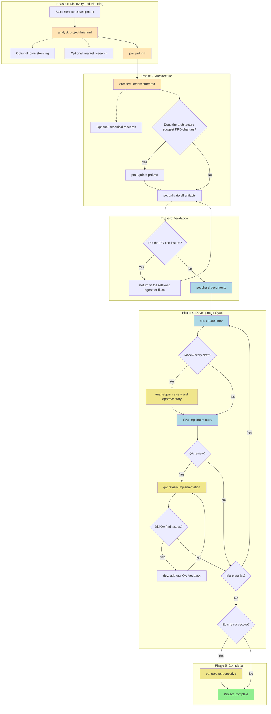
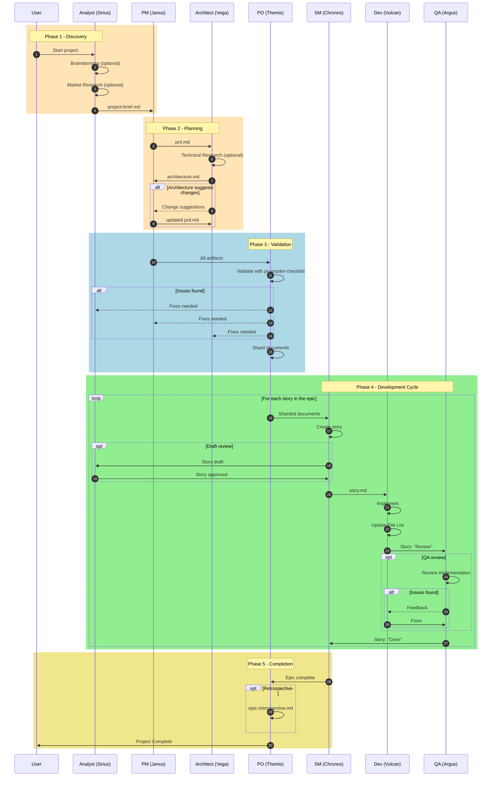
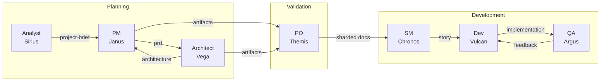
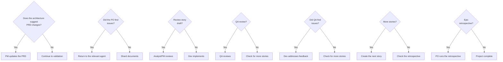

# Workflow: Greenfield Service/API Development

**Document:** GREENFIELD-SERVICE-WORKFLOW.md
**Version:** 1.0
**Created:** 2026-02-04
**Source:** `.aexos-core/development/workflows/greenfield-service.yaml`

---

## Overview

The **Greenfield Service/API Development** workflow is an orchestrated agent flow for backend service development, from conception through complete implementation. It supports both comprehensive planning for complex services and rapid prototyping for simple APIs.

### Supported Project Types

| Type | Description |
|------|-----------|
| `rest-api` | Traditional RESTful API |
| `graphql-api` | GraphQL API |
| `microservice` | Independent microservice |
| `backend-service` | Generic backend service |
| `api-prototype` | Rapid API prototype |
| `simple-service` | Simple service with reduced scope |

### When to Use This Workflow

- Building production APIs or microservices
- Multiple endpoints and complex business logic
- Need for comprehensive documentation and testing
- Multiple team members involved
- Expectation of long-term maintenance
- Enterprise or externally facing APIs

---

## Workflow Diagram



---

## Sequence Diagram



---

## Detailed Steps

### Step 1: Create Project Brief

| Field | Value |
|-------|-------|
| **Agent** | `@analyst` (Sirius) |
| **Task** | Create project-brief.md |
| **Input** | Project concept/idea, initial requirements |
| **Output** | `docs/project-brief.md` |
| **Optional Steps** | `brainstorming_session`, `market_research_prompt` |

**Description:**
The analyst runs a brainstorming session (optional), market research (optional) and creates the project brief that establishes the scope, objectives and initial context.

**Note:** Save the final output to `docs/project-brief.md` in the project.

---

### Step 2: Create PRD

| Field | Value |
|-------|-------|
| **Agent** | `@pm` (Janus) |
| **Task** | Create prd.md |
| **Input** | `project-brief.md` |
| **Output** | `docs/prd.md` |
| **Template** | `prd-tmpl` |

**Description:**
The Product Manager creates the product requirements document (PRD) focused on API/service requirements from the project brief.

**Note:** Save the final output to `docs/prd.md` in the project.

---

### Step 3: Create Architecture

| Field | Value |
|-------|-------|
| **Agent** | `@architect` (Vega) |
| **Task** | Create architecture.md |
| **Input** | `prd.md` |
| **Output** | `docs/architecture.md` |
| **Template** | `architecture-tmpl` |
| **Optional Steps** | `technical_research_prompt` |

**Description:**
The Architect creates the backend/service architecture. They may suggest changes to the PRD stories or new stories.

**Note:** Save the final output to `docs/architecture.md` in the project.

---

### Step 4: Update PRD (Conditional)

| Field | Value |
|-------|-------|
| **Agent** | `@pm` (Janus) |
| **Task** | Update prd.md |
| **Condition** | `architecture_suggests_prd_changes` |
| **Input** | `architecture.md` with suggestions |
| **Output** | `docs/prd.md` (updated) |

**Description:**
If the architect suggests changes to the stories, the PM updates the PRD and re-exports the complete, non-reduced document.

---

### Step 5: Validate Artifacts

| Field | Value |
|-------|-------|
| **Agent** | `@po` (Themis) |
| **Task** | Validate all artifacts |
| **Input** | All documents (`project-brief.md`, `prd.md`, `architecture.md`) |
| **Output** | Approved validation or list of issues |
| **Checklist** | `po-master-checklist` |

**Description:**
The Product Owner validates all documents for consistency and completeness. They may require updates to any document.

---

### Step 6: Fix Issues (Conditional)

| Field | Value |
|-------|-------|
| **Agent** | Variable (depends on the issue) |
| **Task** | Fix flagged documents |
| **Condition** | `po_checklist_issues` |
| **Input** | List of issues from the PO |
| **Output** | Corrected documents |

**Description:**
If the PO finds issues, return to the relevant agent for correction and re-export the updated documents to the `docs/` folder.

---

### Step 7: Shard Documents

| Field | Value |
|-------|-------|
| **Agent** | `@po` (Themis) |
| **Task** | Shard documents |
| **Input** | All validated artifacts |
| **Output** | `docs/prd/`, `docs/architecture/` (sharded) |

**Description:**
Shard the documents for development in the IDE:
- **Option A:** Use the PO agent to shard: `@po` and ask it to shard `docs/prd.md`
- **Option B:** Manual: Drag the `shard-doc` task + `docs/prd.md` into the chat

---

### Step 8: Create Story (Loop)

| Field | Value |
|-------|-------|
| **Agent** | `@sm` (Chronos) |
| **Task** | Create story |
| **Input** | Sharded documents |
| **Output** | `story.md` |
| **Repeats** | For each epic |

**Description:**
Story creation cycle:
1. SM Agent (New Session): `@sm` -> `*create`
2. Creates the next story from the sharded documents
3. The story starts in "Draft" status

---

### Step 9: Review Story Draft (Optional)

| Field | Value |
|-------|-------|
| **Agent** | `@analyst` or `@pm` |
| **Task** | Review story draft |
| **Condition** | `user_wants_story_review` |
| **Input** | `story.md` in draft |
| **Output** | Approved story (Draft -> Approved) |

**Description:**
Optional review to approve the story draft:
- Review the story's completeness and alignment
- Update status: Draft -> Approved

---

### Step 10: Implement Story

| Field | Value |
|-------|-------|
| **Agent** | `@dev` (Vulcan) |
| **Task** | Implement story |
| **Input** | Approved `story.md` |
| **Output** | Implementation files |

**Description:**
Dev Agent (New Session): `@dev`
- Implements the approved story
- Updates the File List with all changes
- Marks the story as "Review" when complete

---

### Step 11: Review Implementation (Optional)

| Field | Value |
|-------|-------|
| **Agent** | `@qa` (Argus) |
| **Task** | Review implementation |
| **Condition** | Optional |
| **Input** | Implementation files |
| **Output** | Approved implementation or feedback |

**Description:**
QA Agent (New Session): `@qa` -> `*review-story`
- Senior dev review with refactoring capability
- Fixes small issues directly
- Leaves a checklist for the remaining items
- Updates the story status (Review -> Done or stays in Review)

---

### Step 12: Address QA Feedback (Conditional)

| Field | Value |
|-------|-------|
| **Agent** | `@dev` (Vulcan) |
| **Task** | Address QA feedback |
| **Condition** | `qa_left_unchecked_items` |
| **Input** | QA checklist with pending items |
| **Output** | Corrected implementation |

**Description:**
If QA left unchecked items:
- Dev Agent (New Session): Address the remaining items
- Return to QA for final approval

---

### Step 13: Continue the Cycle

| Field | Value |
|-------|-------|
| **Action** | Continue for all stories |
| **Condition** | Until all PRD stories are complete |

**Description:**
Repeat the story cycle (SM -> Dev -> QA) for all stories in the epic.

---

### Step 14: Epic Retrospective (Optional)

| Field | Value |
|-------|-------|
| **Agent** | `@po` (Themis) |
| **Task** | Epic retrospective |
| **Condition** | `epic_complete` |
| **Output** | `epic-retrospective.md` |

**Description:**
After the epic is complete:
- Validate that the epic was completed correctly
- Document learnings and improvements

---

### Step 15: Project Complete

| Field | Value |
|-------|-------|
| **Action** | Project complete |
| **Final State** | All stories implemented and reviewed |

**Description:**
All stories implemented and reviewed! The service development phase is complete.

**Reference:** `.aexos-core/data/aexos-kb.md#IDE Development Workflow`

---

## Participating Agents



### Agent Table

| ID | Name | Title | Icon | Responsibility in the Workflow |
|----|------|--------|-------|------------------------------|
| `analyst` | Sirius | Business Analyst | `analysis` | Create project brief, brainstorming, market research |
| `pm` | Janus | Product Manager | `strategy` | Create and update the PRD |
| `architect` | Vega | Architect | `architecture` | Create the service architecture |
| `po` | Themis | Product Owner | `validation` | Validate artifacts, shard docs, retrospective |
| `sm` | Chronos | Scrum Master | `facilitation` | Create the epic's stories |
| `dev` | Vulcan | Full Stack Developer | `implementation` | Implement stories |
| `qa` | Argus | Test Architect | `quality` | Review the implementation |

---

## Executed Tasks

| Step | Task | Agent | Required |
|------|------|--------|-------------|
| 1 | `create-project-brief` | analyst | Yes |
| 1a | `brainstorming_session` | analyst | No |
| 1b | `market_research_prompt` | analyst | No |
| 2 | `create-prd` | pm | Yes |
| 3 | `create-full-stack-architecture` | architect | Yes |
| 3a | `technical_research_prompt` | architect | No |
| 4 | `update-prd` | pm | Conditional |
| 5 | `execute-checklist (po-master-checklist)` | po | Yes |
| 6 | `fix-documents` | various | Conditional |
| 7 | `shard-doc` | po | Yes |
| 8 | `create-next-story` | sm | Yes (loop) |
| 9 | `review-story-draft` | analyst/pm | No |
| 10 | `develop-story` | dev | Yes (loop) |
| 11 | `review-story` | qa | No |
| 12 | `apply-qa-fixes` | dev | Conditional |
| 14 | `epic-retrospective` | po | No |

---

## Prerequisites

### Required Tools

| Tool | Purpose |
|------------|-----------|
| Node.js 18+ | Development runtime |
| Git | Version control |
| GitHub CLI (`gh`) | GitHub integration |
| Supabase CLI | Database operations |

### Configuration Files

| File | Description |
|---------|-----------|
| `.aexos-core/core-config.yaml` | Framework configuration |
| `.env` | Environment variables |
| `projects/{Name}/.project.yaml` | Project-specific settings |

### Required Templates

| Template | Location | Agent |
|----------|-------------|--------|
| `project-brief-tmpl.yaml` | `.aexos-core/development/templates/` | analyst |
| `prd-tmpl.yaml` | `.aexos-core/development/templates/` | pm |
| `architecture-tmpl.yaml` | `.aexos-core/development/templates/` | architect |
| `story-tmpl.yaml` | `.aexos-core/development/templates/` | sm |
| `qa-gate-tmpl.yaml` | `.aexos-core/development/templates/` | qa |

### Checklists

| Checklist | Agent | Use |
|-----------|--------|-----|
| `po-master-checklist.md` | po | Artifact validation |
| `story-draft-checklist.md` | sm | Story validation |
| `story-dod-checklist.md` | dev | Definition of Done |

---

## Inputs and Outputs

### Workflow Inputs

| Input | Description | Provided By |
|---------|-----------|---------------|
| Project concept | Initial idea, objectives, scope | User |
| Business requirements | Client/stakeholder needs | User |
| Technical constraints | Known limitations | User |
| Stack preferences | Preferred technologies | User |

### Workflow Outputs

| Output | Location | Created By |
|-------|-------------|------------|
| `project-brief.md` | `docs/project-brief.md` | analyst |
| `prd.md` | `docs/prd.md` | pm |
| `architecture.md` | `docs/architecture.md` | architect |
| Sharded PRD | `docs/prd/` | po |
| Sharded architecture | `docs/architecture/` | po |
| Stories | `docs/stories/epic-X/` | sm |
| Implemented code | `apps/`, `packages/`, `infrastructure/` | dev |
| QA Gates | `docs/qa/gates/` | qa |
| Retrospective | `docs/epic-retrospective.md` | po |

---

## Decision Points



### Decision Table

| Point | Condition | Action if True | Action if False |
|-------|----------|-------------------|---------------|
| D1 | `architecture_suggests_prd_changes` | PM updates the PRD | Continue to the PO |
| D2 | `po_checklist_issues` | Return for fixes | Shard docs |
| D3 | `user_wants_story_review` | Analyst/PM reviews the draft | Dev implements directly |
| D4 | User preference | QA reviews the implementation | Check for more stories |
| D5 | `qa_left_unchecked_items` | Dev addresses feedback | Story complete |
| D6 | Remaining stories in the epic | Create the next story | Check the retrospective |
| D7 | `epic_complete` and preference | PO runs the retrospective | Project complete |

---

## Handoff Prompts

Standardized messages for transitions between agents:

| Transition | Prompt |
|-----------|--------|
| Analyst -> PM | "Project brief is complete. Save it as docs/project-brief.md in your project, then create the PRD." |
| PM -> Architect | "PRD is ready. Save it as docs/prd.md in your project, then create the service architecture." |
| Architect (review) | "Architecture complete. Save it as docs/architecture.md. Do you suggest any changes to the PRD stories or need new stories added?" |
| Architect -> PM | "Please update the PRD with the suggested story changes, then re-export the complete prd.md to docs/." |
| Artifacts -> PO | "All documents ready in docs/ folder. Please validate all artifacts for consistency." |
| PO (issues) | "PO found issues with [document]. Please return to [agent] to fix and re-save the updated document." |
| Workflow complete | "All planning artifacts validated and saved in docs/ folder. Move to IDE environment to begin development." |

---

## Troubleshooting

### Common Problems

#### 1. Incomplete PRD

**Symptom:** The architect cannot create an adequate architecture.

**Cause:** The project brief is missing crucial information.

**Solution:**
1. Return to the analyst
2. Run `*brainstorm` to discover the missing requirements
3. Update project-brief.md
4. PM recreates the PRD

---

#### 2. Incompatible Architecture

**Symptom:** Stories do not map to the architecture.

**Cause:** PRD and architecture are misaligned.

**Solution:**
1. Architect suggests changes to the PRD
2. PM updates the PRD
3. PO validates consistency
4. Re-shard the documents

---

#### 3. Story Stuck in Draft

**Symptom:** The story does not progress to implementation.

**Cause:** The story draft failed validation.

**Solution:**
1. SM reviews the `story-draft-checklist`
2. Fix the missing items
3. Re-validate with analyst/pm if needed

---

#### 4. Implementation Fails QA

**Symptom:** QA rejects the implementation repeatedly.

**Cause:** Misinterpreted requirements or low-quality code.

**Solution:**
1. Dev reviews the story's acceptance criteria
2. Run `*apply-qa-fixes` with the QA feedback
3. Run CodeRabbit for automatic validation
4. Re-submit to QA

---

#### 5. Infinite Development Cycle

**Symptom:** Stories are never completed.

**Cause:** Scope too large or unresolved dependencies.

**Solution:**
1. PO reviews the backlog and priorities
2. SM splits large stories
3. Identify and resolve blockers
4. Consider a tighter MVP

---

### Logs and Diagnostics

| Type | Location |
|------|-------------|
| Agent logs | `.aexos/logs/agent.log` |
| Project status | `.aexos/project-registry.yaml` |
| Decision logs | `.ai/decision-log-{story-id}.md` |
| QA reports | `docs/qa/gates/` |

### Debug Commands

```bash
# Check the project status
cat .aexos/project-status.yaml

# List in-progress stories
ls docs/stories/epic-*/

# Check the agent logs
tail -f .aexos/logs/agent.log

# Enable debug mode
export AEXOS_DEBUG=true
```

---

## References

### Workflow Files

| File | Description |
|---------|-----------|
| `.aexos-core/development/workflows/greenfield-service.yaml` | Workflow definition |
| `.aexos-core/data/aexos-kb.md` | AEXOS knowledge base |

### Agents

| File | Agent |
|---------|--------|
| `.aexos-core/development/agents/analyst.md` | Sirius (Analyst) |
| `.aexos-core/development/agents/pm.md` | Janus (PM) |
| `.aexos-core/development/agents/architect.md` | Vega (Architect) |
| `.aexos-core/development/agents/po.md` | Themis (PO) |
| `.aexos-core/development/agents/sm.md` | Chronos (SM) |
| `.aexos-core/development/agents/dev.md` | Vulcan (Dev) |
| `.aexos-core/development/agents/qa.md` | Argus (QA) |

### Main Tasks

| File | Task |
|---------|------|
| `.aexos-core/development/tasks/create-doc.md` | Document creation |
| `.aexos-core/development/tasks/shard-doc.md` | Document sharding |
| `.aexos-core/development/tasks/sm-create-next-story.md` | Story creation |
| `.aexos-core/development/tasks/dev-develop-story.md` | Story implementation |
| `.aexos-core/development/tasks/qa-review-story.md` | Implementation review |
| `.aexos-core/development/tasks/execute-checklist.md` | Checklist execution |

### Templates

| File | Template |
|---------|----------|
| `.aexos-core/development/templates/project-brief-tmpl.yaml` | Project Brief |
| `.aexos-core/development/templates/prd-tmpl.yaml` | PRD |
| `.aexos-core/development/templates/architecture-tmpl.yaml` | Architecture |
| `.aexos-core/development/templates/story-tmpl.yaml` | User Story |
| `.aexos-core/development/templates/qa-gate-tmpl.yaml` | QA Gate |

### Checklists

| File | Checklist |
|---------|-----------|
| `.aexos-core/development/checklists/po-master-checklist.md` | PO Validation |
| `.aexos-core/development/checklists/story-draft-checklist.md` | Story Draft Validation |
| `.aexos-core/development/checklists/story-dod-checklist.md` | Definition of Done |

---

## Change History

| Date | Version | Description |
|------|--------|-----------|
| 2026-02-04 | 1.0 | Initial document creation |

---

*Documentation generated automatically from `.aexos-core/development/workflows/greenfield-service.yaml`*
