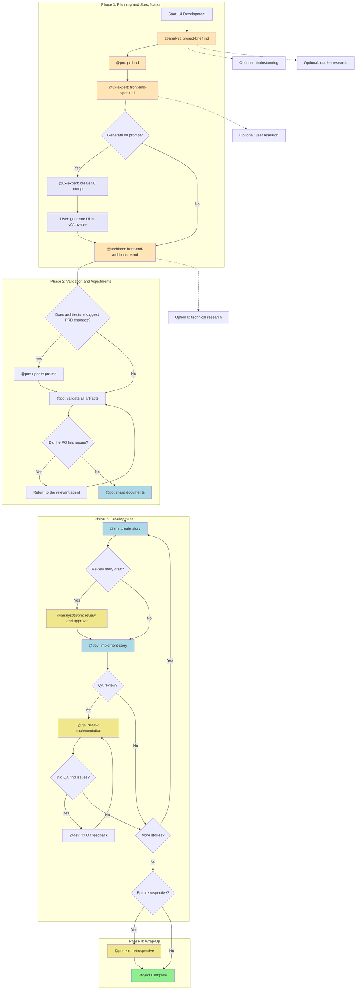
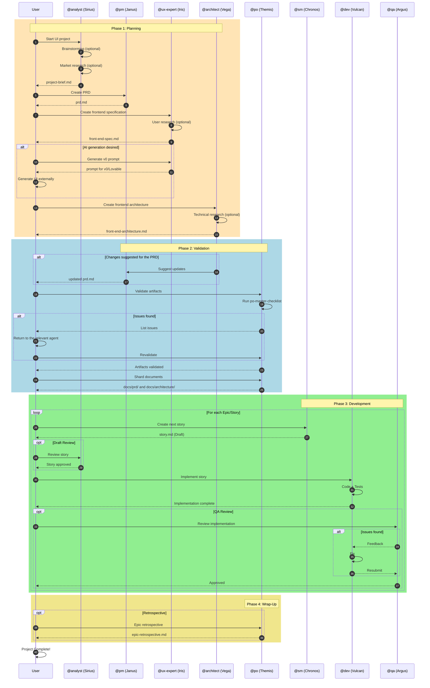
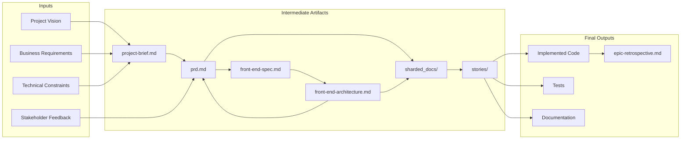
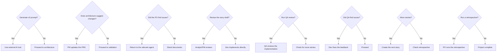
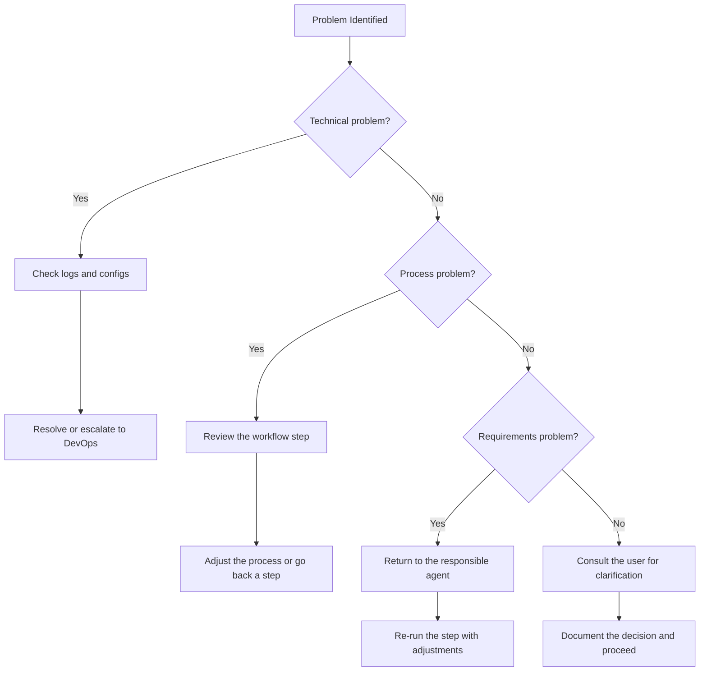

# Greenfield UI Workflow - Complete Guide

> **Workflow ID:** `greenfield-ui`
> **Type:** Greenfield
> **Version:** 1.0
> **Last Updated:** 2026-02-04

## Overview

The **Greenfield UI** workflow is the orchestrated flow for developing frontend applications from scratch (greenfield). It covers the entire lifecycle from conception to implementation, supporting both comprehensive planning for complex UIs and rapid prototyping for simple interfaces.

### Supported Project Types

| Type | Description |
|------|-------------|
| `spa` | Single Page Applications |
| `mobile-app` | Mobile applications |
| `micro-frontend` | Micro-frontends |
| `static-site` | Static sites |
| `ui-prototype` | UI prototypes |
| `simple-interface` | Simple interfaces |

### When to Use This Workflow

- Building production frontend applications
- Multiple views/pages with complex interactions
- Need for comprehensive UI/UX design and testing
- Multiple team members involved
- Long-term maintenance expected
- Customer-facing applications

---

## Workflow Diagram

### Main Flow



### Color Legend

| Color | Meaning |
|-------|---------|
| Orange (`#FFE4B5`) | Document Creation |
| Light Blue (`#ADD8E6`) | Development Cycle |
| Lavender (`#E6E6FA`) | AI Generation (Optional) |
| Yellow (`#F0E68C`) | Review/Validation (Optional) |
| Green (`#90EE90`) | Completion |

---

## Sequence Diagram



---

## Detailed Steps

### Phase 1: Planning and Specification

#### Step 1: Project Brief Creation

| Attribute | Value |
|-----------|-------|
| **Agent** | `@analyst` (Sirius) |
| **Command** | `*create-project-brief` |
| **Task** | `create-doc.md` + `project-brief-tmpl.yaml` |
| **Creates** | `project-brief.md` |
| **Optional Steps** | `brainstorming_session`, `market_research_prompt` |

**Description:** The Analyst facilitates the initial ideation, conducts optional market research and creates the project brief that serves as the foundation for all development.

**Input:**
- User's vision for the project
- Market context
- Known constraints

**Output:**
- `docs/project-brief.md` - Complete project brief

**Handoff Prompt:**
> "Project brief is complete. Save it as docs/project-brief.md in your project, then create the PRD."

---

#### Step 2: PRD Creation

| Attribute | Value |
|-----------|-------|
| **Agent** | `@pm` (Janus) |
| **Command** | `*create-prd` |
| **Task** | `create-doc.md` + `prd-tmpl.yaml` |
| **Requires** | `project-brief.md` |
| **Creates** | `prd.md` |

**Description:** The Product Manager turns the brief into a detailed Product Requirements Document (PRD) focused on UI/frontend requirements.

**Input:**
- `project-brief.md`
- Stakeholder feedback

**Output:**
- `docs/prd.md` - Complete PRD with epics and stories

**Handoff Prompt:**
> "PRD is ready. Save it as docs/prd.md in your project, then create the UI/UX specification."

---

#### Step 3: Frontend Specification

| Attribute | Value |
|-----------|-------|
| **Agent** | `@ux-expert` (Iris) |
| **Command** | `*create-front-end-spec` |
| **Task** | `create-doc.md` + `front-end-spec-tmpl.yaml` |
| **Requires** | `prd.md` |
| **Creates** | `front-end-spec.md` |
| **Optional Steps** | `user_research_prompt` |

**Description:** The UX Expert creates the detailed UI/UX specification, including wireframes, interaction flows and the design system.

**Input:**
- `prd.md`
- User research (optional)

**Output:**
- `docs/front-end-spec.md` - Complete frontend specification

---

#### Step 4: AI Prompt Generation (Optional)

| Attribute | Value |
|-----------|-------|
| **Agent** | `@ux-expert` (Iris) |
| **Command** | `*generate-ui-prompt` |
| **Task** | `generate-ai-frontend-prompt.md` |
| **Requires** | `front-end-spec.md` |
| **Creates** | `v0_prompt` |
| **Condition** | `user_wants_ai_generation` |

**Description:** Generates prompts optimized for UI generation tools such as v0, Lovable, or similar.

**Input:**
- `front-end-spec.md`
- Style preferences

**Output:**
- Prompt formatted for the AI tool
- The user generates the UI externally and downloads the project structure

---

#### Step 5: Frontend Architecture

| Attribute | Value |
|-----------|-------|
| **Agent** | `@architect` (Vega) |
| **Command** | `*create-front-end-architecture` |
| **Task** | `create-doc.md` + `front-end-architecture-tmpl.yaml` |
| **Requires** | `front-end-spec.md` |
| **Creates** | `front-end-architecture.md` |
| **Optional Steps** | `technical_research_prompt`, `review_generated_ui_structure` |

**Description:** The Architect creates the frontend's technical architecture, including stack decisions, patterns and component structure.

**Input:**
- `front-end-spec.md`
- Structure generated by v0/Lovable (if applicable)

**Output:**
- `docs/front-end-architecture.md` - Complete technical architecture

**Handoff Prompt:**
> "Frontend architecture complete. Save it as docs/front-end-architecture.md. Do you suggest any changes to the PRD stories or need new stories added?"

---

### Phase 2: Validation and Adjustments

#### Step 6: PRD Update (Conditional)

| Attribute | Value |
|-----------|-------|
| **Agent** | `@pm` (Janus) |
| **Command** | `*create-prd` (update) |
| **Requires** | `front-end-architecture.md` |
| **Updates** | `prd.md` |
| **Condition** | `architecture_suggests_prd_changes` |

**Description:** If the Architect suggests changes to the stories or new requirements, the PM updates the PRD.

**Input:**
- Architect's suggestions
- Current PRD

**Output:**
- Updated `docs/prd.md`

---

#### Step 7: PO Validation

| Attribute | Value |
|-----------|-------|
| **Agent** | `@po` (Themis) |
| **Command** | `*execute-checklist-po` |
| **Task** | `execute-checklist.md` + `po-master-checklist.md` |
| **Validates** | All artifacts |

**Description:** The Product Owner validates the consistency and completeness of every document created.

**Input:**
- `project-brief.md`
- `prd.md`
- `front-end-spec.md`
- `front-end-architecture.md`

**Output:**
- PASS validation or list of issues

**Prompt when issues are found:**
> "PO found issues with [document]. Please return to [agent] to fix and re-save the updated document."

---

#### Step 8: Document Sharding

| Attribute | Value |
|-----------|-------|
| **Agent** | `@po` (Themis) |
| **Command** | `*shard-doc` |
| **Task** | `shard-doc.md` |
| **Requires** | All validated artifacts |
| **Creates** | `sharded_docs` |

**Description:** Shards large documents into smaller parts to make development in the IDE easier.

**Execution Options:**
- **Option A:** Use the PO agent: `@po`, then ask it to shard `docs/prd.md`
- **Option B:** Manual: Drag the `shard-doc` task + `docs/prd.md` into the chat

**Output:**
- `docs/prd/` - Sharded PRD
- `docs/architecture/` - Sharded architecture

---

### Phase 3: Development

#### Step 9: Story Creation

| Attribute | Value |
|-----------|-------|
| **Agent** | `@sm` (Chronos) |
| **Command** | `*draft` |
| **Task** | `create-next-story.md` |
| **Requires** | `sharded_docs` |
| **Creates** | `story.md` |
| **Repeats** | For each epic |

**Description:** The Scrum Master creates detailed stories from the sharded documents.

**Creation Cycle:**
1. SM Agent (New Session): `@sm` → `*draft`
2. Creates the next story from the sharded docs
3. The story starts with status "Draft"

**Input:**
- Sharded documents
- Sprint context

**Output:**
- `docs/stories/epic-X/story-X.Y.md` - Story in Draft

---

#### Step 10: Draft Review (Optional)

| Attribute | Value |
|-----------|-------|
| **Agent** | `@analyst` or `@pm` |
| **Command** | `*review` (coming soon) |
| **Updates** | `story.md` |
| **Condition** | `user_wants_story_review` |
| **Optional** | Yes |

**Description:** Optional review of the draft to ensure completeness and alignment.

**Actions:**
- Review the story's completeness
- Verify alignment with the PRD
- Update status: Draft → Approved

---

#### Step 11: Implementation

| Attribute | Value |
|-----------|-------|
| **Agent** | `@dev` (Vulcan) |
| **Command** | `*develop` |
| **Task** | `dev-develop-story.md` |
| **Requires** | `story.md` (approved) |
| **Creates** | Implementation files |

**Description:** The Developer implements the story following the defined requirements and tasks.

**Implementation Cycle:**
1. Dev Agent (New Session): `@dev`
2. Implements the approved story
3. Updates the File List with every change
4. Marks the story as "Review" when complete

**Input:**
- Approved story
- Reference architecture

**Output:**
- Implemented code
- Tests
- Story updated with the File List

---

#### Step 12: QA Review (Optional)

| Attribute | Value |
|-----------|-------|
| **Agent** | `@qa` (Argus) |
| **Command** | `*review` |
| **Task** | `review-story.md` |
| **Requires** | Implemented files |
| **Updates** | Implementation |
| **Optional** | Yes |

**Description:** Senior dev review with refactoring capability.

**QA Cycle:**
1. QA Agent (New Session): `@qa` → `*review {story}`
2. Fixes small issues directly
3. Leaves a checklist for the remaining items
4. Updates status (Review → Done or stays in Review)

**Output:**
- Reviewed/refactored code
- Checklist of pending items (if any)
- QA Gate decision (PASS/CONCERNS/FAIL)

---

#### Step 13: QA Feedback Fixes (Conditional)

| Attribute | Value |
|-----------|-------|
| **Agent** | `@dev` (Vulcan) |
| **Command** | `*apply-qa-fixes` |
| **Task** | `apply-qa-fixes.md` |
| **Condition** | `qa_left_unchecked_items` |
| **Updates** | Implementation files |

**Description:** If QA left items unchecked, Dev fixes them and resubmits.

**Cycle:**
1. Dev Agent (New Session): Addresses the remaining items
2. Returns to QA for final approval

---

#### Step 14: Development Cycle

| Attribute | Value |
|-----------|-------|
| **Action** | Repeat the SM → Dev → QA cycle |
| **Condition** | Until every story in the PRD is complete |

**Description:** Repeats the story creation, implementation and review cycle for all stories.

---

### Phase 4: Wrap-Up

#### Step 15: Epic Retrospective (Optional)

| Attribute | Value |
|-----------|-------|
| **Agent** | `@po` (Themis) |
| **Command** | `*epic-retrospective` (coming soon) |
| **Condition** | `epic_complete` |
| **Creates** | `epic-retrospective.md` |
| **Optional** | Yes |

**Description:** After the epic is finished, validates that it was completed correctly and documents the lessons learned.

**Output:**
- `docs/retrospectives/epic-X-retrospective.md`
- Documented improvements

---

#### Step 16: Project Completion

| Attribute | Value |
|-----------|-------|
| **Action** | Project complete |

**Description:** All stories implemented and reviewed. The project's development phase is finished.

**Reference:** `.aexos-core/data/aexos-kb.md#IDE Development Workflow`

---

## Participating Agents

### Agent Table

| Agent | Name | Role | Main Commands |
|-------|------|------|---------------|
| `@analyst` | Sirius | Business Analyst | `*create-project-brief`, `*brainstorm`, `*research` |
| `@pm` | Janus | Product Manager | `*create-prd`, `*shard-prd`, `*create-epic` |
| `@ux-expert` | Iris | UX/UI Designer | `*create-front-end-spec`, `*generate-ui-prompt`, `*wireframe` |
| `@architect` | Vega | System Architect | `*create-front-end-architecture`, `*document-project` |
| `@po` | Themis | Product Owner | `*execute-checklist-po`, `*shard-doc`, `*validate-story-draft` |
| `@sm` | Chronos | Scrum Master | `*draft`, `*story-checklist` |
| `@dev` | Vulcan | Full Stack Developer | `*develop`, `*run-tests`, `*apply-qa-fixes` |
| `@qa` | Argus | Test Architect | `*review`, `*gate`, `*test-design` |

### Agent Collaboration Diagram

```mermaid
graph LR
    subgraph "Planning"
        AN[Sirius<br/>@analyst] --> PM[Janus<br/>@pm]
        PM --> UX[Iris<br/>@ux-expert]
        UX --> AR[Vega<br/>@architect]
    end

    subgraph "Validation"
        AR --> PM
        AR --> PO[Themis<br/>@po]
        PM --> PO
    end

    subgraph "Development"
        PO --> SM[Chronos<br/>@sm]
        SM --> DEV[Vulcan<br/>@dev]
        DEV --> QA[Argus<br/>@qa]
        QA --> DEV
    end

    PO -.-> SM
    SM -.-> PO

    style AN fill:#FFE4B5
    style PM fill:#FFE4B5
    style UX fill:#FFE4B5
    style AR fill:#FFE4B5
    style PO fill:#F0E68C
    style SM fill:#ADD8E6
    style DEV fill:#ADD8E6
    style QA fill:#F0E68C
```

---

## Tasks Executed

### By Phase

#### Phase 1: Planning

| Task | Agent | Template | Description |
|------|-------|----------|-------------|
| `create-doc.md` | @analyst | `project-brief-tmpl.yaml` | Create the project brief |
| `create-deep-research-prompt.md` | @analyst | - | Market research |
| `facilitate-brainstorming-session.md` | @analyst | `brainstorming-output-tmpl.yaml` | Brainstorming session |
| `create-doc.md` | @pm | `prd-tmpl.yaml` | Create the PRD |
| `create-doc.md` | @ux-expert | `front-end-spec-tmpl.yaml` | Frontend specification |
| `generate-ai-frontend-prompt.md` | @ux-expert | - | Prompt for v0/Lovable |
| `create-doc.md` | @architect | `front-end-architecture-tmpl.yaml` | Frontend architecture |

#### Phase 2: Validation

| Task | Agent | Checklist | Description |
|------|-------|-----------|-------------|
| `execute-checklist.md` | @po | `po-master-checklist.md` | Validate artifacts |
| `shard-doc.md` | @po | - | Shard documents |

#### Phase 3: Development

| Task | Agent | Description |
|------|-------|-------------|
| `create-next-story.md` | @sm | Create the next story |
| `execute-checklist.md` | @sm | Story draft checklist |
| `dev-develop-story.md` | @dev | Implement the story |
| `apply-qa-fixes.md` | @dev | Apply QA fixes |
| `review-story.md` | @qa | Review the implementation |
| `qa-gate.md` | @qa | Quality gate decision |

---

## Prerequisites

### Before Starting the Workflow

1. **Configured Environment**
   - Node.js 18+ installed
   - Git configured
   - Package manager (npm/yarn/pnpm)

2. **AEXOS-Core Available**
   - Templates in `.aexos-core/development/templates/`
   - Tasks in `.aexos-core/development/tasks/`
   - Checklists in `.aexos-core/development/checklists/`

3. **Project Structure**
   - `docs/` directory created
   - `docs/stories/` directory created

4. **Research Tools (Optional)**
   - EXA MCP configured for web research
   - Context7 for library documentation

---

## Inputs and Outputs

### Data Flow Diagram



### Input and Output Matrix by Step

| Step | Input | Output | Location |
|------|-------|--------|----------|
| 1 | User's vision | `project-brief.md` | `docs/project-brief.md` |
| 2 | `project-brief.md` | `prd.md` | `docs/prd.md` |
| 3 | `prd.md` | `front-end-spec.md` | `docs/front-end-spec.md` |
| 4 | `front-end-spec.md` | v0 prompt | (external) |
| 5 | `front-end-spec.md` | `front-end-architecture.md` | `docs/front-end-architecture.md` |
| 6 | Architecture suggestions | updated `prd.md` | `docs/prd.md` |
| 7 | All artifacts | Validation | - |
| 8 | Validated artifacts | Sharded docs | `docs/prd/`, `docs/architecture/` |
| 9 | Sharded docs | `story.md` | `docs/stories/epic-X/` |
| 11 | `story.md` | Code + Tests | `src/`, `tests/` |
| 12 | Implementation | QA Gate | `docs/qa/gates/` |

---

## Decision Points

### Decision Diagram



### Description of the Decision Points

| Point | Condition | Yes Path | No Path |
|-------|-----------|----------|---------|
| D1 | User wants AI generation | UX generates the prompt, user uses v0/Lovable | Proceeds to architecture |
| D2 | Architecture requires changes | PM updates the PRD | Proceeds to PO validation |
| D3 | PO finds inconsistencies | Returns to the agent for the fix | Shards documents |
| D4 | User wants to review the draft | Analyst/PM validates the story | Dev implements directly |
| D5 | QA review desired | QA runs a complete review | Checks the next stories |
| D6 | QA identified issues | Dev fixes and resubmits | Proceeds to the next story |
| D7 | More stories exist | Creates the next story in the cycle | Checks retrospective |
| D8 | Retrospective desired | PO documents the lessons learned | Project finished |

---

## Troubleshooting

### Common Problems and Solutions

#### Planning Phase

| Problem | Likely Cause | Solution |
|---------|--------------|----------|
| Incomplete brief | Missing information from the user | Run `*brainstorm` or `*elicit` beforehand |
| PRD too generic | Insufficient brief | Return to the Analyst to enrich the brief |
| Spec without UX detail | Vague requirements in the PRD | The PM must detail user journeys in the PRD |

#### Validation Phase

| Problem | Likely Cause | Solution |
|---------|--------------|----------|
| PO rejects the artifacts | Inconsistency between docs | Use po-master-checklist to identify gaps |
| Too many fix iterations | Lack of initial alignment | Ensure cross-review before the PO |
| Sharding fails | Poorly structured documents | Check the markdown formatting of the docs |

#### Development Phase

| Problem | Likely Cause | Solution |
|---------|--------------|----------|
| Story too large | Poorly defined epics | The PM must break the epic into smaller stories |
| Dev blocked | Ambiguous story | The SM must refine the story with more detail |
| QA rejects repeatedly | Lack of tests | Dev must include tests before marking it complete |
| Infinite Dev-QA loop | Changing requirements | Freeze the story scope before implementing |

#### Technical Problems

| Problem | Likely Cause | Solution |
|---------|--------------|----------|
| Templates not found | Incorrect path | Check `.aexos-core/development/templates/` |
| Agent does not activate | Malformed YAML | Validate the agent file's syntax |
| Checklists fail | Missing dependencies | Check `dependencies` in the agent |

### Escalation Flow



---

## References

### Workflow Files

| File | Path |
|------|------|
| Workflow Definition | `.aexos-core/development/workflows/greenfield-ui.yaml` |
| Knowledge Base | `.aexos-core/data/aexos-kb.md` |

### Agents

| Agent | Path |
|-------|------|
| @analyst | `.aexos-core/development/agents/analyst.md` |
| @pm | `.aexos-core/development/agents/pm.md` |
| @ux-expert | `.aexos-core/development/agents/ux-design-expert.md` |
| @architect | `.aexos-core/development/agents/architect.md` |
| @po | `.aexos-core/development/agents/po.md` |
| @sm | `.aexos-core/development/agents/sm.md` |
| @dev | `.aexos-core/development/agents/dev.md` |
| @qa | `.aexos-core/development/agents/qa.md` |

### Main Templates

| Template | Path |
|----------|------|
| Project Brief | `.aexos-core/development/templates/project-brief-tmpl.yaml` |
| PRD | `.aexos-core/development/templates/prd-tmpl.yaml` |
| Frontend Spec | `.aexos-core/development/templates/front-end-spec-tmpl.yaml` |
| Frontend Architecture | `.aexos-core/development/templates/front-end-architecture-tmpl.yaml` |
| Story | `.aexos-core/development/templates/story-tmpl.yaml` |

### Checklists

| Checklist | Path |
|-----------|------|
| PO Master | `.aexos-core/development/checklists/po-master-checklist.md` |
| Story Draft | `.aexos-core/development/checklists/story-draft-checklist.md` |
| Story DoD | `.aexos-core/development/checklists/story-dod-checklist.md` |

### Related Documentation

- [AEXOS Knowledge Base](.aexos-core/data/aexos-kb.md) - Central knowledge base
- [Brownfield Workflow](./BROWNFIELD-WORKFLOW.md) - Workflow for existing projects (if available)

---

## Version History

| Version | Date | Author | Changes |
|---------|------|--------|---------|
| 1.0 | 2026-02-04 | Documentation Specialist | Initial version of the guide |

---

*Document generated automatically from `.aexos-core/development/workflows/greenfield-ui.yaml`*
