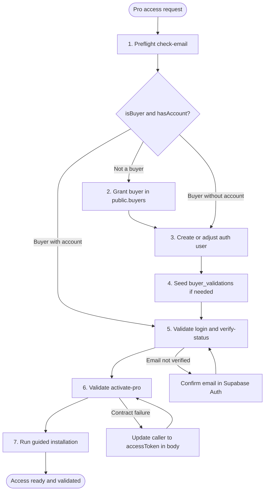

# Workflow: Pro Access Grant

**Version:** 1.0
**Type:** Operations
**Author:** Vulcan + validated with live AEXOS Pro flow
**Creation Date:** 2026-04-20
**Tags:** pro, support, devops, supabase, vercel, installer

---

## Overview

The **Pro Access Grant** workflow standardizes granting or restoring AEXOS Pro access for an end user, covering:

- entitlement and account preflight
- buyer grant
- creating or adjusting the account in Supabase Auth
- direct API validation
- final validation through the guided installer

### Objective

Allow `@devops` to run Pro access support the same way every time, with objective evidence and without manual rediscovering.

### When to use

- user requested Pro access creation
- user requested a Pro password reset
- user reported having purchased but `check-email` does not recognize it
- user already has an account but activation does not complete

### When not to use

- product bug outside the licensing flow
- legacy license key request without email auth

---

## Main Flow

---

## Detailed Steps

### Step 1: Preflight

| Field | Value |
|-------|-------|
| **ID** | `preflight` |
| **Agent** | `@devops` |
| **Action** | Run `POST /api/v1/auth/check-email` |

#### Expected output

- `isBuyer=true|false`
- `hasAccount=true|false`

#### Decision

- if `isBuyer=false`: go to `grant-buyer`
- if `hasAccount=false`: go to `create-account`
- if both are `true`: go to `api-verify`

### Step 2: Grant Buyer

| Field | Value |
|-------|-------|
| **ID** | `grant-buyer` |
| **Agent** | `@devops` |
| **Action** | Upsert into `public.buyers` |

#### Rules

- email always in lowercase
- `is_active=true`
- `source='manual_support'`

### Step 3: Create Account

| Field | Value |
|-------|-------|
| **ID** | `create-account` |
| **Agent** | `@devops` |
| **Action** | Create or adjust the user in Supabase Auth |

#### Rules

- set the password requested by support
- mark the email as confirmed
- do not create a duplicate user

### Step 4: Seed Local Fallback

| Field | Value |
|-------|-------|
| **ID** | `seed-local-fallback` |
| **Agent** | `@devops` |
| **Action** | Upsert into `public.buyer_validations` |

#### When to run

- unstable buyer RPC
- grant too recent, not yet reflected in the preflight

### Step 5: API Verify

| Field | Value |
|-------|-------|
| **ID** | `api-verify` |
| **Agent** | `@devops` |
| **Action** | Validate `login` and `verify-status` |

#### Pass criteria

- `login` returns `accessToken`
- `verify-status` returns `emailVerified=true`

### Step 6: Activate Pro

| Field | Value |
|-------|-------|
| **ID** | `activate-pro` |
| **Agent** | `@devops` |
| **Action** | Validate `POST /api/v1/auth/activate-pro` |

#### Pass criteria

- `201` with `licenseKey` on the first grant
- or `200` with idempotent restoration on reinstall

### Step 7: Guided Install Validation

| Field | Value |
|-------|-------|
| **ID** | `guided-install-validation` |
| **Agent** | `@devops` |
| **Action** | Run the guided installer as the user |

#### Mandatory validation

- source checkout path
- packaged tarball path

#### Pass criteria

- Pro installed
- installer final verification green
- `.claude/skills`, `.claude/commands` and `.codex/skills` present

---

## Inputs

- `target_email`
- `target_password`
- `reset_password` (boolean)
- `run_guided_validation` (boolean, default: `true` when there was a code change)

---

## Outputs

- entitlement confirmed
- account created or updated
- email confirmed
- Pro activated or restored
- API and installer evidence

---

## Preconditions

- access to the Supabase project `evvvnarpwcdybxdvcwjh`
- access to the Vercel project `aexos-license-server`
- operator knows whether the request includes password creation or restoration only

---

## Acceptance Criteria

- `check-email` ends with `isBuyer=true` and `hasAccount=true`
- `login` returns a valid token
- `verify-status` returns email verified
- `activate-pro` returns success
- guided installation passes on the source path and on the tarball path when there is a code change
- support closes the case with evidence without exposing full tokens or license keys

---

## Source Of Truth

- `docs/guides/pro/access-grant-ops-playbook.md`
- `.aexos-core/development/tasks/devops-pro-access-grant.md`
- `docs/stories/PRO-11.1-auth-contract-hardening-and-pro-access-ops.md`
