# Spec Pipeline Workflow - Complete Documentation

> **Version:** 1.0
> **Created:** 2026-01-28
> **Author:** @architect (Vega)
> **Epic:** Epic 3 - Spec Pipeline
> **Status:** Active

---

## 1. Overview

The **Spec Pipeline** is an orchestrated workflow that turns informal requirements into executable specifications. It is part of the **Auto-Claude ADE** (Autonomous Development Engine) infrastructure and implements a flow of 5 main phases that adapt dynamically based on the complexity of the requirement.

### 1.1 Purpose

- Turn informal user descriptions into formal, structured specifications
- Ensure quality and consistency through validation gates
- Adapt the level of depth based on the detected complexity
- Produce artifacts that are traceable from requirements through to implementation

### 1.2 Core Principles

| Principle | Description |
|-----------|-----------|
| **No Invention** | No invented information - only derivation from the inputs |
| **Traceability** | Every statement must trace back to a requirement or research finding |
| **Adaptive Phases** | Phases adjusted automatically by complexity |
| **Quality Gates** | Mandatory validation before moving forward |

---

## 2. Workflow Diagram

### 2.1 Main Flow

```mermaid
flowchart TB
    subgraph TRIGGER["Triggers"]
        T1["*create-spec STORY-ID"]
        T2["story_created<br/>(autoSpec.enabled)"]
    end

    subgraph PREFLIGHT["Pre-Flight Checks"]
        PF1["story_exists<br/>Check/create the directory"]
        PF2["no_existing_spec<br/>Avoid overwriting"]
        PF3["agents_available<br/>Check the configuration"]
    end

    subgraph PHASE1["Phase 1: Gather Requirements"]
        direction TB
        G1["@pm (Janus)"]
        G2["Interactive Elicitation<br/>9 question categories"]
        G3["requirements.json"]
        G1 --> G2 --> G3
    end

    subgraph PHASE2["Phase 2: Assess Complexity"]
        direction TB
        A1["@architect (Vega)"]
        A2["Assess 5 dimensions:<br/>Scope, Integration, Infra,<br/>Knowledge, Risk"]
        A3["complexity.json<br/>SIMPLE | STANDARD | COMPLEX"]
        A1 --> A2 --> A3
    end

    subgraph PHASE3["Phase 3: Research Dependencies"]
        direction TB
        R1["@analyst (Sirius)"]
        R2["Context7 + EXA<br/>Validate dependencies"]
        R3["research.json"]
        R1 --> R2 --> R3
    end

    subgraph PHASE4["Phase 4: Write Specification"]
        direction TB
        W1["@pm (Janus)"]
        W2["Generate spec.md<br/>No invention"]
        W3["spec.md"]
        W1 --> W2 --> W3
    end

    subgraph PHASE5["Phase 5: Critique Specification"]
        direction TB
        C1["@qa (Argus)"]
        C2["Assess 5 dimensions:<br/>Accuracy, Completeness,<br/>Consistency, Feasibility,<br/>Alignment"]
        C3{"Verdict"}
        C4["APPROVED"]
        C5["NEEDS_REVISION"]
        C6["BLOCKED"]
        C1 --> C2 --> C3
        C3 --> C4
        C3 --> C5
        C3 --> C6
    end

    subgraph PHASE5B["Phase 5b: Revise (COMPLEX)"]
        REV1["@pm (Janus)"]
        REV2["Apply feedback<br/>and auto-fixes"]
    end

    subgraph PHASE6["Phase 6: Create Plan"]
        direction TB
        P1["@architect (Vega)"]
        P2["Generate implementation.yaml<br/>Atomic subtasks"]
        P3["plan.json"]
        P1 --> P2 --> P3
    end

    subgraph COMPLETION["Completion"]
        DONE["Pipeline Complete"]
        ARTIFACTS["Generated Artifacts"]
    end

    T1 --> PREFLIGHT
    T2 --> PREFLIGHT
    PREFLIGHT --> PHASE1
    PHASE1 --> PHASE2
    PHASE2 --> PHASE3
    PHASE3 --> PHASE4
    PHASE4 --> PHASE5
    C4 --> PHASE6
    C5 --> PHASE5B
    PHASE5B --> PHASE5
    C6 -.-> |"Escalate to @architect"| HALT["HALT"]
    PHASE6 --> COMPLETION

    style TRIGGER fill:#e1f5fe
    style PREFLIGHT fill:#fff3e0
    style PHASE1 fill:#e8f5e9
    style PHASE2 fill:#fce4ec
    style PHASE3 fill:#f3e5f5
    style PHASE4 fill:#e8f5e9
    style PHASE5 fill:#fff8e1
    style PHASE5B fill:#ffebee
    style PHASE6 fill:#e0f2f1
    style COMPLETION fill:#c8e6c9
```

### 2.2 Flow by Complexity

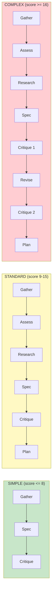

### 2.3 Sequence Diagram

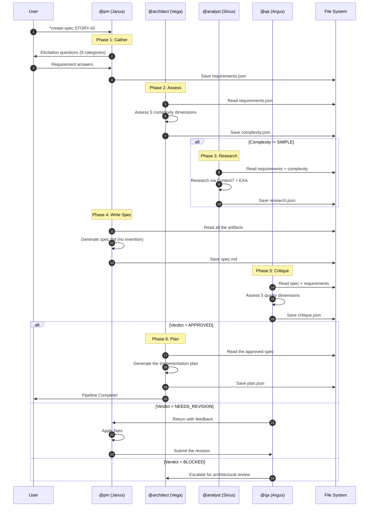

---

## 3. Detailed Steps

### 3.1 Phase 1: Gather Requirements

| Attribute | Value |
|----------|-------|
| **Step ID** | `gather` |
| **Phase Number** | 1 |
| **Agent** | @pm (Janus) |
| **Task** | `spec-gather-requirements.md` |
| **Elicit** | Yes - requires user interaction |

#### Inputs

| Input | Type | Required | Description |
|-------|------|-------------|-----------|
| `storyId` | string | Yes | ID of the story being specified |
| `source` | enum | No | Source: `prd`, `user`, `existing` |
| `prdPath` | string | No | Path to the PRD if source=prd |

#### Outputs

| Output | Location |
|--------|-------------|
| `requirements.json` | `docs/stories/{storyId}/spec/requirements.json` |

#### Elicitation Process (9 Categories)

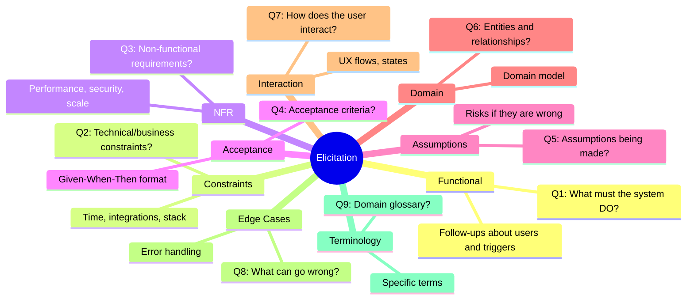

#### Output Structure (requirements.json)

```json
{
  "storyId": "STORY-42",
  "gatheredAt": "2026-01-28T10:00:00Z",
  "source": "user",
  "gatheredBy": "@pm",
  "elicitationVersion": "2.0",
  "functional": [
    {
      "id": "FR-1",
      "description": "Allow login with Google OAuth",
      "priority": "P0",
      "rationale": "Primary authentication method",
      "acceptance": ["AC-1"]
    }
  ],
  "nonFunctional": [...],
  "constraints": [...],
  "assumptions": [...],
  "domainModel": [...],
  "interactions": [...],
  "edgeCases": [...],
  "terminology": [...],
  "openQuestions": [...]
}
```

---

### 3.2 Phase 2: Assess Complexity

| Attribute | Value |
|----------|-------|
| **Step ID** | `assess` |
| **Phase Number** | 2 |
| **Agent** | @architect (Vega) |
| **Task** | `spec-assess-complexity.md` |
| **Skip Condition** | `source === 'simple'` OR `overrideComplexity === 'SIMPLE'` |

#### Inputs

| Input | Type | Required | Description |
|-------|------|-------------|-----------|
| `storyId` | string | Yes | Story ID |
| `requirements` | file | Yes | requirements.json |
| `overrideComplexity` | enum | No | Manual override: SIMPLE, STANDARD, COMPLEX |

#### Outputs

| Output | Location |
|--------|-------------|
| `complexity.json` | `docs/stories/{storyId}/spec/complexity.json` |

#### 5 Complexity Dimensions

```mermaid
radar
    title Complexity Dimensions (1-5)
    "Scope" : 3
    "Integration" : 4
    "Infrastructure" : 2
    "Knowledge" : 3
    "Risk" : 3
```

| Dimension | Score 1 | Score 3 | Score 5 |
|----------|---------|---------|---------|
| **Scope** | 1-2 files | 6-10 files | 20+ files |
| **Integration** | No external ones | 1-2 external APIs | Multiple orchestration |
| **Infrastructure** | No changes | New dependency | New infrastructure |
| **Knowledge** | Existing patterns | New library | Unknown domain |
| **Risk** | Low, isolated | Medium, important | Critical, system core |

#### Classification Thresholds

| Classification | Total Score | Phases Enabled | Estimated Time |
|---------------|-------------|----------------|----------------|
| **SIMPLE** | <= 8 | gather, spec, critique | 30-60 min |
| **STANDARD** | 9-15 | gather, assess, research, spec, critique, plan | 2-4 hours |
| **COMPLEX** | >= 16 | + revise, critique_2 | 4-8 hours |

---

### 3.3 Phase 3: Research Dependencies

| Attribute | Value |
|----------|-------|
| **Step ID** | `research` |
| **Phase Number** | 3 |
| **Agent** | @analyst (Sirius) |
| **Task** | `spec-research-dependencies.md` |
| **Skip Condition** | `complexity.result === 'SIMPLE'` |
| **Tools** | Context7, EXA |

#### Inputs

| Input | Type | Required | Description |
|-------|------|-------------|-----------|
| `storyId` | string | Yes | Story ID |
| `requirements` | file | Yes | requirements.json |
| `complexity` | file | Yes | complexity.json |

#### Outputs

| Output | Location |
|--------|-------------|
| `research.json` | `docs/stories/{storyId}/spec/research.json` |

#### Research Flow

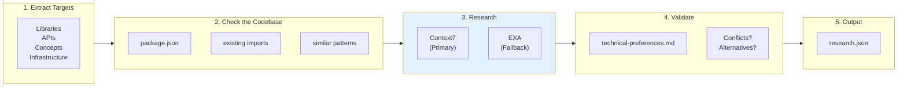

#### Tool Priority

| Tool | Priority | Timeout | Use |
|------------|------------|---------|-----|
| **Context7** | 1 (primary) | 30s | Library documentation |
| **EXA** | 2 (fallback) | - | General web research |
| **Codebase** | - | - | Check existing implementations |

---

### 3.4 Phase 4: Write Specification

| Attribute | Value |
|----------|-------|
| **Step ID** | `spec` |
| **Phase Number** | 4 |
| **Agent** | @pm (Janus) |
| **Task** | `spec-write-spec.md` |
| **Constitutional Gate** | Article IV - No Invention |

#### Inputs

| Input | Type | Required | Description |
|-------|------|-------------|-----------|
| `storyId` | string | Yes | Story ID |
| `requirements` | file | Yes | requirements.json |
| `complexity` | file | No | complexity.json |
| `research` | file | No | research.json |

#### Outputs

| Output | Location |
|--------|-------------|
| `spec.md` | `docs/stories/{storyId}/spec/spec.md` |

#### Constitutional Gate: No Invention

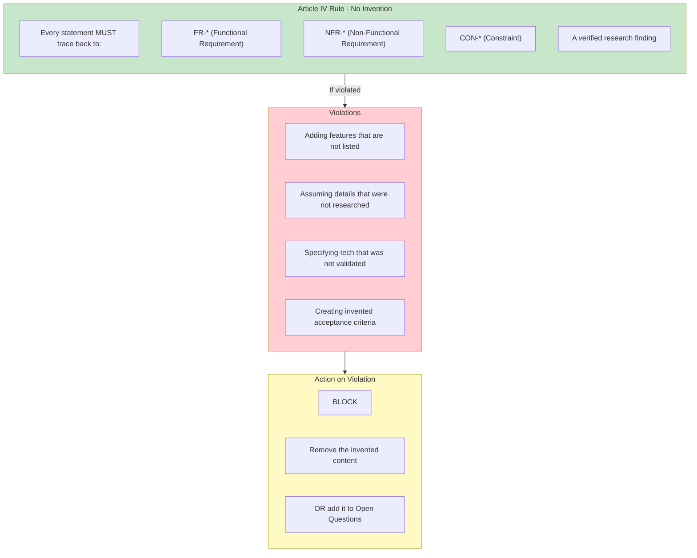

#### spec.md Structure

```
1. Overview
   1.1 Goals
   1.2 Non-Goals
2. Requirements Summary
   2.1 Functional Requirements
   2.2 Non-Functional Requirements
   2.3 Constraints
3. Technical Approach
   3.1 Architecture Overview
   3.2 Component Design
   3.3 Data Flow
4. Dependencies
   4.1 External Dependencies
   4.2 Internal Dependencies
5. Files to Modify/Create
   5.1 New Files
   5.2 Modified Files
6. Testing Strategy
   6.1 Unit Tests
   6.2 Integration Tests
   6.3 Acceptance Tests (Given-When-Then)
7. Risks & Mitigations
8. Open Questions
9. Implementation Checklist
```

---

### 3.5 Phase 5: Critique Specification

| Attribute | Value |
|----------|-------|
| **Step ID** | `critique` |
| **Phase Number** | 5 |
| **Agent** | @qa (Argus) |
| **Task** | `spec-critique.md` |
| **Gate** | Blocking (APPROVED/NEEDS_REVISION/BLOCKED) |

#### Inputs

| Input | Type | Required | Description |
|-------|------|-------------|-----------|
| `storyId` | string | Yes | Story ID |
| `spec` | file | Yes | spec.md |
| `requirements` | file | Yes | requirements.json |
| `complexity` | file | No | complexity.json |
| `research` | file | No | research.json |

#### Outputs

| Output | Location |
|--------|-------------|
| `critique.json` | `docs/stories/{storyId}/spec/critique.json` |

#### 5 Quality Dimensions

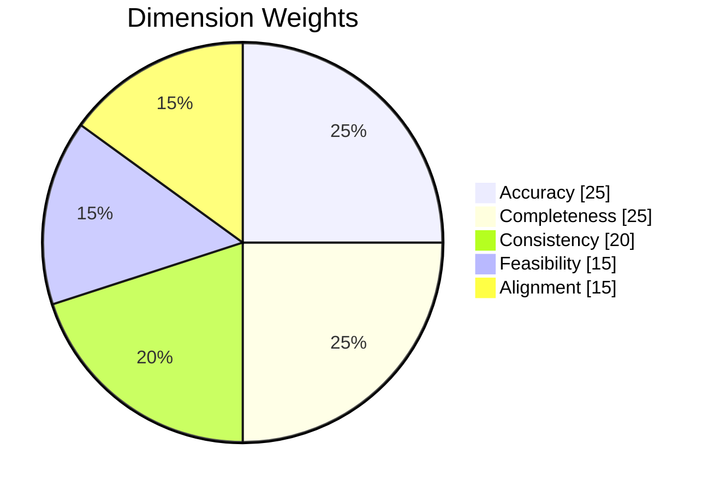

| Dimension | Weight | Checks |
|----------|------|----------|
| **Accuracy** | 25% | Does the spec reflect the requirements correctly? |
| **Completeness** | 25% | Are all sections filled in? Do the tests cover the FRs? |
| **Consistency** | 20% | Are the IDs valid? Any contradictions? |
| **Feasibility** | 15% | Is it technically possible? Do the dependencies exist? |
| **Alignment** | 15% | Is it aligned with the project stack and patterns? |

#### Verdict Logic

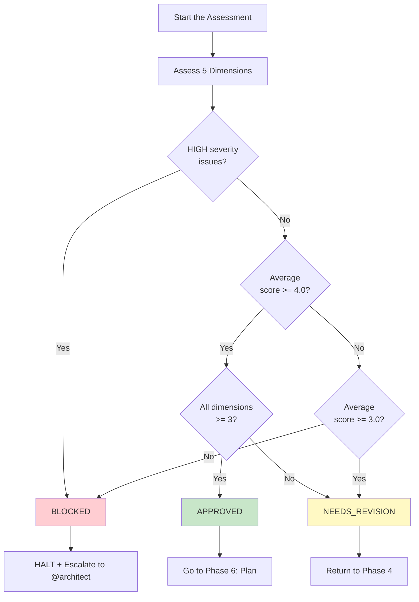

| Verdict | Condition | Next Action |
|---------|----------|--------------|
| **APPROVED** | No HIGH issues, avg >= 4.0, all >= 3 | Go to Plan |
| **NEEDS_REVISION** | MEDIUM issues OR avg 3.0-3.9 | Return to Spec Write |
| **BLOCKED** | HIGH issues OR avg < 3.0 OR any <= 1 | Escalate to @architect |

---

### 3.6 Phase 5b: Revise Specification

| Attribute | Value |
|----------|-------|
| **Step ID** | `revise` |
| **Phase Number** | 5b |
| **Agent** | @pm (Janus) |
| **Condition** | `complexity.result === 'COMPLEX'` OR `critique.verdict === 'NEEDS_REVISION'` |

#### Inputs

| Input | Type | Required | Description |
|-------|------|-------------|-----------|
| `storyId` | string | Yes | Story ID |
| `spec` | file | Yes | Current spec.md |
| `critique` | file | Yes | critique.json with feedback |

#### Outputs

| Output | Location |
|--------|-------------|
| `spec.md` (updated) | `docs/stories/{storyId}/spec/spec.md` |

---

### 3.7 Phase 5c: Second Critique

| Attribute | Value |
|----------|-------|
| **Step ID** | `critique_2` |
| **Phase Number** | 5c |
| **Agent** | @qa (Argus) |
| **Task** | `spec-critique.md` |
| **Condition** | `complexity.result === 'COMPLEX'` |

> **Note:** The second critique is more lenient on MEDIUM issues if demonstrable improvement is present.

---

### 3.8 Phase 6: Create Implementation Plan

| Attribute | Value |
|----------|-------|
| **Step ID** | `plan` |
| **Phase Number** | 6 |
| **Agent** | @architect (Vega) |
| **Task** | `plan-create-implementation.md` |
| **Condition** | `critique.verdict === 'APPROVED'` |

#### Inputs

| Input | Type | Required | Description |
|-------|------|-------------|-----------|
| `storyId` | string | Yes | Story ID |
| `spec` | file | Yes | Approved spec.md |
| `complexity` | file | No | complexity.json |

#### Outputs

| Output | Location |
|--------|-------------|
| `plan.json` | `docs/stories/{storyId}/plan/implementation.yaml` |

#### Subtask Rules

| Rule | Description |
|-------|-----------|
| **Single Service** | 1 service per subtask (frontend, backend, database, infra) |
| **File Limit** | Maximum 3 files per subtask |
| **Verification Required** | Every subtask MUST have a defined verification |
| **Dependency Order** | Database > Backend > Frontend > Integration |

---

## 4. Participating Agents

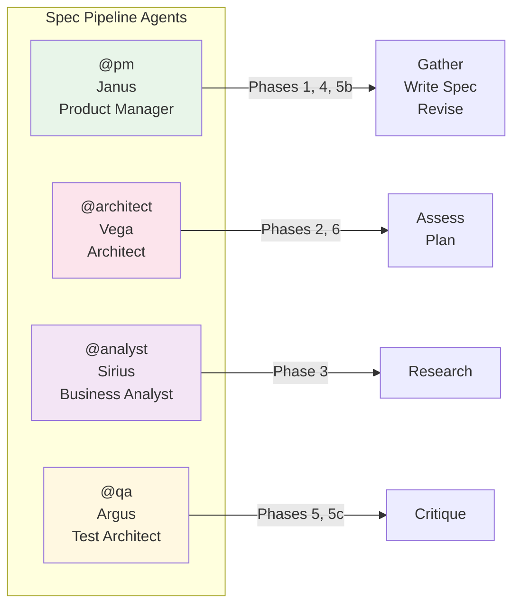

| Agent | ID | Name | Role in the Pipeline | Phases |
|--------|-----|------|-------------------|-------|
| @pm | pm | Janus | Product Manager | 1 (Gather), 4 (Spec), 5b (Revise) |
| @architect | architect | Vega | System Architect | 2 (Assess), 6 (Plan) |
| @analyst | analyst | Sirius | Business Analyst | 3 (Research) |
| @qa | qa | Argus | Test Architect | 5 (Critique), 5c (Critique 2) |

### 4.1 Profile: @pm (Janus)

- **Archetype:** Strategist
- **Focus:** Requirements gathering, specification creation, documentation
- **Principles:** User-focused, data-informed, clarity & precision
- **Tools:** PRD templates, structured elicitation

### 4.2 Profile: @architect (Vega)

- **Archetype:** Visionary
- **Focus:** Systems architecture, technical assessment, planning
- **Principles:** Holistic thinking, pragmatic selection, security at every layer
- **Tools:** Context7, EXA, codebase analysis

### 4.3 Profile: @analyst (Sirius)

- **Archetype:** Decoder
- **Focus:** Research, market analysis, dependency validation
- **Principles:** Curiosity-driven, evidence-based, action-oriented
- **Tools:** EXA, Context7, Google Workspace

### 4.4 Profile: @qa (Argus)

- **Archetype:** Guardian
- **Focus:** Quality validation, approval gates, traceability
- **Principles:** Requirements traceability, risk-based testing, advisory excellence
- **Tools:** CodeRabbit, Browser testing, spec analysis

---

## 5. Tasks Executed

| Task | Phase | Agent | File |
|------|------|--------|---------|
| Gather Requirements | 1 | @pm | `.aexos-core/development/tasks/spec-gather-requirements.md` |
| Assess Complexity | 2 | @architect | `.aexos-core/development/tasks/spec-assess-complexity.md` |
| Research Dependencies | 3 | @analyst | `.aexos-core/development/tasks/spec-research-dependencies.md` |
| Write Specification | 4 | @pm | `.aexos-core/development/tasks/spec-write-spec.md` |
| Critique Specification | 5, 5c | @qa | `.aexos-core/development/tasks/spec-critique.md` |
| Create Implementation Plan | 6 | @architect | `.aexos-core/development/tasks/plan-create-implementation.md` |

---

## 6. Prerequisites

### 6.1 Pre-Flight Checks

| Check | Description | Blocking |
|-------|-----------|----------|
| `story_exists` | The story directory exists or can be created | Yes |
| `no_existing_spec` | Check for an existing spec (avoid overwriting) | No (warning) |
| `agents_available` | The pipeline agents are configured | Yes |

### 6.2 Required Configuration

```yaml
config:
  autoSpec:
    enabled: false        # Enable auto-spec when a story is created
  showProgress: true      # Show progress
  verbose: true           # Detailed logs
  maxRetries: 2           # Attempts in case of failure
  retryDelay: 1000        # Delay between retries (ms)
  strictGate: true        # BLOCKED halts pipeline
  outputDir: docs/stories/{storyId}/spec/
```

---

## 7. Inputs and Outputs

### 7.1 Pipeline Inputs

| Input | Type | Description | Provided By |
|---------|------|-----------|---------------|
| `storyId` | string | Unique story ID | User |
| `source` | enum | `prd`, `user`, `existing` | User (optional) |
| `prdPath` | string | Path to an existing PRD | User (optional) |
| `overrideComplexity` | enum | Manual complexity override | User (optional) |

### 7.2 Pipeline Outputs

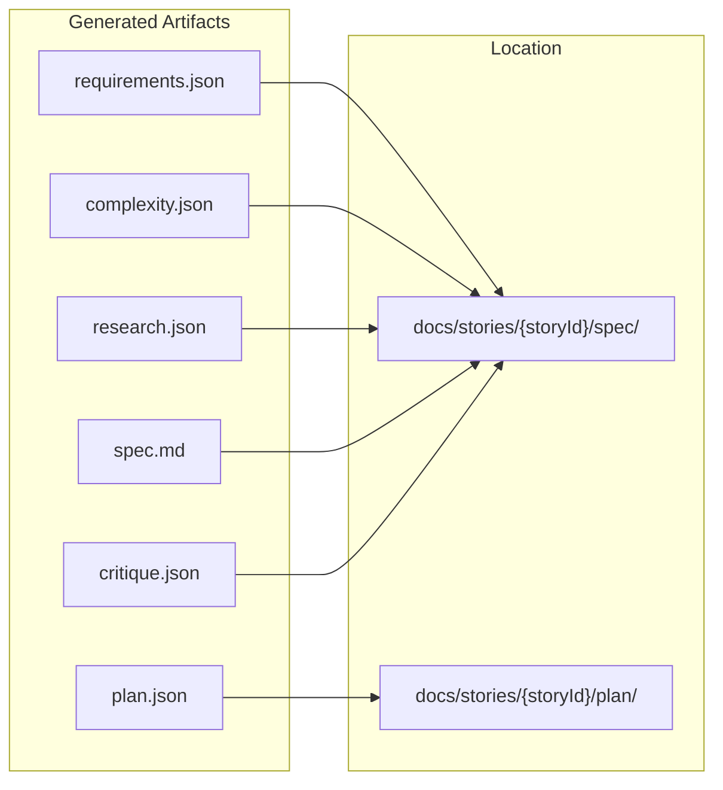

| Artifact | Phase | Description |
|----------|------|-----------|
| `requirements.json` | 1 | Structured requirements (9 categories) |
| `complexity.json` | 2 | Complexity assessment (5 dimensions) |
| `research.json` | 3 | Researched and validated dependencies |
| `spec.md` | 4 | Complete executable specification |
| `critique.json` | 5 | Result of the quality assessment |
| `plan.json` | 6 | Implementation plan with subtasks |

---

## 8. Decision Points

### 8.1 Decision: Skip Assess?

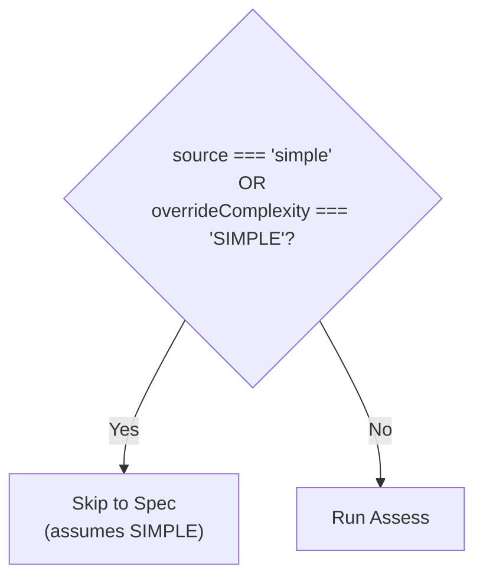

### 8.2 Decision: Skip Research?

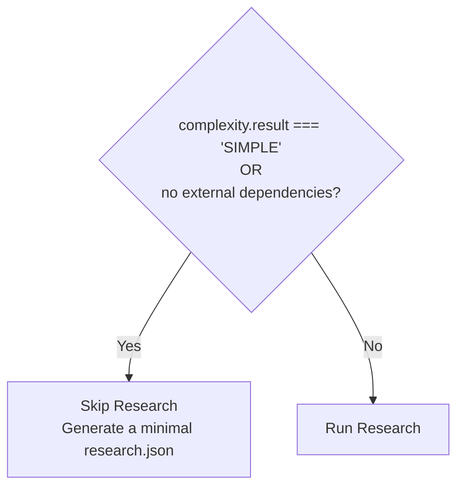

### 8.3 Decision: Critique Verdict

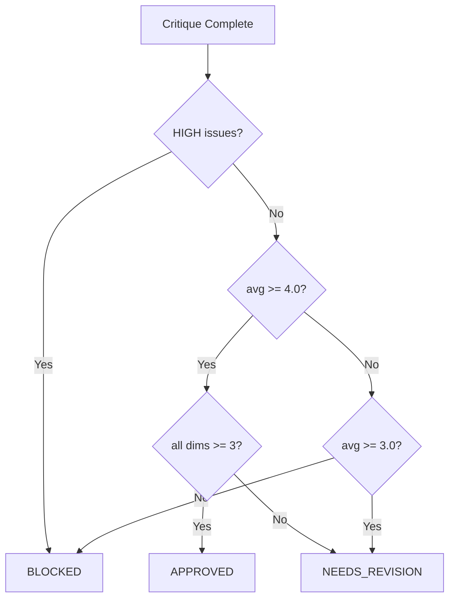

### 8.4 Decision: Run Revise?

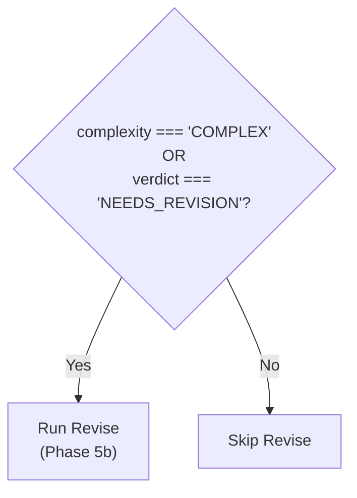

### 8.5 Decision: Second Critique?

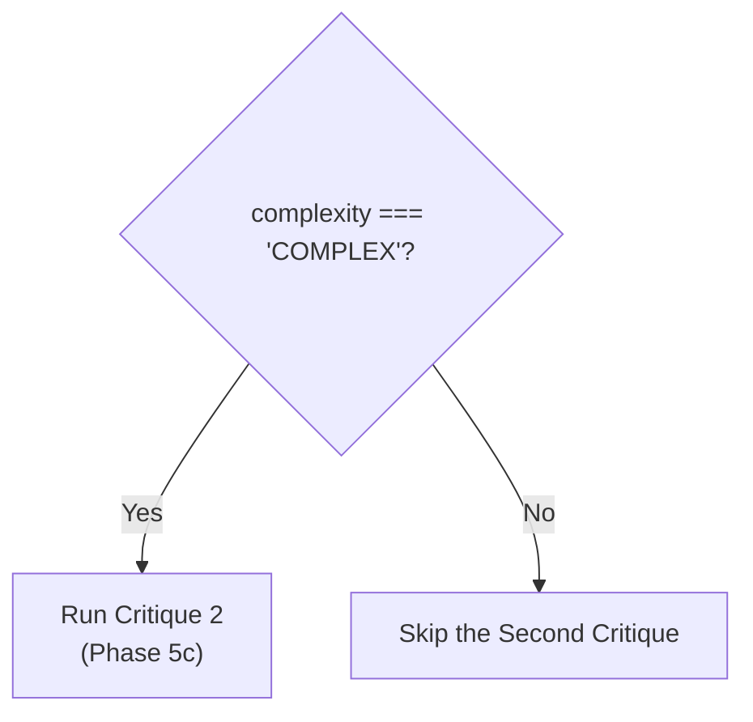

---

## 9. Troubleshooting

### 9.1 Common Errors

| Error | Cause | Solution |
|------|-------|---------|
| `missing_story_id` | Story ID not provided | `*create-spec STORY-42` |
| `phase_failed` | A phase failed during execution | Check the logs, use `--resume` |
| `max_iterations_reached` | Revision limit reached | Escalate to @architect |
| `critique_blocked` | Spec blocked by the QA gate | Review critique.json, fix the HIGH issues |
| `missing-requirements` | requirements.json not found | Run the Gather phase first |
| `empty-functional` | No functional requirements | Re-run the elicitation |
| `context7-unavailable` | Context7 MCP is not responding | Use EXA as a fallback |

### 9.2 How to Resume Execution

The pipeline supports resuming through checkpoints:

```yaml
resume:
  enabled: true
  state_file: docs/stories/{storyId}/spec/.pipeline-state.json

  checkpoints:
    - after: gather   -> requirements_gathered
    - after: assess   -> complexity_assessed
    - after: research -> research_complete
    - after: spec     -> spec_written
    - after: critique -> critique_complete
```

**Command to resume:**
```bash
*create-spec STORY-42 --resume
```

### 9.3 Error Decision Tree

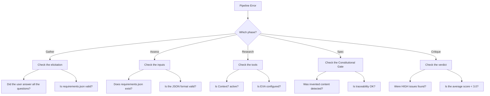

---

## 10. References

### 10.1 Workflow Files

| File | Location |
|---------|-------------|
| Workflow Definition | `.aexos-core/development/workflows/spec-pipeline.yaml` |
| Task: Gather | `.aexos-core/development/tasks/spec-gather-requirements.md` |
| Task: Assess | `.aexos-core/development/tasks/spec-assess-complexity.md` |
| Task: Research | `.aexos-core/development/tasks/spec-research-dependencies.md` |
| Task: Write Spec | `.aexos-core/development/tasks/spec-write-spec.md` |
| Task: Critique | `.aexos-core/development/tasks/spec-critique.md` |
| Task: Create Plan | `.aexos-core/development/tasks/plan-create-implementation.md` |

### 10.2 Related Agents

| Agent | Location |
|--------|-------------|
| @pm (Janus) | `.aexos-core/development/agents/pm.md` |
| @architect (Vega) | `.aexos-core/development/agents/architect.md` |
| @analyst (Sirius) | `.aexos-core/development/agents/analyst.md` |
| @qa (Argus) | `.aexos-core/development/agents/qa.md` |

### 10.3 Related Documentation

- [Workflows YAML Guide](../workflows-yaml-guide.md)
- [AEXOS Documentation Index](../README.md)
- [Backlog Management System](../BACKLOG-MANAGEMENT-SYSTEM.md)

### 10.4 Quick Commands

| Command | Description | Agent |
|---------|-----------|--------|
| `*create-spec STORY-ID` | Run the complete pipeline | - |
| `*gather-requirements STORY-ID` | Gather phase only | @pm |
| `*assess-complexity STORY-ID` | Assess phase only | @architect |
| `*research-deps STORY-ID` | Research phase only | @analyst |
| `*write-spec STORY-ID` | Write phase only | @pm |
| `*critique-spec STORY-ID` | Critique phase only | @qa |

---

## 11. Completion Message

On a successful finish, the pipeline displays:

```
+==============================================================+
|  Spec Pipeline Complete                                      |
+==============================================================+

Story:       {storyId}
Complexity:  {SIMPLE|STANDARD|COMPLEX}
Verdict:     APPROVED
Score:       {score}/5

Artifacts:
   - docs/stories/{storyId}/spec/requirements.json
   - docs/stories/{storyId}/spec/complexity.json
   - docs/stories/{storyId}/spec/research.json
   - docs/stories/{storyId}/spec/spec.md
   - docs/stories/{storyId}/spec/critique.json

Next Steps:
   - Review spec.md
   - Run @dev *develop {storyId}
```

---

## Metadata

```yaml
metadata:
  document: SPEC-PIPELINE-WORKFLOW.md
  version: 1.0
  created: 2026-02-04
  author: Technical Documentation Specialist
  based_on:
    - .aexos-core/development/workflows/spec-pipeline.yaml
    - .aexos-core/development/tasks/spec-*.md
    - .aexos-core/development/agents/*.md
  tags:
    - spec-pipeline
    - workflow
    - documentation
    - cyryx
    - auto-claude
```
