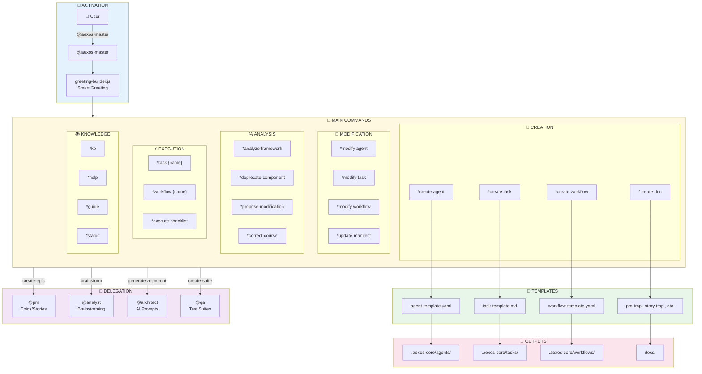
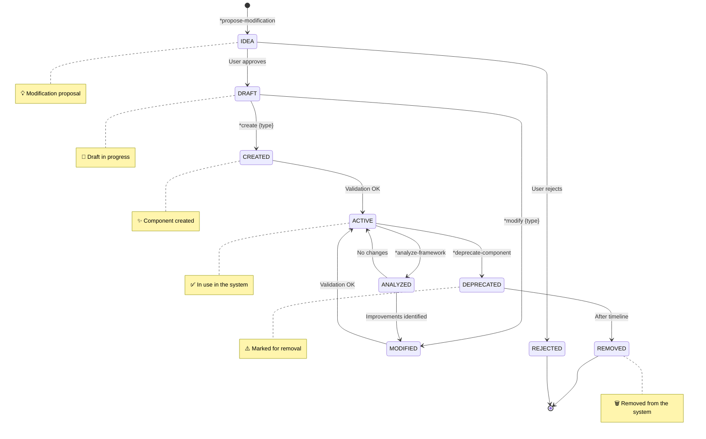
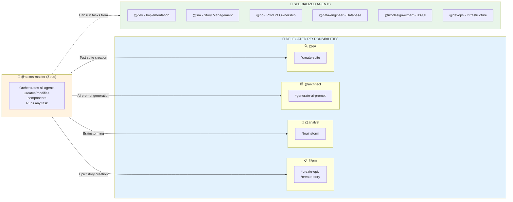

# @aexos-master Agent System

> **Version:** 1.0.0
> **Created:** 2026-02-04
> **Owner:** @aexos-master (Zeus)
> **Status:** Official Documentation

---

## Overview

**@aexos-master** (Zeus - The Orchestrator) is the primary meta-agent of the AEXOS-FULLSTACK framework. It acts as universal orchestrator, framework developer and AEXOS method specialist. Its main responsibilities include:

- **Universal Orchestration**: Runs any task from any agent directly
- **Framework Development**: Creates and modifies agents, tasks, workflows and templates
- **Component Management**: Validates, deprecates and analyzes system components
- **Multi-Agent Coordination**: Manages complex workflows across multiple agents
- **Knowledge Base**: Access to the full AEXOS Method knowledge

### When to Use

- Create or modify framework components (agents, tasks, workflows)
- Orchestrate complex multi-agent workflows
- Run any task directly without persona transformation
- Meta-framework operations and cross-agent coordination
- Access the AEXOS Knowledge Base (*kb)

---

## Complete File List

### @aexos-master Core Task Files

| File | Command | Purpose |
|---------|---------|-----------|
| `.aexos-core/development/tasks/create-agent.md` | `*create agent` | Creates a new agent definition using the template system |
| `.aexos-core/development/tasks/create-task.md` | `*create task` | Creates a new task file with a standardized structure |
| `.aexos-core/development/tasks/create-workflow.md` | `*create workflow` | Creates a new multi-agent workflow definition |
| `.aexos-core/development/tasks/modify-agent.md` | `*modify agent` | Modifies an existing agent with backup and rollback |
| `.aexos-core/development/tasks/modify-task.md` | `*modify task` | Modifies an existing task while preserving compatibility |
| `.aexos-core/development/tasks/modify-workflow.md` | `*modify workflow` | Modifies an existing workflow while maintaining integrity |
| `.aexos-core/development/tasks/analyze-framework.md` | `*analyze-framework` | Analyzes framework structure, redundancies and performance |
| `.aexos-core/development/tasks/deprecate-component.md` | `*deprecate-component` | Deprecates a component with timeline and migration |
| `.aexos-core/development/tasks/propose-modification.md` | `*propose-modification` | Creates a modification proposal for collaborative review |
| `.aexos-core/development/tasks/execute-checklist.md` | `*execute-checklist` | Runs a validation checklist |
| `.aexos-core/development/tasks/create-doc.md` | `*create-doc` | Creates a document from a YAML template |
| `.aexos-core/development/tasks/advanced-elicitation.md` | `*advanced-elicitation` | Runs advanced elicitation with multiple methods |
| `.aexos-core/development/tasks/kb-mode-interaction.md` | `*kb` | Enables interactive Knowledge Base mode |
| `.aexos-core/development/tasks/correct-course.md` | `*correct-course` | Analyzes and corrects process/quality deviations |
| `.aexos-core/development/tasks/update-manifest.md` | `*update-manifest` | Updates the team manifest with new agents |
| `.aexos-core/development/tasks/create-next-story.md` | `*create-next-story` | Creates the next user story |
| `.aexos-core/development/tasks/create-deep-research-prompt.md` | - | Generates deep research prompts |
| `.aexos-core/development/tasks/improve-self.md` | - | Agent self-improvement |
| `.aexos-core/development/tasks/shard-doc.md` | `*shard-doc` | Splits a document into smaller parts |
| `.aexos-core/development/tasks/document-project.md` | `*document-project` | Generates project documentation |
| `.aexos-core/development/tasks/index-docs.md` | `*index-docs` | Indexes documentation for search |

### Agent Definition Files

| File | Purpose |
|---------|-----------|
| `.aexos-core/development/agents/aexos-master.md` | Full agent definition (persona, commands, dependencies) |
| `.claude/commands/AEXOS/agents/aexos-master.md` | Claude Code command to activate @aexos-master |

### @aexos-master Template Files

| File | Purpose |
|---------|-----------|
| `.aexos-core/development/templates/agent-template.yaml` | Template for creating new agents |
| `.aexos-core/development/templates/task-template.md` | Template for creating new tasks |
| `.aexos-core/development/templates/workflow-template.yaml` | Template for creating new workflows |
| `.aexos-core/development/templates/prd-tmpl.yaml` | PRD template |
| `.aexos-core/development/templates/story-tmpl.yaml` | Story template |
| `.aexos-core/development/templates/architecture-tmpl.yaml` | Architecture template |
| `.aexos-core/development/templates/brownfield-prd-tmpl.yaml` | Brownfield PRD template |
| `.aexos-core/development/templates/brownfield-architecture-tmpl.yaml` | Brownfield architecture template |
| `.aexos-core/development/templates/competitor-analysis-tmpl.yaml` | Competitor analysis template |
| `.aexos-core/development/templates/market-research-tmpl.yaml` | Market research template |
| `.aexos-core/development/templates/project-brief-tmpl.yaml` | Project brief template |
| `.aexos-core/development/templates/front-end-architecture-tmpl.yaml` | Frontend architecture template |
| `.aexos-core/development/templates/front-end-spec-tmpl.yaml` | Frontend spec template |
| `.aexos-core/development/templates/fullstack-architecture-tmpl.yaml` | Fullstack architecture template |

### Data and Utility Files

| File | Purpose |
|---------|-----------|
| `.aexos-core/development/data/aexos-kb.md` | AEXOS Method Knowledge Base |
| `.aexos-core/development/data/brainstorming-techniques.md` | Brainstorming techniques |
| `.aexos-core/development/data/elicitation-methods.md` | Elicitation methods |
| `.aexos-core/development/data/technical-preferences.md` | Technical preferences |
| `.aexos-core/development/utils/security-checker.js` | Security validator |
| `.aexos-core/development/utils/yaml-validator.js` | YAML validator |
| `.aexos-core/development/utils/workflow-management.md` | Workflow management |

### @aexos-master Workflow Files

| File | Purpose |
|---------|-----------|
| `.aexos-core/development/workflows/brownfield-fullstack.md` | Brownfield fullstack workflow |
| `.aexos-core/development/workflows/brownfield-service.md` | Brownfield service workflow |
| `.aexos-core/development/workflows/brownfield-ui.md` | Brownfield UI workflow |
| `.aexos-core/development/workflows/greenfield-fullstack.md` | Greenfield fullstack workflow |
| `.aexos-core/development/workflows/greenfield-service.md` | Greenfield service workflow |
| `.aexos-core/development/workflows/greenfield-ui.md` | Greenfield UI workflow |

### @aexos-master Checklist Files

| File | Purpose |
|---------|-----------|
| `.aexos-core/development/checklists/architect-checklist.md` | Architecture checklist |
| `.aexos-core/development/checklists/change-checklist.md` | Change checklist |
| `.aexos-core/development/checklists/pm-checklist.md` | PM checklist |
| `.aexos-core/development/checklists/po-master-checklist.md` | PO checklist |
| `.aexos-core/development/checklists/story-dod-checklist.md` | Story DoD checklist |
| `.aexos-core/development/checklists/story-draft-checklist.md` | Story draft checklist |

### Related Files from Other Agents

| File | Agent | Purpose |
|---------|--------|-----------|
| `.aexos-core/development/tasks/brownfield-create-epic.md` | @pm | Epic creation (delegated) |
| `.aexos-core/development/tasks/brownfield-create-story.md` | @pm | Story creation (delegated) |
| `.aexos-core/development/tasks/analyst-facilitate-brainstorming.md` | @analyst | Brainstorming (delegated) |
| `.aexos-core/development/tasks/generate-ai-frontend-prompt.md` | @architect | AI prompt generation (delegated) |
| `.aexos-core/development/tasks/create-suite.md` | @qa | Test suite creation (delegated) |

---

## Flowchart: Complete System



### Component Lifecycle Diagram



---

## Command to Task Mapping

### Creation Commands

| Command | Task File | Operation |
|---------|-----------|----------|
| `*create agent {name}` | `create-agent.md` | Creates a new agent through progressive elicitation |
| `*create task {name}` | `create-task.md` | Creates a new task with a standardized structure |
| `*create workflow {name}` | `create-workflow.md` | Creates a new multi-agent workflow |
| `*create-doc {template}` | `create-doc.md` | Creates a document from a YAML template |
| `*create-next-story` | `create-next-story.md` | Creates the next user story |

### Modification Commands

| Command | Task File | Operation |
|---------|-----------|----------|
| `*modify agent {name}` | `modify-agent.md` | Modifies an agent with backup/rollback |
| `*modify task {name}` | `modify-task.md` | Modifies a task while preserving compatibility |
| `*modify workflow {name}` | `modify-workflow.md` | Modifies a workflow while maintaining integrity |
| `*update-manifest` | `update-manifest.md` | Updates the team manifest |
| `*propose-modification` | `propose-modification.md` | Creates a modification proposal |

### Analysis and Validation Commands

| Command | Task File | Operation |
|---------|-----------|----------|
| `*analyze-framework` | `analyze-framework.md` | Full framework analysis |
| `*deprecate-component` | `deprecate-component.md` | Deprecates a component with a timeline |
| `*execute-checklist {name}` | `execute-checklist.md` | Runs a validation checklist |
| `*validate-component` | - | Validates security and standards |
| `*correct-course` | `correct-course.md` | Corrects process deviations |

### Execution Commands

| Command | Task File | Operation |
|---------|-----------|----------|
| `*task {name}` | (dynamic) | Runs a specific task |
| `*workflow {name}` | (dynamic) | Starts a multi-agent workflow |
| `*plan [create\|status\|update]` | - | Workflow planning |

### Utility Commands

| Command | Task File | Operation |
|---------|-----------|----------|
| `*help` | - | Shows available commands |
| `*kb` | `kb-mode-interaction.md` | Toggles Knowledge Base mode |
| `*status` | - | Shows current context and progress |
| `*guide` | - | Shows the agent usage guide |
| `*yolo` | - | Toggles skipping confirmations |
| `*exit` | - | Exits agent mode |
| `*advanced-elicitation` | `advanced-elicitation.md` | Advanced elicitation |
| `*shard-doc` | `shard-doc.md` | Splits a document into parts |
| `*doc-out` | - | Outputs the full document |
| `*index-docs` | `index-docs.md` | Indexes documentation |

---

## Integrations Between Agents

### Delegation Diagram



### When to Use Specialized Agents

| Scenario | Recommended Agent | Reason |
|---------|-------------------|-------|
| Story implementation | @dev | Code expertise |
| Code review | @qa | Quality focus |
| PRD creation | @pm | Product expertise |
| Story creation | @sm or @pm | Agile specialization |
| Architecture decisions | @architect | Technical expertise |
| Database operations | @data-engineer | Data expertise |
| UX/UI design | @ux-design-expert | Design expertise |
| Git operations | @github-devops | DevOps expertise |
| Research and analysis | @analyst | Analytical expertise |

---

## Configuration

### Relevant Configuration Files

| File | Purpose |
|---------|-----------|
| `.aexos-core/core-config.yaml` | Central framework configuration |
| `.aexos-core/install-manifest.yaml` | Installation manifest |
| `.aexos-core/config/agent-config-requirements.yaml` | Agent configuration requirements |
| `.aexos/project-registry.yaml` | Central project registry |

### Security Configuration

```yaml
security:
  authorization:
    - Check user permissions before component creation
    - Require confirmation for manifest modifications
    - Log all operations with user identification
  validation:
    - No eval() or dynamic code execution in templates
    - Sanitize all user inputs
    - Validate YAML syntax before saving
    - Check for path traversal attempts
  memory-access:
    - Scoped queries only for framework components
    - No access to sensitive project data
    - Rate limit memory operations
```

### Agent Customization

```yaml
agent:
  customization: |
    - AUTHORIZATION: Check user role/permissions before sensitive operations
    - SECURITY: Validate all generated code for security vulnerabilities
    - MEMORY: Use memory layer to track created components and modifications
    - AUDIT: Log all meta-agent operations with timestamp and user info
```

---

## Best Practices

### 1. Component Creation

- **Always use templates**: Use `*create {type}` instead of creating manually
- **Follow the elicitation**: Do not skip steps of the interactive process
- **Validate before use**: Run `*validate-component` after creation
- **Document dependencies**: List all dependencies in the component

### 2. Component Modification

- **Back up first**: The system creates a backup automatically, but verify it
- **Use propose-modify**: For significant changes, use `*propose-modification`
- **Test after modifying**: Always test the modified component
- **Update manifests**: Remember to run `*update-manifest` if needed

### 3. Workflow Orchestration

- **Use specialized agents**: Delegate to the most appropriate agent
- **Plan before executing**: Use `*plan` for complex workflows
- **Monitor progress**: Use `*status` to follow along

### 4. Knowledge Base Management

- **Enable KB when needed**: Use `*kb` for questions about the framework
- **Do not load it automatically**: The KB is only loaded on demand
- **Explore specific topics**: Use the guided navigation of KB mode

### 5. Security

- **Validate inputs**: Always sanitize user inputs
- **Check permissions**: Verify authorization before sensitive operations
- **Audit operations**: All actions are logged automatically

---

## Troubleshooting

### Problem: Component not found

**Symptom:** "Component not found" error when trying to modify/deprecate

**Solution:**
1. Verify the exact component name
2. Use `*list-components` to see available components
3. Check the correct type (agent, task, workflow, util)

### Problem: Template not found

**Symptom:** Error when running `*create-doc`

**Solution:**
1. List available templates: check `.aexos-core/development/templates/`
2. Use the correct template name without the extension
3. Verify that the template exists and is valid YAML

### Problem: Workflow fails

**Symptom:** The workflow stops with an error

**Solution:**
1. Check the logs with `*status`
2. Check the workflow dependencies
3. Validate the participating agents
4. Use `*correct-course` for analysis

### Problem: KB mode does not load

**Symptom:** Knowledge not available after `*kb`

**Solution:**
1. Verify that `.aexos-core/development/data/aexos-kb.md` exists
2. Make sure the file is not corrupted
3. Restart the agent if necessary

### Problem: Backup/rollback fails

**Symptom:** Error creating a backup or rolling back

**Solution:**
1. Check write permissions on the directory
2. Check disk space
3. Try a manual rollback from the `.backups/` file

### Problem: Elicitation interrupted

**Symptom:** The elicitation process stops midway

**Solution:**
1. Sessions are saved automatically
2. Use `*status` to see progress
3. Continue from where it stopped or start over

---

## References

### Core Files

- [aexos-master Agent](.aexos-core/development/agents/aexos-master.md)
- [Knowledge Base](.aexos-core/development/data/aexos-kb.md)
- [User Guide](.aexos-core/user-guide.md)

### Standards and Documentation

- [AEXOS Framework Master](.aexos-core/docs/standards/AEXOS-LIVRO-DE-OURO-V2.1-COMPLETE.md)
- [AEXOS Golden Book](.aexos-core/docs/standards/AEXOS-LIVRO-DE-OURO.md)
- [Agent Personalization Standard](.aexos-core/docs/standards/AGENT-PERSONALIZATION-STANDARD-V1.md)

### Task Directory

- [Tasks Directory](.aexos-core/development/tasks/)
- [Templates Directory](.aexos-core/development/templates/)
- [Workflows Directory](.aexos-core/development/workflows/)

---

## Summary

| Aspect | Details |
|---------|----------|
| **Agent Name** | Zeus (aexos-master) |
| **Archetype** | Orchestrator |
| **Icon** | 👑 |
| **Total Direct Tasks** | 21 tasks |
| **Total Templates** | 14 templates |
| **Total Workflows** | 6 workflows |
| **Total Checklists** | 6 checklists |
| **Agents It Delegates To** | 4 (@pm, @analyst, @architect, @qa) |
| **Creation Commands** | 5 (`*create *`) |
| **Modification Commands** | 5 (`*modify *`, `*update-*`, `*propose-*`) |
| **Analysis Commands** | 4 (`*analyze-*`, `*deprecate-*`, `*validate-*`, `*correct-*`) |
| **Execution Commands** | 3 (`*task`, `*workflow`, `*execute-checklist`) |
| **Utility Commands** | 10 (`*help`, `*kb`, `*status`, etc.) |
| **Execution Modes** | 3 (YOLO, Interactive, Pre-Flight) |

---

## Changelog

| Date | Author | Description |
|------|-------|-----------|
| 2026-02-04 | @aexos-master | Initial document created with full mapping |

---

*-- Zeus, orchestrating the system*
