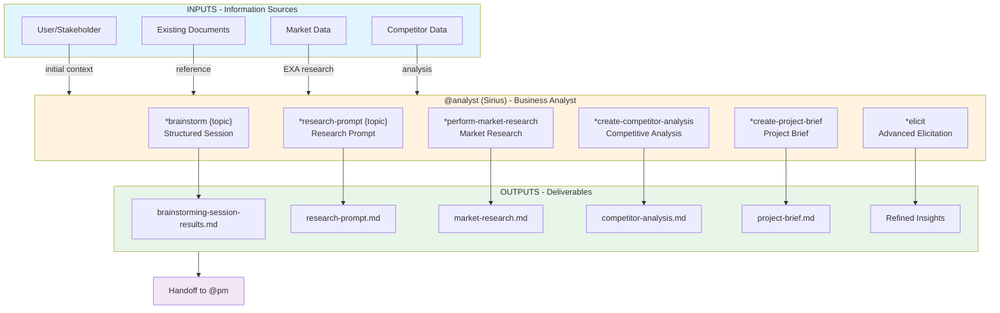
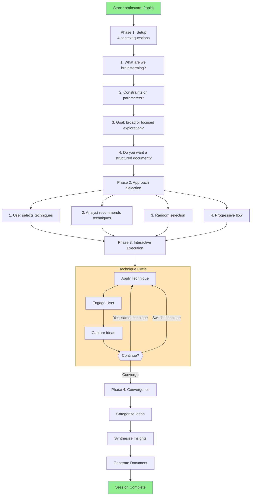
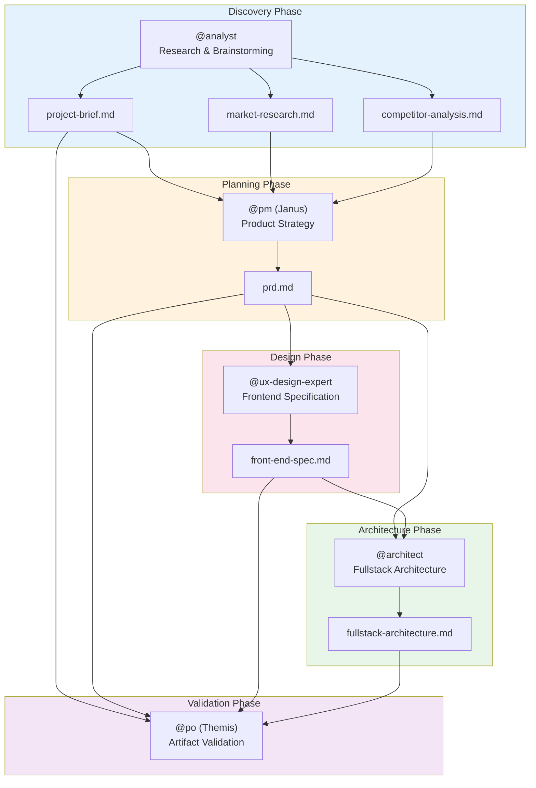
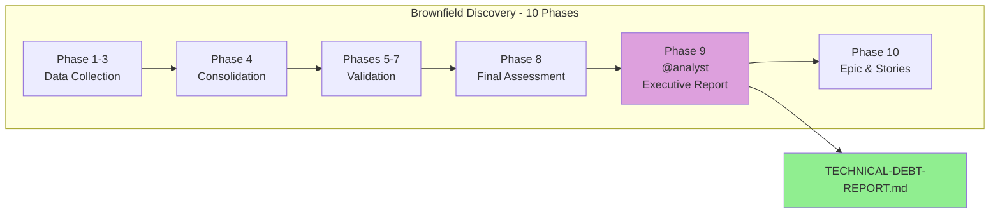

# Analyst Agent System (@analyst) - AEXOS

> **Version:** 1.0.0
> **Created:** 2026-02-04
> **Owner:** @analyst (Sirius)
> **Status:** Official Documentation

---

## Overview

This document describes the complete system of the **@analyst (Sirius)** agent, including all files involved, workflows, available commands, templates and integrations between agents.

The Analyst agent is designed to:
- Conduct market research and competitive analysis
- Facilitate structured brainstorming sessions
- Create project briefs and deep research prompts
- Provide actionable insights for decision making
- Support project discovery (brownfield documentation)
- Generate executive awareness reports

---

## Agent Profile

| Attribute | Value |
|----------|-------|
| **Name** | Sirius |
| **ID** | analyst |
| **Title** | Business Analyst |
| **Icon** | :mag: |
| **Archetype** | Decoder |
| **Sign** | :scorpius: Scorpio |
| **Tone** | Analytical, Inquisitive, Creative |
| **Signature** | "-- Sirius, investigating the truth :mag_right:" |

### Core Principles

1. **Curiosity-Driven Inquiry** - Proactive questions to uncover underlying truths
2. **Objective & Evidence-Based Analysis** - Grounding in verifiable data
3. **Strategic Contextualization** - Framing within the broader strategic context
4. **Facilitate Clarity & Shared Understanding** - Precise articulation of needs
5. **Creative Exploration & Divergent Thinking** - Broad idea generation before converging
6. **Structured & Methodical Approach** - Systematic methods for comprehensiveness
7. **Action-Oriented Outputs** - Clear and actionable deliverables
8. **Collaborative Partnership** - Iterative refinement partnership
9. **Maintaining a Broad Perspective** - Awareness of market trends
10. **Integrity of Information** - Accurate representation of sources

---

## Complete File List

### Agent Core Files

| File | Purpose |
|---------|-----------|
| `.aexos-core/development/agents/analyst.md` | Core definition of the Analyst agent |
| `.claude/commands/AEXOS/agents/analyst.md` | Claude Code command to activate @analyst |

### Analyst Tasks

| File | Command | Purpose |
|---------|---------|-----------|
| `.aexos-core/development/tasks/facilitate-brainstorming-session.md` | `*brainstorm {topic}` | Main task - facilitates structured brainstorming sessions |
| `.aexos-core/development/tasks/analyst-facilitate-brainstorming.md` | `*brainstorm {topic}` | Interactive variant of the brainstorming task |
| `.aexos-core/development/tasks/create-deep-research-prompt.md` | `*research-prompt {topic}` | Generates deep research prompts for investigation |
| `.aexos-core/development/tasks/advanced-elicitation.md` | `*elicit` | Advanced requirements elicitation session |
| `.aexos-core/development/tasks/create-doc.md` | `*doc-out` | Document creation from YAML templates |
| `.aexos-core/development/tasks/document-project.md` | `*create-project-brief` | Documentation of existing projects |
| `.aexos-core/development/tasks/calculate-roi.md` | (related) | ROI and cost savings calculation |

### Related Analysis Tasks

| File | Purpose |
|---------|-----------|
| `.aexos-core/development/tasks/analyze-brownfield.md` | Analysis of brownfield projects |
| `.aexos-core/development/tasks/analyze-framework.md` | Analysis of existing frameworks |
| `.aexos-core/development/tasks/analyze-performance.md` | Performance analysis |
| `.aexos-core/development/tasks/analyze-project-structure.md` | Project structure analysis |
| `.aexos-core/development/tasks/analyze-cross-artifact.md` | Cross-artifact analysis |

### Analyst Templates

| File | Purpose |
|---------|-----------|
| `.aexos-core/product/templates/project-brief-tmpl.yaml` | Template for Project Brief |
| `.aexos-core/product/templates/market-research-tmpl.yaml` | Template for Market Research |
| `.aexos-core/product/templates/competitor-analysis-tmpl.yaml` | Template for Competitive Analysis |
| `.aexos-core/product/templates/brainstorming-output-tmpl.yaml` | Template for brainstorming session output |

### Data Files

| File | Purpose |
|---------|-----------|
| `.aexos-core/development/data/aexos-kb.md` | AEXOS knowledge base |
| `.aexos-core/development/data/brainstorming-techniques.md` | Available brainstorming techniques |

### Workflows That Use the Analyst

| File | Phase | Purpose |
|---------|------|-----------|
| `.aexos-core/development/workflows/greenfield-fullstack.yaml` | Phase 1 | Discovery & Planning - creates project-brief.md |
| `.aexos-core/development/workflows/brownfield-discovery.yaml` | Phase 9 | Executive Awareness Report |

---

## Flowchart: Complete Analyst System



### Brainstorming Flow Diagram



### Session State Diagram

```mermaid
stateDiagram-v2
    [*] --> CONTEXT_GATHERING: Activation
    CONTEXT_GATHERING --> APPROACH_SELECTION: context gathered
    APPROACH_SELECTION --> DIVERGENT_THINKING: approach defined

    DIVERGENT_THINKING --> TECHNIQUE_ACTIVE: technique selected
    TECHNIQUE_ACTIVE --> DIVERGENT_THINKING: switch technique
    TECHNIQUE_ACTIVE --> TECHNIQUE_ACTIVE: keep engaging

    DIVERGENT_THINKING --> CONVERGENT_THINKING: enough ideas
    CONVERGENT_THINKING --> CATEGORIZATION: categorize
    CATEGORIZATION --> SYNTHESIS: synthesize
    SYNTHESIS --> DOCUMENTATION: document
    DOCUMENTATION --> [*]: session complete

    note right of DIVERGENT_THINKING: Warm-up: 5-10 min<br/>Generation: 20-30 min
    note right of CONVERGENT_THINKING: Convergence: 15-20 min
    note right of SYNTHESIS: Synthesis: 10-15 min
```

---

## Flowchart: Integration with Other Agents



### Flow in the Brownfield Discovery Workflow



---

## Command to Task Mapping

### Research & Analysis Commands

| Command | Task File | Operation |
|---------|-----------|----------|
| `*perform-market-research` | `create-doc.md` + template | Creates a market research report |
| `*create-competitor-analysis` | `create-doc.md` + template | Creates a detailed competitive analysis |
| `*research-prompt {topic}` | `create-deep-research-prompt.md` | Generates a deep research prompt |

### Ideation & Discovery Commands

| Command | Task File | Operation |
|---------|-----------|----------|
| `*brainstorm {topic}` | `facilitate-brainstorming-session.md` | Facilitates a structured brainstorming session |
| `*create-project-brief` | `document-project.md` | Creates a project brief |
| `*elicit` | `advanced-elicitation.md` | Advanced elicitation session |

### Utility Commands

| Command | Operation |
|---------|----------|
| `*help` | Shows all available commands |
| `*doc-out` | Outputs the complete document |
| `*session-info` | Shows details of the current session |
| `*guide` | Agent usage guide |
| `*yolo` | Toggle to skip confirmations |
| `*exit` | Exit analyst mode |

---

## Templates and Data Structure

### Project Brief Template

```yaml
template:
  id: project-brief-template-v2
  name: Project Brief
  version: 2.0
  output:
    format: markdown
    filename: docs/brief.md
```

**Main Sections:**
- Executive Summary
- Problem Statement
- Proposed Solution
- Target Users (Primary/Secondary)
- Goals & Success Metrics
- MVP Scope (Core Features / Out of Scope)
- Post-MVP Vision
- Technical Considerations
- Constraints & Assumptions
- Risks & Open Questions

### Market Research Template

```yaml
template:
  id: market-research-template-v2
  name: Market Research Report
  version: 2.0
  output:
    format: markdown
    filename: docs/market-research.md
```

**Main Sections:**
- Executive Summary
- Research Objectives & Methodology
- Market Overview (TAM/SAM/SOM, Trends)
- Customer Analysis (Segments, JTBD, Journey)
- Competitive Landscape
- Industry Analysis (Porter's Five Forces)
- Opportunity Assessment
- Strategic Recommendations

### Competitor Analysis Template

```yaml
template:
  id: competitor-analysis-template-v2
  name: Competitive Analysis Report
  version: 2.0
  output:
    format: markdown
    filename: docs/competitor-analysis.md
```

**Main Sections:**
- Executive Summary
- Analysis Scope & Methodology
- Competitive Landscape Overview
- Individual Competitor Profiles
- Comparative Analysis (Features, SWOT, Positioning)
- Strategic Analysis (Blue Ocean, Vulnerabilities)
- Strategic Recommendations
- Monitoring & Intelligence Plan

### Brainstorming Output Template

```yaml
template:
  id: brainstorming-output-template-v2
  name: Brainstorming Session Results
  version: 2.0
  output:
    format: markdown
    filename: docs/brainstorming-session-results.md
```

**Main Sections:**
- Executive Summary (Topic, Techniques, Ideas Count)
- Technique Sessions (per technique used)
- Idea Categorization
  - Immediate Opportunities
  - Future Innovations
  - Moonshots
  - Insights & Learnings
- Action Planning (Top 3 Priorities)
- Reflection & Follow-up

---

## Deep Research Process

### Research Focus Types

1. **Product Validation Research** - Validate hypotheses and market fit
2. **Market Opportunity Research** - Market size and potential
3. **User & Customer Research** - Personas, JTBD, pain points
4. **Competitive Intelligence Research** - Detailed competitor analysis
5. **Technology & Innovation Research** - Technical trends and evaluations
6. **Industry & Ecosystem Research** - Value chain and dynamics
7. **Strategic Options Research** - Evaluate strategic directions
8. **Risk & Feasibility Research** - Identify and assess risks
9. **Custom Research Focus** - Custom objectives

### Research Prompt Structure

```markdown
## Research Objective
[Clear statement of the objective]

## Background Context
[Relevant information from inputs]

## Research Questions
### Primary Questions (Must Answer)
1. [Specific and actionable question]
...

### Secondary Questions (Nice to Have)
1. [Supporting question]
...

## Research Methodology
### Information Sources
- [Source types and priorities]

### Analysis Frameworks
- [Specific frameworks]

## Expected Deliverables
### Executive Summary
- Key findings and insights
- Critical implications
- Recommended actions

## Success Criteria
[How to evaluate whether the research met its objectives]
```

---

## Tools and Integrations

### Available Tools

| Tool | Purpose |
|------------|-----------|
| **exa** | Advanced web research for markets and technologies |
| **context7** | Library documentation lookup |
| **google-workspace** | Research documentation (Drive, Docs, Sheets) |
| **clickup** | Idea capture and organization |

### Integrations with Other Agents

| Agent | Type of Collaboration |
|--------|---------------------|
| **@pm (Janus)** | Analyst provides research and analysis for PRD creation |
| **@po (Themis)** | Analyst provides market insights and competitive analysis |
| **@architect** | Analyst can provide technology research |
| **@ux-design-expert** | Analyst provides user research for UX decisions |

---

## Execution Modes

### 1. YOLO Mode - Fast and Autonomous (0-1 prompts)
- Autonomous decision making with logging
- Minimal user interaction
- **Best for:** Simple and deterministic tasks

### 2. Interactive Mode - Balanced and Educational (5-10 prompts) [DEFAULT]
- Explicit decision checkpoints
- Educational explanations
- **Best for:** Learning, complex decisions

### 3. Pre-Flight Planning - Comprehensive Planning
- Task analysis phase (identify ambiguities)
- Execution with zero ambiguity
- **Best for:** Ambiguous requirements, critical work

---

## Best Practices

### Market Research

1. **Define clear objectives** - Know which decisions the research will inform
2. **Use multiple sources** - Combine primary and secondary sources
3. **Quantify when possible** - TAM/SAM/SOM with clear calculations
4. **Identify assumptions** - Document limitations and premises
5. **Focus on actionable insights** - Not just data, but recommendations

### Competitive Analysis

1. **Prioritize competitors** - Use a prioritization matrix (market share vs threat)
2. **Deep analysis of Priority 1-2** - Detailed profiles
3. **Monitor continuously** - Establish an update cadence
4. **Identify Blue Ocean** - Look for uncontested market spaces
5. **Document sources** - For validation and future updates

### Brainstorming Sessions

1. **Be a facilitator, not a generator** - Guide the user to generate their own ideas
2. **One technique at a time** - Do not mix multiple techniques
3. **Quantity before quality** - Target: 100 ideas in 60 minutes
4. **Defer judgment** - Generation first, evaluation later
5. **Document everything** - Capture even the "crazy" ideas
6. **Manage energy** - Monitor engagement and offer breaks

### Advanced Elicitation

1. **Context before method** - Analyze the content before selecting methods
2. **Use the 1-9 format** - Always present numbered options
3. **Provide detailed rationale** - Explain trade-offs and decisions
4. **Wait for a response** - Do not proceed without user input
5. **Be concise** - Focus on actionable insights

---

## Troubleshooting

### Stalled brainstorming session

**Symptoms:** User stops generating ideas, short answers

**Solutions:**
1. Check the energy level: "How are you feeling about this direction?"
2. Offer a technique switch: "Would you like to try a different approach?"
3. Use more specific prompts
4. Take a break and resume

### Research without enough data

**Symptoms:** EXA returns few results, niche market

**Solutions:**
1. Expand the search scope (related terms)
2. Use analogies from adjacent markets
3. Combine with primary research (interviews)
4. Document gaps and uncertainties clearly

### Incomplete project brief

**Symptoms:** Vague sections, lack of specificity

**Solutions:**
1. Use advanced elicitation to go deeper
2. Ask for concrete examples
3. Challenge assumptions with scenarios
4. Iterate across multiple sessions if needed

### Shallow competitive analysis

**Symptoms:** Just a list of competitors without insights

**Solutions:**
1. Apply structured frameworks (Porter's, SWOT)
2. Focus on differentiators and vulnerabilities
3. Include positioning analysis
4. Generate specific strategic recommendations

---

## References

### Main Tasks

- [Task: facilitate-brainstorming-session.md](.aexos-core/development/tasks/facilitate-brainstorming-session.md)
- [Task: create-deep-research-prompt.md](.aexos-core/development/tasks/create-deep-research-prompt.md)
- [Task: advanced-elicitation.md](.aexos-core/development/tasks/advanced-elicitation.md)
- [Task: create-doc.md](.aexos-core/development/tasks/create-doc.md)
- [Task: document-project.md](.aexos-core/development/tasks/document-project.md)

### Templates

- [Template: project-brief-tmpl.yaml](.aexos-core/product/templates/project-brief-tmpl.yaml)
- [Template: market-research-tmpl.yaml](.aexos-core/product/templates/market-research-tmpl.yaml)
- [Template: competitor-analysis-tmpl.yaml](.aexos-core/product/templates/competitor-analysis-tmpl.yaml)
- [Template: brainstorming-output-tmpl.yaml](.aexos-core/product/templates/brainstorming-output-tmpl.yaml)

### Workflows

- [Workflow: greenfield-fullstack.yaml](.aexos-core/development/workflows/greenfield-fullstack.yaml)
- [Workflow: brownfield-discovery.yaml](.aexos-core/development/workflows/brownfield-discovery.yaml)

### Agent

- [Agent: analyst.md](.aexos-core/development/agents/analyst.md)

---

## Summary

| Aspect | Details |
|---------|----------|
| **Total Core Tasks** | 6 task files |
| **Total Templates** | 4 YAML templates |
| **Research Commands** | 3 (`*perform-market-research`, `*create-competitor-analysis`, `*research-prompt`) |
| **Ideation Commands** | 3 (`*brainstorm`, `*create-project-brief`, `*elicit`) |
| **Workflows That Use It** | 2 (greenfield-fullstack, brownfield-discovery) |
| **Consumer Agents** | @pm, @po, @architect, @ux-design-expert |
| **Integrated Tools** | exa, context7, google-workspace, clickup |
| **Execution Modes** | 3 (YOLO, Interactive, Pre-Flight) |

---

## Changelog

| Date | Author | Description |
|------|-------|-----------|
| 2026-02-04 | @analyst | Initial document created with complete flowcharts and mappings |

---

*-- Sirius, investigating the truth :mag_right:*
