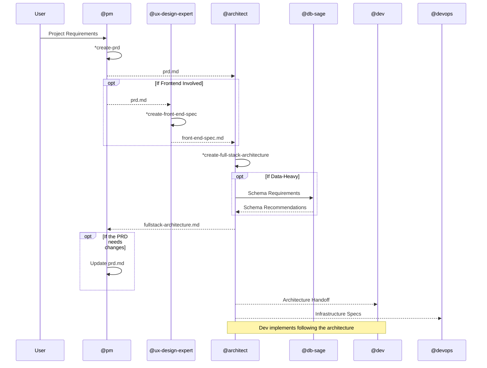
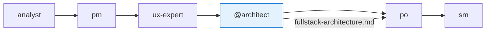
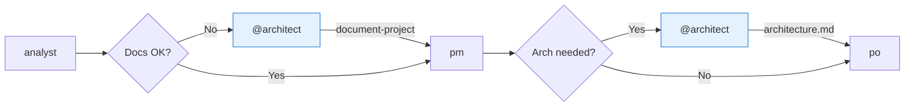
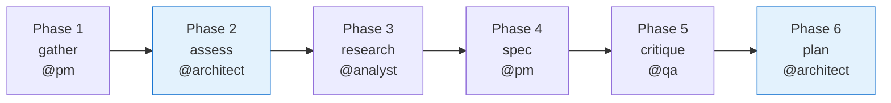
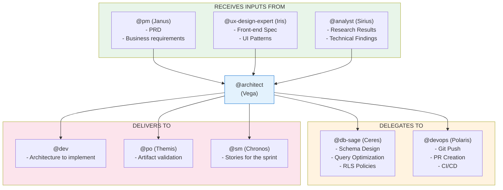
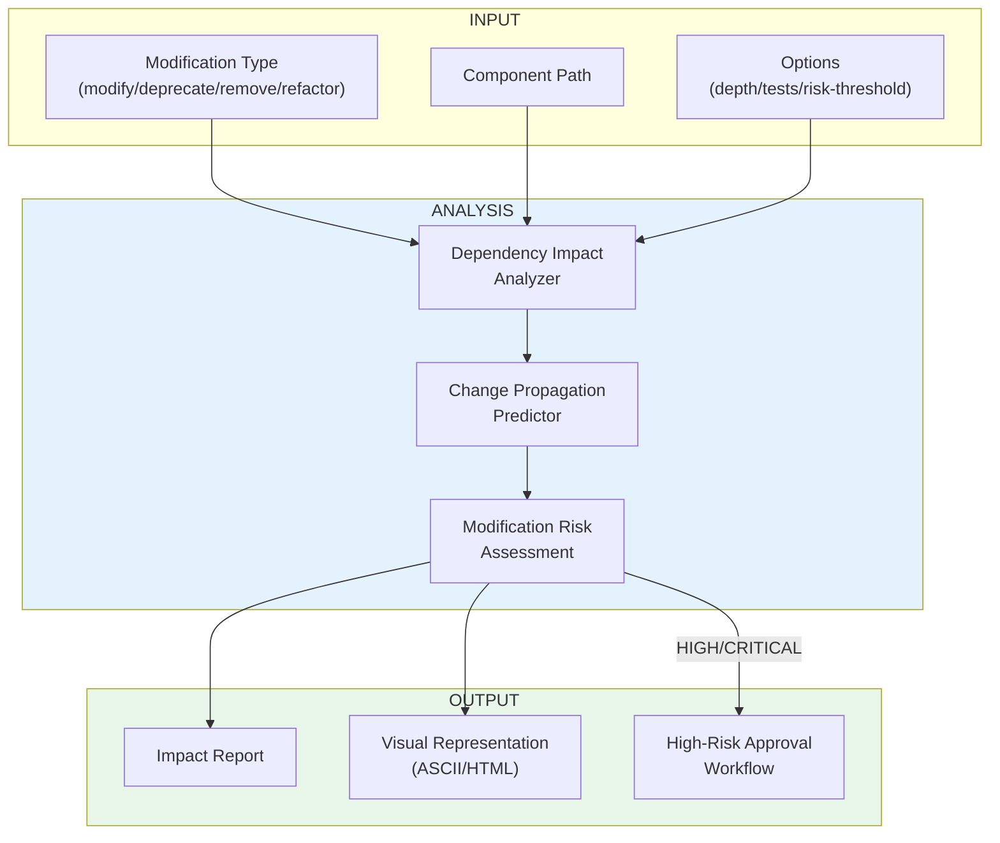
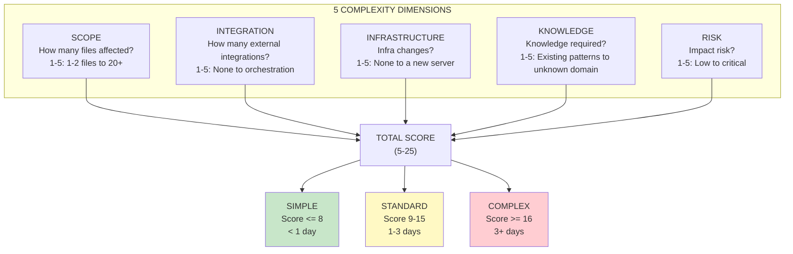

# @architect Agent System

> **Version:** 1.0.0
> **Created:** 2026-02-04
> **Owner:** @architect (Vega - Visionary)
> **Status:** Official Documentation

---

## Overview

The **@architect** agent (Vega) is the **Holistic System Architect & Full-Stack Technical Leader** of AEXOS. This agent is responsible for:

- **Complete system architecture** (microservices, monolith, serverless, hybrid)
- **Technology stack selection** (frameworks, languages, platforms)
- **Infrastructure planning** (deployment, scaling, monitoring, CDN)
- **API design** (REST, GraphQL, tRPC, WebSocket)
- **Security architecture** (authentication, authorization, encryption)
- **Frontend architecture** (state management, routing, performance)
- **Backend architecture** (service boundaries, event flows, caching)
- **Cross-cutting concerns** (logging, monitoring, error handling)
- **Integration patterns** (event-driven, messaging, webhooks)
- **Performance optimization** (across every layer)

### Core Principles

1. **Holistic System Thinking** - View every component as part of a larger system
2. **User Experience Drives Architecture** - Start with user journeys and work backward
3. **Pragmatic Technology Selection** - Choose "boring" technology where possible, "exciting" where necessary
4. **Progressive Complexity** - Design systems that are simple up front yet scalable
5. **Cross-Stack Performance Focus** - Optimize holistically across every layer
6. **Developer Experience as First-Class Concern** - Enable developer productivity
7. **Security at Every Layer** - Implement defense in depth
8. **Data-Centric Design** - Let data requirements drive the architecture
9. **Cost-Conscious Engineering** - Balance technical ideals against financial reality
10. **Living Architecture** - Design for change and adaptation

---

## Complete File List

### @architect Core Task Files

| File | Command | Purpose |
|---------|---------|-----------|
| `.aexos-core/development/tasks/architect-analyze-impact.md` | `*analyze-impact` | Analyzes the impact of modifications to framework components |
| `.aexos-core/development/tasks/document-project.md` | `*document-project` | Generates brownfield documentation for an existing project |
| `.aexos-core/development/tasks/create-doc.md` | `*create-doc` | Creates documents from YAML templates |
| `.aexos-core/development/tasks/collaborative-edit.md` | `*collaborative-edit` | Manages collaborative editing sessions |
| `.aexos-core/development/tasks/create-deep-research-prompt.md` | `*research` | Generates deep research prompts |
| `.aexos-core/development/tasks/execute-checklist.md` | `*execute-checklist` | Runs validation checklists |
| `.aexos-core/development/tasks/spec-assess-complexity.md` | `*assess-complexity` | Assesses story complexity (Spec Pipeline) |

### Agent Definition Files

| File | Purpose |
|---------|-----------|
| `.aexos-core/development/agents/architect.md` | Core definition of the Architect agent |
| `.claude/commands/AEXOS/agents/architect.md` | Claude Code command that activates @architect |

### @architect Template Files

| File | Purpose |
|---------|-----------|
| `.aexos-core/product/templates/architecture-tmpl.yaml` | Template for backend architecture |
| `.aexos-core/product/templates/front-end-architecture-tmpl.yaml` | Template for frontend architecture |
| `.aexos-core/product/templates/fullstack-architecture-tmpl.yaml` | Template for fullstack architecture |
| `.aexos-core/product/templates/brownfield-architecture-tmpl.yaml` | Template for brownfield projects |

### Supporting Data Files

| File | Purpose |
|---------|-----------|
| `.aexos-core/development/data/technical-preferences.md` | Default AEXOS technical preferences |

### Related Files from Other Agents

| File | Agent | Purpose |
|---------|--------|-----------|
| `.aexos-core/development/tasks/spec-gather-requirements.md` | @pm | Gathers requirements that feed the architecture |
| `.aexos-core/development/tasks/spec-research-dependencies.md` | @analyst | Researches dependencies for the architecture |
| `.aexos-core/development/tasks/spec-critique.md` | @qa | Validates specs that impact the architecture |
| `.aexos-core/development/tasks/plan-create-implementation.md` | @architect | Creates the post-spec implementation plan |
| `.aexos-core/development/agents/db-sage.md` | @db-sage | Collaborates on data architecture |
| `.aexos-core/development/agents/ux-design-expert.md` | @ux-design-expert | Collaborates on frontend architecture |
| `.aexos-core/development/agents/devops.md` | @devops | Collaborates on infrastructure |

---

## Flowchart: Complete @architect System

```mermaid
flowchart TB
    subgraph INPUTS["INPUTS"]
        PRD["PRD\n(from @pm)"]
        FRONTEND_SPEC["Front-end Spec\n(from @ux-design-expert)"]
        REQUIREMENTS["Requirements\n(from user/stakeholder)"]
        EXISTING_PROJECT["Existing Project\n(brownfield)"]
    end

    subgraph ARCHITECT_CORE["@architect (Vega) - Core Operations"]
        direction TB

        subgraph DESIGN["Architecture Design"]
            FULLSTACK["*create-full-stack-architecture"]
            BACKEND["*create-backend-architecture"]
            FRONTEND["*create-front-end-architecture"]
            BROWNFIELD["*create-brownfield-architecture"]
        end

        subgraph ANALYSIS["Analysis & Impact"]
            IMPACT["*analyze-impact"]
            COMPLEXITY["*assess-complexity"]
            RESEARCH["*research"]
        end

        subgraph DOCS["Documentation"]
            DOC_PROJECT["*document-project"]
            CREATE_DOC["*create-doc"]
            CHECKLIST["*execute-checklist"]
        end
    end

    subgraph OUTPUTS["OUTPUTS"]
        ARCH_DOC["Architecture Document\n(.md)"]
        IMPACT_REPORT["Impact Report\n(.json/.html)"]
        COMPLEXITY_JSON["Complexity Assessment\n(.json)"]
        PROJECT_DOCS["Project Documentation"]
    end

    subgraph COLLABORATION["COLLABORATION"]
        DB_SAGE["@db-sage\n(Schema Design)"]
        UX_EXPERT["@ux-design-expert\n(UI Architecture)"]
        DEV["@dev\n(Implementation)"]
        DEVOPS["@devops\n(Infrastructure)"]
    end

    PRD --> FULLSTACK
    PRD --> BACKEND
    FRONTEND_SPEC --> FRONTEND
    REQUIREMENTS --> BROWNFIELD
    EXISTING_PROJECT --> DOC_PROJECT
    EXISTING_PROJECT --> BROWNFIELD

    FULLSTACK --> ARCH_DOC
    BACKEND --> ARCH_DOC
    FRONTEND --> ARCH_DOC
    BROWNFIELD --> ARCH_DOC

    IMPACT --> IMPACT_REPORT
    COMPLEXITY --> COMPLEXITY_JSON

    DOC_PROJECT --> PROJECT_DOCS
    CREATE_DOC --> PROJECT_DOCS

    ARCH_DOC --> DEV
    ARCH_DOC --> DEVOPS

    DB_SAGE -.->|"Schema Design"| FULLSTACK
    UX_EXPERT -.->|"UI Patterns"| FRONTEND

    style ARCHITECT_CORE fill:#e3f2fd
    style DESIGN fill:#bbdefb
    style ANALYSIS fill:#c8e6c9
    style DOCS fill:#fff9c4
    style OUTPUTS fill:#e8f5e9
    style COLLABORATION fill:#f3e5f5
```



### Diagram: Architecture Creation Flow



---

## Command to Task Mapping

### Architecture Design Commands

| Command | Task File / Template | Operation |
|---------|---------------------|----------|
| `*create-full-stack-architecture` | `create-doc.md` + `fullstack-architecture-tmpl.yaml` | Creates a complete fullstack architecture |
| `*create-backend-architecture` | `create-doc.md` + `architecture-tmpl.yaml` | Creates a backend architecture |
| `*create-front-end-architecture` | `create-doc.md` + `front-end-architecture-tmpl.yaml` | Creates a frontend architecture |
| `*create-brownfield-architecture` | `create-doc.md` + `brownfield-architecture-tmpl.yaml` | Architecture for existing projects |

### Analysis Commands

| Command | Task File | Operation |
|---------|-----------|----------|
| `*analyze-impact` | `architect-analyze-impact.md` | Analyzes the impact of modifications |
| `*assess-complexity` | `spec-assess-complexity.md` | Assesses complexity (5 dimensions) |
| `*research` | `create-deep-research-prompt.md` | Generates a research prompt |

### Documentation Commands

| Command | Task File | Operation |
|---------|-----------|----------|
| `*document-project` | `document-project.md` | Documents an existing project |
| `*execute-checklist` | `execute-checklist.md` | Runs the architecture checklist |
| `*doc-out` | N/A (built-in) | Outputs the complete document |
| `*shard-prd` | N/A (built-in) | Shards the PRD into parts |

### Utility Commands

| Command | Operation |
|---------|----------|
| `*help` | Shows every available command |
| `*session-info` | Shows details of the current session |
| `*guide` | Shows the agent usage guide |
| `*yolo` | Toggle to skip confirmations |
| `*exit` | Exits architect mode |

---

## Workflows Involving @architect

### 1. Greenfield Fullstack Workflow

**File:** `.aexos-core/development/workflows/greenfield-fullstack.yaml`



**@architect's Role:**
- Receives the PRD and the front-end-spec
- Creates fullstack-architecture.md
- May suggest changes to the PRD
- Hands the architecture over for PO validation

### 2. Brownfield Fullstack Workflow

**File:** `.aexos-core/development/workflows/brownfield-fullstack.yaml`



**@architect's Role:**
- Analyzes the existing project with `*document-project`
- Creates brownfield-architecture.md when needed
- Identifies technical debt and constraints

### 3. Spec Pipeline Workflow

**File:** `.aexos-core/development/workflows/spec-pipeline.yaml`



**@architect's Role:**
- **Phase 2 (Assess):** Assesses complexity using 5 dimensions
- **Phase 6 (Plan):** Creates the implementation plan once approved

### 4. QA Loop (Escalation)

**File:** `.aexos-core/development/workflows/qa-loop.yaml`

**@architect's Role:**
- Receives escalations for specs marked BLOCKED by QA
- Resolves critical architectural issues

---

## Integrations Between Agents

### Collaboration Diagram



### Responsibility Boundaries

| Responsibility | @architect DOES | @architect DELEGATES |
|------------------|----------------|-------------------|
| **Database** | Technology selection, integration | Schema design, query optimization -> @db-sage |
| **Git Operations** | `git status`, `git log`, `git diff` | `git push`, `gh pr create` -> @devops |
| **Frontend** | State architecture, routing | UX/UI design -> @ux-design-expert |
| **Code** | Patterns, structure | Implementation -> @dev |
| **Research** | Technology decisions | Market research -> @analyst |

### Collaboration Pattern with @db-sage

```yaml
collaboration_pattern:
  - question: "Which database should we use?"
    answer_by: "@architect"
    perspective: "The system as a whole"

  - question: "How should the schema be designed?"
    answer_by: "@db-sage"
    handoff: true

  - question: "How do we optimize queries?"
    answer_by: "@db-sage"
    handoff: true

  - question: "How do we integrate the data layer?"
    answer_by: "@architect designs"
    provides: "@db-sage provides schema"
```

---

## Impact Analysis (*analyze-impact)

### Analysis Flow



### Command Options

```bash
# Basic analysis
*analyze-impact modify .aexos-core/agents/weather-agent.md

# Deep analysis with tests
*analyze-impact modify .aexos-core/agents/weather-agent.md --depth deep --include-tests

# Deprecation with visual output
*analyze-impact deprecate .aexos-core/scripts/old-helper.js --output-format visual --save-report reports/deprecation.html

# Refactoring with a risk threshold
*analyze-impact refactor .aexos-core/tasks/process-data.md --depth shallow --risk-threshold medium
```

### Risk Levels

| Level | Color | Action | Examples |
|-------|-----|------|----------|
| **LOW** | Green | Note for future refactoring | Style, minor optimizations |
| **MEDIUM** | Yellow | Document as tech debt | Inconsistent API, missing error handling |
| **HIGH** | Red | Immediate architectural discussion | N+1 queries, memory leaks |
| **CRITICAL** | Bold Red | Block approval | Hardcoded credentials, SQL injection |

---

## Complexity Assessment (*assess-complexity)

### The 5 Dimensions



### Assessment Output

```json
{
  "storyId": "STORY-42",
  "result": "STANDARD",
  "totalScore": 13,
  "dimensions": {
    "scope": { "score": 3, "notes": "auth module, login page, user service" },
    "integration": { "score": 3, "notes": "Google OAuth API" },
    "infrastructure": { "score": 2, "notes": "env vars for OAuth" },
    "knowledge": { "score": 2, "notes": "OAuth pattern already exists in the codebase" },
    "risk": { "score": 3, "notes": "affects all users" }
  },
  "pipelinePhases": ["gather", "assess", "research", "spec", "critique", "plan"]
}
```

---

## Configuration

### Relevant Configuration Files

| File | Purpose |
|---------|-----------|
| `.aexos-core/core-config.yaml` | Central framework configuration |
| `.aexos/project-registry.yaml` | Project registry |
| `technical-preferences.md` | Technical preferences (stack, patterns) |

### Tools Available to @architect

| Tool | Purpose | Restrictions |
|------|-----------|------------|
| `exa` | Research on technologies and best practices | - |
| `context7` | Library documentation | - |
| `git` | Read-only: status, log, diff | **NO PUSH** |
| `supabase-cli` | High-level database architecture | Schema design -> @db-sage |
| `railway-cli` | Infrastructure planning | - |
| `coderabbit` | Code review for patterns and security | - |

### Git Restrictions

```yaml
git_restrictions:
  allowed_operations:
    - git status
    - git log
    - git diff
    - git branch -a

  blocked_operations:
    - git push        # ONLY @github-devops
    - git push --force
    - gh pr create

  redirect_message: "For git push operations, activate @github-devops"
```

---

## CodeRabbit Integration

### When to Use

- Reviewing architecture changes across multiple layers
- Validating API design patterns
- Security architecture review
- Performance optimization review
- Integration pattern validation
- Infrastructure code review

### Severity Handling

| Severity | Action | Focus |
|----------|------|------|
| **CRITICAL** | Block approval | Security vulnerabilities, integrity risks |
| **HIGH** | Flag for discussion | Performance bottlenecks, anti-patterns |
| **MEDIUM** | Document as tech debt | Maintainability, design patterns |
| **LOW** | Note for refactoring | Style consistency |

### Execution Command

```bash
# For work in progress
wsl bash -c 'cd /mnt/c/... && ~/.local/bin/coderabbit --prompt-only -t uncommitted'

# For feature branches
wsl bash -c 'cd /mnt/c/... && ~/.local/bin/coderabbit --prompt-only --base main'
```

---

## Best Practices

### When Designing Architecture

1. **Start with the User** - User journeys drive architectural decisions
2. **Document Trade-offs** - Record what was chosen and why
3. **Consider Evolution** - Design for change, not perfection
4. **Validate Assumptions** - Use `*research` for unfamiliar technologies
5. **Collaborate Early** - Involve @db-sage and @ux-design-expert before finalizing

### When Analyzing Impact

1. **Use the Appropriate Depth** - `shallow` for quick checks, `deep` for critical changes
2. **Include Tests** - Use `--include-tests` for API changes
3. **Document Decisions** - Save reports with `--save-report`
4. **Respect Risk Thresholds** - Do not ignore HIGH/CRITICAL

### When Documenting Projects

1. **Be Honest** - Document technical debt, do not idealize
2. **Reference Files** - Use real paths, do not duplicate content
3. **Focus on the PRD** - If a PRD exists, document the relevant areas
4. **Capture Gotchas** - Workarounds and tribal knowledge are valuable

---

## Troubleshooting

### Problem: Impact analysis is too slow

**Cause:** `deep` depth on a large codebase

**Solution:**
- Use `--depth shallow` for quick checks
- Use `--exclude-external` to focus on internal code
- Break the analysis up by module

### Problem: Architecture template not found

**Cause:** The template does not exist at the specified path

**Solution:**
1. Check `.aexos-core/product/templates/`
2. Use `*create-doc` without a template and pick from the list
3. Create a custom template if needed

### Problem: Responsibility conflict with @db-sage

**Cause:** Uncertainty about who does what

**Solution:**
```
- "Which database?" -> @architect
- "How do we model the schema?" -> @db-sage
- "How do we integrate the data layer?" -> @architect designs, @db-sage implements the schema
```

### Problem: CodeRabbit timeout

**Cause:** The review takes 7-30 minutes

**Solution:**
- Use a 15-minute timeout (900000ms)
- If the timeout persists, the review is still processing
- Check the status with `coderabbit auth status` in WSL

### Problem: I cannot run git push

**Cause:** @architect is read-only for git push

**Solution:**
```
Activate @github-devops for push operations:
1. *exit (leave @architect)
2. @github-devops
3. Perform the push/PR
```

---

## References

### Core Tasks

- [architect-analyze-impact.md](.aexos-core/development/tasks/architect-analyze-impact.md)
- [document-project.md](.aexos-core/development/tasks/document-project.md)
- [create-doc.md](.aexos-core/development/tasks/create-doc.md)
- [execute-checklist.md](.aexos-core/development/tasks/execute-checklist.md)
- [spec-assess-complexity.md](.aexos-core/development/tasks/spec-assess-complexity.md)

### Architecture Templates

- [fullstack-architecture-tmpl.yaml](.aexos-core/product/templates/fullstack-architecture-tmpl.yaml)
- [architecture-tmpl.yaml](.aexos-core/product/templates/architecture-tmpl.yaml)
- [front-end-architecture-tmpl.yaml](.aexos-core/product/templates/front-end-architecture-tmpl.yaml)
- [brownfield-architecture-tmpl.yaml](.aexos-core/product/templates/brownfield-architecture-tmpl.yaml)

### Related Workflows

- [greenfield-fullstack.yaml](.aexos-core/development/workflows/greenfield-fullstack.yaml)
- [brownfield-fullstack.yaml](.aexos-core/development/workflows/brownfield-fullstack.yaml)
- [spec-pipeline.yaml](.aexos-core/development/workflows/spec-pipeline.yaml)

### Collaborating Agents

- [@db-sage](.aexos-core/development/agents/db-sage.md) - Data architecture
- [@ux-design-expert](.aexos-core/development/agents/ux-design-expert.md) - Frontend architecture
- [@pm](.aexos-core/development/agents/pm.md) - Requirements and PRD
- [@devops](.aexos-core/development/agents/devops.md) - Git push and infrastructure

---

## Summary

| Aspect | Details |
|---------|----------|
| **Agent Name** | Vega (Visionary) |
| **ID** | @architect |
| **Total Core Tasks** | 7 task files |
| **Architecture Templates** | 4 (fullstack, backend, frontend, brownfield) |
| **Design Commands** | 4 (`*create-*-architecture`) |
| **Analysis Commands** | 3 (`*analyze-impact`, `*assess-complexity`, `*research`) |
| **Docs Commands** | 3 (`*document-project`, `*execute-checklist`, `*create-doc`) |
| **Workflows Involved** | 4 (greenfield-fullstack, brownfield-fullstack, spec-pipeline, qa-loop) |
| **Collaborating Agents** | 5 (@pm, @ux-design-expert, @db-sage, @devops, @analyst) |
| **Git Restrictions** | Read-only (push -> @devops) |
| **External Tools** | 6 (exa, context7, git, supabase-cli, railway-cli, coderabbit) |

---

## Changelog

| Date | Author | Description |
|------|-------|-----------|
| 2026-02-04 | @architect | Initial document created |

---

*-- Vega, architecting the future*
