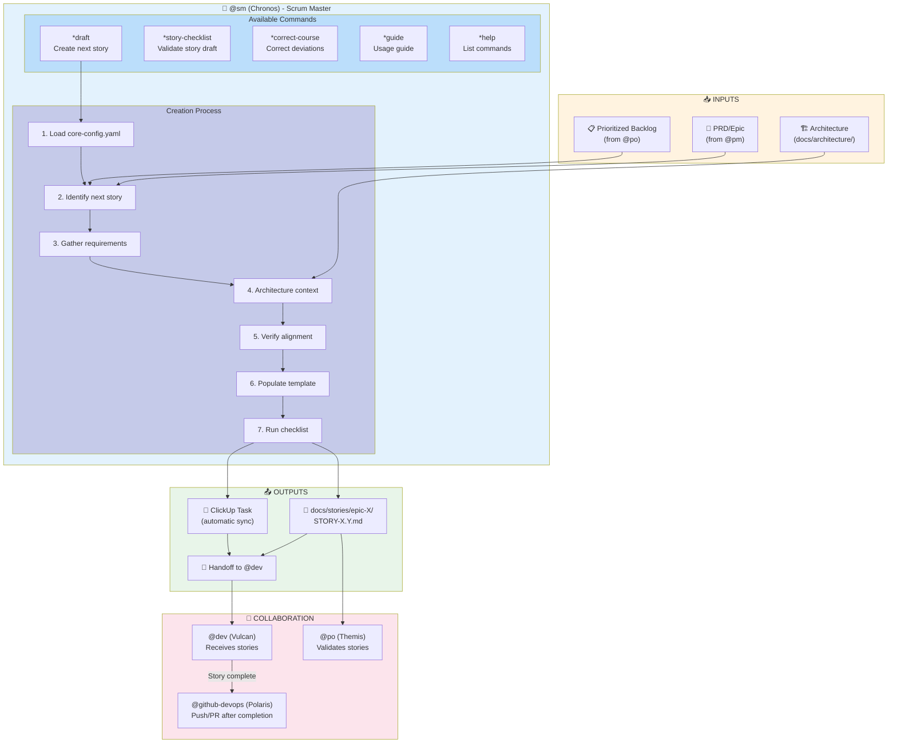
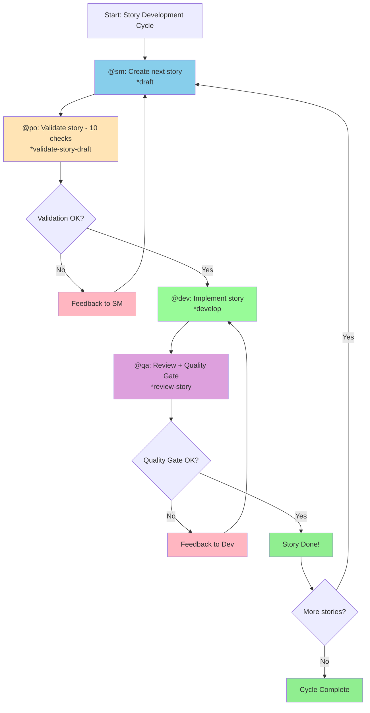
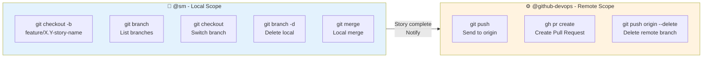
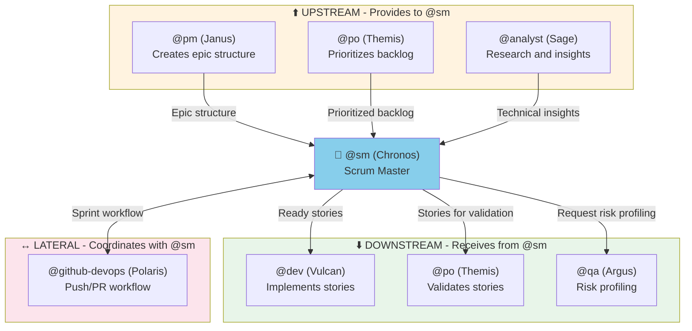

# @sm Agent System

> **Version:** 1.0.0
> **Created:** 2026-02-04
> **Owner:** @sm (Chronos - Facilitator)
> **Status:** Official Documentation

---

## Overview

The **@sm (Chronos)** agent is the technical Scrum Master of AEXOS, specialized in story preparation and agile process facilitation. Its main role is to create detailed and actionable stories that developer agents can implement with minimal need for additional research.

**Main Responsibilities:**
- Creation and refinement of user stories
- Epic management and requirements breakdown
- Sprint planning facilitation
- Guidance on agile processes
- Preparation of handoffs to developers
- Management of local branches during development

**Archetype:** Facilitator (Pisces)
**Communication Tone:** Empathetic, collaborative, fluid
**Key Vocabulary:** adapt, pivot, adjust, simplify, connect, flow, remove

---

## Complete File List

### @sm Core Task Files

| File | Command | Purpose |
|---------|---------|-----------|
| `.aexos-core/development/tasks/sm-create-next-story.md` | `*draft` | Main task to create the next story from the backlog |
| `.aexos-core/development/tasks/create-next-story.md` | `*draft` | Full version of the story creation task |
| `.aexos-core/development/tasks/execute-checklist.md` | `*story-checklist` | Runs the story draft validation checklist |
| `.aexos-core/development/tasks/correct-course.md` | `*correct-course` | Analyzes and corrects process deviations |
| `.aexos-core/development/tasks/collaborative-edit.md` | - | Collaborative document editing |
| `.aexos-core/development/tasks/init-project-status.md` | - | Project status initialization |

### Agent Definition Files

| File | Purpose |
|---------|-----------|
| `.aexos-core/development/agents/sm.md` | Core definition of the SM agent |
| `.claude/commands/AEXOS/agents/sm.md` | Claude Code command to activate @sm |
| `.cursor/rules/sm.md` | Rules for the Cursor IDE |
| `.cursor/rules/sm.mdc` | Compiled rules for Cursor |

### Checklist Files Used

| File | Purpose |
|---------|-----------|
| `.aexos-core/product/checklists/story-draft-checklist.md` | Validates the quality and completeness of story drafts |
| `.aexos-core/product/checklists/story-dod-checklist.md` | Definition of Done for stories |
| `.aexos-core/product/checklists/change-checklist.md` | Change navigation and course correction |
| `.aexos-core/product/checklists/po-master-checklist.md` | Master checklist used in validation |

### Related Files from Other Agents

| File | Agent | Purpose |
|---------|--------|-----------|
| `.aexos-core/development/agents/po.md` | @po | Coordinates with @sm on backlog and sprint planning |
| `.aexos-core/development/agents/dev.md` | @dev | Receives stories from @sm for implementation |
| `.aexos-core/development/agents/pm.md` | @pm | Creates epics that @sm breaks down into stories |
| `.aexos-core/development/agents/devops.md` | @github-devops | Receives completed stories for push/PR |
| `.aexos-core/development/agents/qa.md` | @qa | Coordinates on risk profiling |

### Workflow Files That Use @sm

| File | Purpose |
|---------|-----------|
| `.aexos-core/development/workflows/story-development-cycle.yaml` | Complete story development cycle |
| `.aexos-core/development/workflows/greenfield-fullstack.yaml` | Greenfield full-stack workflow |
| `.aexos-core/development/workflows/greenfield-service.yaml` | Greenfield service workflow |
| `.aexos-core/development/workflows/greenfield-ui.yaml` | Greenfield UI workflow |
| `.aexos-core/development/workflows/brownfield-fullstack.yaml` | Brownfield full-stack workflow |
| `.aexos-core/development/workflows/brownfield-service.yaml` | Brownfield service workflow |
| `.aexos-core/development/workflows/brownfield-ui.yaml` | Brownfield UI workflow |

### Configuration Files

| File | Purpose |
|---------|-----------|
| `.aexos-core/core-config.yaml` | Central configuration (devStoryLocation, etc.) |
| `.aexos-core/development/scripts/greeting-builder.js` | Smart greeting script |
| `.aexos-core/development/scripts/agent-assignment-resolver.js` | Agent assignment resolution |

---

## Flowchart: Complete @sm System



### Story Development Cycle Diagram



### Branch Management Diagram



---

## Command to Task Mapping

| Command | Task File | Operation |
|---------|-----------|----------|
| `*draft` | `sm-create-next-story.md` / `create-next-story.md` | Creates the next story from the backlog |
| `*story-checklist` | `execute-checklist.md` | Runs `story-draft-checklist.md` |
| `*correct-course` | `correct-course.md` | Analyzes and corrects process deviations |
| `*help` | (built-in) | Shows available commands |
| `*guide` | (built-in) | Shows the agent usage guide |
| `*session-info` | (built-in) | Shows details of the current session |
| `*exit` | (built-in) | Exits Scrum Master mode |

---

## Integrations between Agents

### Integration Flow



### Collaboration Matrix

| Agent | Relationship | Action |
|--------|----------------|------|
| **@pm (Janus)** | Receives from | Epic structure, sharded PRD |
| **@po (Themis)** | Coordinates with | Backlog prioritization, sprint planning |
| **@dev (Vulcan)** | Delivers to | Stories ready for implementation |
| **@qa (Argus)** | Requests | Risk profiling for stories |
| **@github-devops (Polaris)** | Delegates to | Push branches, create PRs |
| **@analyst (Sage)** | Consults | Technical research and insights |

### Delegation to @github-devops

@sm manages ONLY local Git operations. For remote operations, **always** delegate to @github-devops:

**Operations Allowed for @sm:**
- `git checkout -b feature/X.Y-story-name` - Create local branch
- `git branch` - List branches
- `git branch -d branch-name` - Delete local branch
- `git checkout branch-name` - Switch branch
- `git merge branch-name` - Local merge

**Blocked Operations (use @github-devops):**
- `git push` - Send to remote
- `git push origin --delete` - Delete remote branch
- `gh pr create` - Create Pull Request

---

## Configuration

### core-config.yaml (Relevant Keys)

```yaml
# Story location
devStoryLocation: docs/stories

# Sharded or Monolithic PRD
prdSharded: true
prdShardedLocation: docs/prd/epics

# Architecture
architectureVersion: v4
architectureSharded: true
architectureShardedLocation: docs/architecture

# QA
qaLocation: docs/qa

# CodeRabbit Integration
coderabbit_integration:
  enabled: true  # Controls whether @sm populates the CodeRabbit section in stories
```

### Agent Dependencies

```yaml
dependencies:
  tasks:
    - create-next-story.md
    - execute-checklist.md
    - correct-course.md
  templates:
    - story-tmpl.yaml
  checklists:
    - story-draft-checklist.md
  tools:
    - git               # Local branch operations only
    - clickup           # Track sprint progress
    - context7          # Research technical requirements
```

---

## Best Practices

### Story Creation

1. **Always start from the PRD/Epic** - Do not invent requirements
2. **Include references with citations** - `[Source: architecture/tech-stack.md#database]`
3. **Populate Dev Notes fully** - Technical context extracted from the architecture
4. **Run the checklist after creation** - `*story-checklist` validates quality
5. **Do not assume information** - If you cannot find it, state "No specific guidance found"

### Branch Management

1. **Use the naming convention** - `feature/X.Y-story-name` (X.Y = epic.story)
2. **Create a branch when starting a story** - Isolates development
3. **Do not attempt to push** - Always delegate to @github-devops
4. **Resolve conflicts locally** - Before requesting a push

### Collaboration with Other Agents

1. **Respect boundaries** - Do not implement code, do not create PRs
2. **Document handoffs** - Make clear what @dev needs to do
3. **Coordinate with @po** - Backlog prioritization before creating stories
4. **Notify @github-devops** - When a story is ready for push

### Story Validation

1. **Run the checklist** - `*story-checklist` after creation
2. **Review all 6 criteria** - Goal, Technical, References, Self-Containment, Testing, CodeRabbit
3. **Fix before handoff** - Incomplete stories block @dev
4. **Document deviations** - If there are conflicts between the epic and the architecture

---

## Troubleshooting

### Story not found in ClickUp

**Symptom:** Epic verification fails at Step 5.1

**Solution:**
1. Check whether the Epic exists in the ClickUp Backlog list
2. Confirm tags: `epic`, `epic-{epicNum}`
3. Status must be "Planning" or "In Progress"
4. Create the Epic manually if needed:
   ```
   Name: 'Epic {epicNum}: {Epic Title}'
   List: Backlog
   Tags: ['epic', 'epic-{epicNum}']
   Status: Planning
   ```

### core-config.yaml not found

**Symptom:** Task halts with a file-not-found message

**Solution:**
1. Copy from `GITHUB aexos-core/core-config.yaml`
2. Or run the AEXOS installer: `npx @aexos/core install`
3. Configure `devStoryLocation`, `prdSharded`, etc.

### Checklist returns FAIL in multiple categories

**Symptom:** Story draft with several validation problems

**Solution:**
1. Review the referenced architecture files
2. Check whether the PRD/Epic is complete
3. Use the file fallback strategy for alternative files
4. Add notes in Dev Notes about the gaps

### Local branch out of sync

**Symptom:** Merge conflicts when trying to integrate

**Solution:**
1. Run `git fetch origin` to update references
2. Merge the base branch locally: `git merge main`
3. Resolve conflicts before requesting a push from @github-devops

### CodeRabbit section does not appear in the story

**Symptom:** Story created without the CodeRabbit integration section

**Cause:** `coderabbit_integration.enabled: false` in core-config.yaml

**Solution:**
1. Check `core-config.yaml`
2. If intentional, the story will have a skip notice
3. To enable, set `coderabbit_integration.enabled: true`

---

## References

### Agent Files
- [Agent: sm.md](.aexos-core/development/agents/sm.md)
- [Task: create-next-story.md](.aexos-core/development/tasks/create-next-story.md)
- [Task: execute-checklist.md](.aexos-core/development/tasks/execute-checklist.md)
- [Task: correct-course.md](.aexos-core/development/tasks/correct-course.md)

### Checklists
- [Checklist: story-draft-checklist.md](.aexos-core/product/checklists/story-draft-checklist.md)
- [Checklist: story-dod-checklist.md](.aexos-core/product/checklists/story-dod-checklist.md)
- [Checklist: change-checklist.md](.aexos-core/product/checklists/change-checklist.md)

### Workflows
- [Workflow: story-development-cycle.yaml](.aexos-core/development/workflows/story-development-cycle.yaml)
- [Workflow: greenfield-fullstack.yaml](.aexos-core/development/workflows/greenfield-fullstack.yaml)
- [Workflow: brownfield-fullstack.yaml](.aexos-core/development/workflows/brownfield-fullstack.yaml)

### Configuration
- [Core Config](../.aexos-core/core-config.yaml)

### Related Documentation
- [Backlog Management System](../BACKLOG-MANAGEMENT-SYSTEM.md)

---

## Summary

| Aspect | Details |
|---------|----------|
| **Agent** | @sm (Chronos) - Scrum Master |
| **Archetype** | Facilitator (Pisces) |
| **Total Task Files** | 6 core tasks |
| **Available Commands** | 7 (`*draft`, `*story-checklist`, `*correct-course`, `*help`, `*guide`, `*session-info`, `*exit`) |
| **Checklists Used** | 4 checklists |
| **Workflows That Use @sm** | 7 workflows |
| **Tools** | git (local), clickup, context7 |
| **Collaborates with** | @pm, @po, @dev, @qa, @github-devops, @analyst |
| **Delegates to** | @github-devops (remote operations) |
| **Main Responsibility** | Creation of detailed and actionable stories |

---

## Changelog

| Date | Author | Description |
|------|-------|-----------|
| 2026-02-04 | @dev | Initial document created |

---

*-- Chronos, removing obstacles*
