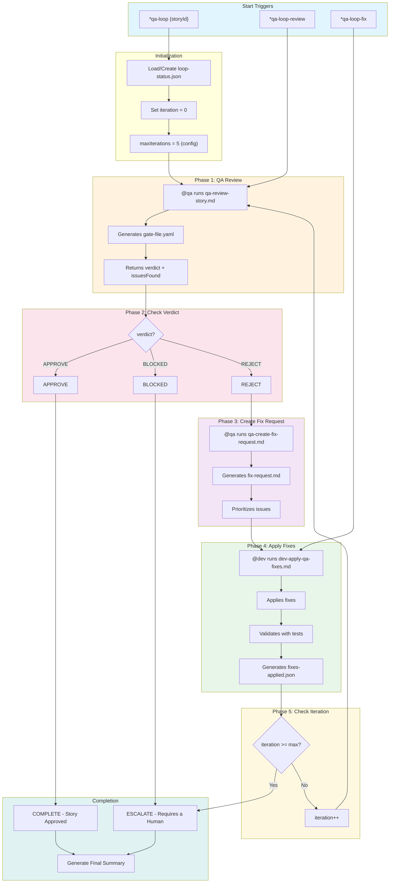
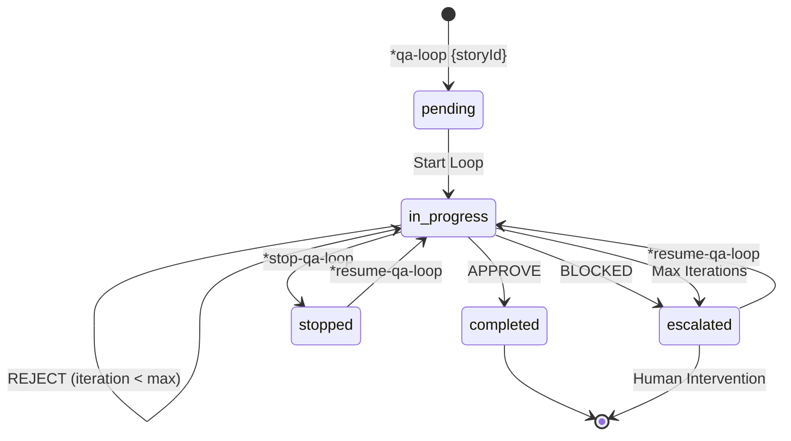
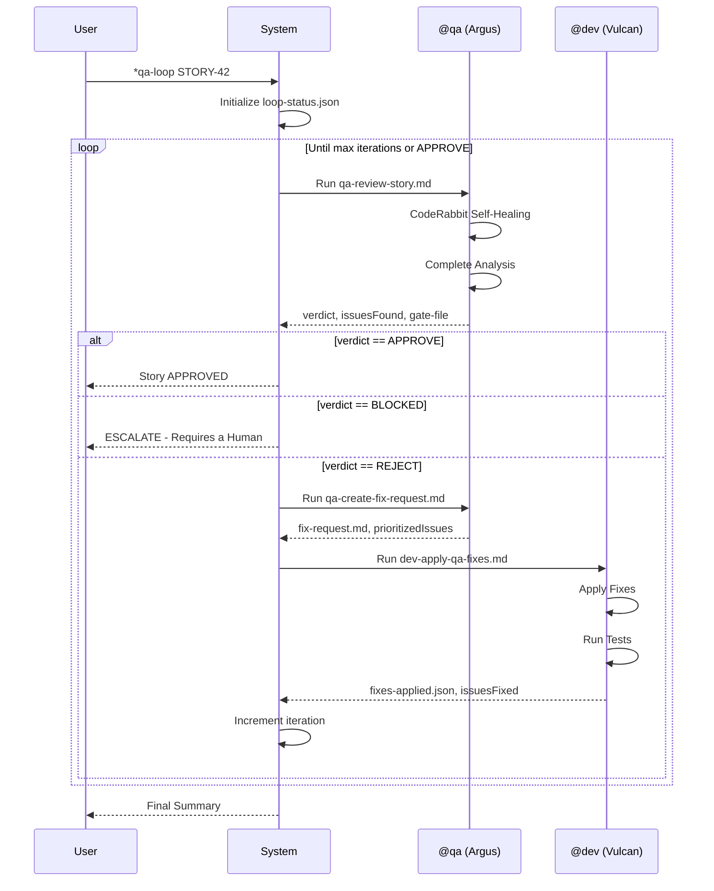
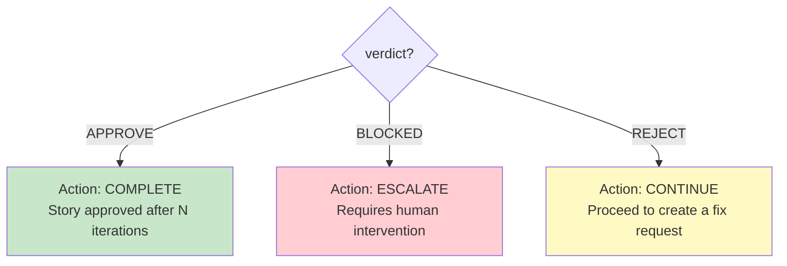
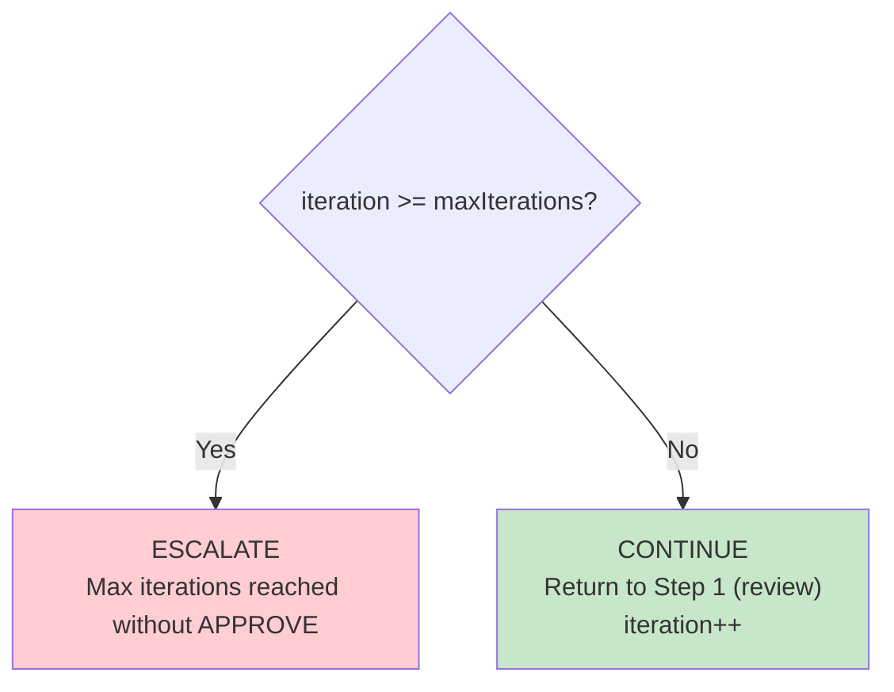
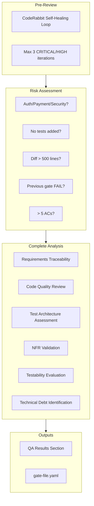
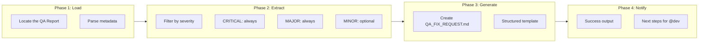
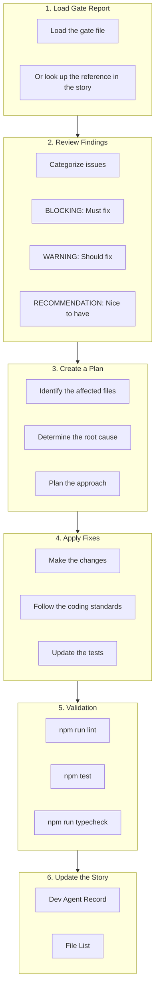
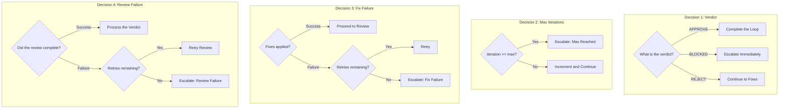
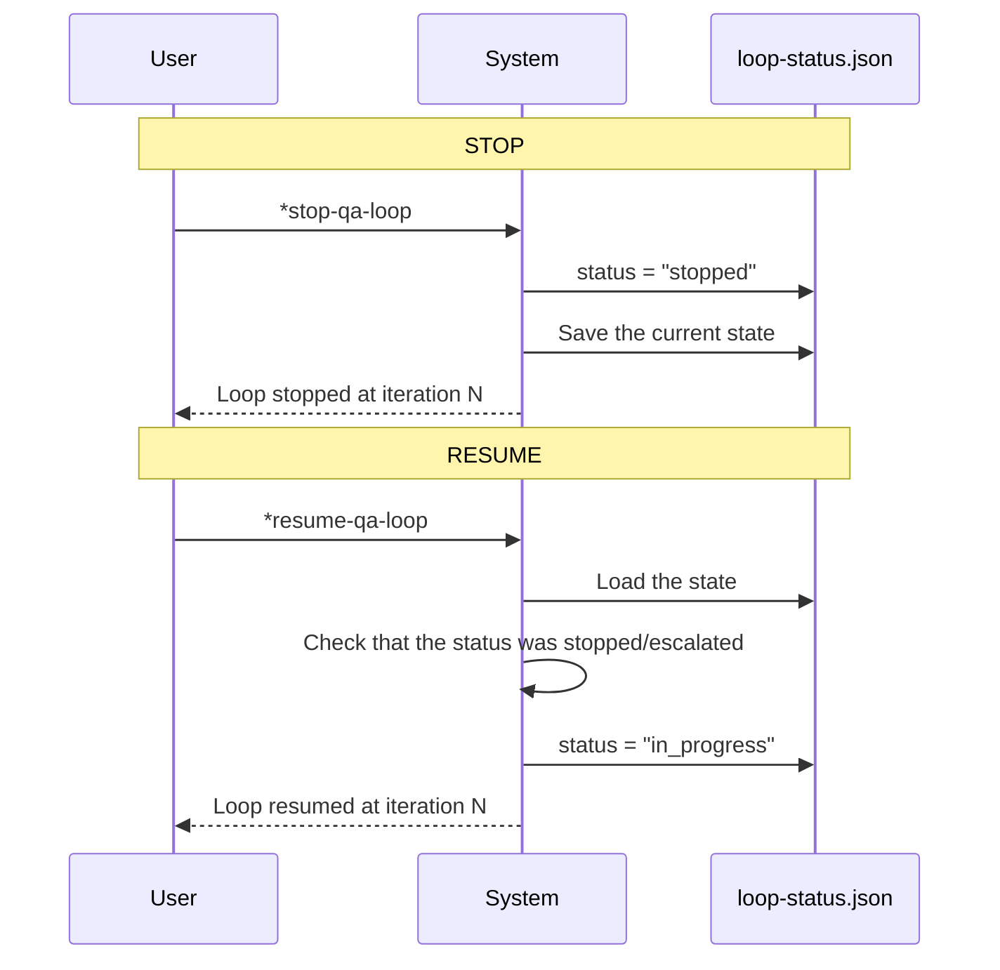

# QA Loop Workflow - Complete Documentation

**Version:** 1.0
**Last Updated:** 2026-02-04
**Epic:** 6 - QA Evolution: Autonomous Development Engine (ADE)
**Story:** 6.5
**Author:** @architect (Vega)

---

## Table of Contents

1. [Overview](#overview)
2. [Workflow Diagram](#workflow-diagram)
3. [Detailed Steps](#detailed-steps)
4. [Participating Agents](#participating-agents)
5. [Executed Tasks](#executed-tasks)
6. [Prerequisites](#prerequisites)
7. [Inputs and Outputs](#inputs-and-outputs)
8. [Decision Points](#decision-points)
9. [Configuration](#configuration)
10. [Execution Control](#execution-control)
11. [Escalation](#escalation)
12. [Dashboard Integration](#dashboard-integration)
13. [Error Handling](#error-handling)
14. [Troubleshooting](#troubleshooting)
15. [References](#references)

---

## Overview

The **QA Loop Orchestrator** is an automated workflow that orchestrates the complete cycle of:

```
Review -> Fix -> Re-review
```

This workflow runs up to a configurable maximum number of iterations (default: 5), tracking the results of each iteration. When the maximum limit is reached or a manual stop is requested, the workflow escalates for human intervention.

### Purpose

- Automate the quality review cycle
- Reduce the time between feedback and fix
- Ensure complete traceability of the QA process
- Escalate automatically when needed

### Supported Project Types

- `aexos-development`
- `autonomous-development`
- `qa-automation`

---

## Workflow Diagram

### Main Flow



### State Diagram



### Agent Communication Sequence



---

## Detailed Steps

### Step 1: Review (Phase 1)

| Attribute | Value |
|----------|-------|
| **Name** | `review` |
| **Phase** | 1 - QA Review |
| **Agent** | `@qa` (Argus) |
| **Task** | `qa-review-story.md` |
| **Timeout** | 30 minutes (1,800,000 ms) |

**Description:**
Runs a complete QA review of the story implementation, producing a verdict: APPROVE, REJECT or BLOCKED.

**Inputs:**

```yaml
storyId: "{storyId}"
iteration: "{currentIteration}"
previousIssues: "{history[-1].issuesFound|0}"
```

**Outputs:**

- `gate-file.yaml` - Gate file with the decision
- `verdict` - APPROVE | REJECT | BLOCKED
- `issuesFound` - Number of issues found

**On Success:**
```
log: "Review complete: {verdict} ({issuesFound} issues)"
next: check_verdict
```

**On Failure:**
```
action: retry (max 2 attempts)
on_exhausted: escalate
```

---

### Step 2: Check Verdict (Phase 2)

| Attribute | Value |
|----------|-------|
| **Name** | `check_verdict` |
| **Phase** | 2 - Verdict Check |
| **Agent** | `system` |

**Description:**
Evaluates the review verdict and determines the next action.

**Decision Logic:**



---

### Step 3: Create Fix Request (Phase 3)

| Attribute | Value |
|----------|-------|
| **Name** | `create_fix_request` |
| **Phase** | 3 - Create Fix Request |
| **Agent** | `@qa` (Argus) |
| **Task** | `qa-create-fix-request.md` |

**Description:**
Generates a structured fix request document from the review findings. It prioritizes issues and provides actionable fix instructions.

**Inputs:**

```yaml
storyId: "{storyId}"
gateFile: "{outputs.review.gate-file}"
iteration: "{currentIteration}"
```

**Outputs:**

- `fix-request.md` - Document with prioritized issues
- `prioritizedIssues` - List of issues ordered by priority

**On Success:**
```
log: "Fix request created with {prioritizedIssues.length} prioritized issues"
next: fix_issues
```

**On Failure:**
```
action: continue
fallback: "Use raw gate file for fixes"
```

---

### Step 4: Fix Issues (Phase 4)

| Attribute | Value |
|----------|-------|
| **Name** | `fix_issues` |
| **Phase** | 4 - Apply Fixes |
| **Agent** | `@dev` (Vulcan) |
| **Task** | `dev-apply-qa-fixes.md` |
| **Timeout** | 60 minutes (3,600,000 ms) |

**Description:**
The developer agent applies the fixes based on the fix request. It runs tests and validates the changes.

**Inputs:**

```yaml
storyId: "{storyId}"
fixRequest: "{outputs.create_fix_request.fix-request}"
iteration: "{currentIteration}"
```

**Outputs:**

- `fixes-applied.json` - Record of the applied fixes
- `issuesFixed` - Number of issues fixed

**On Success:**
```
log: "Fixed {issuesFixed} of {issuesFound} issues"
next: increment_iteration
```

**On Failure:**
```
action: retry (max 2 attempts)
on_exhausted: escalate with reason "Dev agent unable to apply fixes after retries"
```

---

### Step 5: Increment Iteration (Phase 5)

| Attribute | Value |
|----------|-------|
| **Name** | `increment_iteration` |
| **Phase** | 5 - Check Iteration |
| **Agent** | `system` |

**Description:**
Increments the iteration counter and checks it against the maximum. If the max is reached, it escalates to a human.

**Logic:**



---

## Participating Agents

### @qa - Argus (Test Architect)

```yaml
Name: Argus
ID: qa
Title: Test Architect & Quality Advisor
Icon: ✅
Archetype: Guardian
Sign: Virgo

Responsibilities in the QA Loop:
  - Run the complete QA review (qa-review-story.md)
  - Create structured fix requests (qa-create-fix-request.md)
  - Determine the verdict: APPROVE, REJECT, BLOCKED
  - Generate gate files with documented decisions
```

**Tools Used:**

| Tool | Purpose |
|------------|-----------|
| `github-cli` | Code review and PR management |
| `browser` | End-to-end testing and UI validation |
| `context7` | Research testing frameworks |
| `supabase` | Database testing and data validation |
| `coderabbit` | Automated code review |

**CodeRabbit Integration:**

```yaml
self_healing:
  enabled: true
  type: full
  max_iterations: 3
  timeout_minutes: 30
  severity_filter: [CRITICAL, HIGH]
  behavior:
    CRITICAL: auto_fix
    HIGH: auto_fix
    MEDIUM: document_as_debt
    LOW: ignore
```

---

### @dev - Vulcan (Full Stack Developer)

```yaml
Name: Vulcan
ID: dev
Title: Full Stack Developer
Icon: 💻
Archetype: Builder
Sign: Aquarius

Responsibilities in the QA Loop:
  - Apply fixes based on the fix request (dev-apply-qa-fixes.md)
  - Run tests to validate the fixes
  - Update the Dev Agent Record in the story
  - Ensure the fixes do not break existing functionality
```

**Tools Used:**

| Tool | Purpose |
|------------|-----------|
| `git` | Local operations: add, commit, status, diff |
| `context7` | Look up library documentation |
| `supabase` | Database operations |
| `browser` | Test web applications |
| `coderabbit` | Pre-commit code quality review |

---

### System Agent

```yaml
Type: Automatic
Responsibilities:
  - Check verdicts
  - Increment iterations
  - Control the workflow flow
  - Manage the loop status
```

---

## Executed Tasks

### 1. qa-review-story.md

**Location:** `.aexos-core/development/tasks/qa-review-story.md`

**Purpose:** Perform a test architecture review with a quality gate decision.

**Review Process:**



**Gate Criteria:**

| Gate | Condition |
|------|----------|
| **PASS** | All critical requirements met, no blocking issues |
| **CONCERNS** | Non-critical issues found, the team should review |
| **FAIL** | Critical issues that must be addressed |
| **WAIVED** | Issues acknowledged but explicitly waived by the team |

---

### 2. qa-create-fix-request.md

**Location:** `.aexos-core/development/tasks/qa-create-fix-request.md`

**Purpose:** Generate a structured `QA_FIX_REQUEST.md` document for @dev based on the QA findings.

**Workflow:**



**Fix Request Structure:**

```markdown
# QA Fix Request: {storyId}

## Instructions for @dev
- Fix ONLY the issues listed below
- Do not add features or refactor unrelated code

## Summary
| Severity | Count | Status |
|----------|-------|--------|
| CRITICAL | N | Must fix before merge |
| MAJOR | N | Should fix before merge |
| MINOR | N | Optional improvements |

## Issues to Fix
### 1. [CRITICAL] {title}
- Location: `{file:line}`
- Problem: {description}
- Expected: {expected}
- Verification: [ ] {steps}

## Constraints
- [ ] Fix ONLY listed issues
- [ ] Run all tests: `npm test`
- [ ] Run linting: `npm run lint`
```

---

### 3. dev-apply-qa-fixes.md

**Location:** `.aexos-core/development/tasks/dev-apply-qa-fixes.md`

**Purpose:** Apply fixes based on the QA feedback and gate review.

**Developer Workflow:**



**Exit Criteria:**

- All BLOCKING issues resolved
- All tests passing (lint, unit, integration)
- Story file updated
- Code ready for re-review

---

## Prerequisites

### To Start the QA Loop

| Requirement | Description |
|-----------|-----------|
| **Story Status** | Must be in "Review" |
| **Complete Implementation** | The developer completed all tasks |
| **Updated File List** | The file list in the story file is current |
| **Automated Tests** | All automated tests passing |
| **CodeRabbit Configured** | CLI installed in WSL (optional but recommended) |

### Environment Configuration

```yaml
# Check CodeRabbit
wsl bash -c '~/.local/bin/coderabbit auth status'

# Check Node.js
node --version  # >= 18

# Check dependencies
npm test        # Must pass
npm run lint    # Must pass
```

---

## Inputs and Outputs

### Workflow Inputs

| Field | Type | Required | Description |
|-------|------|-------------|-----------|
| `storyId` | string | Yes | Story identifier (e.g. "STORY-42") |
| `maxIterations` | number | No | Override of the max (default: 5) |
| `mode` | string | No | `yolo`, `interactive`, `preflight` |

### Workflow Outputs

| File | Location | Description |
|---------|-------------|-----------|
| `loop-status.json` | `qa/loop-status.json` | Current loop status |
| `gate-file.yaml` | `qa/gates/{storyId}.yaml` | Quality gate decision |
| `fix-request.md` | `qa/QA_FIX_REQUEST.md` | Fix document |
| `fixes-applied.json` | `qa/fixes-applied.json` | Record of fixes |
| `summary.md` | `qa/summary.md` | Final loop summary |

### Status File Schema

```yaml
storyId: string              # Story ID
currentIteration: number     # Current iteration
maxIterations: number        # Configured maximum
status: enum                 # pending | in_progress | completed | stopped | escalated
startedAt: ISO-8601          # Start timestamp
updatedAt: ISO-8601          # Last update

history:
  - iteration: number
    reviewedAt: ISO-8601
    verdict: APPROVE | REJECT | BLOCKED
    issuesFound: number
    fixedAt: ISO-8601 | null
    issuesFixed: number | null
    duration: number         # milliseconds
```

---

## Decision Points

### Decision Diagram



### Escalation Criteria

| Trigger | Reason | Action |
|---------|-------|------|
| `max_iterations_reached` | The loop reached the max without APPROVE | Escalate with full context |
| `verdict_blocked` | QA returned BLOCKED | Escalate immediately |
| `fix_failure` | @dev could not apply the fixes after retries | Escalate with the error log |
| `manual_escalate` | The user ran `*escalate-qa-loop` | Escalate on demand |

---

## Configuration

### Configurable Parameters

```yaml
config:
  # Maximum number of iterations (AC2)
  maxIterations: 5
  configPath: autoClaude.qaLoop.maxIterations

  # Progress tracking
  showProgress: true
  verbose: true

  # Status file location (AC4)
  statusFile: qa/loop-status.json

  # Dashboard integration (AC7)
  dashboardStatusPath: .aexos/dashboard/status.json
  legacyStatusPath: .aexos/status.json

  # Timeout per phase (milliseconds)
  reviewTimeout: 1800000    # 30 minutes
  fixTimeout: 3600000       # 60 minutes

  # Retry configuration
  maxRetries: 2
  retryDelay: 5000          # 5 seconds
```

### Per-Project Customization

In the `.aexos-core/core-config.yaml` file:

```yaml
autoClaude:
  qaLoop:
    maxIterations: 3        # Reduce for smaller projects
    reviewTimeout: 900000   # 15 min for fast reviews
    fixTimeout: 1800000     # 30 min for simple fixes
```

---

## Execution Control

### Available Commands

| Command | Action | Description |
|---------|------|-----------|
| `*qa-loop {storyId}` | `start_loop` | Starts the complete loop |
| `*qa-loop-review` | `run_step: review` | Starts from the review step only |
| `*qa-loop-fix` | `run_step: fix` | Starts from the fix step only |
| `*stop-qa-loop` | `stop_loop` | Stops the loop and saves the state |
| `*resume-qa-loop` | `resume_loop` | Resumes a stopped/escalated loop |
| `*escalate-qa-loop` | `escalate` | Forces manual escalation |
| `*qa-loop --reset` | `reset` | Deletes the status and restarts |

### Stop/Resume Flow



---

## Escalation

### Escalation Triggers

```yaml
escalation:
  enabled: true
  triggers:
    - max_iterations_reached
    - verdict_blocked
    - fix_failure
    - manual_escalate
```

### Context Package

When an escalation occurs, the system prepares:

| Item | Description |
|------|-----------|
| `loop-status.json` | Complete loop status |
| Gate files | All gate files from the history |
| Fix requests | All generated fix requests |
| Summary | Summary of all iterations |

### Notification Message

```
QA Loop Escalation for {storyId}

Reason: {escalation.reason}
Iterations completed: {currentIteration}
Last verdict: {history[-1].verdict}
Outstanding issues: {history[-1].issuesFound - history[-1].issuesFixed}

Review the context package and decide:
1. Resume loop: *resume-qa-loop {storyId}
2. Manually fix and approve
3. Reject story and create follow-up
```

### Notification Channels

- `log` - System log
- `console` - Terminal output

---

## Dashboard Integration

### Status JSON Schema

```yaml
integration:
  status_json:
    track_loop: true
    field: qaLoop
    update_on_each_iteration: true

    schema:
      storyId: string
      status: string
      currentIteration: number
      maxIterations: number
      lastVerdict: string
      lastIssuesFound: number
      updatedAt: ISO-8601
```

### Project Status Update

```yaml
project_status:
  update_story_status: true
  status_field: qaLoopStatus
```

### Notifications

| Event | Message | Channels |
|--------|----------|--------|
| `on_approve` | "QA Loop APPROVED: {storyId}" | log |
| `on_escalate` | "QA Loop ESCALATED: {storyId} - needs attention" | log |
| `on_stop` | "QA Loop STOPPED: {storyId}" | log |

---

## Error Handling

### Common Errors and Resolutions

| Error | Cause | Resolution | Action |
|------|-------|-----------|------|
| `missing_story_id` | Story ID not provided | "Usage: *qa-loop STORY-42" | prompt |
| `review_timeout` | The review phase exceeded the timeout | Check the QA agent status | escalate |
| `fix_timeout` | The fix phase exceeded the timeout | Check the Dev agent status | escalate |
| `invalid_status` | Corrupted status file | "Reset loop: *qa-loop {storyId} --reset" | halt |

### Retry Strategies

```yaml
on_failure:
  action: retry
  max_retries: 2              # Maximum number of attempts
  retryDelay: 5000            # Delay between attempts
  on_exhausted: escalate      # Action when retries are exhausted
```

---

## Troubleshooting

### Problem: Loop Stuck in Review

**Symptoms:**
- The review does not complete after 30 minutes
- The status stays "in_progress"

**Diagnostics:**
```bash
# Check the loop status
cat qa/loop-status.json | jq '.status, .currentIteration'

# Check the last gate file
ls -la qa/gates/
```

**Solution:**
1. Run `*stop-qa-loop`
2. Check whether CodeRabbit is responding
3. Run `*resume-qa-loop` to resume

---

### Problem: Fix Not Applied

**Symptoms:**
- @dev reports success but the issues persist
- The re-review finds the same problems

**Diagnostics:**
```bash
# Check the fix request
cat qa/QA_FIX_REQUEST.md

# Check the applied fixes
cat qa/fixes-applied.json
```

**Solution:**
1. Manually review fix-request.md
2. Check whether @dev updated the correct files
3. Run the tests locally before re-review

---

### Problem: Max Iterations Reached

**Symptoms:**
- The loop escalates after 5 iterations without APPROVE

**Diagnostics:**
```bash
# View the complete history
cat qa/loop-status.json | jq '.history'
```

**Solution:**
1. Analyze the pattern of recurring issues
2. Check whether the requirements are clear
3. Consider raising maxIterations or resolving manually

---

### Problem: CodeRabbit Does Not Work

**Symptoms:**
- "coderabbit: command not found" error
- Timeout in the self-healing phase

**Diagnostics:**
```bash
# Check the installation
wsl bash -c 'which coderabbit'

# Check authentication
wsl bash -c '~/.local/bin/coderabbit auth status'
```

**Solution:**
1. Reinstall CodeRabbit in WSL
2. Run `coderabbit auth login`
3. Check the path in the agent config

---

### Problem: Corrupted Status File

**Symptoms:**
- "invalid_status" error
- The loop does not start or resume

**Solution:**
```bash
# Back up the corrupted file
mv qa/loop-status.json qa/loop-status.json.bak

# Restart the loop
*qa-loop {storyId} --reset
```

---

## References

### Workflow Files

| File | Location |
|---------|-------------|
| Workflow Definition | `.aexos-core/development/workflows/qa-loop.yaml` |
| QA Review Task | `.aexos-core/development/tasks/qa-review-story.md` |
| Create Fix Request Task | `.aexos-core/development/tasks/qa-create-fix-request.md` |
| Apply QA Fixes Task | `.aexos-core/development/tasks/dev-apply-qa-fixes.md` |
| QA Agent | `.aexos-core/development/agents/qa.md` |
| Dev Agent | `.aexos-core/development/agents/dev.md` |

### Related Documentation

| Document | Description |
|-----------|-----------|
| Epic 6 - QA Evolution | Context of the Autonomous Development Engine |
| Story 6.5 | Implementation story for the QA Loop |
| Story 6.3.3 | CodeRabbit Self-Healing Integration |
| ADR-XXX | Architecture Decision Record (if one exists) |

### Templates

| Template | Location | Use |
|----------|-------------|-----|
| `qa-gate-tmpl.yaml` | `.aexos-core/development/templates/` | Gate file structure |
| `story-tmpl.yaml` | `.aexos-core/development/templates/` | Story file structure |

---

## Change History

| Date | Version | Author | Changes |
|------|--------|-------|----------|
| 2026-02-04 | 1.0 | Technical Documentation Specialist | Initial version |

---

*Documentation generated automatically from the `qa-loop.yaml` workflow*
