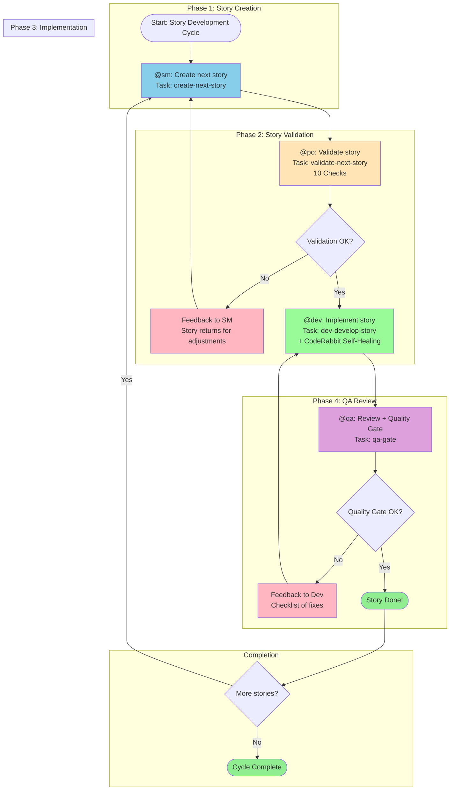
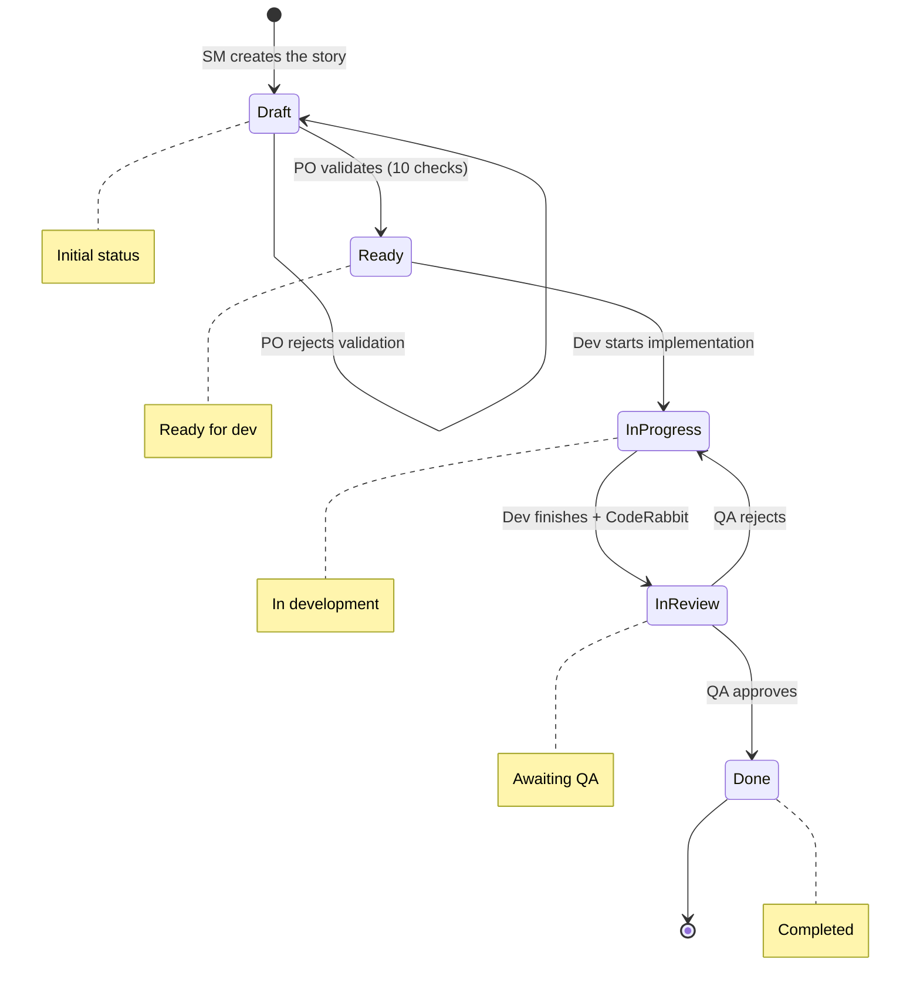
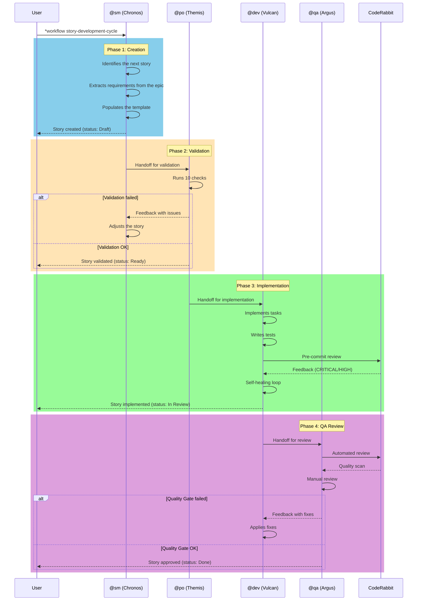
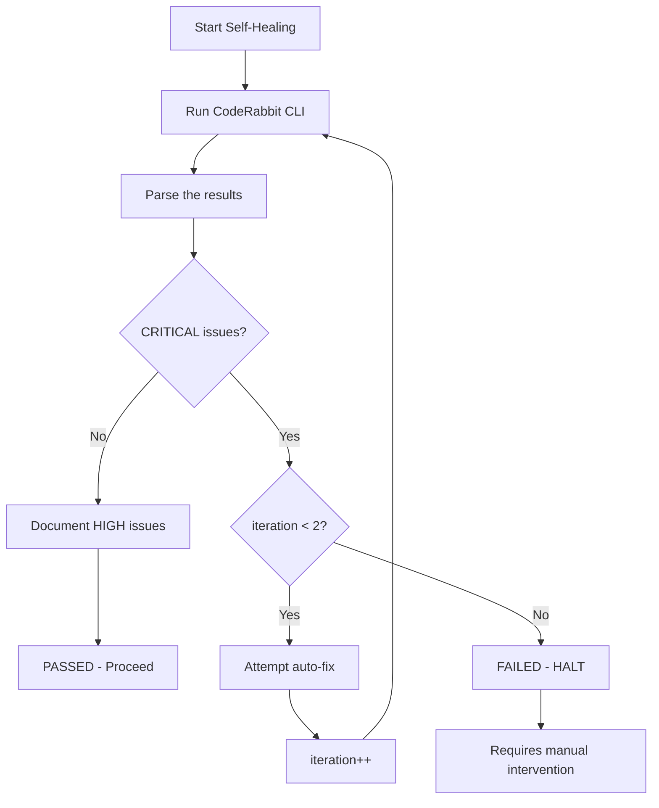
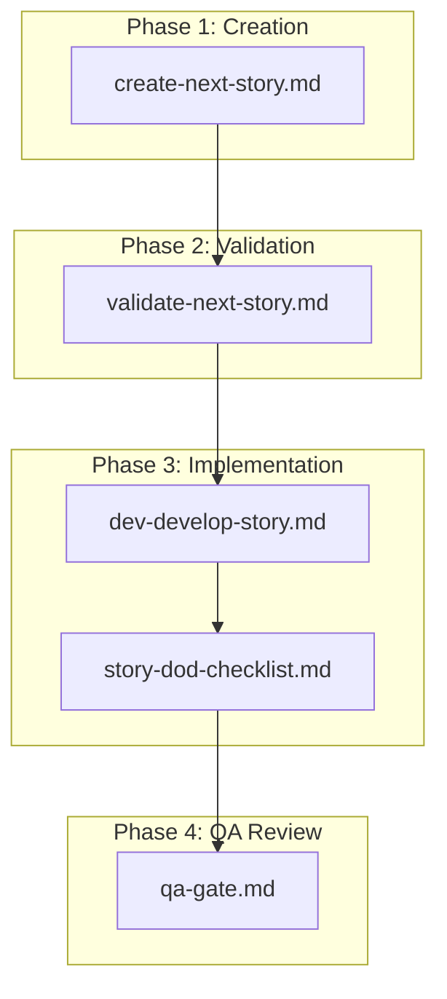
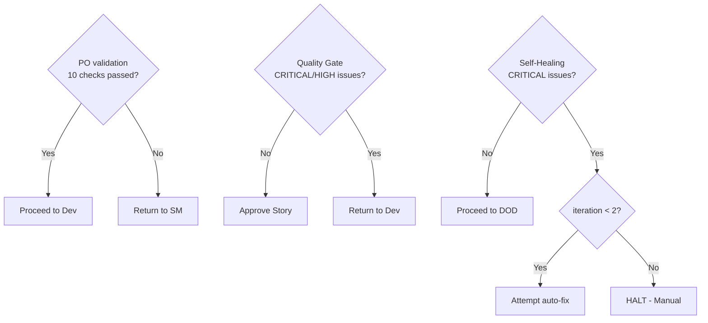

# Workflow: Story Development Cycle

**Version:** 1.0
**Type:** Generic Workflow
**Author:** Zeus (AEXOS Master)
**Creation Date:** 2025-01-30
**Tags:** story, development-cycle, quality-gate, agile, generic

---

## Overview

The **Story Development Cycle** is the central AEXOS workflow for story development. It automates the complete flow from creation to delivery with an integrated quality gate, following the sequence: **create -> validate -> implement -> QA review**.

### Objective

Ensure that every story goes through a structured and traceable process, with validation points at each phase, reducing rework and increasing delivery quality.

### Supported Project Types

| Type | Description |
|------|-----------|
| `greenfield` | New projects, from scratch |
| `brownfield` | Existing projects, maintenance |
| `feature-development` | Development of new features |
| `bug-fix` | Bug fixing |
| `enhancement` | Improvements to existing features |

---

## Mermaid Workflow Diagram

### Main Flow



### Story Status Flow



### Agent Interaction Diagram



---

## Detailed Steps

### Step 1: Create Story (Phase 1)

| Field | Value |
|-------|-------|
| **ID** | `create` |
| **Agent** | @sm (Chronos - Scrum Master) |
| **Action** | Create the next story |
| **Task** | `create-next-story.md` |

#### Description

The Scrum Master (Chronos) identifies and creates the next story from the backlog using the sharded PRD or project documentation as the source.

#### Inputs

| Input | Type | Origin | Required |
|-------|------|--------|-------------|
| `name` | string | User Input | Yes |
| `options` | object | User Input | No |
| `force` | boolean | User Input | No |
| Sharded PRD | file | File system | Yes |
| Epic context | document | docs/stories/epic-X/ | Yes |

#### Outputs

| Output | Type | Destination |
|--------|------|---------|
| `story_file` | file | `{devStoryLocation}/{epicNum}.{storyNum}.story.md` |
| `story_id` | string | Workflow context |
| `validation_report` | object | Memory |

#### Success Criteria

- [ ] Story created with a descriptive title
- [ ] Acceptance criteria defined
- [ ] Clear and bounded scope
- [ ] Dependencies identified

#### Story Status

- **Before:** N/A
- **After:** `Draft`

---

### Step 2: Validate Story (Phase 2)

| Field | Value |
|-------|-------|
| **ID** | `validate` |
| **Agent** | @po (Themis - Product Owner) |
| **Action** | Validate the story (10 checks) |
| **Task** | `validate-next-story.md` |
| **Requires** | `create` |

#### Description

The Product Owner (Themis) validates the created story using a rigorous 10-point checklist, ensuring the story is ready for implementation.

#### Inputs

| Input | Type | Origin | Required |
|-------|------|--------|-------------|
| `story_file` | file | Output of the previous step | Yes |
| `target` | string | User Input | Yes |
| `criteria` | array | Config | Yes |
| `strict` | boolean | User Input | No (default: true) |

#### Outputs

| Output | Type | Destination |
|--------|------|---------|
| `validation_report` | object | File (.ai/*.json) |
| `validation_result` | boolean | Return value |
| `errors` | array | Memory |
| `story_status` | string | Story file |

#### Validation Checklist (10 Points)

| # | Check | Description |
|---|-------|-----------|
| 1 | Clear and objective title | The title precisely describes what will be done |
| 2 | Complete description | Problem/need clearly explained |
| 3 | Testable acceptance criteria | Given/When/Then format preferred |
| 4 | Well-defined scope | What is IN and OUT clearly listed |
| 5 | Mapped dependencies | Prerequisite stories or resources identified |
| 6 | Complexity estimate | Complexity points or T-shirt sizing |
| 7 | Business value | Clear benefit to the user/business |
| 8 | Documented risks | Potential problems identified |
| 9 | Done criteria | Clear definition of when it is complete |
| 10 | Alignment with PRD/Epic | Consistency with the source documents |

#### Result

| Result | Action |
|-----------|------|
| **Approved** | Status changes to `Ready`, proceeds to implementation |
| **Rejected** | Returns to SM with detailed feedback |

#### Story Status

- **Before:** `Draft`
- **After (Success):** `Ready`
- **After (Failure):** `Draft` (returns to SM)

---

### Step 3: Implement Story (Phase 3)

| Field | Value |
|-------|-------|
| **ID** | `implement` |
| **Agent** | @dev (Vulcan - Full Stack Developer) |
| **Action** | Implement the story |
| **Task** | `dev-develop-story.md` |
| **Requires** | `validate` |

#### Description

The Dev Agent (Vulcan) implements the validated story, following the acceptance criteria and the defined tasks. It includes the CodeRabbit Self-Healing Loop to ensure code quality.

#### Execution Modes

| Mode | Description | User Prompts |
|------|-----------|-------------------|
| **YOLO** | Autonomous execution with decision logging | 0-1 |
| **Interactive** | Decision checkpoints and educational feedback (DEFAULT) | 5-10 |
| **Pre-Flight** | Complete planning before execution | 10-15 (upfront) |

#### Inputs

| Input | Type | Origin | Required |
|-------|------|--------|-------------|
| `story_file` | file | Output of the previous step | Yes |
| `task` | string | User Input | Yes |
| `parameters` | object | User Input | No |
| `mode` | string | User Input | No (default: interactive) |

#### Outputs

| Output | Type | Destination |
|--------|------|---------|
| `implementation_files` | array | File system |
| `test_results` | object | Console/logs |
| `commit_hash` | string | Git |
| `execution_result` | object | Memory |
| `logs` | array | `.ai/logs/*` |
| `decision_log` | file | `.ai/decision-log-{story-id}.md` (YOLO mode) |

#### Execution Flow

```mermaid
flowchart LR
    A[Read task] --> B[Implement task + subtasks]
    B --> C[Write tests]
    C --> D[Run validations]
    D --> E{All passed?}
    E -->|Yes| F[Mark checkbox [x]]
    E -->|No| B
    F --> G[Update File List]
    G --> H{More tasks?}
    H -->|Yes| A
    H -->|No| I[CodeRabbit Self-Healing]
    I --> J[Story DOD Checklist]
    J --> K[Status: In Review]
```

#### CodeRabbit Self-Healing Loop



#### Success Criteria

- [ ] All acceptance criteria implemented
- [ ] Tests passing
- [ ] File List updated
- [ ] Code committed
- [ ] CodeRabbit Self-Healing passed

#### Story Status

- **Before:** `Ready`
- **During:** `In Progress`
- **After:** `In Review`

---

### Step 4: QA Review (Phase 4)

| Field | Value |
|-------|-------|
| **ID** | `review` |
| **Agent** | @qa (Argus - Test Architect) |
| **Action** | Final review + Quality Gate |
| **Task** | `qa-gate.md` |
| **Requires** | `implement` |

#### Description

The QA Agent (Argus) performs the final review with a quality gate, validating code, tests, and adherence to the acceptance criteria.

#### Inputs

| Input | Type | Origin | Required |
|-------|------|--------|-------------|
| `story_file` | file | Output of the previous step | Yes |
| `target` | string | User Input | Yes |
| `criteria` | array | Config | Yes |
| `strict` | boolean | User Input | No (default: true) |

#### Outputs

| Output | Type | Destination |
|--------|------|---------|
| `qa_report` | file | `{qaLocation}/gates/{epic}.{story}-{slug}.yml` |
| `quality_gate_status` | string | PASS/CONCERNS/FAIL/WAIVED |
| `story_final_status` | string | Story file |
| `validation_result` | boolean | Return value |
| `errors` | array | Memory |

#### Quality Gate Checks

| # | Check | Description |
|---|-------|-----------|
| 1 | Code review | Standards, readability, maintainability |
| 2 | Unit tests | Adequate and passing |
| 3 | Acceptance criteria | All met |
| 4 | No regressions | Existing features preserved |
| 5 | Performance | Within acceptable limits |
| 6 | Security | OWASP basics verified |
| 7 | Documentation | Updated if needed |

#### Quality Gate Decisions

| Decision | Criteria | Action |
|---------|-----------|------|
| **PASS** | All checks passed, no HIGH issues | Approve the story |
| **CONCERNS** | Non-blocking issues present | Approve with observations |
| **FAIL** | HIGH/CRITICAL issues present | Return to Dev |
| **WAIVED** | Issues explicitly accepted | Approve with a documented waiver |

#### Issue Severity

| Severity | Description | Action |
|------------|-----------|------|
| `low` | Minor, cosmetic issues | Document |
| `medium` | Should be fixed soon | Create tech debt |
| `high` | Critical, should block the release | Return to Dev |

#### Result

| Result | Action |
|-----------|------|
| **Approved** | Status changes to `Done` |
| **Rejected** | Returns to Dev with a checklist of fixes |

#### Story Status

- **Before:** `In Review`
- **After (Success):** `Done`
- **After (Failure):** `In Progress` (returns to Dev)

---

## Participating Agents

### @sm - Chronos (Scrum Master)

| Aspect | Description |
|---------|-----------|
| **Icon** | 🌊 |
| **Archetype** | Facilitator |
| **Role** | Technical Scrum Master - Story Preparation Specialist |
| **Focus** | Create clear and actionable stories for development agents |
| **Responsibilities** | Story creation, epic management, sprint planning, local branch management |

**Relevant Commands:**
- `*draft` - Create the next story
- `*story-checklist` - Run the story checklist

---

### @po - Themis (Product Owner)

| Aspect | Description |
|---------|-----------|
| **Icon** | 🎯 |
| **Archetype** | Balancer |
| **Role** | Technical Product Owner & Process Steward |
| **Focus** | Validate artifact cohesion and ensure documentation quality |
| **Responsibilities** | Backlog management, story validation, prioritization, PM tool sync |

**Relevant Commands:**
- `*validate-story-draft {story}` - Validate story quality
- `*backlog-review` - Review for sprint planning

---

### @dev - Vulcan (Full Stack Developer)

| Aspect | Description |
|---------|-----------|
| **Icon** | 💻 |
| **Archetype** | Builder |
| **Role** | Expert Senior Software Engineer & Implementation Specialist |
| **Focus** | Execute story tasks with precision and comprehensive testing |
| **Responsibilities** | Code implementation, testing, debugging, refactoring |

**Relevant Commands:**
- `*develop {story-id}` - Implement the story
- `*run-tests` - Run linting and tests
- `*apply-qa-fixes` - Apply QA fixes

---

### @qa - Argus (Test Architect)

| Aspect | Description |
|---------|-----------|
| **Icon** | ✅ |
| **Archetype** | Guardian |
| **Role** | Test Architect with Quality Advisory Authority |
| **Focus** | Comprehensive quality analysis through test architecture |
| **Responsibilities** | Code review, quality gates, test strategy, risk assessment |

**Relevant Commands:**
- `*review {story}` - Comprehensive story review
- `*gate {story}` - Create a quality gate decision
- `*code-review {scope}` - Automated review

---

## Executed Tasks

### Task Map by Phase



### Task Details

| Task | File | Agent | Purpose |
|------|---------|--------|-----------|
| Create Next Story | `create-next-story.md` | @sm | Create a story from the PRD/epic |
| Validate Next Story | `validate-next-story.md` | @po | Validate completeness and quality |
| Develop Story | `dev-develop-story.md` | @dev | Implement code and tests |
| Story DOD Checklist | `story-dod-checklist.md` | @dev | Verify the Definition of Done |
| QA Gate | `qa-gate.md` | @qa | Create a quality gate decision |

---

## Prerequisites

### Project Configuration

1. **core-config.yaml** - Required AEXOS configuration file
   - `devStoryLocation` - Story location
   - `prd.*` - PRD configuration
   - `architecture.*` - Architecture configuration
   - `qa.qaLocation` - Location of the QA artifacts

2. **Story Template** - `story-tmpl.yaml` available in `.aexos-core/development/templates/`

3. **Checklists** - Required checklists available:
   - `story-draft-checklist.md`
   - `story-dod-checklist.md`
   - `po-master-checklist.md`

### Prerequisite Documentation

| Document | Location | Required |
|-----------|-------|-------------|
| PRD (sharded or monolithic) | Per the `prd.*` config | Yes |
| Epic file | `docs/stories/epic-X/` | Yes |
| Architecture docs | Per the `architecture.*` config | Yes |

### Integrated Tools

| Tool | Purpose | Agents |
|------------|-----------|---------|
| `git` | Version control | @sm, @dev, @qa |
| `coderabbit` | Automated review | @dev, @qa |
| `clickup` | Story tracking | @sm, @po |
| `context7` | Library documentation | All |
| `github-cli` | GitHub operations | @po, @qa |

---

## Inputs and Outputs

### Workflow Inputs

| Input | Type | Source | Description |
|---------|------|-------|-----------|
| Epic requirements | Document | `docs/stories/epic-X/` | Epic requirements |
| PRD | Document | Per the config | Product Requirements |
| Architecture docs | Documents | `docs/architecture/` | Technical specifications |
| Story template | YAML | `.aexos-core/development/templates/` | Standard template |

### Workflow Outputs

| Output | Type | Destination | Description |
|-------|------|---------|-----------|
| Story file | Markdown | `{devStoryLocation}/{epic}.{story}.story.md` | Complete story |
| Implementation files | Code | Per the story tasks | Implemented code |
| Test files | Code | Per the project standard | Unit tests |
| QA Gate file | YAML | `{qaLocation}/gates/{epic}.{story}-{slug}.yml` | QA decision |
| Decision log | Markdown | `.ai/decision-log-{story-id}.md` | Decision log (YOLO mode) |

---

## Decision Points

### Decision Diagram



### Detailed Decision Points

| Point | Phase | Decider | Criterion | Positive Result | Negative Result |
|-------|------|---------|----------|-------------------|-------------------|
| PO validation | 2 | @po | 10 checks pass | Status: Ready | Returns to SM |
| Self-Healing | 3 | System | No CRITICAL issues | Proceeds to DOD | Halt or auto-fix |
| Quality Gate | 4 | @qa | No HIGH/CRITICAL | Status: Done | Returns to Dev |

### Blocking Conditions

The workflow must HALT and request user intervention when:

1. **Unapproved dependencies needed** - A new library or resource is required
2. **Ambiguity after checking the story** - Requirements are unclear
3. **3 consecutive failures** - Implementation or fix attempts
4. **Missing configuration** - core-config.yaml or templates absent
5. **Failing regression** - Existing tests broke

---

## Execution Modes

The workflow supports three execution modes that affect all steps:

### 1. YOLO Mode (Autonomous)

```yaml
mode: yolo
prompts: 0-1
best_for: Simple and deterministic tasks
```

- Autonomous decisions with automatic logging
- Minimal user interaction
- Generates `decision-log-{story-id}.md` with all decisions

### 2. Interactive Mode (Balanced) [DEFAULT]

```yaml
mode: interactive
prompts: 5-10
best_for: Learning and complex decisions
```

- Explicit decision checkpoints
- Educational explanations at each step
- Confirms understanding with the user

### 3. Pre-Flight Mode (Planning)

```yaml
mode: preflight
prompts: 10-15 (upfront)
best_for: Ambiguous requirements and critical work
```

- Complete ambiguity analysis before starting
- Comprehensive upfront questionnaire
- Execution without ambiguity after planning

---

## Troubleshooting

### Common Problems

#### 1. Story cannot be created

**Symptom:** Error when running `create-next-story`

**Possible Causes:**
- `core-config.yaml` not found
- Epic file does not exist
- PRD not available

**Solution:**
```bash
# Check whether core-config.yaml exists
cat .aexos-core/core-config.yaml

# Check the epic structure
ls docs/stories/epic-*/

# Check the PRD
cat docs/prd/PRD.md  # or wherever the config points
```

#### 2. PO validation fails repeatedly

**Symptom:** The story returns to SM multiple times

**Possible Causes:**
- Poorly defined acceptance criteria
- Missing information in the Dev Notes
- Unclear scope

**Solution:**
1. Review the 10 checks of the checklist
2. Ensure the Given/When/Then format in the ACs
3. Fill the Dev Notes with architecture references

#### 3. CodeRabbit Self-Healing fails

**Symptom:** CRITICAL issues persist after 2 iterations

**Possible Causes:**
- Issues that require significant refactoring
- Complex security problems
- Code that violates architecture standards

**Solution:**
```bash
# Check the CodeRabbit output
wsl bash -c 'cd /mnt/c/.../aexos-core && ~/.local/bin/coderabbit --prompt-only -t uncommitted'

# Fix the issues manually
# Then re-run *develop
```

#### 4. Quality Gate returns FAIL

**Symptom:** QA rejects the story with HIGH issues

**Possible Causes:**
- Acceptance criteria not met
- Insufficient test coverage
- Security problems

**Solution:**
1. Review the generated `qa-gate.yml`
2. Run `*apply-qa-fixes` on @dev
3. Re-submit for review

#### 5. Workflow hangs at a handoff

**Symptom:** The transition between agents does not happen

**Possible Causes:**
- Outputs not generated correctly
- Inconsistent story status
- Dependency on a previous step not satisfied

**Solution:**
```bash
# Check the story status
cat docs/stories/{story-file}.md | grep "status:"

# Force the transition manually
@{next-agent}
*{appropriate-command}
```

### Logs and Diagnostics

| File | Location | Content |
|---------|-------|----------|
| Decision Log | `.ai/decision-log-{story-id}.md` | Autonomous decisions (YOLO mode) |
| QA Gate | `{qaLocation}/gates/{epic}.{story}-{slug}.yml` | Quality gate decision |
| Story File | `{devStoryLocation}/{epic}.{story}.story.md` | Complete story with logs |

---

## When to Use and When Not to Use

### When to Use This Workflow

- Development of any story (greenfield or brownfield)
- When you need the complete cycle with validation and quality gate
- When you need process traceability
- Teams that follow a structured agile process

### When NOT to Use This Workflow

| Situation | Alternative |
|----------|-------------|
| Urgent hotfixes | Simplified flow without a QA gate |
| Exploratory spikes/POCs | Ad-hoc development |
| Purely technical tasks without a story | Direct tasks with @dev |

---

## References

### Related Files

| File | Path |
|---------|---------|
| Workflow Definition | `.aexos-core/development/workflows/story-development-cycle.yaml` |
| SM Agent | `.aexos-core/development/agents/sm.md` |
| PO Agent | `.aexos-core/development/agents/po.md` |
| Dev Agent | `.aexos-core/development/agents/dev.md` |
| QA Agent | `.aexos-core/development/agents/qa.md` |
| Create Story Task | `.aexos-core/development/tasks/create-next-story.md` |
| Validate Story Task | `.aexos-core/development/tasks/validate-next-story.md` |
| Develop Story Task | `.aexos-core/development/tasks/dev-develop-story.md` |
| QA Gate Task | `.aexos-core/development/tasks/qa-gate.md` |
| Story Template | `.aexos-core/development/templates/story-tmpl.yaml` |

### Additional Documentation

- [YAML Workflows Guide](../workflows-yaml-guide.md)
- [Squads Guide](../squads-user-guide.md)
- [Prioritization Framework](../PRIORITIZATION-FRAMEWORK.md)

---

## Changelog

| Version | Date | Changes |
|--------|------|----------|
| 1.0 | 2025-01-30 | Initial version of the workflow |

---

*Documentation generated automatically based on the `story-development-cycle.yaml` file*
